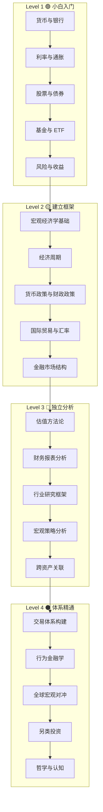

# 📚 金融基础知识库

> 从完全不懂到体系精通，分四个阶段递进学习。

## 学习路径总览

## 各阶段详情

| Level | 目标 | 预计时间 | 入口 |
|-------|------|----------|------|
| [Level 1 🟢](./level-1-beginner/) | 理解基本概念，能看懂财经新闻 | 2-4 周 | [开始学习 →](./level-1-beginner/) |
| [Level 2 🟡](./level-2-intermediate/) | 建立宏观框架，理解经济运行逻辑 | 1-3 月 | [开始学习 →](./level-2-intermediate/) |
| [Level 3 🔴](./level-3-advanced/) | 独立做投研分析，形成自己的判断 | 3-6 月 | [开始学习 →](./level-3-advanced/) |
| [Level 4 ⚫](./level-4-expert/) | 构建完整投资体系，持续迭代进化 | 终身 | [开始学习 →](./level-4-expert/) |

## 学习建议

1. **不要跳级**。每一层都是下一层的地基。
2. **边学边记**。用 [07-journal](../07-journal/) 记录你的理解和困惑。
3. **结合实事**。学完一个概念，去 [05-daily-tracking](../05-daily-tracking/) 找真实案例对照。
4. **反复回看**。随着认知提升，同一篇笔记会有不同的理解。
