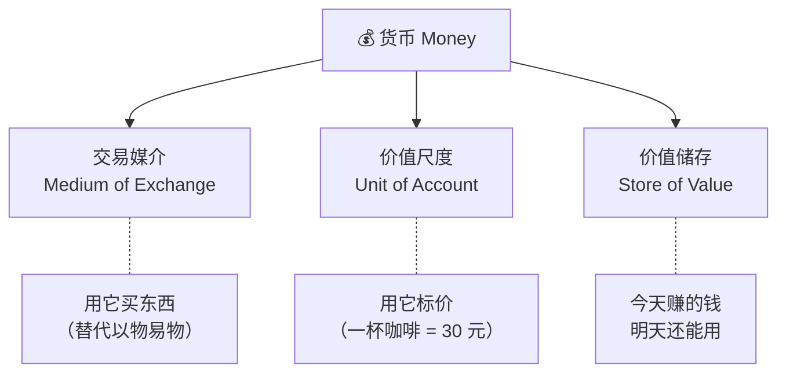
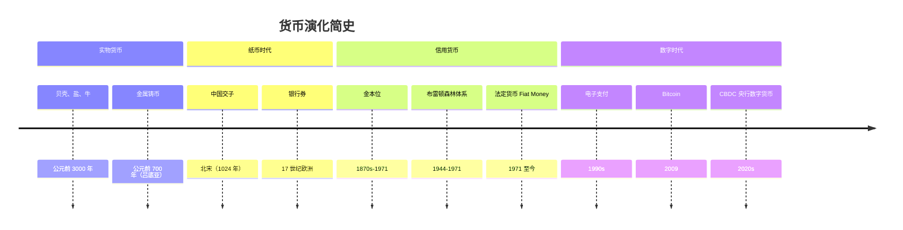
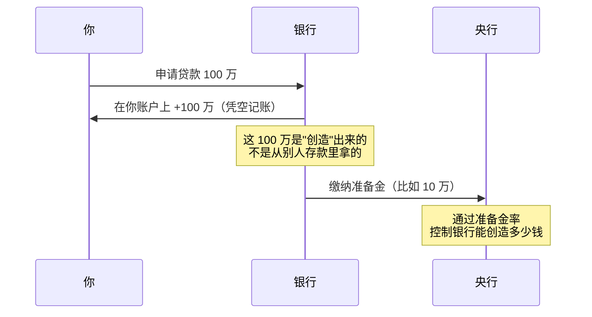

# 01 货币的本质 | What is Money?

`🟢 入门` `预计阅读：15 分钟`

> 核心问题：钱是什么？为什么一张纸能买东西？比特币算不算钱？

---

## 一句话总结

**货币是一种"共识"** —— 所有人都相信它有价值，它就有价值。

---

## 货币的三大功能

### 1. 交易媒介 (Medium of Exchange)

没有货币的世界：你是个程序员，想吃面包，得找一个既会做面包、又需要写代码的人。这叫**"需求的双重巧合"(Double Coincidence of Wants)**，效率极低。

有了货币：你写代码换钱 → 拿钱买面包。简单。

### 2. 价值尺度 (Unit of Account)

所有商品都用同一个单位标价，你才能比较"一部手机"和"100 杯咖啡"哪个更贵。

### 3. 价值储存 (Store of Value)

你今天工作赚的钱，下个月还能花。但注意：**如果通胀太高，这个功能就会被削弱**（→ 见下一篇 [02-利率与通胀](./02-interest-and-inflation.md)）。

---

## 货币的演化史

### 关键转折：1971 年尼克松关闭黄金窗口

在此之前：美元和黄金挂钩（35 美元 = 1 盎司黄金），其他货币和美元挂钩。

在此之后：**所有货币都是"法定货币"(Fiat Money)** —— 没有任何实物支撑，纯靠政府信用。

> 💡 这就是为什么各国央行可以"印钱"——因为钱不再需要对应等量的黄金。

---

## 现代货币是怎么"创造"出来的？

很多人以为：央行印钱 → 发给银行 → 银行借给你。

实际上更接近：**商业银行通过贷款创造货币**。

### 货币乘数效应 (Money Multiplier)

假设准备金率 = 10%：
- 央行投放 100 元基础货币 (Base Money)
- 理论上最多能创造 100 ÷ 10% = **1000 元** 广义货币 (M2)

> 这就是为什么你会听到"M2 增速"这个指标——它反映的是整个经济体里"钱"的总量变化。

---

## 几种"钱"的层次

| 层次 | 名称 | 包含什么 | 流动性 |
|------|------|----------|--------|
| M0 | 基础货币 | 流通中的现金 + 银行在央行的存款 | 最高 |
| M1 | 狭义货币 | M0 + 活期存款 | 高 |
| M2 | 广义货币 | M1 + 定期存款 + 理财等 | 中 |

> 📊 中国 2024 年 M2 约 **313 万亿元**，是 GDP 的 2.5 倍左右。这个比值持续上升，说明"钱"在变多，但不一定都流入了实体经济。

---

## 比特币算不算"货币"？

用三大功能检验：

| 功能 | BTC 表现 | 评分 |
|------|----------|------|
| 交易媒介 | 能用但慢、贵、波动大，日常支付不实用 | ⭐⭐ |
| 价值尺度 | 没人用 BTC 标价（"这个 0.003 BTC"？） | ⭐ |
| 价值储存 | 长期升值但短期波动剧烈 | ⭐⭐⭐ |

**结论**：BTC 目前更像"数字黄金"（价值储存工具），而不是日常货币。但它的底层思想——**去中心化、总量有限、不可篡改**——对理解货币本质非常有启发。

---

## 核心概念速查

| 术语 | 英文 | 一句话解释 |
|------|------|-----------|
| 法定货币 | Fiat Money | 没有实物支撑，靠政府信用的货币 |
| 基础货币 | Base Money / M0 | 央行直接控制的"种子钱" |
| 广义货币 | Broad Money / M2 | 经济体里所有"钱"的总量 |
| 准备金率 | Reserve Ratio | 银行必须留在央行的比例 |
| 货币乘数 | Money Multiplier | 基础货币能放大多少倍 |
| 信用创造 | Credit Creation | 银行通过贷款"创造"新的钱 |
| 金本位 | Gold Standard | 货币和黄金挂钩的制度 |

---

## 延伸思考

1. 如果所有人同时去银行取钱，会发生什么？（→ 银行挤兑 Bank Run）
2. 政府能无限印钱吗？代价是什么？（→ 通胀、汇率贬值）
3. 为什么有人说"现金是最差的资产"？（→ 通胀侵蚀购买力）

---

## 下一篇

→ [02 利率与通胀](./02-interest-and-inflation.md)：钱为什么会贬值？央行怎么控制？
