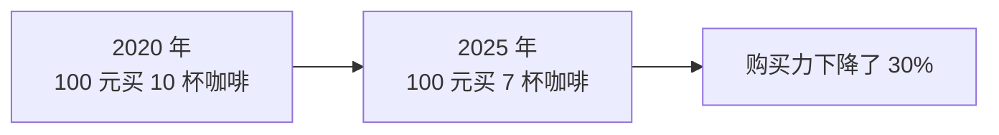
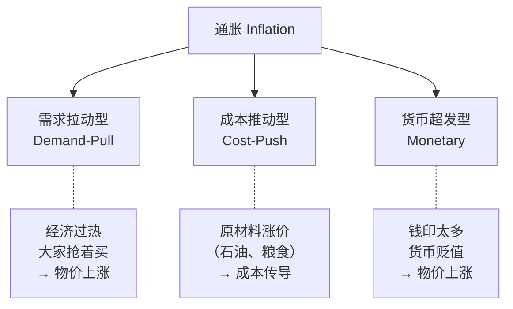
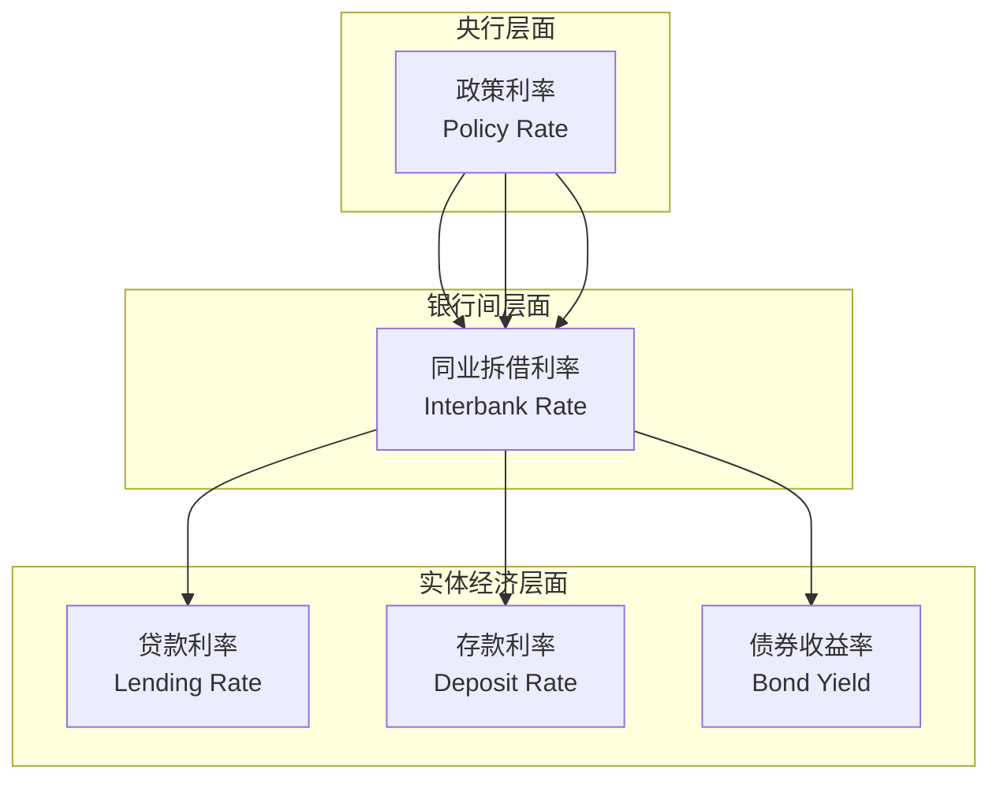
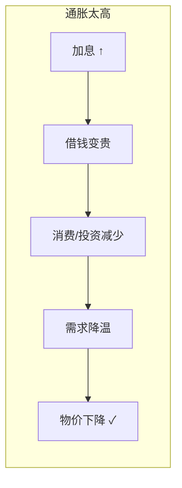
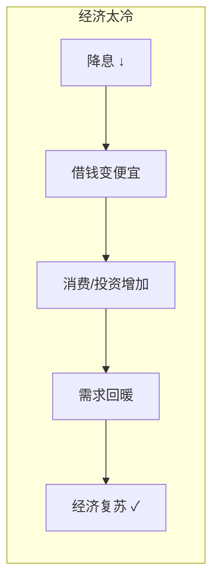
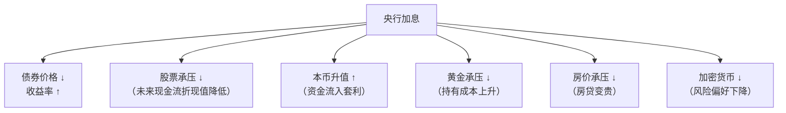
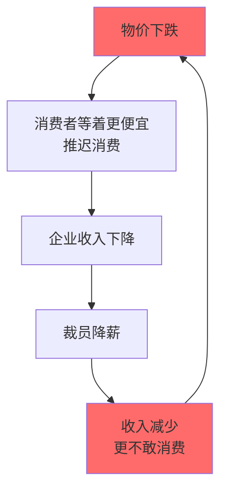

# 02 利率与通胀 | Interest Rate & Inflation

`🟢 入门` `预计阅读：20 分钟`

> 核心问题：为什么钱会贬值？利率是谁定的？加息降息到底影响什么？

---

## 一句话总结

**利率是"钱的价格"，通胀是"钱的贬值速度"。央行通过调利率来控制通胀。**

---

## Part 1: 通胀 (Inflation)

### 什么是通胀？

通胀 = 物价持续上涨 = 同样的钱能买到的东西变少了。



### 通胀怎么衡量？

| 指标 | 英文 | 衡量什么 | 谁发布 |
|------|------|----------|--------|
| CPI | Consumer Price Index | 消费者物价（你的生活成本） | 统计局 |
| PPI | Producer Price Index | 生产者物价（工厂成本） | 统计局 |
| PCE | Personal Consumption Expenditures | 美国版 CPI（美联储更看重） | BEA |
| GDP Deflator | — | 整体经济物价水平 | — |

> 📊 一般认为 **2% 左右的温和通胀是健康的**（美联储目标就是 2%）。太高不行（物价飞涨），太低也不行（通缩，大家不消费）。

### 通胀的三种成因



**经典案例**：
- 需求拉动：2021 年美国疫情后消费爆发 → CPI 飙到 9%
- 成本推动：1970s 石油危机 → 全球滞胀
- 货币超发：津巴布韦、委内瑞拉恶性通胀

---

## Part 2: 利率 (Interest Rate)

### 利率是什么？

**利率 = 借钱的成本 = 存钱的回报**

你存银行 100 元，年利率 3%，一年后拿回 103 元。这 3 元就是银行"租用"你的钱付的"租金"。

### 利率的层次



### 中美利率体系对比

| | 中国 | 美国 |
|--|------|------|
| 政策利率 | MLF 利率、7 天逆回购利率 | Federal Funds Rate |
| 贷款基准 | LPR（贷款市场报价利率） | Prime Rate |
| 决策机构 | 中国人民银行 (PBOC) | 美联储 (Fed / FOMC) |
| 会议频率 | 每月 | 每年 8 次 FOMC |

---

## Part 3: 央行怎么用利率控制通胀？

### 核心逻辑





### 加息/降息的连锁反应



> 💡 这张图非常重要！它解释了为什么美联储一加息，全球资产都在跌。后面在 [04-global-economy/connections](../../../04-global-economy/connections/) 会深入展开。

---

## Part 4: 实际利率 vs 名义利率

```
实际利率 = 名义利率 - 通胀率
Real Rate = Nominal Rate - Inflation
```

| 场景 | 名义利率 | 通胀率 | 实际利率 | 含义 |
|------|----------|--------|----------|------|
| 正常 | 5% | 2% | +3% | 存钱有真实回报 |
| 负利率 | 2% | 5% | -3% | 存钱实际在亏钱！ |
| 零利率 | 0% | 0% | 0% | 日本"失去的三十年" |

> 📊 2022-2023 年中国：存款利率 ~2%，CPI ~0.5%，实际利率为正。
> 同期美国：存款利率 ~5%，CPI ~3.5%，实际利率也为正。
> 但 2020-2021 年美国：利率 0%，通胀 7% → 实际利率 -7%，存钱血亏。

---

## Part 5: 通缩 (Deflation) —— 比通胀更可怕？

通缩 = 物价持续下降。听起来好事？其实很危险：



这叫**"通缩螺旋"(Deflationary Spiral)**。日本 1990s-2010s 就陷入了这个循环。

---

## 核心概念速查

| 术语 | 英文 | 一句话解释 |
|------|------|-----------|
| 通胀 | Inflation | 物价持续上涨，购买力下降 |
| 通缩 | Deflation | 物价持续下降，经济萎缩 |
| CPI | Consumer Price Index | 衡量消费者物价变动的指标 |
| 名义利率 | Nominal Interest Rate | 银行标出来的利率 |
| 实际利率 | Real Interest Rate | 扣除通胀后的真实回报 |
| 加息 | Rate Hike | 央行提高政策利率 |
| 降息 | Rate Cut | 央行降低政策利率 |
| 滞胀 | Stagflation | 经济停滞 + 高通胀（最难处理） |
| FOMC | Federal Open Market Committee | 美联储决定利率的会议 |
| LPR | Loan Prime Rate | 中国贷款市场报价利率 |

---

## 延伸思考

1. 为什么中国和美国的利率方向经常相反？（→ 经济周期不同步）
2. 如果通胀 10% 但工资涨 15%，你是赚了还是亏了？（→ 看实际购买力）
3. 为什么说"现金是垃圾"？什么时候现金反而是王？（→ 通缩环境）

---

## 下一篇

→ [03 银行体系](./03-banking-system.md)：银行怎么赚钱？央行到底是干什么的？
