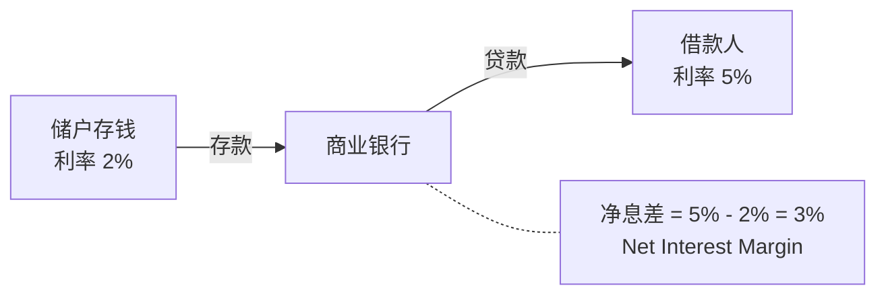
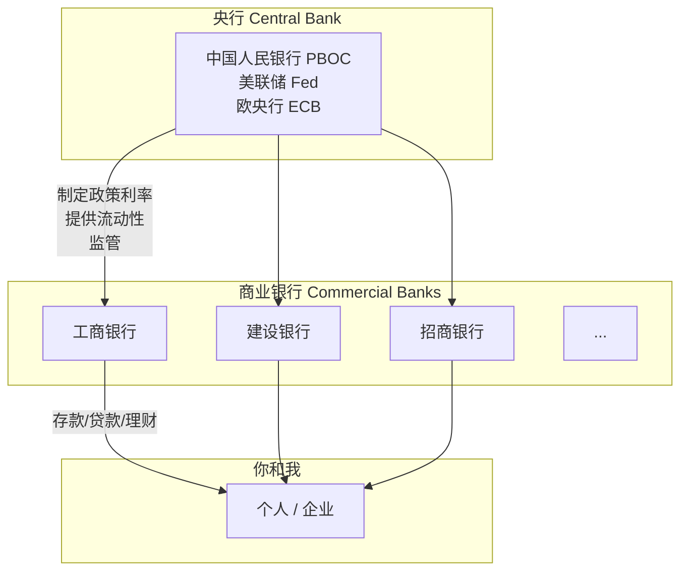
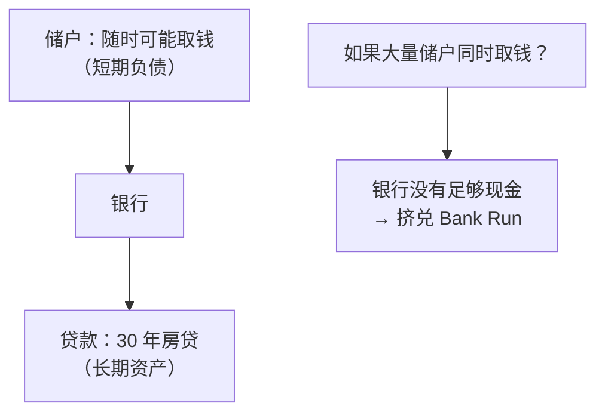
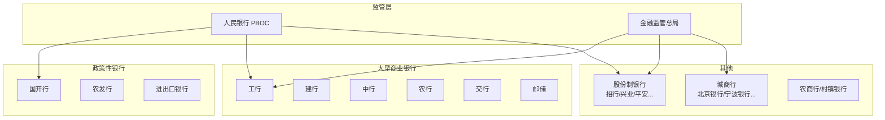

# 03 银行体系 | Banking System

`🟢 入门` `预计阅读：15 分钟`

> 核心问题：银行怎么赚钱？央行是干什么的？为什么银行会倒闭？

---

## 一句话总结

**银行是"钱的中间商"，央行是"银行的银行"。整个金融体系建立在信任之上。**

---

## 银行怎么赚钱？

银行的核心商业模式：**低息吸收存款，高息发放贷款，赚中间的利差 (Spread)**。

### 银行的其他收入来源

| 收入类型 | 例子 |
|----------|------|
| 净利息收入 (NII) | 存贷利差 |
| 手续费 | 转账、信用卡、理财代销 |
| 投资收益 | 买债券、同业投资 |
| 中间业务 | 担保、信用证、托管 |

---

## 央行 vs 商业银行

### 央行的核心职能

| 职能 | 做什么 | 为什么重要 |
|------|--------|-----------|
| 货币政策 | 调利率、调准备金率、公开市场操作 | 控制经济冷热 |
| 最后贷款人 | 银行缺钱时兜底 | 防止系统性崩溃 |
| 金融监管 | 设定资本充足率等规则 | 防止银行乱来 |
| 发行货币 | 印钱（基础货币投放） | 维持货币供给 |
| 外汇管理 | 管理外汇储备、干预汇率 | 稳定本币（中国特色） |

---

## 银行为什么会倒闭？

### 核心矛盾：期限错配 (Maturity Mismatch)

**经典案例**：
- 2023 年硅谷银行 (SVB)：利率上升 → 持有的债券巨亏 → 储户恐慌取钱 → 48 小时倒闭
- 2008 年雷曼兄弟：次贷资产暴跌 → 无法偿还短期借款 → 破产

### 防止银行倒闭的机制

| 机制 | 作用 |
|------|------|
| 存款保险 (Deposit Insurance) | 中国：50 万以内全额赔付 |
| 资本充足率 (Capital Adequacy Ratio) | 银行必须有足够自有资金 |
| 准备金制度 | 必须留一部分钱在央行 |
| 央行最后贷款人 | 紧急时刻提供流动性 |

---

## 中国银行体系结构

---

## 影子银行 (Shadow Banking)

不是银行，但干着银行的活（吸收资金、发放贷款），却不受银行那么严格的监管。

| 中国的影子银行 | 美国的影子银行 |
|---------------|---------------|
| 信托公司 | 投资银行 |
| P2P（已清退） | 货币市场基金 |
| 理财产品（表外） | 对冲基金 |
| 地方融资平台 | 特殊目的载体 (SPV) |

> ⚠️ 影子银行是 2008 年金融危机和中国地方债问题的核心角色之一。

---

## 核心概念速查

| 术语 | 英文 | 一句话解释 |
|------|------|-----------|
| 商业银行 | Commercial Bank | 面向公众的存贷款银行 |
| 央行 | Central Bank | 银行的银行，制定货币政策 |
| 净息差 | Net Interest Margin (NIM) | 贷款利率 - 存款利率 |
| 准备金 | Reserve | 银行存在央行的钱 |
| 挤兑 | Bank Run | 大量储户同时取钱导致银行崩溃 |
| 存款保险 | Deposit Insurance | 银行倒了政府赔你（有上限） |
| 影子银行 | Shadow Banking | 不受银行监管但做类银行业务 |
| 期限错配 | Maturity Mismatch | 短期借入、长期贷出的风险 |

---

## 延伸思考

1. 为什么中国的银行几乎不会倒？（→ 国有控股 + 隐性担保）
2. 数字货币 (CBDC) 会不会让商业银行消失？（→ 脱媒风险）
3. 为什么说"银行是顺周期的"？（→ 经济好多放贷，经济差收贷款）

---

## 下一篇

→ [04 股票基础](./04-stocks-101.md)：买股票到底买的是什么？
