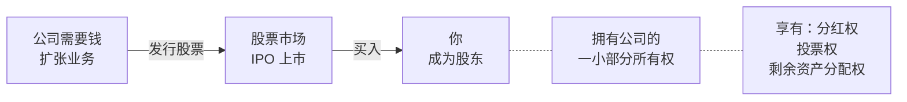
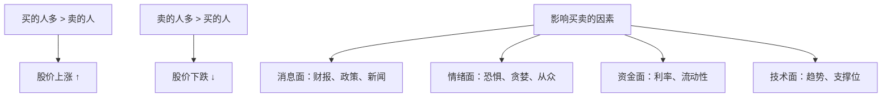
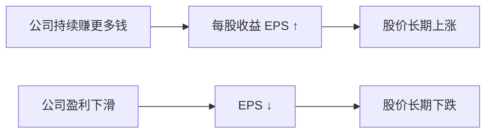
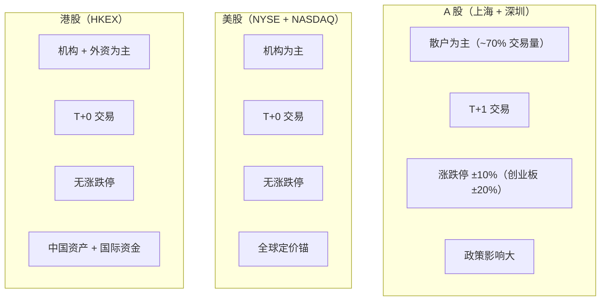
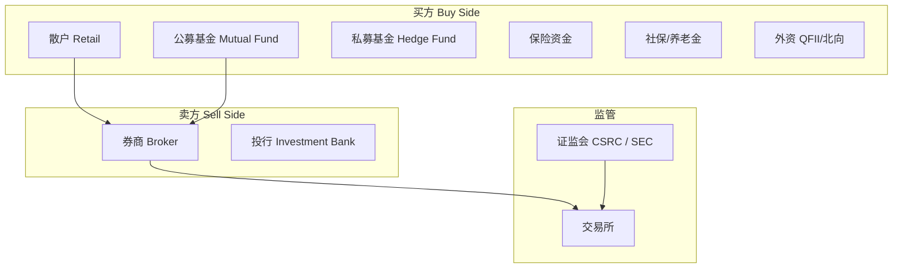

# 04 股票基础 | Stocks 101

`🟢 入门` `预计阅读：20 分钟`

> 核心问题：买股票到底买的是什么？股价为什么会涨跌？

---

## 一句话总结

**买股票 = 买公司的一小块所有权。股价短期是投票机，长期是称重机。**

---

## 股票是什么？

### 股票 vs 债券（最本质的区别）

| | 股票 Stock | 债券 Bond |
|--|-----------|-----------|
| 身份 | 股东（老板之一） | 债权人（借钱给公司） |
| 回报 | 不确定（可能翻倍，可能归零） | 确定（固定利息） |
| 风险 | 高 | 低 |
| 公司倒闭时 | 最后才能分钱（可能没了） | 优先偿还 |
| 上涨空间 | 无限 | 有限 |

---

## 股价为什么会涨跌？

### 短期：供需决定

### 长期：盈利决定

> 💡 格雷厄姆名言：**"短期来看，市场是投票机；长期来看，市场是称重机。"**
> 短期靠情绪和资金驱动，长期靠真实盈利支撑。

---

## 股票的核心指标

### 估值指标

| 指标 | 公式 | 含义 | 参考值 |
|------|------|------|--------|
| P/E 市盈率 | 股价 ÷ 每股收益 | 多少年回本 | 10-25 正常 |
| P/B 市净率 | 股价 ÷ 每股净资产 | 相对账面价值贵不贵 | <1 可能低估 |
| P/S 市销率 | 市值 ÷ 营收 | 适合亏损公司 | 行业差异大 |
| 股息率 | 每股分红 ÷ 股价 | 现金回报率 | >3% 算高 |

### 盈利指标

| 指标 | 含义 |
|------|------|
| EPS (Earnings Per Share) | 每股赚多少钱 |
| ROE (Return on Equity) | 股东的钱赚了多少回报 |
| 净利润增速 | 赚钱能力是否在增长 |
| 毛利率 | 产品本身赚不赚钱 |

---

## A 股 vs 美股 vs 港股

| 特征 | A 股 | 美股 | 港股 |
|------|------|------|------|
| 交易时间 | 9:30-15:00 | 9:30-16:00 (美东) | 9:30-16:00 |
| 交易制度 | T+1 | T+0 | T+0 |
| 涨跌限制 | 有 | 无（有熔断） | 无 |
| 做空 | 融券（门槛高） | 容易 | 容易 |
| 散户占比 | 高 | 低 | 低 |
| 上市制度 | 注册制（2023 全面） | 注册制 | 注册制 |

---

## 股票市场的参与者

---

## 新手最常犯的错误

| 错误 | 为什么错 | 正确思维 |
|------|----------|----------|
| 追涨杀跌 | 高买低卖 | 有体系地买卖 |
| 只看股价高低 | 10 元的股票不一定比 100 元的便宜 | 看估值（P/E） |
| 频繁交易 | 手续费 + 情绪消耗 | 减少交易频率 |
| 满仓一只股 | 风险集中 | 分散持仓 |
| 听消息炒股 | 你听到时已经晚了 | 建立自己的分析框架 |
| 不设止损 | 小亏变大亏 | 提前定好退出规则 |

---

## 核心概念速查

| 术语 | 英文 | 一句话解释 |
|------|------|-----------|
| IPO | Initial Public Offering | 公司第一次公开卖股票 |
| 市值 | Market Cap | 股价 × 总股数 |
| 市盈率 | P/E Ratio | 股价 ÷ 每股收益 |
| 每股收益 | EPS | 公司利润 ÷ 总股数 |
| 分红 | Dividend | 公司把利润分给股东 |
| 做多 | Long | 买入，赌涨 |
| 做空 | Short | 借来卖掉，赌跌 |
| 牛市 | Bull Market | 持续上涨的市场 |
| 熊市 | Bear Market | 持续下跌的市场（跌 >20%） |
| 大盘指数 | Index | 一篮子股票的综合表现（沪深 300、标普 500） |

---

## 延伸思考

1. 为什么巴菲特说"买股票就是买公司"？
2. A 股为什么散户多、波动大？（→ 制度 + 投资者结构）
3. 一只股票 P/E = 100，一定是泡沫吗？（→ 看增速，PEG）

---

## 下一篇

→ [05 债券基础](./05-bonds-101.md)：债券和股票有什么区别？为什么说债券是"安全资产"？
