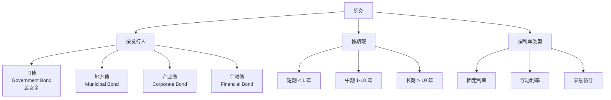
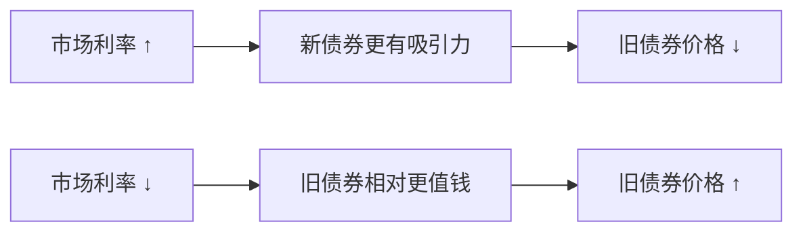
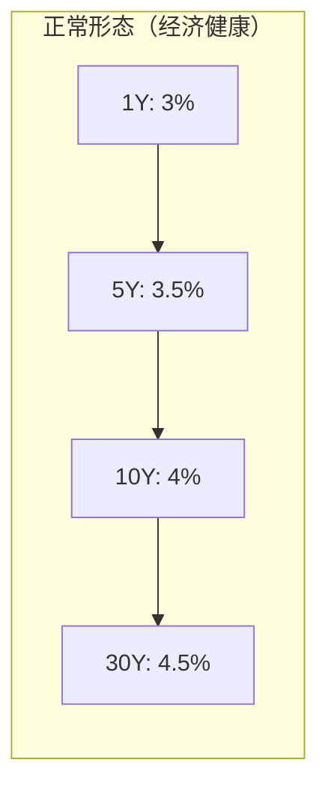
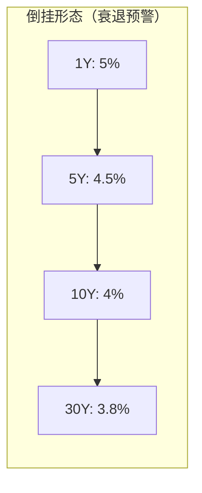
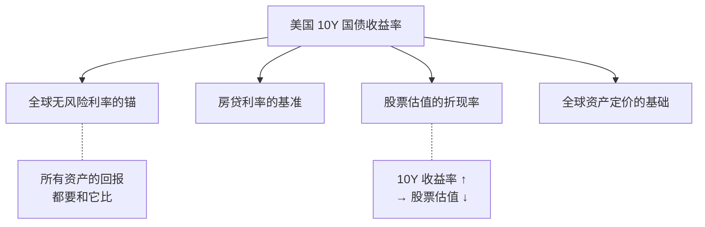

# 05 债券基础 | Bonds 101

`🟢 入门` `预计阅读：15 分钟`

> 核心问题：债券和股票有什么区别？为什么说债券是"安全资产"？利率和债券价格为什么反着走？

---

## 一句话总结

**债券 = 借条。你借钱给政府/企业，它定期付你利息，到期还本金。收益确定但有限，风险低但不是零。**

---

## 债券的本质


### 债券的关键要素

| 要素 | 英文 | 含义 | 例子 |
|------|------|------|------|
| 面值 | Par Value / Face Value | 到期还你多少钱 | 100 元 |
| 票面利率 | Coupon Rate | 每年付多少利息 | 3% |
| 到期日 | Maturity Date | 什么时候还本金 | 2035 年 |
| 发行人 | Issuer | 谁借的钱 | 财政部/腾讯 |
| 信用评级 | Credit Rating | 还钱能力评估 | AAA/AA/BBB |

---

## 债券的分类



---

## 最重要的概念：利率↑ = 债券价格↓

这是很多人搞不懂的点，用一个例子说清楚：

```
你持有一张债券：面值 100 元，票面利率 3%，每年付 3 元利息。

现在市场利率升到 5%。
新发的债券每年付 5 元利息。

问：谁还愿意花 100 元买你那张只付 3 元的旧债券？
答：没人。除非你降价卖。

所以：利率上升 → 旧债券价格下跌。
```



> 💡 **利率和债券价格永远反向运动**。这是债券投资最核心的规律。

### 久期 (Duration)：利率敏感度

| 债券类型 | 久期 | 利率变动 1% 的影响 |
|----------|------|-------------------|
| 1 年期国债 | ~1 年 | 价格变动 ~1% |
| 10 年期国债 | ~8 年 | 价格变动 ~8% |
| 30 年期国债 | ~20 年 | 价格变动 ~20% |

> 期限越长，对利率越敏感。这就是为什么 2022 年美联储加息时，长期债券暴跌。

---

## 收益率 (Yield)

### 到期收益率 YTM (Yield to Maturity)

```
YTM = 你现在买入这张债券，持有到期，每年的实际回报率。

如果债券价格 = 面值 → YTM = 票面利率
如果债券价格 < 面值 → YTM > 票面利率（你买便宜了）
如果债券价格 > 面值 → YTM < 票面利率（你买贵了）
```

### 收益率曲线 (Yield Curve)





> 正常情况：期限越长利率越高（补偿时间风险）。
> 倒挂时：短期利率 > 长期利率 → 市场预期未来经济变差、利率会降。

---

## 为什么要关注美国 10 年期国债？



> 📊 当 10Y 美债收益率从 1.5% 升到 5%（2021→2023），全球股市、债市、房市都遭受了巨大冲击。

---

## 中国债券市场

| 品种 | 发行人 | 风险 | 收益率参考 |
|------|--------|------|-----------|
| 国债 | 财政部 | 极低 | 10Y ~2.3% |
| 国开债 | 国开行 | 极低 | 略高于国债 |
| 地方债 | 地方政府 | 低 | 略高于国债 |
| 企业债 AAA | 优质企业 | 低 | +50-100bp |
| 企业债 AA | 一般企业 | 中 | +100-200bp |
| 城投债 | 地方融资平台 | 中高 | +100-300bp |
| 可转债 | 上市公司 | 中 | 兼具股性和债性 |

---

## 核心概念速查

| 术语 | 英文 | 一句话解释 |
|------|------|-----------|
| 面值 | Par Value | 债券到期偿还的金额 |
| 票息 | Coupon | 定期支付的利息 |
| 到期收益率 | YTM | 持有到期的年化回报 |
| 久期 | Duration | 债券价格对利率的敏感度 |
| 信用利差 | Credit Spread | 企业债收益率 - 国债收益率 |
| 收益率曲线 | Yield Curve | 不同期限债券收益率的连线 |
| 倒挂 | Inversion | 短期利率高于长期利率 |
| 违约 | Default | 发行人还不起钱 |

---

## 延伸思考

1. 为什么说"债券是股票的对手盘"？（→ 股债跷跷板）
2. 2022 年为什么股债双杀？（→ 通胀环境下跷跷板失效）
3. 中国国债收益率持续下行说明什么？（→ 经济预期弱）
4. 可转债为什么被称为"进可攻退可守"？

---

## 下一篇

→ [06 基金与 ETF](./06-funds-and-etf.md)：不会选股怎么办？
