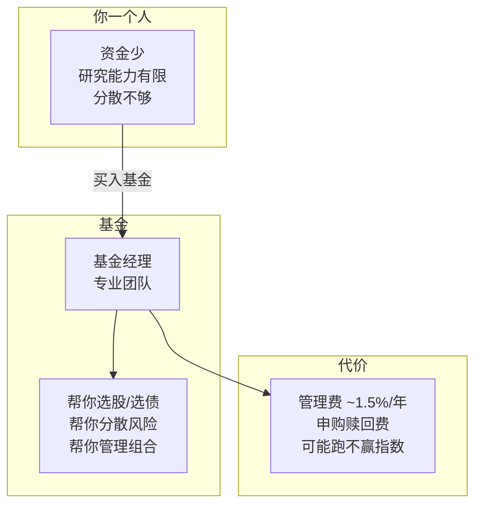
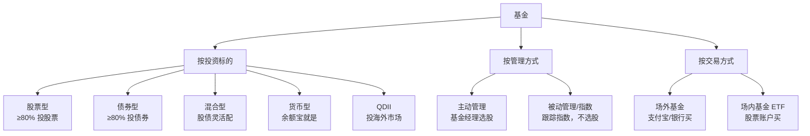
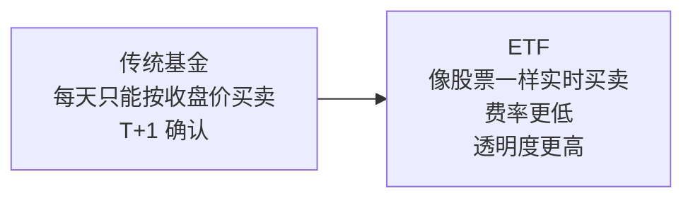
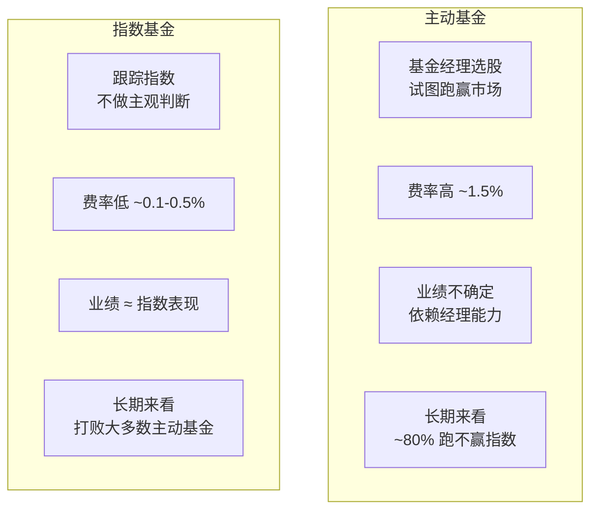
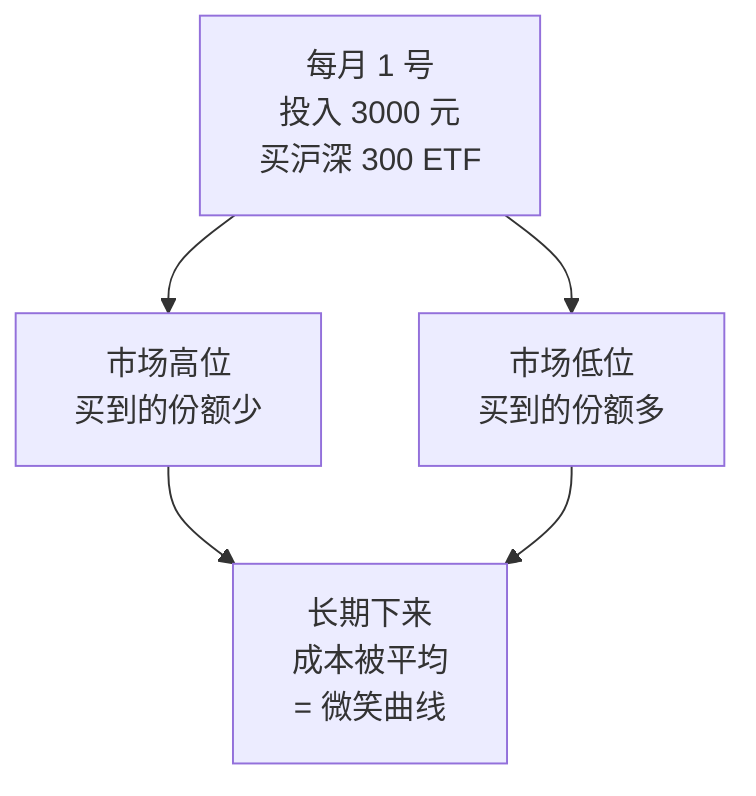

# 06 基金与 ETF | Funds & ETF

`🟢 入门` `预计阅读：15 分钟`

> 核心问题：不会选股怎么办？基金和 ETF 有什么区别？该买哪个？

---

## 一句话总结

**基金 = 把大家的钱凑在一起，交给专业人士打理。ETF = 可以像股票一样买卖的基金。不会选股？买指数基金就对了。**

---

## 基金的本质

---

## 基金分类

---

## ETF 是什么？

**ETF (Exchange-Traded Fund)** = 交易所交易基金

### ETF 的优势

| 优势 | 说明 |
|------|------|
| 费率低 | 管理费 0.1-0.5%（主动基金 1-1.5%） |
| 交易灵活 | 盘中实时买卖 |
| 透明 | 每天公布持仓 |
| 分散 | 一只 ETF = 一篮子股票 |
| 品种丰富 | 宽基/行业/商品/跨境都有 |

---

## 核心 ETF 推荐（中国投资者）

### 宽基指数 ETF

| ETF | 代码 | 跟踪指数 | 适合 |
|-----|------|----------|------|
| 沪深 300 ETF | 510300 | 沪深 300 | A 股核心资产 |
| 中证 500 ETF | 510500 | 中证 500 | 中盘成长 |
| 创业板 ETF | 159915 | 创业板指 | 科技成长 |
| 科创 50 ETF | 588000 | 科创 50 | 硬科技 |
| 纳指 ETF | 513100 | 纳斯达克 100 | 美股科技 |
| 标普 500 ETF | 513500 | 标普 500 | 美股大盘 |

### 行业/主题 ETF

| ETF | 跟踪 | 适合 |
|-----|------|------|
| 半导体 ETF | 芯片产业链 | 看好国产替代 |
| 新能源 ETF | 光伏/锂电/电动车 | 看好绿色转型 |
| 医药 ETF | 医药生物 | 老龄化受益 |
| 红利 ETF | 高分红股票 | 稳健收息 |
| 黄金 ETF | 黄金现货 | 避险/抗通胀 |

---

## 主动基金 vs 指数基金

> 💡 巴菲特的建议：**"对大多数人来说，定期买入低费率的指数基金是最好的投资方式。"**

---

## 定投策略 | Dollar Cost Averaging (DCA)

### 什么是定投？

固定时间、固定金额买入基金。不择时，靠纪律。

### 定投的优势

| 优势 | 说明 |
|------|------|
| 不需要择时 | 避免"买在山顶"的恐惧 |
| 强制储蓄 | 养成投资习惯 |
| 平滑成本 | 低位多买，高位少买 |
| 心理压力小 | 不用盯盘 |

### 定投的注意事项

1. **选对标的**：定投垃圾股照样亏。选宽基指数（沪深 300、标普 500）最稳。
2. **坚持足够久**：至少 3 年以上才能看到效果。
3. **止盈很重要**：A 股牛短熊长，涨多了要分批止盈。
4. **不要在牛市顶部开始**：虽然定投不择时，但起点太高回本周期会很长。

---

## 新手行动方案

**最简方案**：
- 每月定投 **沪深 300 ETF** + **纳指 ETF**（各 50%）
- 金额 = 月收入的 10-30%
- 坚持 3 年，不看账户

---

## 核心概念速查

| 术语 | 英文 | 一句话解释 |
|------|------|-----------|
| ETF | Exchange-Traded Fund | 在交易所买卖的基金 |
| 指数基金 | Index Fund | 跟踪某个指数的基金 |
| 主动基金 | Active Fund | 基金经理主动选股的基金 |
| 定投 | DCA (Dollar Cost Averaging) | 定期定额投资 |
| 管理费 | Management Fee | 基金公司每年收的费用 |
| 跟踪误差 | Tracking Error | ETF 和指数的偏差 |
| 场内/场外 | On-exchange / Off-exchange | 股票账户买 vs 支付宝买 |
| QDII | Qualified Domestic Institutional Investor | 投资海外的基金 |

---

## 延伸思考

1. 为什么巴菲特说"买指数基金"但自己却选股？
2. 如果所有人都买指数基金，市场还能有效定价吗？
3. A 股适合定投吗？（→ 牛短熊长，止盈策略很关键）

---

## 下一篇

→ [07 风险与收益](./07-risk-and-return.md)：高收益一定高风险吗？
