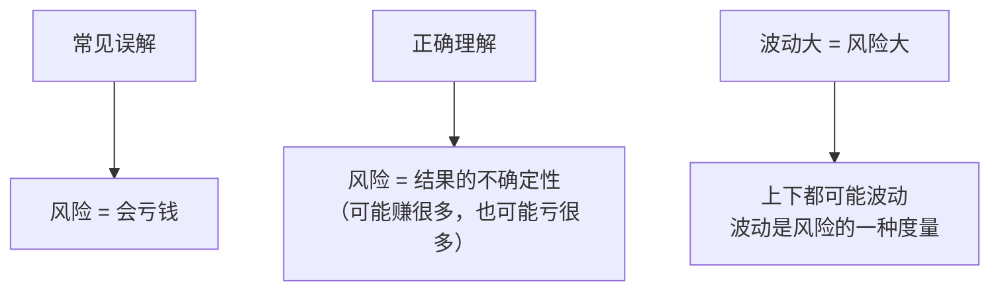
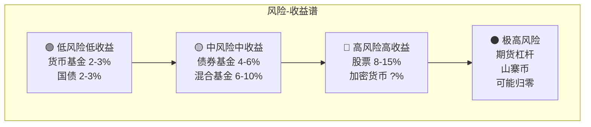
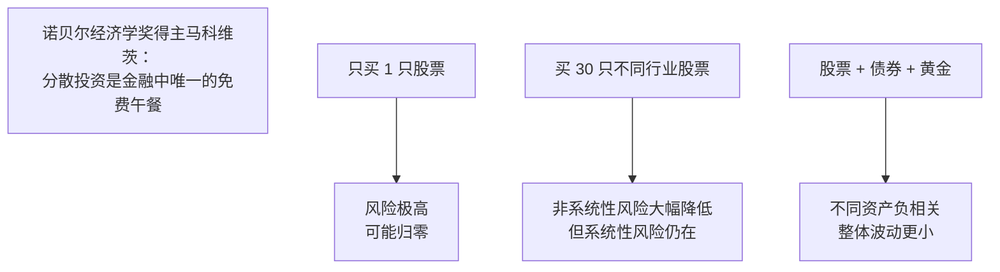
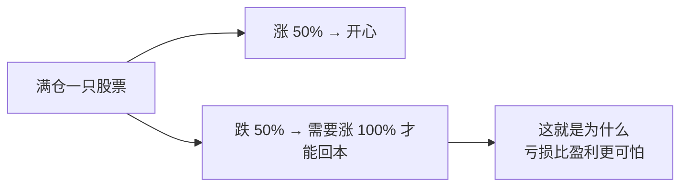

# 07 风险与收益 | Risk & Return

`🟢 入门` `预计阅读：15 分钟`

> 核心问题：高收益一定高风险吗？怎么衡量风险？怎么在风险和收益之间找平衡？

---

## 一句话总结

**风险不等于亏钱，风险 = 不确定性。投资的核心不是追求最高收益，而是追求"单位风险下的最高收益"。**

---

## 风险的正确理解

### 风险 ≠ 亏钱



### 风险的种类

| 风险类型 | 英文 | 例子 | 能否分散 |
|----------|------|------|----------|
| 系统性风险 | Systematic Risk | 金融危机、战争、加息 | ❌ 不能 |
| 非系统性风险 | Unsystematic Risk | 某公司财务造假 | ✅ 分散持仓 |
| 流动性风险 | Liquidity Risk | 想卖卖不掉 | 选流动性好的资产 |
| 信用风险 | Credit Risk | 借钱的人还不起 | 选高评级 |
| 通胀风险 | Inflation Risk | 钱贬值 | 配置抗通胀资产 |

---

## 风险与收益的关系



### 各资产的历史风险收益

| 资产 | 长期年化收益 | 年化波动率 | 最大回撤 |
|------|-------------|-----------|----------|
| 货币基金 | 2-3% | ~0% | 几乎无 |
| 中国国债 | 3-4% | 3-5% | -5% |
| 沪深 300 | 8-10% | 20-25% | -70%（2008） |
| 标普 500 | 10-12% | 15-18% | -55%（2008） |
| 黄金 | 7-8% | 15-18% | -45%（1980-2000） |
| BTC | 100%+（早期） | 60-80% | -85%（2022） |

> 💡 注意：**高收益不是"保证"的，高风险是"确定"的**。你承担了高风险，不一定能获得高收益。

---

## 衡量风险的指标

| 指标 | 英文 | 含义 | 越大越... |
|------|------|------|-----------|
| 波动率 | Volatility (σ) | 收益率的标准差 | 风险越大 |
| 最大回撤 | Max Drawdown | 从最高点到最低点的跌幅 | 风险越大 |
| 夏普比率 | Sharpe Ratio | (收益-无风险利率) ÷ 波动率 | 性价比越高 ✓ |
| Beta | β | 相对市场的波动倍数 | 波动越大 |
| VaR | Value at Risk | 在一定概率下的最大损失 | 风险越大 |

### 夏普比率：最重要的"性价比"指标

```
Sharpe Ratio = (投资收益率 - 无风险利率) / 波动率

例子：
基金 A：收益 15%，波动 20% → Sharpe = (15-3)/20 = 0.6
基金 B：收益 10%，波动 8%  → Sharpe = (10-3)/8 = 0.875

→ 基金 B 的"性价比"更高！
```

> 💡 **Sharpe > 1** 算优秀，**> 2** 算顶级。大多数基金长期 Sharpe 在 0.3-0.8 之间。

---

## 分散投资：唯一的"免费午餐"



### 相关性是关键

| 资产组合 | 相关性 | 分散效果 |
|----------|--------|----------|
| A 股 + A 股 | 高正相关 | ❌ 差 |
| A 股 + 美股 | 中等正相关 | 🟡 一般 |
| 股票 + 债券 | 负相关（通常） | ✅ 好 |
| 股票 + 黄金 | 低相关 | ✅ 好 |

---

## 风险管理的核心原则

### 1. 永远不要 All-in



**数学真相**：
| 亏损 | 需要涨多少才能回本 |
|------|-------------------|
| -10% | +11% |
| -20% | +25% |
| -30% | +43% |
| -50% | +100% |
| -80% | +400% |
| -90% | +900% |

### 2. 用"睡得着觉"来衡量仓位

如果你的持仓让你晚上睡不着、白天频繁看手机，说明**仓位太重或风险太高**。

### 3. 先想最坏情况

> "投资的第一条规则是不要亏钱。第二条规则是不要忘记第一条。" —— 巴菲特

---

## 核心概念速查

| 术语 | 英文 | 一句话解释 |
|------|------|-----------|
| 波动率 | Volatility | 价格上下波动的幅度 |
| 最大回撤 | Max Drawdown | 历史上最大的亏损幅度 |
| 夏普比率 | Sharpe Ratio | 每承担一单位风险获得多少超额收益 |
| 分散投资 | Diversification | 不把鸡蛋放一个篮子里 |
| 相关性 | Correlation | 两个资产是否同涨同跌 |
| 系统性风险 | Systematic Risk | 整个市场的风险，无法分散 |
| 风险溢价 | Risk Premium | 承担风险获得的额外回报 |

---

## 延伸思考

1. "低风险高收益"的机会存在吗？（→ 极少，且转瞬即逝）
2. 为什么散户总是"高买低卖"？（→ 行为金融学，恐惧与贪婪）
3. 如果你只能选一个指标评价基金，选哪个？（→ 夏普比率）

---

## 下一篇

→ [08 经济指标入门](./08-economic-indicators.md)：GDP、CPI、PMI 到底在说什么？
