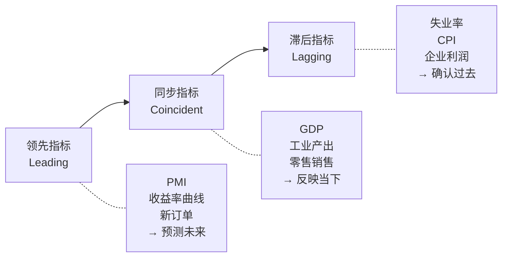
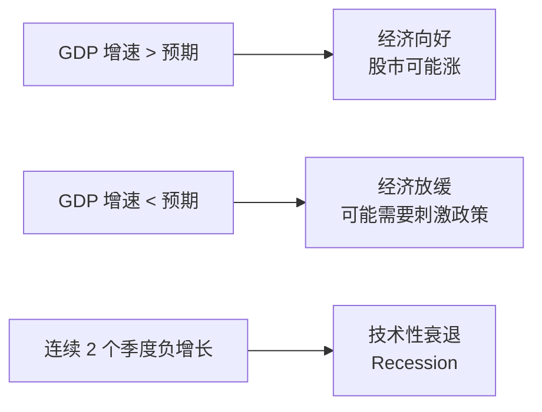
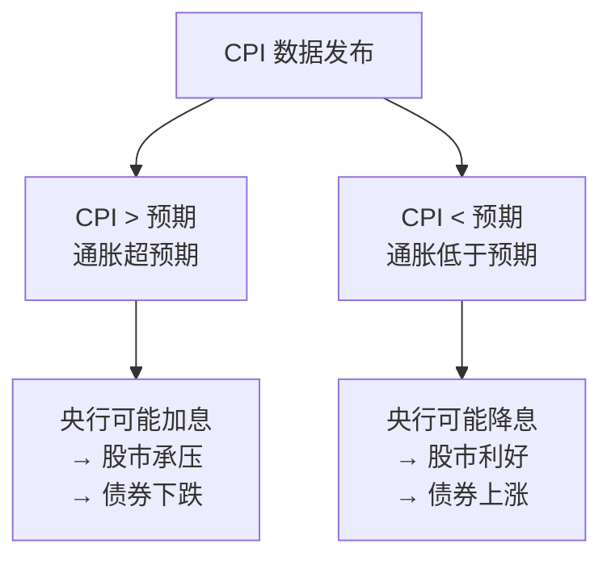
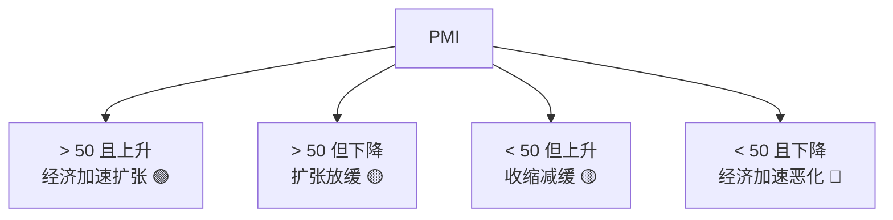
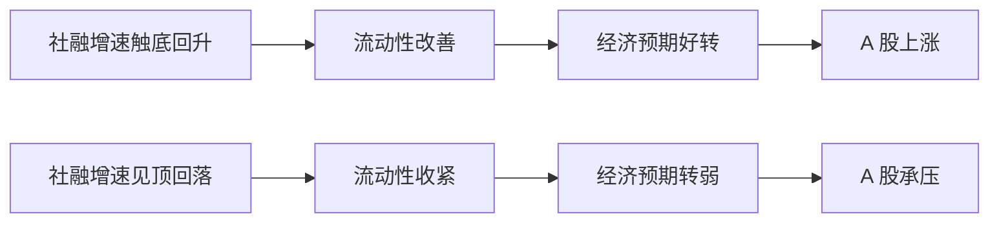
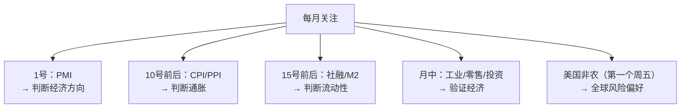

# 08 经济指标入门 | Economic Indicators

`🟢 入门` `预计阅读：20 分钟`

> 核心问题：GDP、CPI、PMI 这些数字到底在说什么？怎么用它们判断经济好不好？

---

## 一句话总结

**经济指标是经济的"体检报告"。学会看几个核心指标，你就能判断经济是在变好还是变差。**

---

## 指标分类：领先、同步、滞后



> 💡 **领先指标最有用**——它告诉你未来会怎样。等滞后指标确认时，市场早就反应了。

---

## 核心指标详解

### 1. GDP — 经济总量

```
GDP (Gross Domestic Product) = 一个国家在一段时间内生产的所有商品和服务的总价值
```

| 要点 | 说明 |
|------|------|
| 频率 | 季度 |
| 关注什么 | 同比增速（中国目标 ~5%） |
| 局限性 | 滞后、修正多、不反映质量 |



### 2. CPI — 通胀温度计

```
CPI (Consumer Price Index) = 一篮子消费品的价格变动
```

| 要点 | 说明 |
|------|------|
| 频率 | 月度 |
| 关注什么 | 同比增速（健康水平 2-3%） |
| 核心 CPI | 剔除食品和能源（波动太大） |



### 3. PMI — 经济先行指标

```
PMI (Purchasing Managers' Index) = 采购经理人指数
通过调查企业采购经理对未来的预期编制
```

| 要点 | 说明 |
|------|------|
| 频率 | 月度（每月 1 号前后） |
| 荣枯线 | **50** |
| > 50 | 经济扩张 |
| < 50 | 经济收缩 |
| 分类 | 制造业 PMI / 服务业 PMI |



> 📊 中国有两个 PMI：官方 PMI（偏大企业）和财新 PMI（偏中小企业）。两者有时方向不一致。

### 4. 就业数据 — 经济的核心

**美国非农就业 (Non-Farm Payrolls, NFP)**：
- 每月第一个周五发布
- 全球金融市场最关注的单一数据
- 直接影响美联储决策

| 数据 | 含义 |
|------|------|
| 新增就业 > 20 万 | 就业市场强劲 |
| 新增就业 < 10 万 | 就业放缓，可能降息 |
| 失业率 < 4% | 充分就业 |
| 失业率快速上升 | 衰退信号 |

### 5. 社融 / M2 — 中国特色指标

```
社融 (Total Social Financing) = 实体经济从金融体系获得的全部资金
M2 = 广义货币供应量
```

| 要点 | 说明 |
|------|------|
| 为什么重要 | 中国经济靠信贷驱动，社融是领先指标 |
| 看什么 | 同比增速的拐点 |
| 与 A 股关系 | 社融增速 ↑ → A 股通常 1-2 季度后上涨 |



---

## 指标速查表

| 指标 | 英文 | 频率 | 类型 | 核心看点 |
|------|------|------|------|----------|
| GDP | Gross Domestic Product | 季度 | 同步 | 增速趋势 |
| CPI | Consumer Price Index | 月度 | 滞后 | 通胀水平 |
| PPI | Producer Price Index | 月度 | 领先(对CPI) | 上游成本 |
| PMI | Purchasing Managers' Index | 月度 | 领先 | 荣枯线 50 |
| 非农 | Non-Farm Payrolls | 月度 | 同步 | 新增就业数 |
| 失业率 | Unemployment Rate | 月度 | 滞后 | 趋势方向 |
| 社融 | Total Social Financing | 月度 | 领先 | 增速拐点 |
| M2 | Broad Money | 月度 | 领先 | 货币供给 |
| 零售销售 | Retail Sales | 月度 | 同步 | 消费强弱 |
| 工业增加值 | Industrial Production | 月度 | 同步 | 生产端 |

---

## 怎么用这些指标？

### 实战框架



### 数据发布后怎么看？

1. **看绝对值**：好还是差？
2. **看预期差**：比市场预期好还是差？（这个更重要！）
3. **看趋势**：连续几个月的方向
4. **看结构**：分项数据有没有亮点或隐忧

> 💡 市场不是对"好数据"反应，而是对"超预期"反应。数据好但不及预期，市场可能跌。

---

## 核心概念速查

| 术语 | 英文 | 一句话解释 |
|------|------|-----------|
| 领先指标 | Leading Indicator | 预测未来经济走向 |
| 同步指标 | Coincident Indicator | 反映当前经济状态 |
| 滞后指标 | Lagging Indicator | 确认已发生的趋势 |
| 预期差 | Beat/Miss Expectations | 实际值 vs 市场预期 |
| 环比 | MoM (Month over Month) | 和上个月比 |
| 同比 | YoY (Year over Year) | 和去年同期比 |
| 季调 | Seasonally Adjusted | 剔除季节性因素 |

---

## 🎉 Level 1 完成！

恭喜你完成了入门阶段的全部内容！现在你应该能：
- ✅ 理解货币、利率、通胀的基本逻辑
- ✅ 区分股票、债券、基金的本质
- ✅ 知道风险和收益的关系
- ✅ 看懂基本的经济指标

**下一步** → [Level 2: 建立框架](../level-2-intermediate/)

---

## 相关链接

- [每日追踪 → 指标解读](../../05-daily-tracking/indicators/)
- [全球经济关联](../../04-global-economy/connections/)
- [数据源推荐](../../08-resources/data-sources.md)
