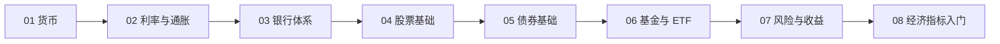

# 🟢 Level 1: 小白入门

> 目标：理解最基本的金融概念，能看懂财经新闻，知道钱是怎么运转的。

## 学习顺序

## 课程列表

| # | 主题 | 核心问题 | 文件 |
|---|------|----------|------|
| 01 | 货币的本质 | 钱是什么？为什么一张纸能买东西？ | [01-money.md](./01-money.md) |
| 02 | 利率与通胀 | 为什么钱会贬值？利率是谁定的？ | [02-interest-and-inflation.md](./02-interest-and-inflation.md) |
| 03 | 银行体系 | 银行怎么赚钱？央行是干什么的？ | [03-banking-system.md](./03-banking-system.md) |
| 04 | 股票基础 | 买股票到底买的是什么？ | [04-stocks-101.md](./04-stocks-101.md) |
| 05 | 债券基础 | 债券和股票有什么区别？ | [05-bonds-101.md](./05-bonds-101.md) |
| 06 | 基金与 ETF | 不会选股怎么办？ | [06-funds-and-etf.md](./06-funds-and-etf.md) |
| 07 | 风险与收益 | 高收益一定高风险吗？ | [07-risk-and-return.md](./07-risk-and-return.md) |
| 08 | 经济指标入门 | GDP、CPI、PMI 到底在说什么？ | [08-economic-indicators.md](./08-economic-indicators.md) |

## 完成标准

学完 Level 1 后，你应该能：
- [ ] 解释通胀是怎么产生的
- [ ] 说出央行加息/降息的基本逻辑
- [ ] 区分股票、债券、基金的本质区别
- [ ] 看懂一条财经新闻里的关键数据
- [ ] 理解"风险"不等于"亏钱"
