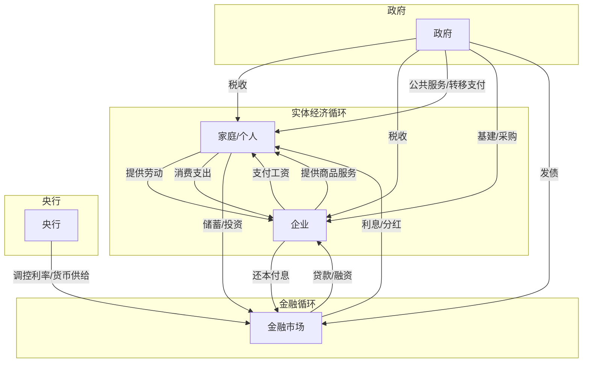
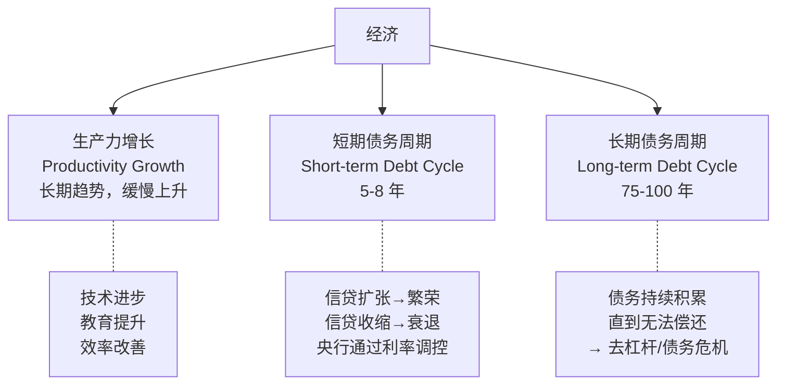
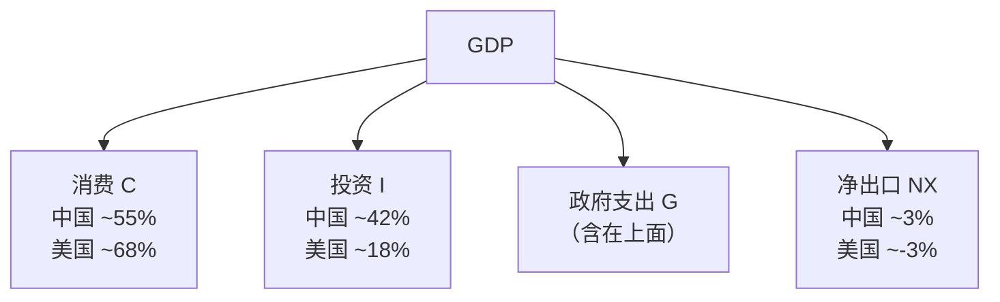
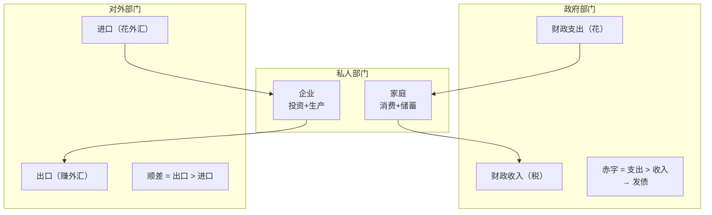
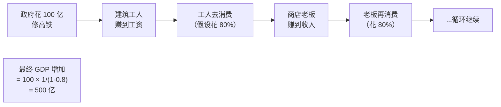
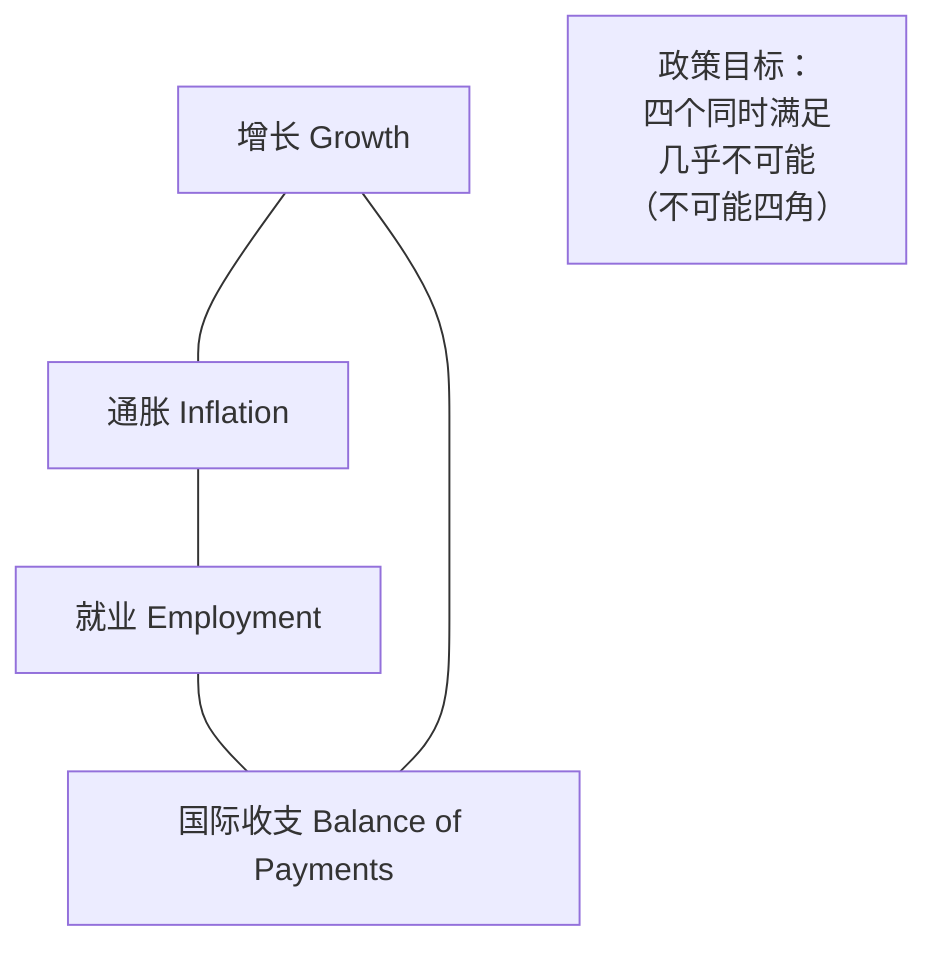
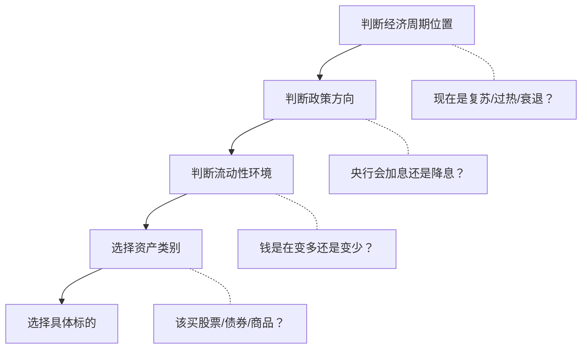

# 01 宏观经济学全景图 | Macroeconomics Overview

`🟡 进阶` `预计阅读：25 分钟`

> 核心问题：经济是怎么运转的？所有经济活动之间是怎么联系的？

---

## 一句话总结

**经济 = 无数笔交易的总和。一个人的支出是另一个人的收入。理解这个循环，就理解了经济的本质。**

---

## 经济的基本循环



---

## 达里奥的经济机器模型

> 推荐先看达里奥的 30 分钟视频《经济机器是怎样运行的》



### 三种力量叠加


---

## GDP 的三种算法

### 支出法（最常用）

```
GDP = C + I + G + NX

C = 消费 (Consumption)
I = 投资 (Investment)  
G = 政府支出 (Government Spending)
NX = 净出口 (Net Exports = 出口 - 进口)
```



> 💡 中国靠投资，美国靠消费。这个结构差异决定了两国经济的不同特征和政策重点。

### 收入法

```
GDP = 工资 + 利润 + 利息 + 租金 + 折旧 + 间接税
```

### 生产法

```
GDP = 各行业增加值之和
```

---

## 总供给与总需求 (AS-AD 模型)


### 四种经济状态

| 状态 | AD vs AS | 表现 | 政策应对 |
|------|----------|------|----------|
| 过热 | AD > AS | GDP↑ 通胀↑ | 紧缩（加息） |
| 健康增长 | AD ≈ AS | GDP↑ 通胀温和 | 维持 |
| 衰退 | AD < AS | GDP↓ 失业↑ | 宽松（降息+财政刺激） |
| 滞胀 | AS 收缩 | GDP↓ 通胀↑ | 最难处理 |

---

## 经济的三大部门



### 部门平衡恒等式

```
私人部门盈余 + 政府部门盈余 + 对外部门盈余 = 0
```

> 💡 这意味着：如果政府要减少赤字（紧缩），那么私人部门或对外部门必须有一个承受压力。这就是为什么"财政紧缩"往往导致经济衰退。

---

## 乘数效应 (Multiplier Effect)



```
乘数 = 1 / (1 - 边际消费倾向)
如果人们把收入的 80% 用来消费：乘数 = 1/(1-0.8) = 5
```

> 但实际中乘数没这么大，因为有储蓄、税收、进口等"漏出"。

---

## 宏观经济的核心矛盾



| 目标 | 指标 | 矛盾 |
|------|------|------|
| 高增长 | GDP 增速 | 增长太快 → 通胀 |
| 低通胀 | CPI < 3% | 压通胀 → 牺牲增长 |
| 充分就业 | 失业率 < 5% | 就业太好 → 工资通胀 |
| 国际收支平衡 | 经常账户 | 顺差太大 → 贸易摩擦 |

---

## 从宏观到投资



> 这就是"自上而下"(Top-Down) 的投资框架。先看宏观，再看行业，最后看个股。

---

## 核心概念速查

| 术语 | 英文 | 一句话解释 |
|------|------|-----------|
| 宏观经济学 | Macroeconomics | 研究整体经济运行的学科 |
| 总需求 | Aggregate Demand (AD) | 经济中所有人想买的总量 |
| 总供给 | Aggregate Supply (AS) | 经济中所有人能生产的总量 |
| 乘数效应 | Multiplier Effect | 一笔支出引发连锁消费 |
| 产出缺口 | Output Gap | 实际 GDP vs 潜在 GDP 的差距 |
| 潜在增速 | Potential Growth | 不引发通胀的最大增速 |
| 滞胀 | Stagflation | 经济停滞 + 高通胀 |

---

## 延伸思考

1. 中国 GDP 增速从 10% 降到 5%，是"衰退"吗？（→ 潜在增速下降）
2. 为什么说"一个人的支出是另一个人的收入"如此重要？
3. 如果所有人同时节约（不消费），经济会怎样？（→ 节俭悖论）

---

## 下一篇

→ [02 经济周期](./02-business-cycle.md)：为什么经济有繁荣和衰退？怎么判断现在在哪个阶段？
