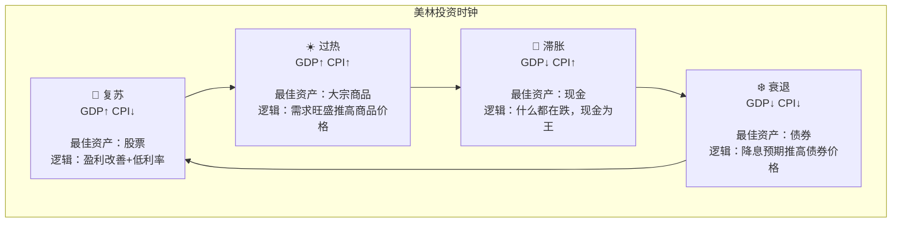
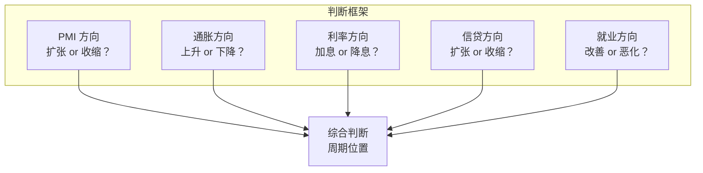
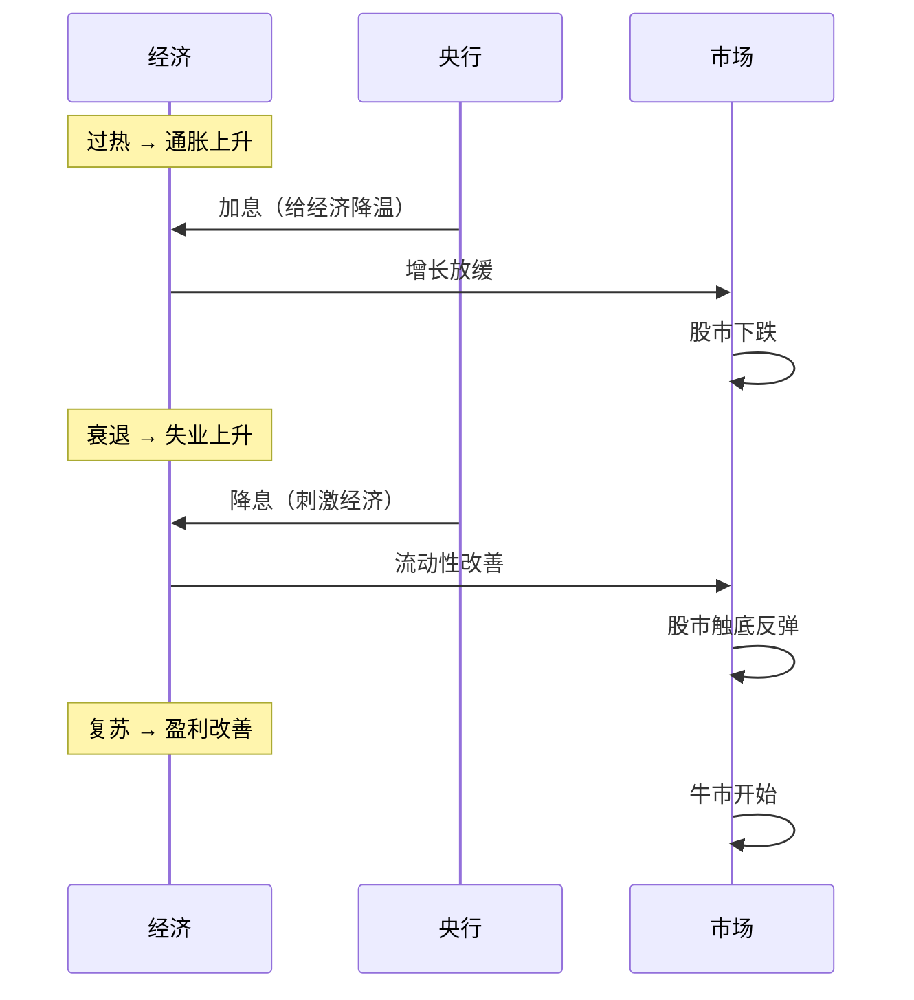
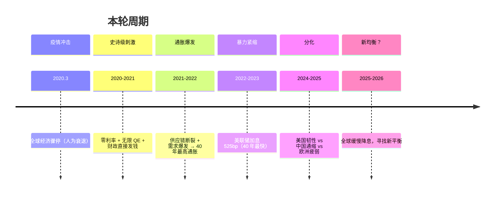

# 02 经济周期 | Business Cycle

`🟡 进阶` `预计阅读：25 分钟`

> 核心问题：为什么经济有繁荣和衰退？怎么判断现在在哪个阶段？不同阶段该买什么？

---

## 一句话总结

**经济永远在"扩张→过热→衰退→复苏"中循环。理解周期位置，是做对投资决策的前提。**

---

## 经济周期的四个阶段

### 各阶段特征

| 阶段 | GDP | 通胀 | 利率方向 | 就业 | 企业盈利 |
|------|-----|------|----------|------|----------|
| 🌱 复苏 | ↑ 加速 | ↓ 低位 | 低/开始升 | 改善 | 触底回升 |
| ☀️ 过热 | ↑ 高位 | ↑ 上升 | ↑ 加息 | 充分就业 | 高位 |
| 🍂 滞胀 | ↓ 放缓 | ↑ 高位 | ↑ 高位 | 开始恶化 | 见顶回落 |
| ❄️ 衰退 | ↓ 负增长 | ↓ 回落 | ↓ 降息 | 失业上升 | 大幅下滑 |

---

## 美林时钟：周期与资产轮动

### 各阶段资产表现排序

| 阶段 | 第一 | 第二 | 第三 | 第四 |
|------|------|------|------|------|
| 复苏 | 股票 | 债券 | 大宗 | 现金 |
| 过热 | 大宗 | 股票 | 现金 | 债券 |
| 滞胀 | 现金 | 大宗 | 债券 | 股票 |
| 衰退 | 债券 | 现金 | 股票 | 大宗 |

> ⚠️ 美林时钟是简化模型，实际中：
> 1. 阶段之间没有清晰分界线
> 2. 有时会跳过某个阶段
> 3. 中国和美国可能处于不同阶段
> 4. 2020 年后政策干预使周期变形

---

## 周期的驱动力：信贷

> 💡 **信贷是经济周期的放大器**。上行时加速繁荣，下行时加速衰退。这就是为什么"去杠杆"总是很痛苦。

---

## 如何判断当前周期位置？

### 核心指标组合

### 实战判断（2025 年中）

| 指标 | 中国 | 美国 |
|------|------|------|
| PMI | ~50 附近震荡 | >50 但放缓 |
| 通胀 | CPI ~0-1%（通缩边缘） | CPI ~3%（仍偏高） |
| 利率 | 降息周期中 | 高位维持/缓慢降息 |
| 信贷 | 社融增速低位 | 信贷条件偏紧 |
| 就业 | 压力大（青年失业） | 仍然强劲但边际放缓 |
| **判断** | **复苏早期/底部** | **扩张后期/放缓** |

> 💡 中美处于不同的周期阶段！这就是为什么两国政策方向相反（中国降息 vs 美国维持高利率）。

---

## 领先指标：提前预判拐点

| 指标 | 领先多久 | 看什么 |
|------|----------|--------|
| 收益率曲线（2Y-10Y） | 12-24 个月 | 倒挂 → 衰退预警 |
| PMI 新订单 | 3-6 个月 | 方向比绝对值重要 |
| 社融增速（中国） | 1-2 个季度 | 拐点领先经济和股市 |
| 信用利差 | 3-6 个月 | 走阔 → 风险上升 |
| 领先经济指标 LEI | 6-12 个月 | 连续下降 → 衰退 |
| 房屋开工（美国） | 6-12 个月 | 利率敏感，最先反应 |

---

## 周期中的政策应对

### 政策底 vs 市场底 vs 经济底

> 💡 **市场永远领先经济**。等经济数据好转再买，往往已经涨了一大截。

---

## 本轮周期的特殊性

### 2020-2026 年：史无前例的周期

---

## 核心概念速查

| 术语 | 英文 | 一句话解释 |
|------|------|-----------|
| 经济周期 | Business Cycle | 经济在扩张和收缩间的循环 |
| 美林时钟 | Merrill Lynch Clock | 根据增长+通胀判断资产配置 |
| 衰退 | Recession | 连续两个季度 GDP 负增长 |
| 萧条 | Depression | 严重且持久的衰退 |
| 产出缺口 | Output Gap | 实际产出 vs 潜在产出的差距 |
| 领先指标 | Leading Indicator | 提前预示经济方向的数据 |
| 政策底 | Policy Bottom | 政策开始转向宽松的时点 |
| 信贷脉冲 | Credit Impulse | 新增信贷的变化速度 |

---

## 延伸思考

1. 经济周期能被消灭吗？（→ 不能，但可以被平滑）
2. 为什么这次美国加息后没有衰退？（→ 财政扩张对冲）
3. 中国的"资产负债表衰退"和日本有什么异同？
4. 如果你只能看一个指标判断周期，你选哪个？

---

## 下一篇

→ [03 货币政策深入](./03-monetary-policy.md)：央行的工具箱里有什么？QE/QT 是怎么回事？
