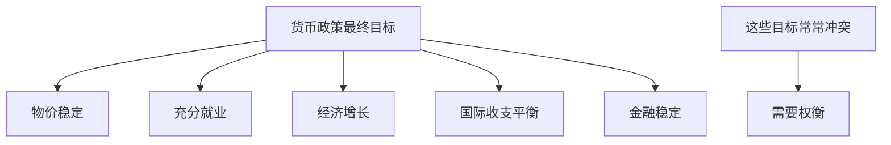
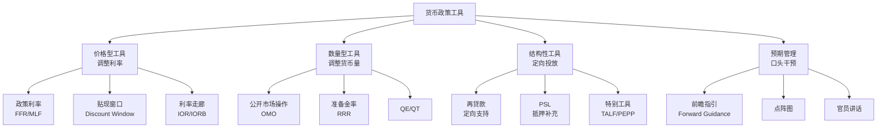
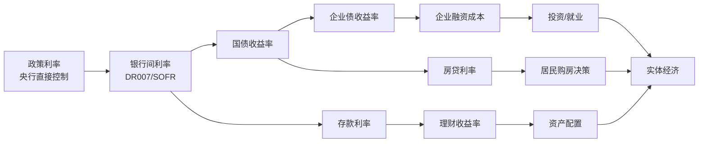
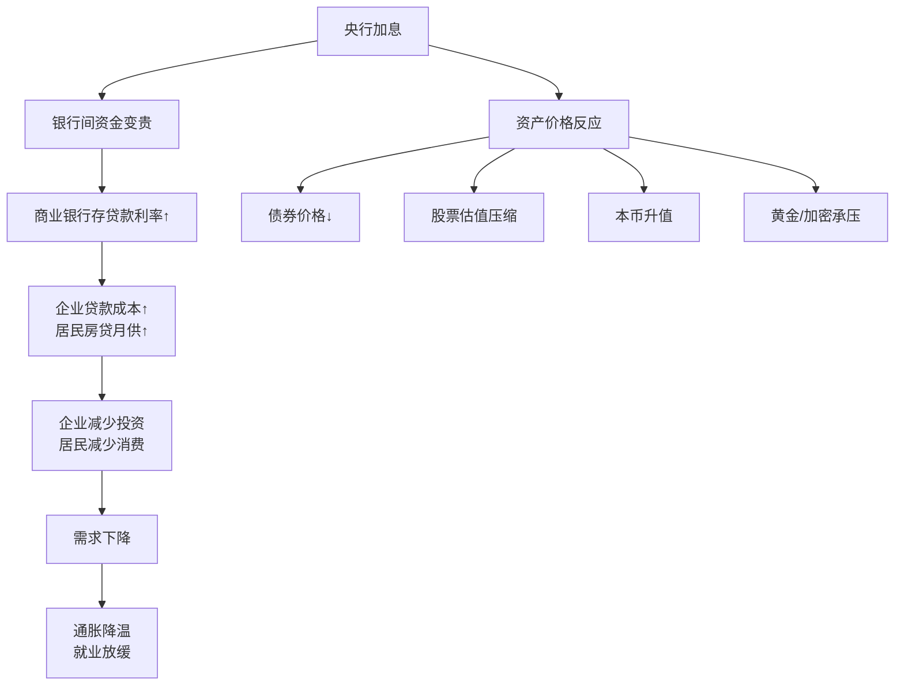
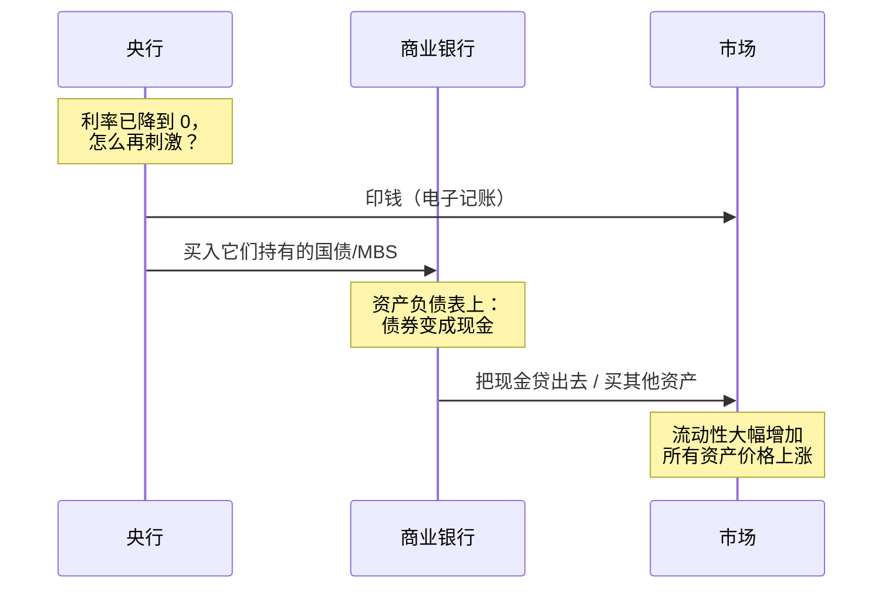
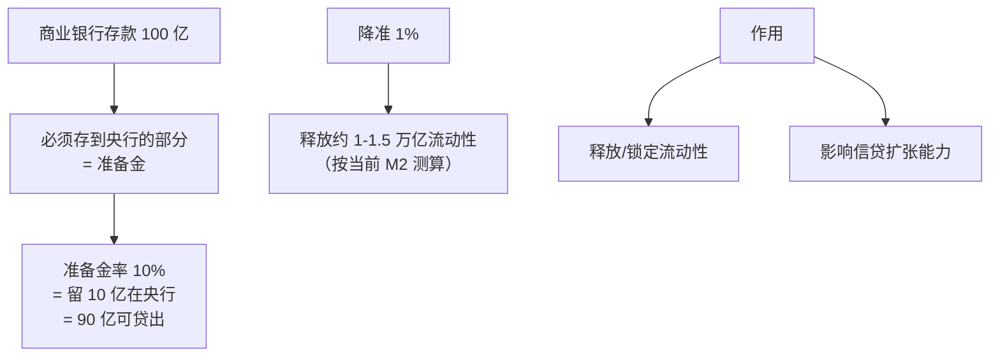
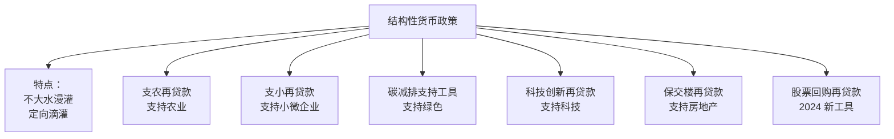
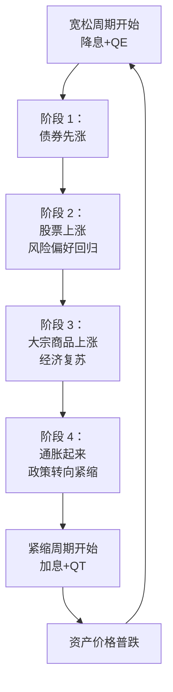

# 03 货币政策深入 | Monetary Policy Deep Dive

`🟡 进阶` `预计阅读：25 分钟`

> 核心问题：央行的工具箱里到底有什么？QE/QT 是怎么影响资产价格的？为什么这次降息没有以前那么有效？

---

## 一句话总结

**货币政策 = 央行通过控制"钱的数量"和"钱的价格"，来影响经济。但工具的有效性正在下降——这是当前最重要的宏观主题之一。**

---

## 货币政策的目标



| 央行 | 法定目标 | 优先级 |
|------|----------|--------|
| 美联储 (Fed) | 物价稳定 + 充分就业（双重使命） | 视情况权衡 |
| 欧央行 (ECB) | 物价稳定（单一目标） | 通胀第一 |
| 中国人民银行 (PBOC) | 多目标（含汇率、金融稳定） | 综合考虑 |
| 日本央行 (BOJ) | 物价稳定 2% | 长期低利率 |

---

## 货币政策工具箱



---

## 价格型工具：利率

### 政策利率传导链



### 加息的传导（典型场景）



---

## 数量型工具：QE 和 QT

### QE 是什么？



### QE 的效果链

```mermaid
graph TB
    QE[央行 QE 买债] --> A[国债收益率↓]
    A --> B[融资成本下降<br/>所有期限]
    QE --> C[银行流动性增加]
    C --> D[信贷扩张]
    QE --> E[资产价格上涨<br/>"组合再平衡效应"]
    E --> F[财富效应<br/>消费增加]
    QE --> G[本币贬值<br/>提振出口]
    
    style E fill:#3498db,color:#fff
```

### QE 历史

| 时期 | 央行 | 规模 | 背景 |
|------|------|------|------|
| 2001-2006 | 日本 | ~$300 亿 | 全球首次 QE |
| 2008-2014 | 美联储（QE1/2/3） | $3.5 万亿 | 金融危机后 |
| 2015-2018 | 欧央行 | €2.6 万亿 | 欧债危机后 |
| 2020-2022 | 美联储 | $4.5 万亿 | 疫情应对 |
| 2020-2022 | 全球央行 | $11 万亿 | 史无前例 |

### QT（量化紧缩）

```mermaid
graph LR
    A[QT 模式] --> B[到期国债不再续买<br/>"被动缩表"]
    A --> C[主动卖出国债<br/>"主动缩表"]
    
    D[效果] --> E[市场流动性减少]
    D --> F[长端利率上升]
    D --> G[资产价格承压]
    
    H[当前美联储 QT] --> I[每月 $250-600 亿<br/>资产负债表从 9 万亿降到 7 万亿]
```

> ⚠️ QT 的速度和幅度比加息更难预测，市场反应也更不确定。2019 年美联储 QT 导致回购市场危机就是教训。

---

## 准备金率（中国特色）



中国近年准备金率走势：
- 2011 高点：21.5%
- 2015：17%
- 2020：12.5%
- 2024：~7%（创新低）

> 💡 准备金率在中国是常用工具，在美国基本不再使用（美联储已取消法定准备金率）。

---

## 结构性工具（中国为代表）



> 💡 这是中国与美欧的重要差异。美联储是"总量+价格"为主，中国是"总量+结构"双管齐下。

---

## 前瞻指引（Forward Guidance）

```mermaid
graph TB
    A[前瞻指引] --> B[未来政策路径的承诺/暗示]
    A --> C[作用：<br/>稳定市场预期<br/>影响长端利率]
    
    A --> D[类型]
    D --> D1[时间型："至少到 2024 年保持低利率"]
    D --> D2[条件型："直到通胀达到 2%"]
    D --> D3[模糊型："维持限制性立场"]
    
    E[关键案例] --> F[2008 年伯南克<br/>"低利率持续较长时间"]
    E --> G[2020 年鲍威尔<br/>"不考虑加息"]
```

---

## 货币政策为何"失效"？

近年央行政策的有效性在下降，原因复杂：

### 1. 利率传导不畅（中国）


### 2. 流动性陷阱

```mermaid
graph TB
    A[利率已经接近 0<br/>或为负] --> B[再降息也<br/>无法刺激借贷]
    B --> C[凯恩斯所说的<br/>"流动性陷阱"]
    
    D[历史案例] --> E[日本 1990s+]
    D --> F[欧洲 2014-2022]
    D --> G[当前中国部分领域]
```

### 3. 资产负债表衰退

借款人**主动**去杠杆，无论利率多低都不借钱（→ 详见 [信用与债务周期](./07-credit-cycle.md)）。

### 4. 财政主导（Fiscal Dominance）

```mermaid
graph TB
    A[政府债务过高] --> B[加息会让<br/>政府付息成本爆炸]
    B --> C[央行不敢真正紧缩]
    C --> D[货币政策被财政"绑架"]
    
    style D fill:#e74c3c,color:#fff
```

> 💡 美国债务/GDP > 120%，每年利息超国防预算。这种情况下货币政策的独立性受到挑战。这是当前最重要的宏观主题之一。

---

## 货币政策与资产价格

### 政策周期与资产轮动



### 流动性视角看资产

```
全球流动性 ≈ 主要央行资产负债表总规模

流动性扩张 → 资产价格上涨（包括加密货币）
流动性收缩 → 资产价格下跌
```

> 💡 这就是为什么 BTC 也跟着美联储跳舞——因为它是流动性最敏感的资产之一。

---

## 央行决策的"反应函数"

简化的反应函数（Taylor Rule）：

```
最优利率 = 中性利率 + 1.5 × (通胀 - 通胀目标) + 0.5 × 产出缺口

例：
中性利率 2%
当前通胀 4%，目标 2%
产出缺口 +1%
最优利率 = 2% + 1.5 × (4% - 2%) + 0.5 × 1% = 5.5%
```

实战中央行不会机械套公式，但泰勒规则提供了判断**当前利率是否过紧/过松**的参考。

---

## 核心概念速查

| 术语 | 英文 | 一句话解释 |
|------|------|-----------|
| 政策利率 | Policy Rate | 央行直接控制的利率 |
| 联邦基金利率 | Federal Funds Rate (FFR) | 美国政策利率 |
| QE | Quantitative Easing | 量化宽松，央行印钱买债 |
| QT | Quantitative Tightening | 量化紧缩，央行缩表 |
| 准备金率 | Reserve Requirement Ratio | 商业银行必须存央行的比例 |
| MLF | Medium-term Lending Facility | 中期借贷便利（中国） |
| 公开市场操作 | OMO (Open Market Operations) | 央行买卖证券调流动性 |
| 前瞻指引 | Forward Guidance | 央行对未来政策的暗示 |
| 中性利率 | Neutral Rate | 既不刺激也不抑制经济的利率 |
| 流动性陷阱 | Liquidity Trap | 利率为零仍无法刺激经济 |
| 财政主导 | Fiscal Dominance | 财政状况制约货币政策 |
| 缩表 | Balance Sheet Reduction | 央行缩减资产规模 |

---

## 延伸思考

1. 为什么 2020-2022 年史无前例的 QE 没有立刻引发恶性通胀？
2. 如果美联储被迫为美国财政赤字"印钱"，会发生什么？
3. 数字货币（CBDC）会怎么改变货币政策的传导？
4. 中国是否会进入日本式的"流动性陷阱"？

---

## 下一篇

→ [04 财政政策](./04-fiscal-policy.md)：政府花钱和收税怎么影响经济？为什么财政比货币更"硬核"？
