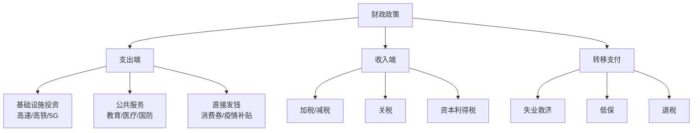
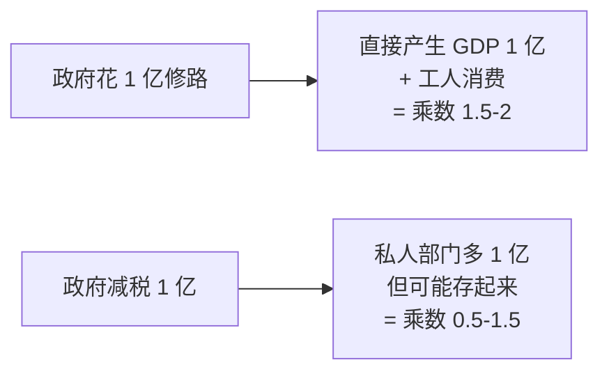
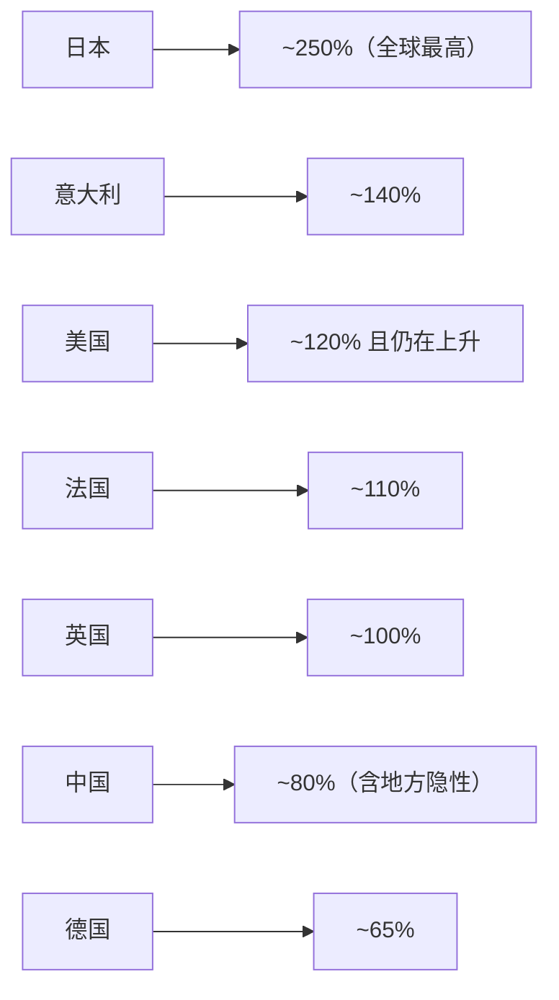
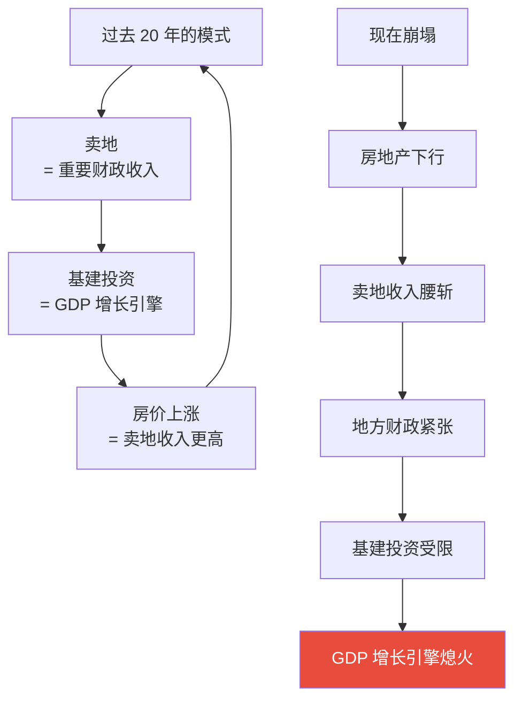
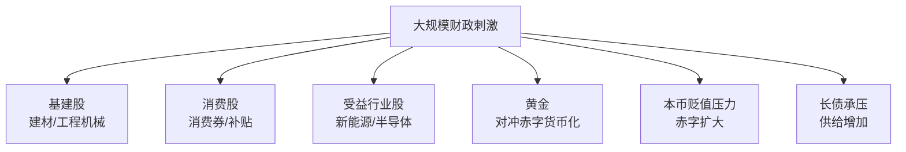
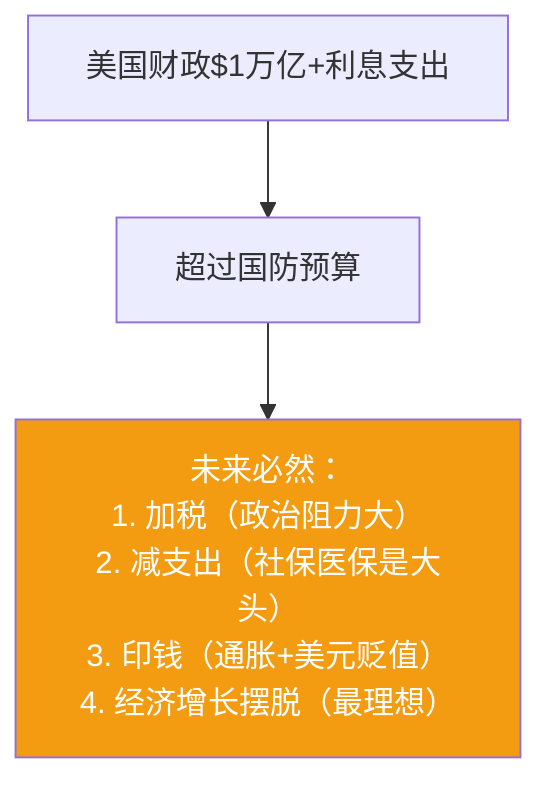
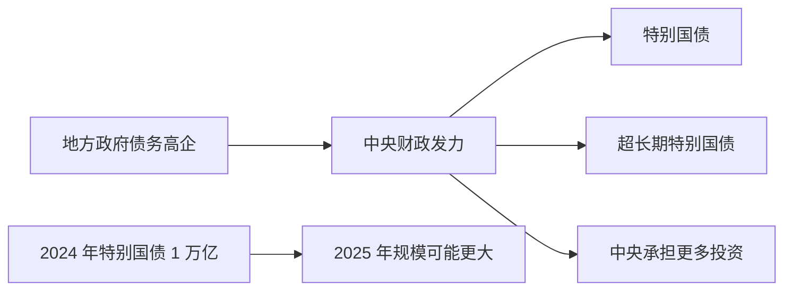

# 04 财政政策 | Fiscal Policy

`🟡 进阶` `预计阅读：20 分钟`

> 核心问题：政府收税和花钱怎么影响经济？为什么 2020 年后财政比货币更"硬核"？财政赤字到底有没有上限？

---

## 一句话总结

**财政政策 = 政府花钱（支出）+ 收税（收入）+ 借债（赤字）。在货币政策失效的时代，财政正在成为宏观调控的主角。**

---

## 财政 vs 货币：本质区别

```mermaid
graph TB
    subgraph "货币政策"
        M1[央行]
        M2[影响利率/流动性]
        M3[间接刺激]
        M4[需要私人部门"接招"<br/>愿意借贷消费]
    end
    
    subgraph "财政政策"
        F1[政府]
        F2[直接花钱/减税]
        F3[直接刺激]
        F4[钱直接进入实体经济<br/>不依赖私人部门]
    end
    
    M2 --> M3 --> M4
    F2 --> F3 --> F4
    
    style F4 fill:#27ae60,color:#fff
```

> 💡 **关键差异**：货币政策是"开水龙头"，但水流不流过来还得看私人部门。财政政策是"直接发钱"，立刻有效果。

---

## 财政政策的工具



### 支出 vs 减税：哪个更刺激？



**结论**：直接政府支出对 GDP 的拉动效果通常**强于**等量减税。但政府支出的"效率"和"挤出效应"是另一个问题。

---

## 财政赤字 (Fiscal Deficit)

```
财政赤字 = 财政支出 - 财政收入
盈余 = 收入 > 支出（很少见）
赤字 = 支出 > 收入（常态）
```

### 怎么弥补赤字？

```mermaid
graph TB
    A[财政赤字] --> B[发行国债<br/>向市场借钱]
    A --> C[央行直接购买国债<br/>"赤字货币化"<br/>= 印钱]
    A --> D[出售国有资产<br/>（不可持续）]
    A --> E[海外借款<br/>（中美少见）]
    
    style C fill:#e74c3c,color:#fff
```

### 为什么"赤字货币化"危险？


但近年来，这条线越来越模糊：
- 2020 年美联储 QE 实质上是"间接货币化"
- 日本央行持有 50%+ 国债
- 这就是为什么黄金、BTC 这样的"硬资产"叙事崛起

---

## 主要国家财政状况

### 财政赤字/GDP（2024）

| 国家 | 赤字率 | 评价 |
|------|--------|------|
| 美国 🇺🇸 | ~7% | 历史高位（非战时） |
| 日本 🇯🇵 | ~5% | 长期高赤字 |
| 中国 🇨🇳 | ~3-4%（官方） / ~7%（含地方隐性） | 表面合规，实际高 |
| 德国 🇩🇪 | ~2% | 财政纪律严 |
| 法国 🇫🇷 | ~5% | 长期超欧盟红线 |
| 印度 🇮🇳 | ~6% | 发展中国家正常 |

### 政府债务/GDP



---

## "财政空间"概念

```mermaid
graph TB
    A[财政空间<br/>Fiscal Space] --> B[一个国家在不引发<br/>债务危机的情况下<br/>能继续借多少钱]
    
    A --> C[影响因素]
    C --> C1[当前债务水平]
    C --> C2[借款利率<br/>越高空间越小]
    C --> C3[本币地位<br/>能否"印钱"]
    C --> C4[经济增长率]
    C --> C5[国际投资者信心]
```

### 为什么美国财政空间还很大？

| 优势 | 说明 |
|------|------|
| 美元是全球储备货币 | 全球需要美元资产 |
| 美债是全球安全资产 | 没有真正的替代品 |
| 自己的货币可以印 | 不会出现"美元违约" |
| 经济创新能力强 | 增长持续支撑财政 |

但这些优势正在**慢慢被侵蚀**。

---

## 当前的"大财政时代"

```mermaid
graph TB
    A[2020 年后<br/>"大财政时代"开启] --> B[原因 1：<br/>货币政策接近极限]
    A --> C[原因 2：<br/>疫情冲击需要直接救助]
    A --> D[原因 3：<br/>地缘竞争需要产业政策]
    A --> E[原因 4：<br/>不平等加剧需要再分配]
    A --> F[原因 5：<br/>能源转型需要大投入]
    
    G[特征] --> H[赤字常态化]
    G --> I[产业政策回归<br/>美国 IRA / CHIPS Act]
    G --> J[基建大幅投入]
    G --> K[直接发钱普及化]
```

### 美国的"产业政策"回归

| 法案 | 规模 | 内容 |
|------|------|------|
| IRA（通胀削减法案） | ~$3700 亿 | 新能源、电动车 |
| CHIPS Act | ~$520 亿 | 半导体本土制造 |
| Infrastructure Act | ~$1.2 万亿 | 基建升级 |

> 💡 美国从"市场原教旨主义"回归"国家干预+产业政策"，这是几十年来最大的范式转变。

---

## 中国的财政特殊性

```mermaid
graph TB
    CN[中国财政] --> A[一般公共预算<br/>常规支出]
    CN --> B[政府性基金预算<br/>主要是土地出让收入]
    CN --> C[国有资本经营预算]
    CN --> D[社保基金预算]
    CN --> E[地方政府专项债<br/>不计入预算赤字]
    CN --> F[地方政府融资平台<br/>城投债，"隐性债务"]
```

### 中国财政的核心问题



### 化债

中国当前面临的核心财政课题：
- 地方政府隐性债务规模 60-80 万亿
- 通过债务置换、特殊再融资债等方式逐步化解
- "中央加杠杆，地方降杠杆"成为新方向

---

## 财政与资产价格

### 大规模财政刺激的资产影响



### 财政紧缩的资产影响

| 资产 | 影响 |
|------|------|
| 政府相关股（国防/基建） | ↓ |
| 风险资产 | ↓（短期） |
| 长债 | ↑（债务压力减轻） |
| 本币 | ↑ |

---

## 当前最大的财政主题

### 美国财政可持续性



### 中国"中央加杠杆"



---

## 核心概念速查

| 术语 | 英文 | 一句话解释 |
|------|------|-----------|
| 财政赤字 | Fiscal Deficit | 政府支出 > 收入 |
| 政府债务 | Government Debt | 累计赤字形成的债务 |
| 国债 | Government Bond | 政府发行的债券 |
| 主权债务危机 | Sovereign Debt Crisis | 政府还不起债 |
| 赤字货币化 | Debt Monetization | 央行直接为政府融资 |
| 财政空间 | Fiscal Space | 还能借多少钱 |
| 自动稳定器 | Automatic Stabilizer | 经济差时自动增加支出（如失业救济） |
| 挤出效应 | Crowding Out | 政府借钱挤压私人投资 |
| MMT | Modern Monetary Theory | 现代货币理论（争议大） |
| 财政主导 | Fiscal Dominance | 财政绑架货币政策 |

---

## 延伸思考

1. 美国财政赤字的终局是什么？通胀化解？还是债务重组？
2. 日本债务/GDP 250% 还没崩，为什么？中国可以学吗？
3. MMT（现代货币理论）有道理吗？为什么主流经济学反对？
4. 如果财政变成"主角"，传统的美林时钟还适用吗？

---

## 下一篇

→ [05 国际贸易与汇率](./05-trade-and-fx.md)：全球化怎么影响每个人？汇率到底怎么定的？
