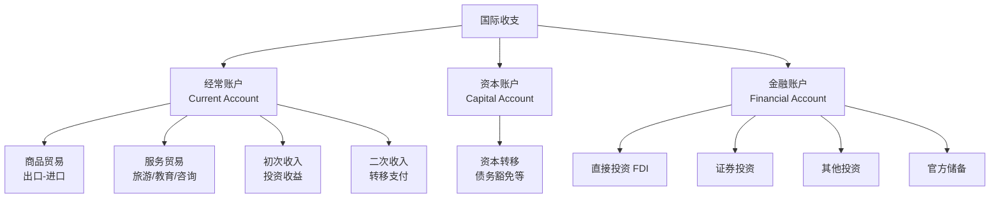
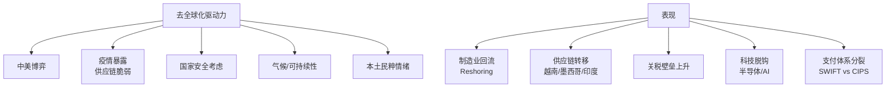
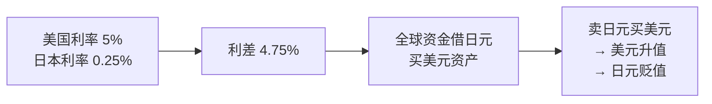
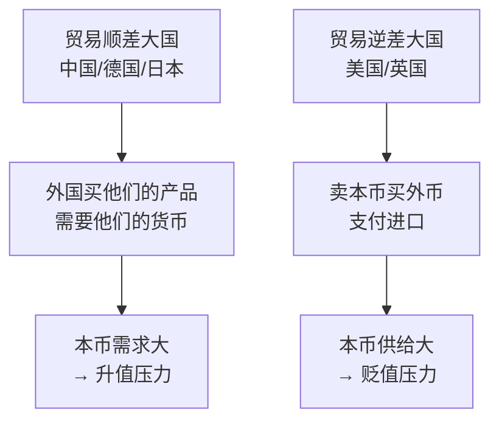
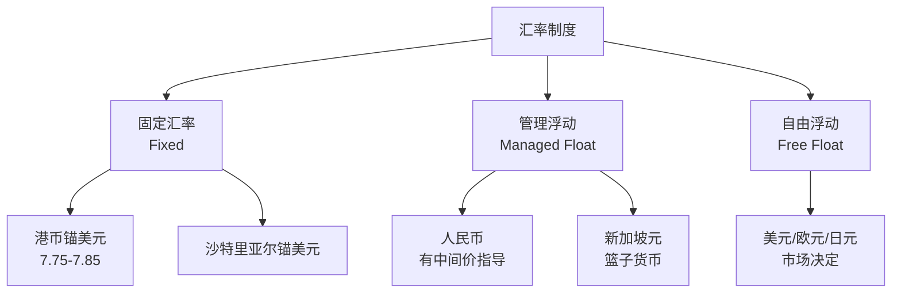
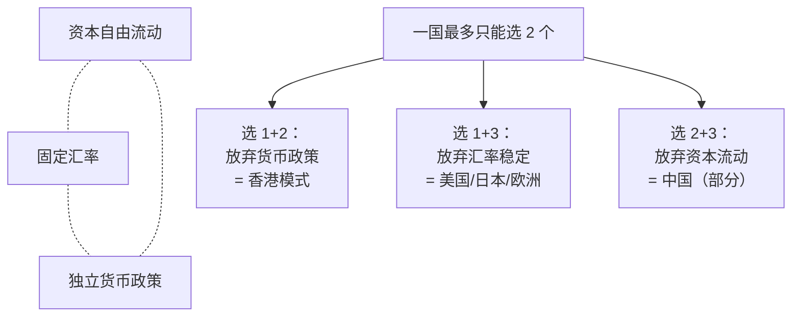
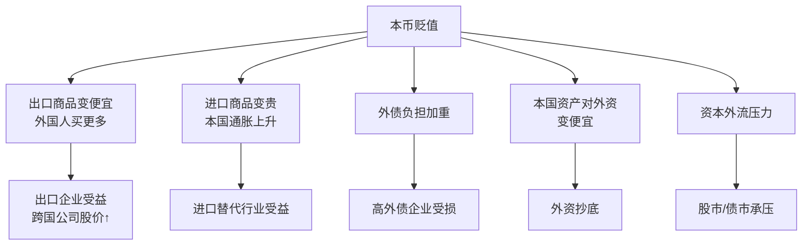
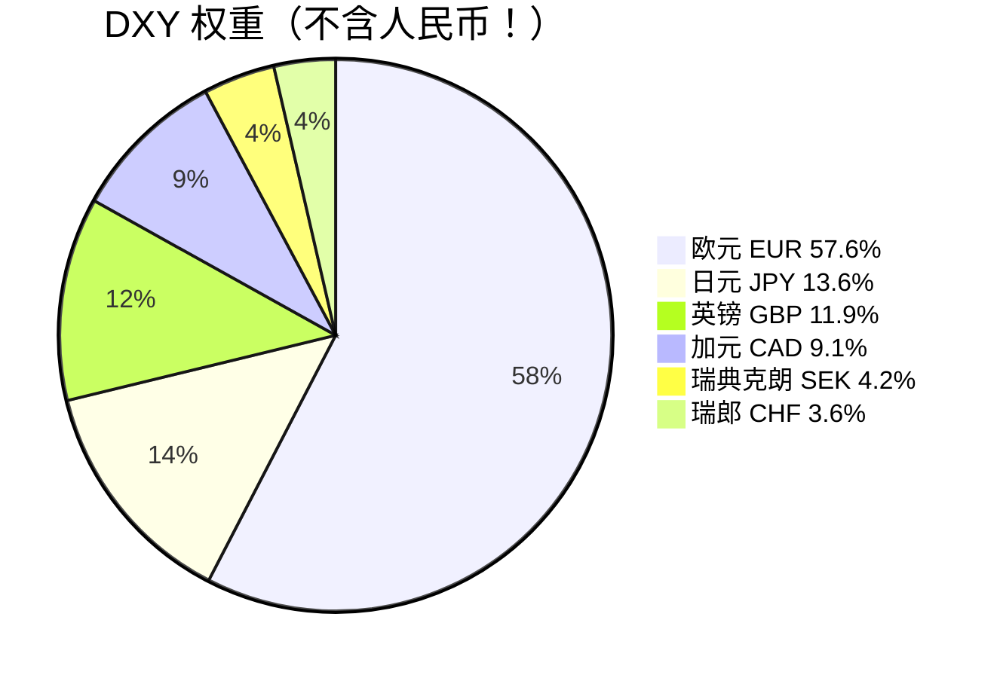

# 05 国际贸易与汇率 | International Trade & FX

`🟡 进阶` `预计阅读：25 分钟`

> 核心问题：全球化怎么影响每个人？汇率到底由什么决定？为什么"不可能三角"困扰所有央行？

---

## 一句话总结

**国际贸易让世界更紧密，但也制造了赢家和输家。汇率是两国经济的"温度计"，反映了利率差、贸易差、信心差。**

---

## 国际贸易基础

### 比较优势 (Comparative Advantage)

```mermaid
graph TB
    A[李嘉图比较优势理论] --> B[即使一国所有产品<br/>都不如另一国]
    B --> C[只要专注于<br/>"相对最擅长"的产品]
    C --> D[贸易仍能让<br/>双方都受益]
    
    E[简单例子] --> F[中国擅长制造]
    E --> G[美国擅长创新]
    F --> H[互通有无<br/>双赢]
    G --> H
```

### 国际收支 (Balance of Payments)



> 💡 经常账户 + 资本账户 + 金融账户 + 误差遗漏 ≈ 0（恒等式）

### 主要国家贸易格局

| 国家 | 经常账户 | 角色 |
|------|----------|------|
| 中国 🇨🇳 | 顺差大国 | 制造业出口 |
| 德国 🇩🇪 | 顺差大国 | 高端制造出口 |
| 日本 🇯🇵 | 顺差（投资收益） | 海外投资大国 |
| 美国 🇺🇸 | 巨额逆差 | 消费驱动 |
| 英国 🇬🇧 | 逆差 | 服务业为主 |

---

## 全球化的赢家与输家

```mermaid
graph TB
    GLOBAL[过去 30 年全球化] --> A[赢家]
    GLOBAL --> B[输家]
    
    A --> A1[发展中国家中产<br/>中国/越南/印度]
    A --> A2[跨国公司股东]
    A --> A3[发达国家高技能群体]
    A --> A4[全球消费者<br/>商品价格下降]
    
    B --> B1[发达国家蓝领<br/>美国"铁锈带"]
    B --> B2[制造业被替代地区]
    B --> B3[环境]
    B --> B4[传统工艺]
```

### "大象图"（Elephant Curve）

```
横轴：全球收入分位
纵轴：1988-2008 年收入增长率

形状像大象：
- 中段（发展中国家中产）：高速增长 ← 全球化赢家
- 80-95 分位（发达国家中产）：几乎不增长 ← 全球化输家
- 顶端（全球前 1%）：大幅增长 ← 全球化赢家

→ 这就是 Trump、Brexit 等民粹崛起的经济根源
```

---

## 当前的"去全球化"



---

## 汇率：核心定价机制

### 短期：利率差驱动



这就是 **Carry Trade（套息交易）**——影响汇率短中期走势的核心。

### 中期：经常账户



> ⚠️ 但实际中，美国是逆差大国但美元长期强势，原因在于**金融账户顺差**（全世界都买美债美股）。

### 长期：购买力平价 (PPP)

```
PPP 汇率 = 同一商品在两国的价格比

巨无霸指数（Big Mac Index）：
- 美国 $5.5
- 中国 ¥25
- PPP 估算：25/5.5 ≈ 4.5 元/美元
- 实际汇率：~7.2 元/美元
- → 人民币按 PPP 被"低估"约 37%
```

> 💡 但 PPP 是**长期均衡**，短期汇率会偏离，且偏离时间可能很长。

---

## 汇率制度



### 不可能三角 (Impossible Trinity)



> 💡 这是国际金融最重要的理论之一。中国的资本管制，本质上是"为了同时要稳汇率和独立货币政策"做出的牺牲。

---

## 美元体系的特殊地位

```mermaid
graph TB
    USD[美元] --> A[全球储备货币<br/>~58% 储备]
    USD --> B[全球贸易结算<br/>~50% 贸易]
    USD --> C[全球外汇交易<br/>88% 涉及美元]
    USD --> D[全球债务计价<br/>大多用美元]
    USD --> E[石油定价<br/>"石油美元"]
    
    F[美元强势的代价] --> G["特里芬难题"<br/>美国必须不断<br/>对外输出美元<br/>= 需要长期逆差]
```

### 特里芬难题 (Triffin Dilemma)

```
全球需要美元作储备 → 美国必须输出美元 → 美国必须长期逆差
但长期逆差 → 削弱美元信用 → 储备货币地位动摇

这是无解的悖论。
```

---

## 汇率冲击的传导

### 本币贬值的影响



### 本币升值的影响

```
出口企业受损（产品变贵）
进口企业受益（成本下降）
通胀降温
外债负担减轻
外资流入（追赶资产）
```

---

## 汇率干预

```mermaid
graph TB
    A[央行干预方式] --> B[直接干预<br/>买卖外汇]
    A --> C[间接干预<br/>调利率]
    A --> D[口头干预<br/>官员讲话]
    A --> E[管制干预<br/>资本流动限制]
    
    F[央行的"弹药"] --> G[外汇储备<br/>中国 $3.2 万亿全球第一]
    F --> H[政策利率]
    F --> I[市场信誉]
```

### 经典案例

| 事件 | 时间 | 结果 |
|------|------|------|
| 索罗斯狙击英镑 | 1992 | 英国央行失败，被迫退出 ERM |
| 索罗斯狙击港元 | 1998 | 港府坚守，索罗斯失败 |
| 日本干预日元 | 2022-2024 | 短期有效，长期跟随基本面 |
| 中国"811" 汇改 | 2015 | 一次性贬值后波动加剧 |

---

## 几个关键汇率

### 美元指数 DXY



### 人民币汇率

```
USD/CNY：在岸人民币（中国大陆）
USD/CNH：离岸人民币（香港等）
CFETS 篮子：人民币对一篮子货币（更全面）
```

---

## 核心概念速查

| 术语 | 英文 | 一句话解释 |
|------|------|-----------|
| 经常账户 | Current Account | 商品+服务+收入 |
| 金融账户 | Financial Account | 跨境投资 |
| 顺差/逆差 | Surplus/Deficit | 收支差额 |
| 比较优势 | Comparative Advantage | 相对最擅长的领域 |
| 套息交易 | Carry Trade | 借低息币投高息资产 |
| 购买力平价 | PPP | 长期汇率均衡水平 |
| 不可能三角 | Impossible Trinity | 自由流动+固定汇率+独立货币三选二 |
| 特里芬难题 | Triffin Dilemma | 储备货币的内在矛盾 |
| 资本管制 | Capital Control | 限制资金跨境 |
| 外汇储备 | FX Reserves | 央行持有的外币 |

---

## 延伸思考

1. 中国为什么不让人民币完全自由浮动？代价和收益是什么？
2. 美元失去储备货币地位需要什么条件？谁会取代？
3. 去全球化会持续多久？是不是历史必然？
4. 数字货币（CBDC）会改变国际货币体系吗？

---

## 下一篇

→ [06 金融市场结构](./06-market-structure.md)：钱在市场里到底怎么流动？谁在交易？
