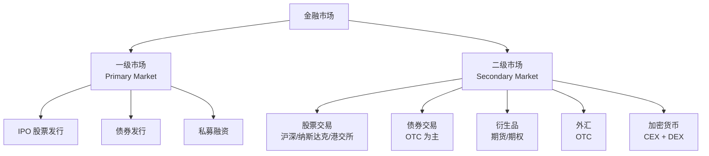
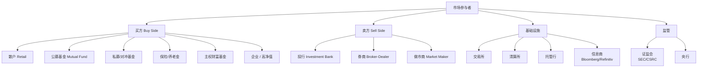
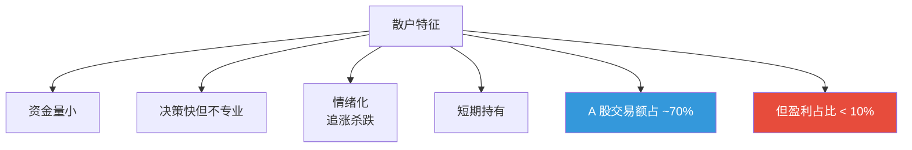
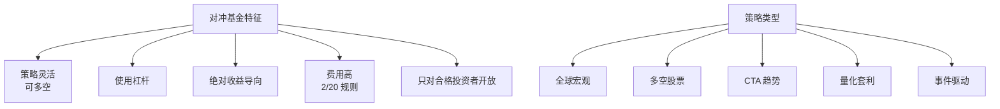
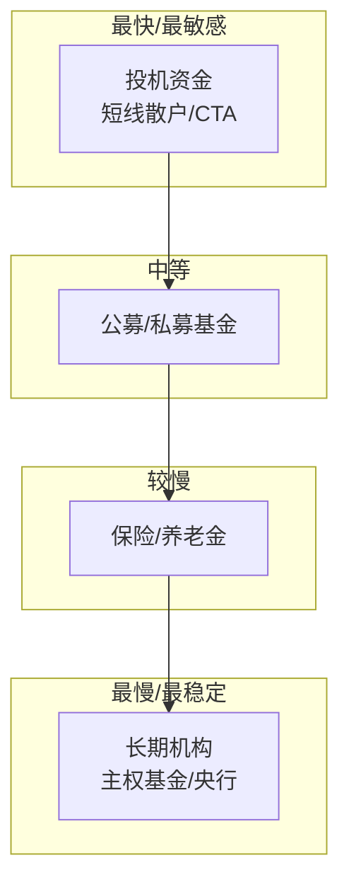
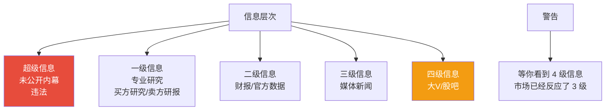
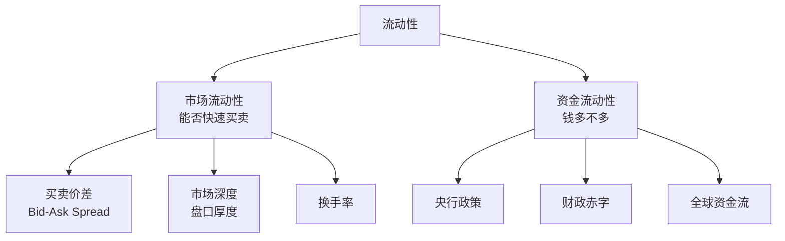

# 06 金融市场结构 | Financial Market Structure

`🟡 进阶` `预计阅读：20 分钟`

> 核心问题：钱在市场里怎么流动？谁在交易？为什么"散户对手盘"通常是机构？

---

## 一句话总结

**金融市场是个生态系统。理解谁在场、各自的目标和约束，才能理解价格为什么这么走。**

---

## 金融市场的全貌



### 一级市场 vs 二级市场

| | 一级市场 | 二级市场 |
|--|---------|---------|
| 谁发行 | 公司/政府 | — |
| 谁购买 | 投资者 | 投资者之间互相买卖 |
| 资金流向 | 进入发行方 | 在投资者间流转 |
| 例子 | IPO、债券发行 | 日常交易 |

> 💡 大多数人参与的是二级市场。**二级市场的价格变动不直接影响公司的钱袋子**，但会影响公司融资能力（因为它决定了下次发股的定价）。

---

## 市场参与者



---

## 各参与者的特征

### 散户（个人投资者）



> 💡 这就是 A 股的"七亏二平一赚"现象——散户在交易额上是主力，但在盈利上是少数。

### 公募基金

```mermaid
graph TB
    A[公募基金特征] --> B[资金量大<br/>但每只产品有上限]
    A --> C[受严格监管]
    A --> D[业绩压力<br/>每季度考核]
    A --> E[被迫"抱团"]
    A --> F[牛市追高<br/>熊市割肉]
    
    G[影响] --> H[基金重仓股波动放大]
    G --> I["基金赚钱、基民亏钱"现象]
```

### 对冲基金 / 私募



### 北向资金（外资）

```mermaid
graph TB
    A[北向资金] --> B[通过沪港通/深港通<br/>买 A 股]
    A --> C[被称为"聪明钱"<br/>但近年有效性下降]
    A --> D[偏好<br/>消费/金融/新能源龙头]
    A --> E[影响因素]
    E --> E1[美元强弱]
    E --> E2[中美利差]
    E --> E3[地缘风险]
    E --> E4[A 股估值水平]
```

---

## 资金流的"金字塔"



> 💡 不同层次的资金反应速度差异巨大。看清"是谁在主导这波行情"对判断持续性至关重要。

---

## 信息层次



### 散户的信息劣势

| 维度 | 散户 | 机构 |
|------|------|------|
| 调研 | 看新闻 | 实地调研、专家网络 |
| 数据 | 公开数据 | 付费数据库 + 替代数据 |
| 模型 | 拍脑袋 | 量化模型 |
| 速度 | 看到就晚了 | 算法毫秒级 |
| 成本 | 高 | 低（万分之一） |

**散户的优势**：
- 资金灵活，可以不受规模限制选股
- 没有业绩考核，可以长期持有
- 没有内部决策流程，可以快速行动

---

## 流动性 (Liquidity)



### 流动性危机

```mermaid
graph LR
    A[正常时期] --> B[资产价格 ≈ 内在价值]
    
    C[流动性危机] --> D[资产价格 << 内在价值<br/>"火灾甩卖"]
    D --> E[谁有钱谁是王]
    
    F[历史时刻] --> G[2008.10 金融危机底]
    F --> H[2020.3 疫情底]
    F --> I[2022.10-11 美债流动性危机]
```

---

## 衍生品市场

```mermaid
graph TB
    D[衍生品] --> A[期货 Futures<br/>约定未来交割]
    D --> B[期权 Options<br/>未来"权利"而非义务]
    D --> C[互换 Swaps<br/>交换现金流]
    D --> E[远期 Forwards<br/>OTC 期货]
    
    F[作用] --> G[套期保值<br/>Hedging]
    F --> H[投机 Speculation]
    F --> I[价格发现<br/>Price Discovery]
    
    J[规模] --> K[全球衍生品名义本金<br/>>$700 万亿<br/>是实体经济多倍]
```

### 衍生品的双刃剑

| 正面 | 负面 |
|------|------|
| 风险管理工具 | 杠杆放大风险 |
| 价格发现机制 | 制造系统性风险 |
| 提高市场效率 | 复杂性掩盖风险 |
| 配置工具 | 投机过度 |

> ⚠️ 2008 年危机的核心就是 CDS（信用违约互换）失控。

---

## A 股 vs 美股 vs 港股的市场结构

| 维度 | A 股 | 美股 | 港股 |
|------|------|------|------|
| 散户占比 | 70% | <20% | ~30% |
| 做空难度 | 难 | 易 | 易 |
| 涨跌停限制 | ±10/20% | 无 | 无 |
| T+? | T+1 | T+0 | T+0 |
| 期权品种 | 少 | 丰富 | 较多 |
| 衍生品交易量 | 小 | 巨大 | 大 |
| 主导力量 | 流动性+政策 | 机构+科技 | 国际资金 |

---

## 市场异象 (Market Anomalies)

```mermaid
graph TB
    A[已知异象] --> B[小盘股效应<br/>长期跑赢大盘]
    A --> C[价值效应<br/>低估值跑赢]
    A --> D[动量效应<br/>涨的继续涨]
    A --> E[反转效应<br/>极端走势会反转]
    A --> F[日历效应<br/>"五穷六绝七翻身"]
    A --> G[A 股小盘超额收益<br/>2012-2015 极致]
    
    H[警告] --> I[一旦被发现并广为人知<br/>异象会减弱甚至消失]
```

---

## 核心概念速查

| 术语 | 英文 | 一句话解释 |
|------|------|-----------|
| 一级市场 | Primary Market | 证券首次发行 |
| 二级市场 | Secondary Market | 证券交易市场 |
| 买方 | Buy Side | 投资管理方 |
| 卖方 | Sell Side | 投行/券商研究/做市 |
| 做市商 | Market Maker | 提供买卖报价的机构 |
| 流动性 | Liquidity | 资产能否快速变现 |
| 价差 | Bid-Ask Spread | 买入价与卖出价之差 |
| 换手率 | Turnover Rate | 成交量/流通股 |
| 衍生品 | Derivatives | 价值依赖于其他资产的合约 |
| 套利 | Arbitrage | 利用价差获利 |
| 多/空 | Long/Short | 买入做多/卖出做空 |

---

## 延伸思考

1. 散户能在专业机构主导的市场中赚钱吗？怎么赚？
2. 高频交易让市场更有效还是更不稳定？
3. 被动投资占比越来越高，会不会让市场失效？
4. 加密货币的市场结构（无中心化）和传统市场有什么本质区别？

---

## 下一篇

→ [07 信用与债务周期](./07-credit-cycle.md)：为什么债务是经济最大的驱动力？也是最大的风险源？
