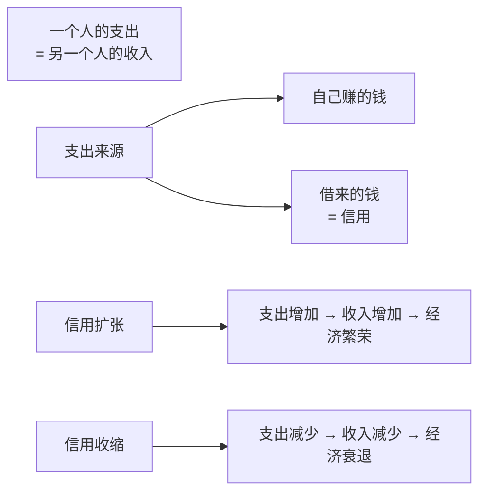
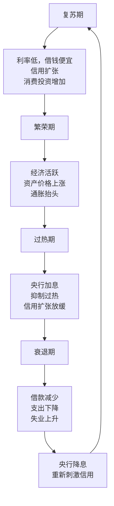
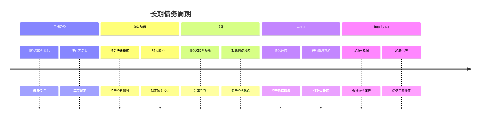
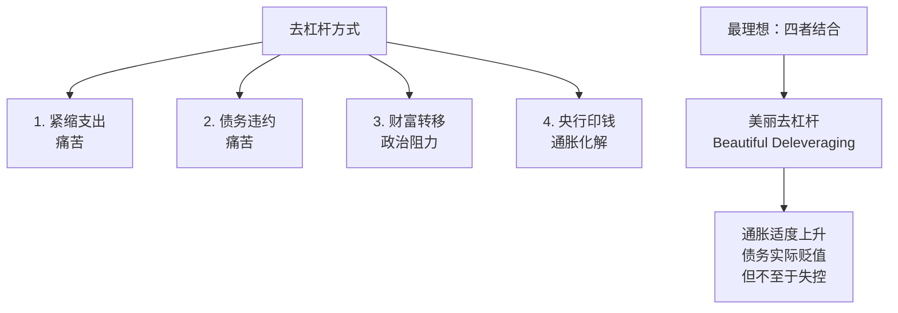
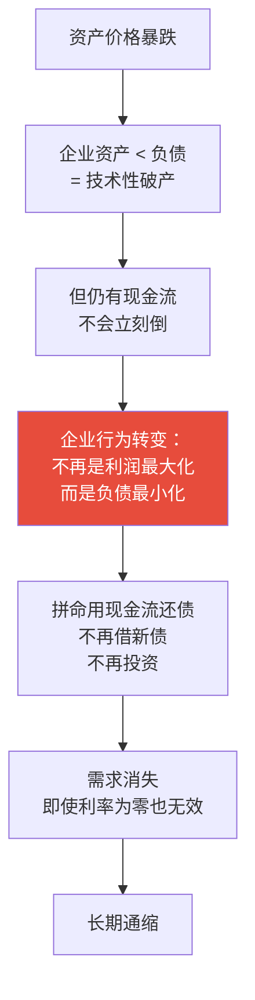
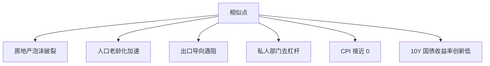
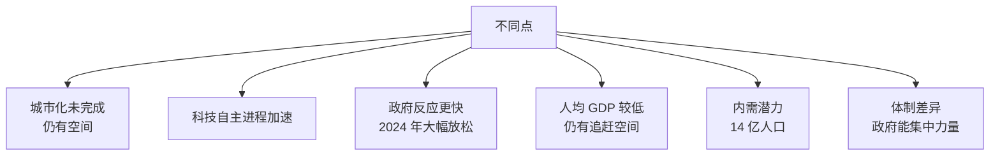
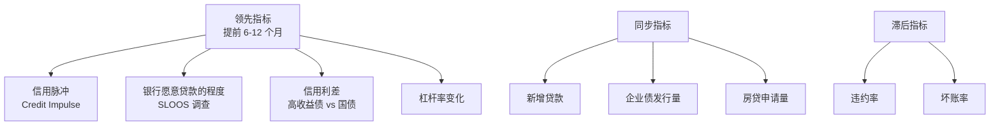
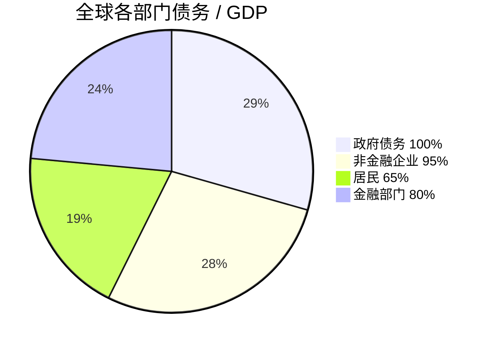
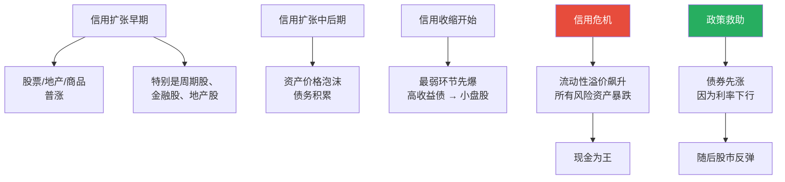

# 07 信用与债务周期 | Credit & Debt Cycle

`🟡 进阶` `预计阅读：30 分钟`

> 核心问题：为什么债务是经济最大的驱动力，也是最大的风险源？什么是"资产负债表衰退"？中国会重蹈日本覆辙吗？

---

## 一句话总结

**经济的本质是信用扩张和收缩的循环。债务能创造繁荣，也能制造危机。理解债务周期，就理解了宏观经济的"主线"。**

---

## 信用为什么这么重要？



> 💡 达里奥的核心观点：**经济中绝大部分增长来自信用，而不是生产力**。生产力增长缓慢稳定，但信用可以快速扩张和收缩，这就是周期的本质。

---

## 短期债务周期（5-8 年）



这是常规的"美林时钟"周期，由央行通过利率工具调节。

---

## 长期债务周期（50-75 年）



> 💡 短周期是"利率周期"，长周期是"债务周期"。当长周期顶部到来时，短周期工具（降息）会失效——这就是当前世界面临的局面。

---

## 达里奥的"美丽去杠杆"框架

去杠杆有四种方式：



### 历史上的去杠杆

| 时期 | 国家 | 方式 | 结果 |
|------|------|------|------|
| 1930s 大萧条 | 美国 | 紧缩+违约 | 灾难（GDP -25%） |
| 1990s | 日本 | 紧缩+缓慢印钱 | 失去三十年 |
| 2008 后 | 美国 | 大规模 QE + 财政 | 美丽去杠杆 |
| 2022+ | 美国 | 通胀化解 + 高名义增长 | 进行中 |
| 2021+ | 中国 | 多种方式同时 | 正在尝试 |

---

## 资产负债表衰退（辜朝明）

这是理解日本"失去三十年"和当前中国的关键概念。



### 资产负债表衰退 vs 普通衰退

| | 普通衰退 | 资产负债表衰退 |
|--|----------|---------------|
| 触发 | 加息过度/外部冲击 | 资产泡沫破裂 |
| 持续 | 1-2 年 | 10-20 年 |
| 利率政策 | 有效 | 失效 |
| 唯一对策 | 等周期 | 大规模财政 |
| 案例 | 2001 互联网泡沫后 | 日本 1990s |

---

## 中国是否在重蹈日本覆辙？

### 相似点



### 不同点



### 关键判断

```
日本 1990 时：人均 GDP $30k+，已是发达国家
中国 2024 时：人均 GDP $13k，仍在发展阶段

→ 中国增长空间更大，但也面临更复杂的外部环境（中美博弈）
```

---

## 信用周期的领先指标



### 信用脉冲 (Credit Impulse)

```
信用脉冲 = 新增信贷 / GDP 的二阶导数
       = 信用增速的"加速度"

> 0：信用扩张加速 → 经济会变好
< 0：信用扩张减速 → 经济会变差
```

> 📊 中国的信用脉冲领先 GDP 增速约 2-3 个季度。这是判断中国经济拐点的核心指标之一。

---

## 各国债务全景

### 总债务 / GDP（2024）



> 总债务/GDP > 350% — 历史最高。**全球都在长期债务周期的"顶部区域"**。

### 主要国家债务比较

| 国家 | 政府/GDP | 居民/GDP | 企业/GDP | 总计 |
|------|----------|----------|----------|------|
| 日本 🇯🇵 | 250% | 65% | 110% | ~425% |
| 美国 🇺🇸 | 120% | 75% | 80% | ~275% |
| 中国 🇨🇳 | 80% (含地方) | 60% | 165% | ~305% |
| 欧元区 | 90% | 55% | 110% | ~255% |

---

## 信用周期与资产价格



---

## 当前的核心矛盾

```mermaid
graph TB
    A[全球处于长期债务周期顶部] --> B[各国债务都接近极限]
    
    B --> C[加息会让付息成本爆炸<br/>→ 央行被迫"忍受"通胀]
    B --> D[降息会让通胀失控<br/>→ 央行不能轻易宽松]
    B --> E[财政受限<br/>→ 政策空间收窄]
    
    F[出路] --> G[1. 通胀化解<br/>金融抑制]
    F --> H[2. 经济增长摆脱<br/>需要技术革命/AI?]
    F --> I[3. 债务重组/违约<br/>痛苦]
    F --> J[4. 战争/危机<br/>不可控]
    
    style A fill:#e74c3c,color:#fff
```

> 💡 这是为什么近几年"金融抑制"(Financial Repression) 概念兴起——政府通过低利率 + 通胀来"温水煮青蛙"地降低实际债务。

---

## 核心概念速查

| 术语 | 英文 | 一句话解释 |
|------|------|-----------|
| 信用 | Credit | 借贷形成的债权债务关系 |
| 杠杆 | Leverage | 债务相对自有资本的倍数 |
| 去杠杆 | Deleveraging | 减少债务/降低杠杆 |
| 信用脉冲 | Credit Impulse | 信用扩张速度的变化 |
| 资产负债表衰退 | Balance Sheet Recession | 私人部门主动去杠杆 |
| 美丽去杠杆 | Beautiful Deleveraging | 多种工具组合温和去杠杆 |
| 金融抑制 | Financial Repression | 政府用低利率+通胀降低实际债务 |
| 债务货币化 | Debt Monetization | 央行直接为政府融资 |
| 主权债务危机 | Sovereign Debt Crisis | 政府还不起债 |
| 庞氏债务 | Ponzi Debt | 借新还旧维持的债务 |

---

## 延伸思考

1. 美国债务/GDP > 120%，最终怎么收场？
2. 中国如何避免"日本化"？或者"日本化"也不是最坏的结果？
3. 加密货币（特别是 BTC）能在债务危机中扮演什么角色？
4. 如果发生大规模债务重组，谁是最大输家？

---

## 推荐阅读

- 《债务危机》— 达里奥（必读）
- 《大衰退》— 辜朝明（资产负债表衰退理论）
- 《这次不一样》— 莱因哈特 & 罗格夫（800 年金融危机史）
- 《国家如何破产》— 莱因哈特 & 罗格夫

---

## 下一篇

→ [08 资产配置入门](./08-asset-allocation.md)：把所有学到的整合起来——怎么把不同资产组合在一起？
