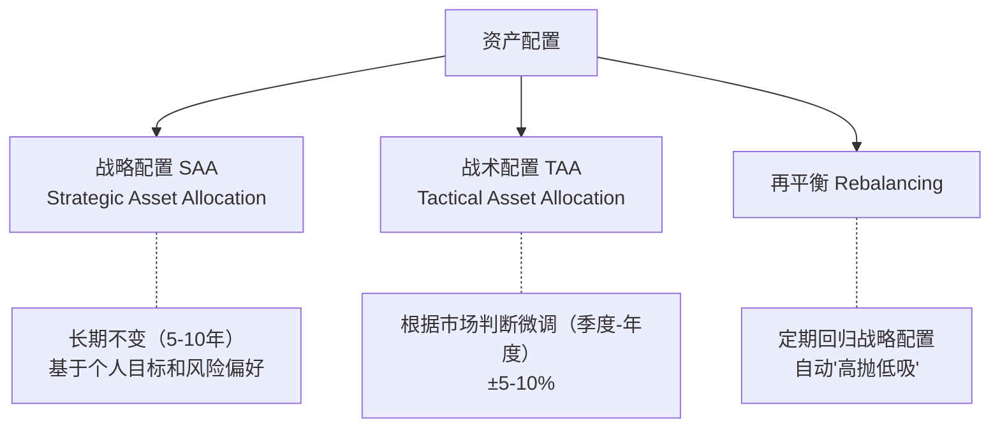
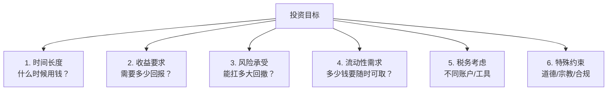
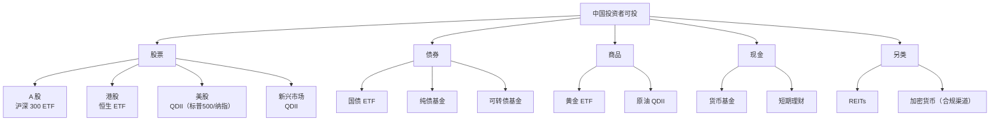
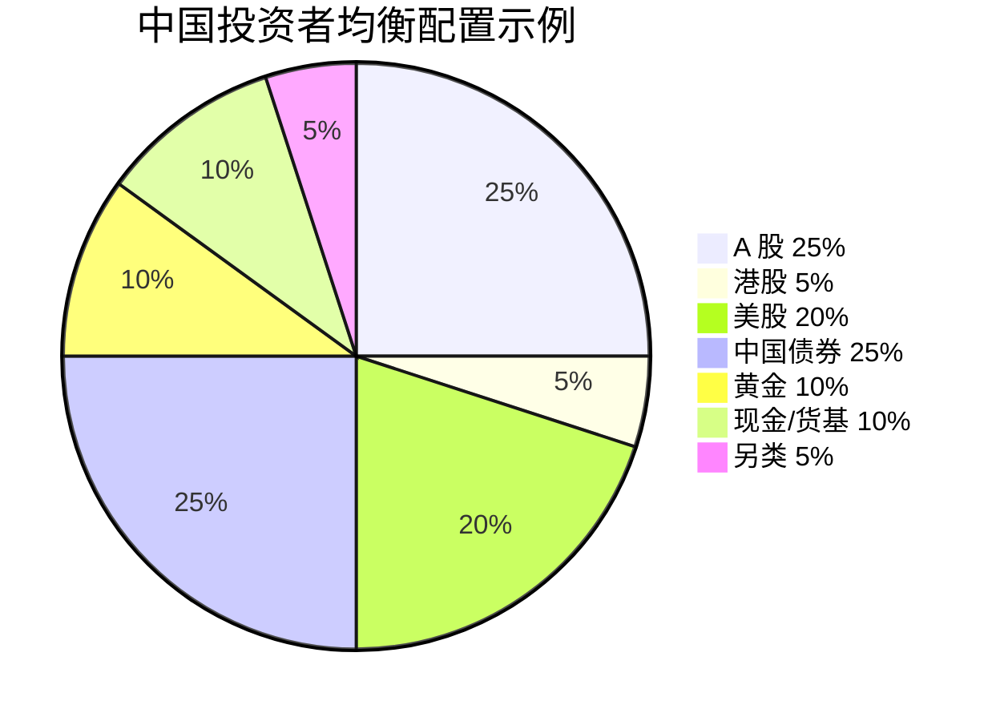
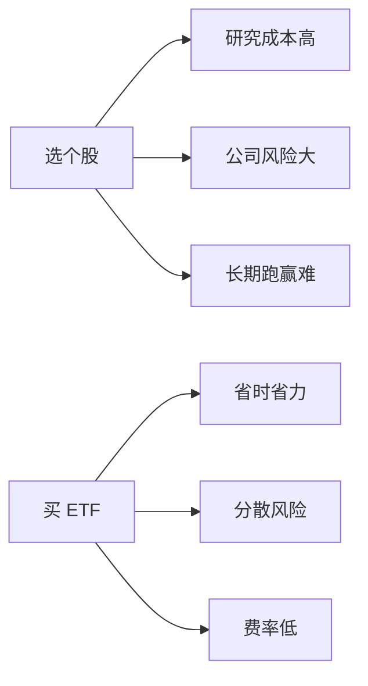
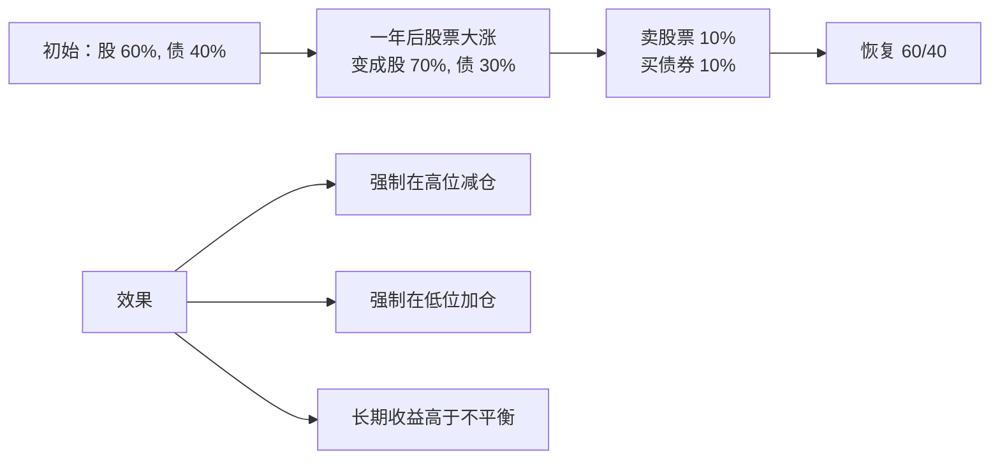
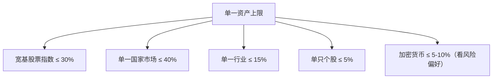
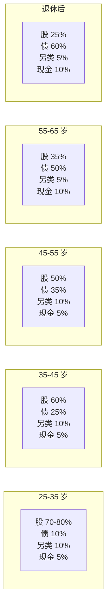
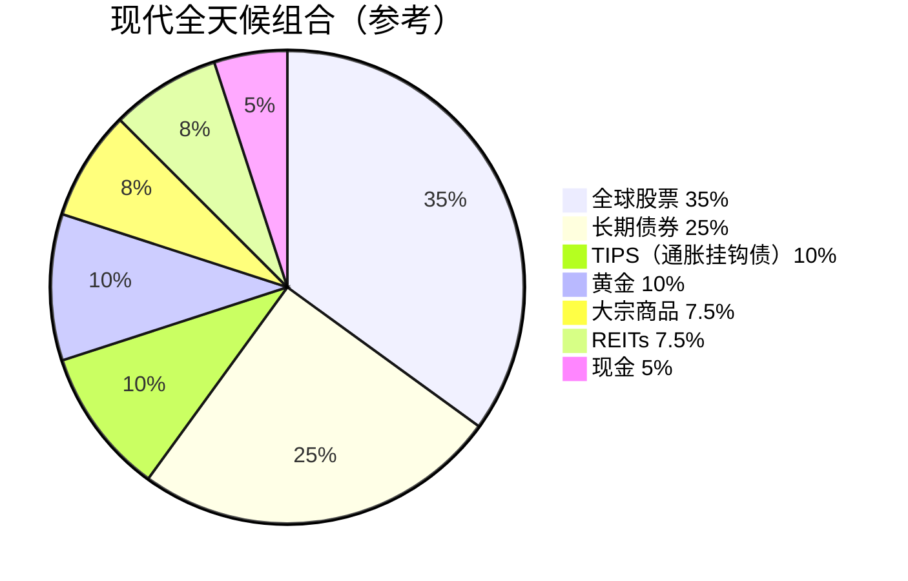
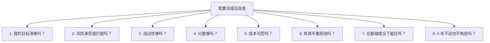

# 08 资产配置入门 | Asset Allocation

`🟡 进阶` `预计阅读：25 分钟`

> 核心问题：怎么把学到的所有知识整合起来？建立一个能穿越周期的资产组合？

---

## 一句话总结

**资产配置是把所有宏观知识落地的地方。它不是要你预测市场，而是让你在任何环境下都能活下来。**

---

## 资产配置的层次



> 💡 90% 的精力应该在战略配置上。战术调整是锦上添花，搞不好反而是毁灭性的。

---

## 第一步：明确目标和约束



### 风险承受度自测

```
1. 如果你的投资组合一年内跌 30%，你会：
   A. 加仓 → 高承受
   B. 持有不动 → 中承受
   C. 减仓 → 低承受
   D. 全部清仓 → 极低承受

2. 你需要这笔钱多久？
   A. 10 年以上 → 高承受
   B. 5-10 年 → 中承受
   C. 1-5 年 → 低承受
   D. 1 年以内 → 极低承受
```

---

## 第二步：选择配置方案

### 方案对比

| 方案 | 股票 | 债券 | 黄金 | 商品 | 现金 | 适合 |
|------|------|------|------|------|------|------|
| 60/40 经典 | 60% | 40% | - | - | - | 中等风险 |
| 全天候 | 30% | 55% | 7.5% | 7.5% | - | 长期穿越周期 |
| 永久组合 | 25% | 25% | 25% | - | 25% | 极简稳健 |
| 年龄法则 | 100-年龄 | 年龄 | - | - | - | 简单粗暴 |
| 进取型 | 70% | 15% | 5% | - | 10% | 年轻+长期 |
| 保守型 | 25% | 50% | 10% | 5% | 10% | 临退休 |

---

## 第三步：本土化实现

### 中国投资者的可投资产



### 推荐基础组合（中等风险）



---

## 第四步：执行原则

### 1. 用 ETF/基金，不要选个股



### 2. 定投而不是择时

```mermaid
graph TB
    A[一次性投入] --> A1[需要"猜对"时机]
    A --> A2[心理压力大]
    A --> A3[错过机会成本]
    
    B[定期定额] --> B1[不需要猜时机]
    B --> B2[平滑成本]
    B --> B3[强制储蓄]
    B --> B4[心理压力小]
```

### 3. 长期持有

| 持有时间 | 美股年化回报 | 亏钱概率 |
|----------|-------------|----------|
| 1 年 | 平均 ~10% | ~30% |
| 5 年 | 平均 ~10% | ~10% |
| 10 年 | 平均 ~10% | ~3% |
| 20 年 | 平均 ~10% | <1% |

> 💡 时间是分散波动的最佳工具。

---

## 再平衡：自动"高抛低吸"



### 再平衡的频率

| 方法 | 优缺点 |
|------|--------|
| 每年 1 次 | 简单，最常用 |
| 每季度 1 次 | 更灵敏，但摩擦成本高 |
| 偏离阈值（±5%） | 反应及时但需监控 |
| 混合（年度 + 阈值） | 最佳但复杂 |

> 💡 **再平衡是反人性的**。当股票涨得欢的时候让你卖，跌得惨的时候让你买。这就是它有效的原因——市场上大多数人做不到。

---

## 风险管理叠加

### 仓位管理



### 止损/止盈纪律

| 类型 | 规则 |
|------|------|
| 战略仓位 | 不轻易止损（除非基本面恶化） |
| 战术仓位 | 跌 10-15% 止损 |
| 投机仓位 | 严格止损（5-10%） |

---

## 不同人生阶段的配置



---

## 当前环境下的配置思考

### 2024-2026 年的特殊环境

```mermaid
graph TB
    A[当前世界] --> B[全球长期债务周期顶部]
    A --> C[去全球化 + 地缘风险]
    A --> D[AI 革命可能改变生产力]
    A --> E[气候转型大趋势]
    A --> F[60/40 经典组合受质疑<br/>2022 股债双杀]
    
    G[配置启示] --> H[黄金权重提升]
    G --> I[加入大宗商品]
    G --> J[全球分散更重要]
    G --> K[关注 AI/科技长期主题]
    G --> L[现金不再是"垃圾"<br/>有 5% 利息]
```

### 一个"现代全天候"配置参考



---

## 配置常见错误

```mermaid
graph TB
    A[错误清单] --> B[1. 跟风<br/>看别人买什么就买什么]
    A --> C[2. 追涨杀跌<br/>买涨得多的，卖跌得多的]
    A --> D[3. 过度集中<br/>"All in"某只股或某行业]
    A --> E[4. 频繁调整<br/>看到新闻就动手]
    A --> F[5. 忽视成本<br/>选高费率主动基金]
    A --> G[6. 不再平衡<br/>让风险敞口失控]
    A --> H[7. 时间错配<br/>用买房首付的钱炒股]
    A --> I[8. 杠杆过度<br/>融资融券、合约爆仓]
```

---

## 最终的检查清单



如果有任何一个答案是"不"，说明你需要重新审视配置。

---

## 核心概念速查

| 术语 | 英文 | 一句话解释 |
|------|------|-----------|
| 战略配置 | SAA (Strategic) | 长期资产组合 |
| 战术配置 | TAA (Tactical) | 短期调整 |
| 再平衡 | Rebalancing | 定期回归目标比例 |
| 风险平价 | Risk Parity | 各资产贡献相同风险 |
| 全天候 | All Weather | 适应所有经济环境 |
| 60/40 | 60/40 Portfolio | 经典股债组合 |
| 多元化 | Diversification | 分散到多种资产 |
| 时间分散 | Time Diversification | 通过长期持有降低风险 |

---

## 🎉 Level 2 完成！

恭喜你完成了 Level 2 的全部 8 篇内容！现在你应该能：
- ✅ 解释货币政策、财政政策的作用机制
- ✅ 理解汇率为什么这么走
- ✅ 看清金融市场的参与者和力量
- ✅ 理解债务周期的重要性
- ✅ 制定自己的资产配置方案

**下一步** → [Level 3: 独立分析](../level-3-advanced/) — 学会做投研

---

## 延伸思考

1. 没有任何配置方案是"最优"的。你的配置应该匹配的是什么？
2. 如果有 100 万，你今天会怎么配？
3. 5 年后再看你的配置，你觉得最容易出问题的地方是什么？

---

## 推荐阅读

- 《全天候投资策略》— 桥水基金
- 《有效资产管理》— 威廉·伯恩斯坦
- 《资产配置的艺术》— 大卫·达斯特
- 桥水《Daily Observations》（公开部分）
