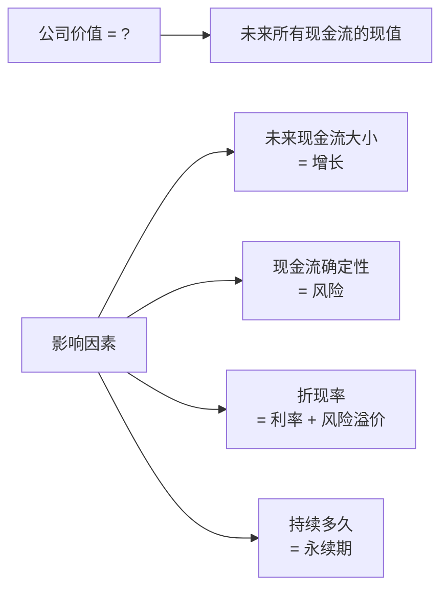
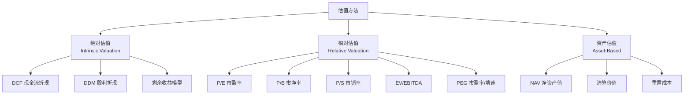
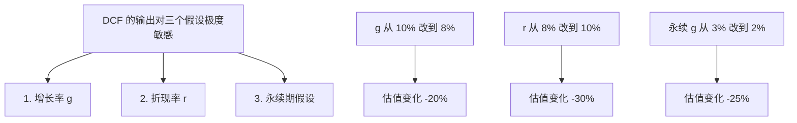
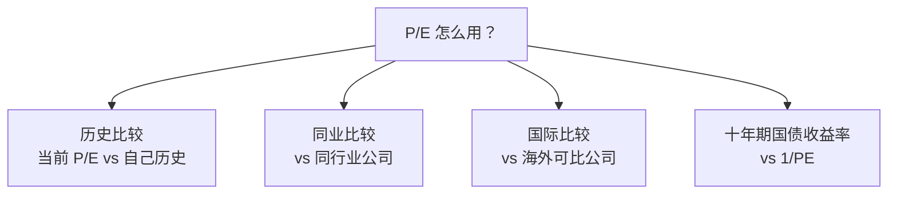
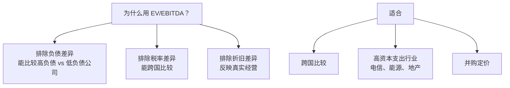
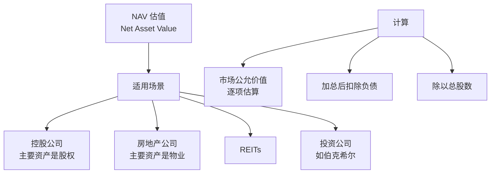
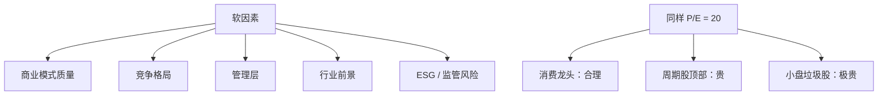
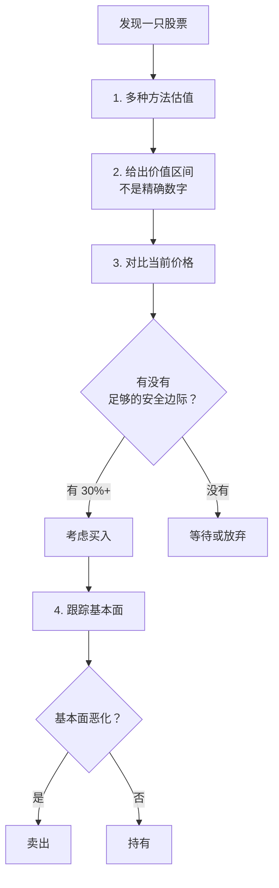

# 01 估值方法论 | Valuation

`🔴 高级` `预计阅读：30 分钟`

> 核心问题：一家公司、一个资产到底值多少钱？为什么同一个公司不同人能给出完全不同的估值？

---

## 一句话总结

**估值不是科学，是艺术 + 数学。任何估值都需要假设，假设错了估值就错了。掌握估值的目的不是算出"准确价格"，而是判断"是贵还是便宜"。**

---

## 估值的本质



> 💡 这个公式简单但有力。所有估值方法本质上都在估计这几个变量。

---

## 三大估值方法



---

## 方法 1：DCF（现金流折现）

DCF 是估值的"圣杯"——理论上最完美，但实操中最难。

### 核心公式

```
公司价值 = Σ (未来每年的自由现金流 / (1 + 折现率)^t) + 永续期价值

简化版：
价值 = FCF₁/(1+r) + FCF₂/(1+r)² + ... + FCFₙ/(1+r)ⁿ + TV/(1+r)ⁿ
```

### DCF 的步骤

```mermaid
graph TB
    A[1. 预测未来 5-10 年<br/>自由现金流 FCF] --> B[2. 估计永续期增长率 g]
    B --> C[3. 计算永续期价值<br/>TV = FCFn × (1+g) / (r-g)]
    C --> D[4. 估计折现率 WACC<br/>= 加权平均资本成本]
    D --> E[5. 折现回今天]
    E --> F[6. 加总 = 公司价值]
    F --> G[7. ÷ 总股数 = 每股内在价值]
```

### 一个简化例子

```
假设：
- 当前自由现金流 FCF₀ = 10 亿
- 未来 5 年增速 10%
- 5 年后永续增长 3%
- 折现率 8%
- 总股数 1 亿

未来 5 年 FCF：11, 12.1, 13.3, 14.6, 16.1（亿）
第 5 年永续价值 TV = 16.1 × 1.03 / (0.08 - 0.03) = 332 亿

折现到今天：
PV = 11/1.08 + 12.1/1.08² + 13.3/1.08³ + 14.6/1.08⁴ + 16.1/1.08⁵ + 332/1.08⁵
   = 10.2 + 10.4 + 10.6 + 10.7 + 11.0 + 226
   = 279 亿

每股价值 = 279 / 1 = 279 元
```

### DCF 的"三个杀手"假设



> ⚠️ DCF 容易"先有结论，再调假设倒推"。这是估值最大的陷阱。

### DCF 适用场景

| 适合 | 不适合 |
|------|--------|
| 现金流稳定可预测 | 早期/亏损公司 |
| 成熟行业 | 周期性极强的行业 |
| 大企业（能预测 5-10 年） | 商业模式还在变 |
| 例：可口可乐、电信公司 | 例：蔚来、AI 创业公司 |

---

## 方法 2：相对估值（最常用）

### P/E（市盈率）

```
P/E = 股价 / 每股收益 = 市值 / 净利润
   = 多少年回本（如果利润不变）
```



#### P/E 的"陷阱"

| 陷阱 | 说明 |
|------|------|
| 周期顶部 P/E 看起来低 | 利润高时 P/E 低，但接下来利润会塌 |
| 亏损公司 P/E 失效 | E 为负或接近 0 |
| 一次性损益扭曲 | 卖资产收益 → 利润虚高 |
| 不考虑增长 | 同样 P/E，增速 5% 和 30% 价值不同 |

> 💡 周期股看 P/E 容易踩坑。**最佳买入时机往往是周期股 P/E 看起来"贵"的时候**（利润底部），最佳卖出时机是 P/E 看起来"便宜"的时候（利润顶部）。

### PEG（增速调整）

```
PEG = P/E / 盈利增速

PEG = 1：合理估值
PEG < 1：可能低估
PEG > 1：可能高估
```

例：
- 公司 A：P/E = 30，增速 30% → PEG = 1（合理）
- 公司 B：P/E = 15，增速 5% → PEG = 3（高估）
- 公司 C：P/E = 50，增速 60% → PEG = 0.83（低估）

### P/B（市净率）

```
P/B = 股价 / 每股净资产 = 市值 / 净资产
   = 你为每 1 元的账面资产付了多少钱
```

| 适合 | 例子 |
|------|------|
| 重资产公司 | 银行、保险、地产、钢铁 |
| 周期股底部 | 利润亏损但资产还在 |
| 资产决定价值的公司 | 矿企、基金管理 |

> 💡 银行股几乎只看 P/B。当前中国大行 P/B ~0.5（破净），美国大行 P/B ~1.5。

### EV/EBITDA

```
EV (Enterprise Value) = 市值 + 总债务 - 现金
EBITDA = 息税折旧摊销前利润

EV/EBITDA = "排除资本结构差异"的估值
```



### P/S（市销率）

```
P/S = 市值 / 营收
```

| 适合 | 例子 |
|------|------|
| 早期高增长公司 | SaaS、互联网早期 |
| 亏损公司 | 还没有利润但有营收 |
| 营收稳定的行业 | 零售、电商 |

⚠️ P/S 高度依赖**利润率**。营收 100 但只赚 1，和营收 100 赚 30，价值天差地别。

---

## 方法 3：资产估值（NAV）



例：港股老牌地产股
- 持有物业 NAV：$100 亿
- 净负债：$30 亿
- 调整后 NAV：$70 亿
- 总股数：10 亿股
- 每股 NAV：$7
- 当前股价：$3.5
- 折价：50%！

> 💡 港股很多老牌公司常年 NAV 折价 50%+。这就是著名的"价值陷阱"——便宜，但永远便宜。

---

## 不同行业的估值惯例

| 行业 | 主要方法 | 关键指标 |
|------|----------|----------|
| 银行 | P/B、ROE | ROE、不良率、净息差 |
| 保险 | P/EV（内含价值） | 新业务价值 |
| 地产 | NAV | 土地储备、租金 |
| 互联网 | DCF / P/S / 用户数 | DAU、ARPU、CAC |
| 制造业 | P/E、EV/EBITDA | 毛利率、ROE |
| 周期股 | P/B + 行业景气 | 商品价格 |
| 消费品 | DCF + P/E | 品牌、市占率 |
| 公用事业 | DDM（股利折现） | 股息率、稳定性 |
| 矿业 | NAV + 储量估值 | 储量、品位、成本 |
| 创新药 | rNPV（风险调整） | 管线、临床进度 |

---

## 估值的"软因素"

DCF/P/E 算出来的只是数字。真正决定估值的还有：



---

## 估值的常见误区

### 1. "便宜不等于好"

```
P/B = 0.3 的银行股 → 可能资产质量有问题
P/E = 5 的地产股 → 利润可能不可持续
P/E = 8 的烟草公司 → 可能反映长期衰退预期
```

### 2. "贵不等于差"

```
亚马逊长期 P/E > 100 → 但持续创造价值
英伟达 P/E 多年高位 → 但盈利持续超预期
```

### 3. "估值不会自动均值回归"

低估值可以更低估，高估值可以更高估。**催化剂比估值更重要**。

### 4. "不同行业不能直接比 P/E"

科技 P/E 30，银行 P/E 5。这不代表科技贵银行便宜，只是行业特性不同。

---

## 怎么用估值做决策？



### 安全边际 (Margin of Safety)

```
安全边际 = (内在价值 - 当前价格) / 内在价值

格雷厄姆建议：至少 30-50%
即：内在价值 100 元，最多用 50-70 元买入
```

> 💡 安全边际是承认"我可能算错了"。即使估值低了 30%，仍然不亏。

---

## 实操建议

### 给新手


### 给进阶

- 学会自己做简单 DCF
- 关注公司的现金流而非利润
- 考虑会计准则的影响
- 学会"反向 DCF"——当前价格隐含了什么假设？

---

## 核心概念速查

| 术语 | 英文 | 一句话解释 |
|------|------|-----------|
| 内在价值 | Intrinsic Value | 资产的真实价值 |
| 市价 | Market Price | 当前交易价格 |
| 安全边际 | Margin of Safety | 内在价值与价格的差 |
| DCF | Discounted Cash Flow | 现金流折现 |
| FCF | Free Cash Flow | 自由现金流 |
| WACC | Weighted Average Cost of Capital | 加权平均资本成本 |
| 永续期 | Terminal Value | 预测期之后的剩余价值 |
| P/E | Price/Earnings | 市盈率 |
| P/B | Price/Book | 市净率 |
| PEG | P/E to Growth | 市盈率/增速 |
| EV/EBITDA | Enterprise Value/EBITDA | 企业价值倍数 |
| NAV | Net Asset Value | 净资产值 |

---

## 延伸思考

1. 为什么巴菲特说"不会用 DCF 估值的人不应该买股票"？
2. 如果一个 P/E = 100 的公司你不敢买，但它持续涨，你的估值框架是不是有问题？
3. 利率从 5% 降到 2%，股票"合理 P/E"应该升多少？

---

## 推荐阅读

- 《估值》— Aswath Damodaran（"估值教父"）
- 《巴菲特致股东的信》
- 《股市真规则》— 帕特·多尔西
- 《估值的艺术》— Nicolas Schmidlin

---

## 下一篇

→ [02 财务报表深度分析](./02-financial-statements.md)：怎么从三张表里发现真相？
