# 02 财务报表深度分析 | Financial Statements Analysis

`🔴 高级` `预计阅读：30 分钟`

> 核心问题：怎么从三张报表里看出公司的真实状况？怎么识别财务造假？

---

## 一句话总结

**财报是公司的"体检报告"。三张表互相印证，单独看任何一张都可能被骗。掌握财报阅读，是从"听消息"到"独立判断"的分水岭。**

---

## 三张表的关系

```mermaid
graph TB
    subgraph "三张报表"
        A[利润表<br/>Income Statement]
        B[资产负债表<br/>Balance Sheet]
        C[现金流量表<br/>Cash Flow Statement]
    end
    
    A -.- A1["一段时间内<br/>赚了多少钱"]
    B -.- B1["某一时刻<br/>有多少家底"]
    C -.- C1["一段时间内<br/>钱怎么进出"]
    
    D[关键关系] --> E[净利润 × 时间<br/>= 累积到资产负债表]
    D --> F[现金流量表的<br/>"经营现金流"<br/>≠ 净利润]
```

> 💡 核心洞察：**净利润可以"做"出来，现金流很难造假**。这就是为什么巴菲特最看重现金流。

---

## 利润表：怎么赚的钱

### 利润表的层次

```
营业收入 (Revenue)
    - 营业成本 (Cost of Revenue)
    = 毛利润 (Gross Profit)
    - 销售费用
    - 管理费用
    - 研发费用
    - 财务费用
    = 营业利润 (Operating Income / EBIT)
    + 投资收益
    + 其他收益
    - 所得税
    = 净利润 (Net Income)
```

### 关键利润率

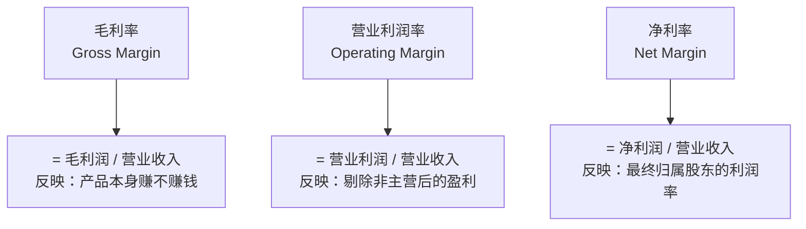

### 各行业典型利润率

| 行业 | 毛利率 | 净利率 |
|------|--------|--------|
| 高端白酒（茅台） | 90%+ | 50%+ |
| 软件/SaaS | 70-80% | 20-30% |
| 互联网（成熟期） | 60-70% | 20-30% |
| 消费品 | 30-50% | 10-15% |
| 制造业 | 20-30% | 5-10% |
| 零售 | 20-30% | 1-3% |
| 银行 | — | 30-40%（非传统口径） |

### 营收增速和质量

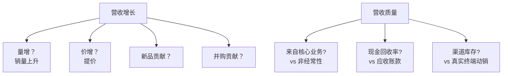

### 利润表的"陷阱"

```mermaid
graph TB
    A[常见的利润"水分"] --> B[非经常性损益<br/>卖资产/政府补助]
    A --> C[投资收益<br/>炒股/卖子公司]
    A --> D[资本化研发<br/>本应费用化]
    A --> E[折旧政策变更]
    A --> F[商誉减值<br/>是否充分]
```

> 💡 看利润表要看"扣非净利润"——扣除非经常性损益后的净利润，更能反映核心盈利能力。

---

## 资产负债表：家底有多厚

### 基本结构

```
资产 = 负债 + 所有者权益

资产端：                    负债端：
- 流动资产                  - 流动负债
  - 现金                      - 应付账款
  - 应收账款                  - 短期借款
  - 存货                      - 预收账款
  - 短期投资               - 非流动负债
- 非流动资产                  - 长期借款
  - 固定资产                  - 应付债券
  - 无形资产                所有者权益：
  - 商誉                      - 股本
  - 长期投资                  - 资本公积
                              - 留存收益
```

### 关键比率

```mermaid
graph TB
    A[资产质量] --> B[资产负债率<br/>= 总负债 / 总资产]
    A --> C[流动比率<br/>= 流动资产 / 流动负债]
    A --> D[速动比率<br/>= (流动资产 - 存货) / 流动负债]
    
    E[运营效率] --> F[应收账款周转天数]
    E --> G[存货周转天数]
    E --> H[总资产周转率]
    
    I[盈利能力] --> J[ROA<br/>= 净利润 / 总资产]
    I --> K[ROE<br/>= 净利润 / 净资产]
```

### 重点关注科目

| 科目 | 看什么 | 警惕信号 |
|------|--------|----------|
| 现金 | 是否充足 | 现金占比异常低 |
| 应收账款 | 是否快速增长 | 增速 >> 收入增速 |
| 存货 | 周转天数 | 异常增加 |
| 商誉 | 占净资产比例 | >30% 警惕减值 |
| 短期借款 | 还款能力 | 大量借款+少现金 |
| 资产负债率 | 行业对比 | 远高于同行 |

### ROE 杜邦分析

```
ROE = 净利率 × 资产周转率 × 权益乘数
    = 赚钱能力 × 周转能力 × 杠杆水平
```

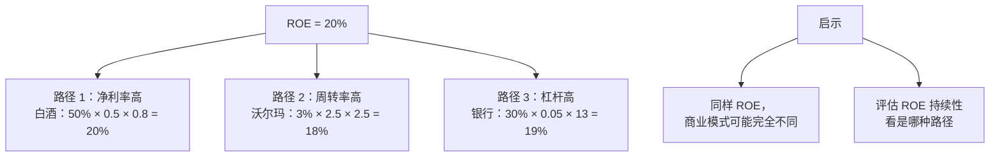

---

## 现金流量表：钱真的进了口袋

### 三个部分

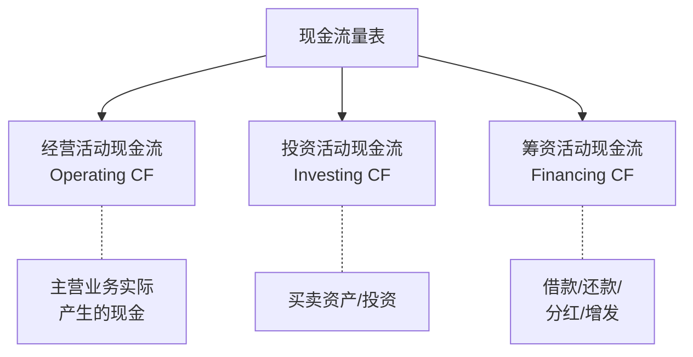

### 三种现金流的"健康组合"

| 经营 CF | 投资 CF | 筹资 CF | 公司类型 |
|---------|---------|---------|----------|
| + | - | - | 🟢 成熟健康（最理想） |
| + | + | - | 🟡 收缩中（不投资了） |
| + | - | + | 🟢 成长期（融资+扩张） |
| - | - | + | 🟡 早期（持续融资） |
| - | + | + | 🔴 危险（卖资产+融资） |
| - | - | - | 🔴 极度危险 |

### 自由现金流 (FCF)

```
FCF = 经营活动现金流 - 资本支出

含义：公司真正"自由"可用的钱
- 可以分红
- 可以回购
- 可以并购
- 可以还债
```

> 💡 巴菲特最爱的指标。FCF 才是公司"真正赚到的钱"，而不是利润表上的净利润。

### 净利润 vs 现金流的"差异"

```mermaid
graph TB
    A[净利润 + 100 亿] --> B{为什么和经营现金流不同？}
    B --> C[+ 折旧摊销<br/>不付现金的费用]
    B --> D[- 应收账款增加<br/>客户没付款]
    B --> E[- 存货增加<br/>钱压在库存]
    B --> F[+ 应付账款增加<br/>欠供应商]
    
    G[健康公司] --> H[经营现金流 ≥ 净利润]
    
    I[警惕公司] --> J[经营现金流 << 净利润<br/>"利润上有，现金没有"]
```

---

## 三表勾稽：怎么互相印证

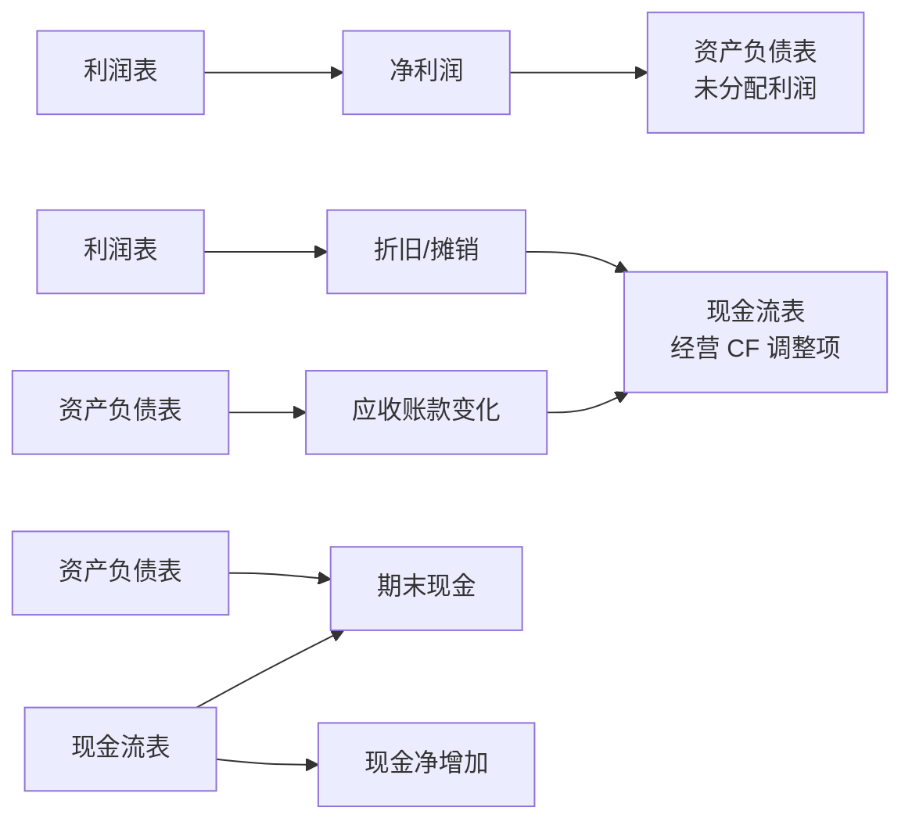

---

## 财务造假的常见手法

### 1. 虚增收入

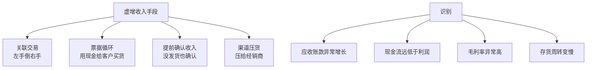

### 2. 虚增资产

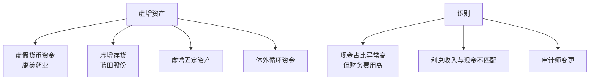

### 3. 隐藏负债

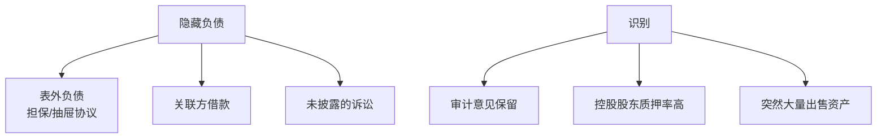

### 4. 经典造假案例

| 公司 | 手法 | 结果 |
|------|------|------|
| 安然 (2001) | 表外负债 + 假交易 | 倒闭，奠定 SOX 法案 |
| 雷曼 (2008) | "Repo 105"美化报表 | 倒闭，2008 危机引爆点 |
| 康美药业 (2018) | 虚增 300 亿现金 | 退市 |
| 瑞幸咖啡 (2020) | 虚增收入 22 亿 | 美股退市 |
| 恒大 (2021+) | 表外负债 + 高杠杆 | 暴雷 |

---

## 财报阅读的实战流程

### 1. 先看三页

```
1. 财务摘要（几张表的核心数据）
2. 管理层讨论与分析（MD&A）— 怎么看待业务
3. 现金流量表 — 真金白银
```

### 2. 重点关注的"30 个数字"

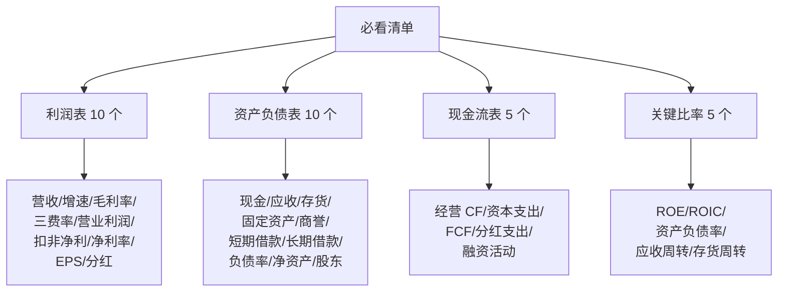

### 3. 横向 + 纵向比较

```
纵向：和自己历史比（5 年趋势）
横向：和同行比（前 5 名）
绝对：看绝对数值是否合理
```

### 4. 看附注

很多关键信息藏在附注里：
- 关联交易
- 重大诉讼
- 或有负债
- 收入确认政策
- 关键会计估计

---

## 财报陷阱的红旗

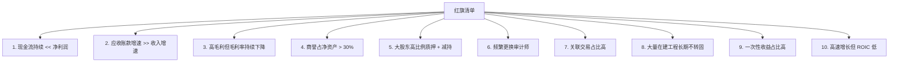

---

## 优秀公司的财报特征

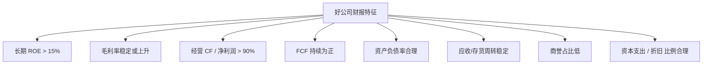

---

## 不同行业看财报的重点

| 行业 | 重点指标 | 警惕信号 |
|------|----------|----------|
| 银行 | 不良率、拨备覆盖、净息差 | 不良率上升、拨备下降 |
| 保险 | 内含价值、新业务价值 | 新业务价值持续下滑 |
| 地产 | 三道红线、销售回款 | 销售下滑、现金紧张 |
| 互联网 | DAU、ARPU、获客成本 | 用户增速下滑 |
| 制造业 | 毛利率、产能利用率 | 库存激增 |
| 零售 | 同店销售、坪效 | 同店下滑 |
| 矿业 | 储量、生产成本 | 成本上升 |
| 创新药 | 研发管线、临床进度 | 主力产品专利到期 |

---

## 核心概念速查

| 术语 | 英文 | 一句话解释 |
|------|------|-----------|
| 营业收入 | Revenue | 卖货/服务的总收入 |
| 毛利润 | Gross Profit | 收入 - 直接成本 |
| 营业利润 | Operating Income | 主营业务利润 |
| 净利润 | Net Income | 最终归属股东的利润 |
| EPS | Earnings Per Share | 每股收益 |
| ROE | Return on Equity | 净资产收益率 |
| ROA | Return on Assets | 总资产收益率 |
| ROIC | Return on Invested Capital | 投入资本回报率 |
| EBIT | Earnings Before Interest & Tax | 息税前利润 |
| EBITDA | EBIT + Depreciation & Amortization | 息税折旧摊销前利润 |
| FCF | Free Cash Flow | 自由现金流 |
| 商誉 | Goodwill | 并购溢价部分 |
| 杜邦分析 | DuPont Analysis | ROE 拆解分析 |

---

## 推荐阅读

- 《财报就像一本故事书》— 刘顺仁
- 《手把手教你读财报》— 唐朝
- 《一本书读懂财报》— 钟廷晓
- 《Financial Shenanigans》— Howard Schilit（财务舞弊识别经典）

---

## 延伸思考

1. 为什么巴菲特说"我不看会计师做的东西，我只看现金"？
2. 同样净利润 10 亿，为什么不同公司的"含金量"差别巨大？
3. 财务造假的公司股价为什么之前能涨那么多？市场有效吗？

---

## 下一篇

→ [03 行业研究框架](./03-industry-research.md)：从财报到行业，从公司到赛道
