# 03 行业研究框架 | Industry Research

`🔴 高级` `预计阅读：30 分钟`

> 核心问题：怎么系统地研究一个行业？怎么判断一个行业是"长坡厚雪"还是"短命赛道"？

---

## 一句话总结

**好行业 = 大空间 + 高壁垒 + 良好竞争格局 + 长期需求。在好行业里选普通公司，比在坏行业里选优秀公司，长期回报通常更好。**

---

## 行业研究的"四维框架"

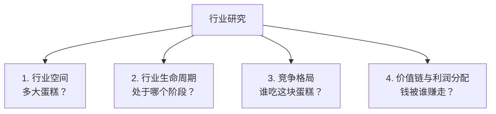

---

## 第一维：行业空间

### TAM/SAM/SOM 框架

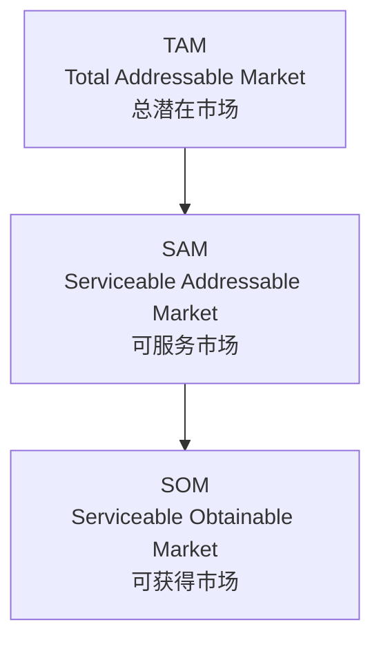

例：电动车
- **TAM**：全球汽车市场（~$3 万亿）
- **SAM**：消费者愿意接受电动车的市场（取决于政策/技术）
- **SOM**：某家公司能拿到的份额

### 空间测算的几种方法

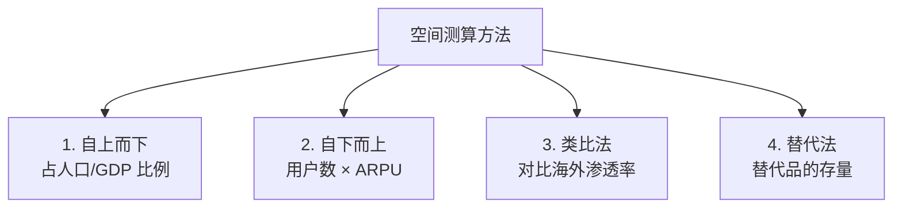

### 案例：中国电动车空间

```
方法 1：替代法
中国汽车年销 ~2500 万辆
渗透率从 5% (2020) → 50%+ (2025)
→ 电动车年销 1250 万辆

方法 2：对比法
中国千人汽车保有量 ~250 辆
美国 ~830 辆
长期空间还有 3 倍

方法 3：技术替代曲线
当一个新技术成本 < 老技术，渗透率会从 5% 加速到 50%
之后变缓
```

---

## 第二维：行业生命周期

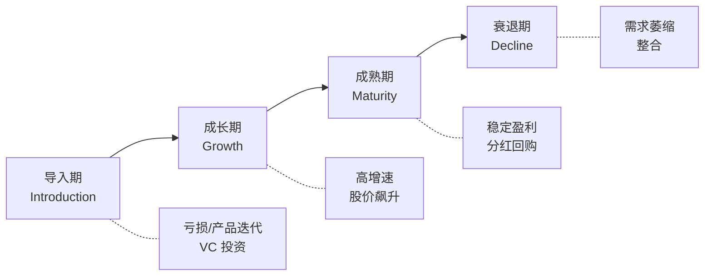

### 各阶段的特征与投资策略

| 阶段 | 增速 | 估值 | 风险 | 策略 |
|------|------|------|------|------|
| 导入 | 0-50% | 高/无意义 | 极高（可能归零） | 押龙头，分散下注 |
| 成长 | 30-100% | P/E 30-100 | 高 | 拥抱龙头 |
| 成熟 | 5-15% | P/E 15-25 | 中 | 看现金流和分红 |
| 衰退 | <0% | P/E 5-10 | 看具体情况 | 价值陷阱警惕 |

### 怎么判断当前阶段？

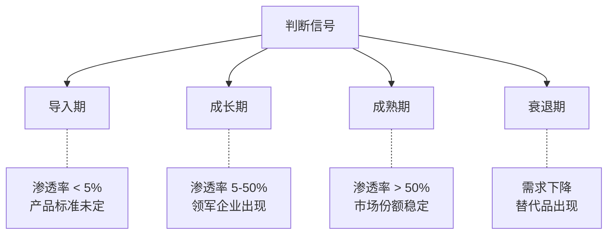

### 中国主要行业的当前阶段

| 行业 | 阶段 | 关键问题 |
|------|------|----------|
| 电动车 | 成长后期 | 产能过剩 + 价格战 |
| 光伏 | 成长后期 | 严重产能过剩 |
| 智能手机 | 成熟 | 渗透率饱和 |
| 白酒 | 成熟 | 高端化的天花板 |
| 银行 | 成熟 | 净息差压缩 |
| 房地产 | 衰退期开始 | 需求萎缩 |
| AI 应用 | 导入期 | 商业模式未明 |
| 半导体 | 成长期 | 国产替代 |
| 医美 | 成长期 | 渗透率仍低 |

---

## 第三维：竞争格局

### 波特五力

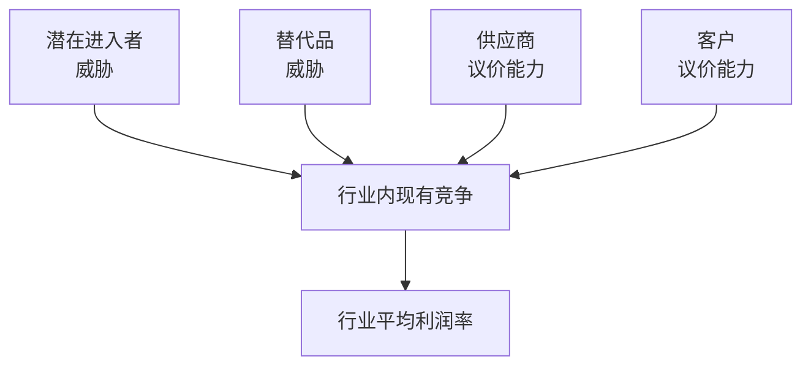

### 行业集中度（CR）

```
CR4 = 前 4 大企业市占率
CR4 < 30%：极度分散，价格战激烈
CR4 30-50%：中等集中
CR4 > 50%：集中度高，龙头有定价权
CR4 > 70%：寡头格局，最理想
```

### 案例对比

| 行业 | CR4 | 竞争格局 | 利润率 |
|------|-----|----------|--------|
| 高端白酒 | ~85% | 寡头 | 极高（毛利 80%+） |
| 调味品 | ~50% | 集中 | 较高 |
| 智能手机 | ~80% | 寡头 | 中等 |
| 服装 | <10% | 极度分散 | 低 |
| 餐饮 | <5% | 极度分散 | 低 |
| 电动车 | <40% | 仍在分散 | 大多亏损 |

> 💡 **集中度高的行业利润率高**——这是经济学最稳定的规律之一。

---

## 第四维：价值链与利润分配

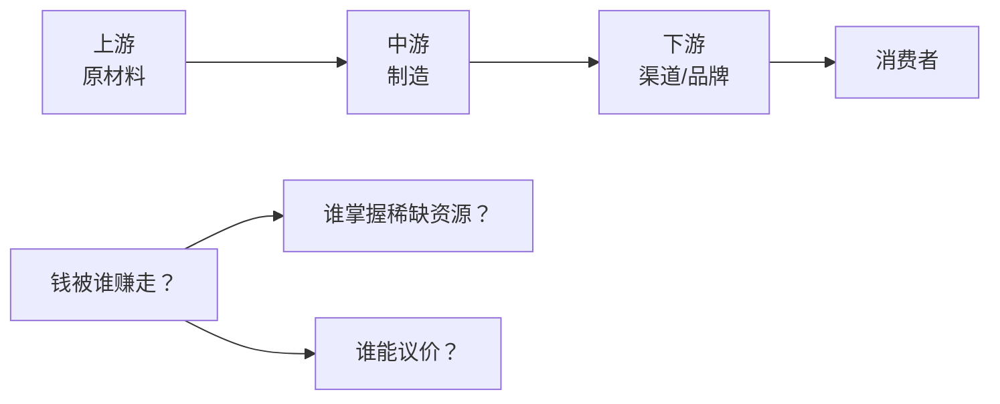

### 案例：iPhone 价值链

```
苹果 iPhone 售价 $1000：
- 原材料/零部件：~$400
- 富士康代工费：~$10（1%）
- 苹果毛利：~$590（59%！）

→ 苹果掌握品牌、设计、操作系统、生态
→ 利润 90%+ 归苹果
→ 制造商富士康只赚辛苦钱
```

### 案例：电动车价值链

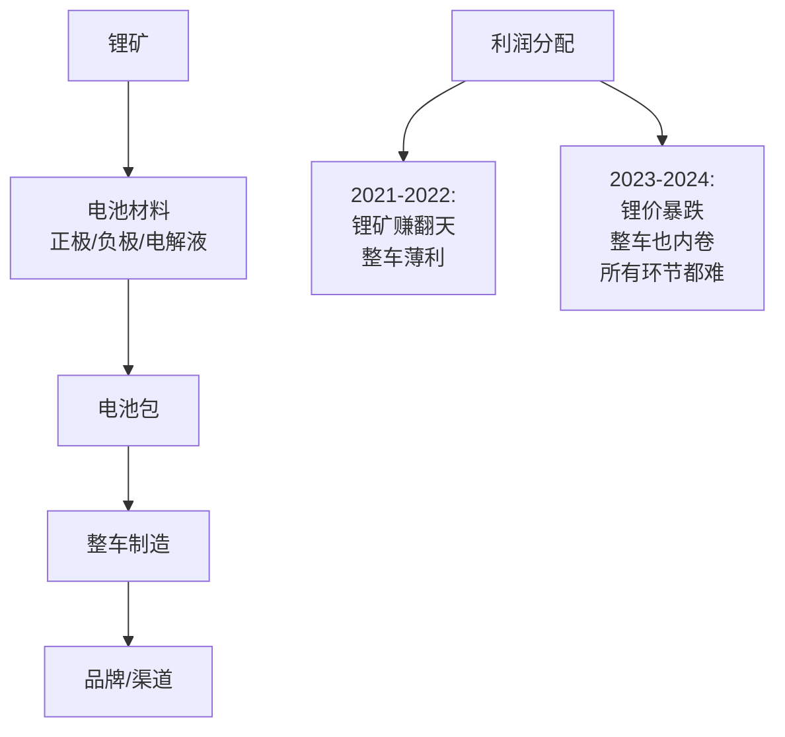

> 💡 **价值链上利润分配会随时间变化**。研究行业要看"现在谁赚钱"和"以后谁赚钱"。

---

## 行业研究的工具

### 1. 信息来源

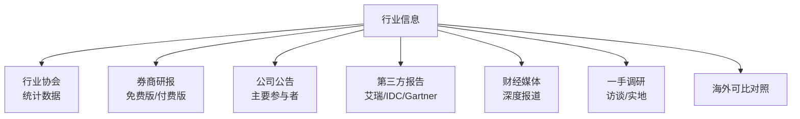

### 2. 关键数据

| 类别 | 数据 |
|------|------|
| 规模 | 总产量/产值/收入 |
| 增长 | 同比/环比增速 |
| 价格 | 出厂价/零售价/价差 |
| 竞争 | 市占率/集中度 |
| 盈利 | 毛利率/净利率 |
| 库存 | 渠道/工厂库存 |
| 出口 | 进出口/海外占比 |

### 3. 高频跟踪指标

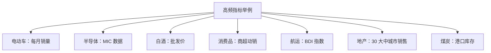

---

## 行业研究的"心智模型"

### 1. 寻找"长坡厚雪"

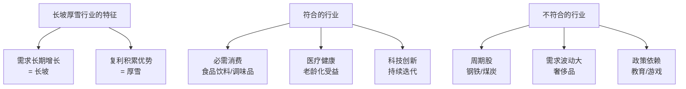

### 2. 警惕"价值陷阱"

```
看起来便宜但实际是陷阱的行业：
- 长期下行的行业（传统媒体）
- 受政策打压的行业（教育双减后）
- 技术被颠覆的行业（胶卷被数码取代）
- 需求结构性下降的行业（中国房地产？）
```

### 3. 关注"产业趋势"

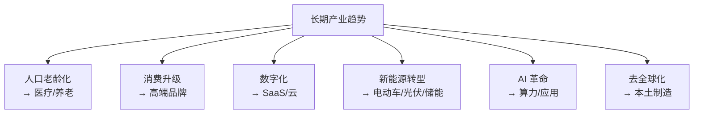

### 4. 政策的"风险与机会"

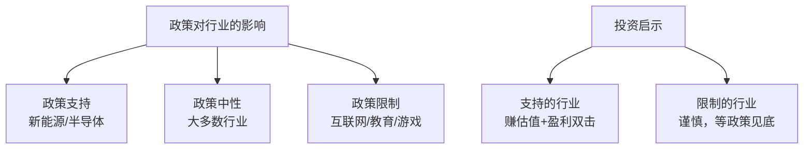

---

## 中国行业研究的特殊性

### 1. 政策驱动比基本面更重要（短期）

```
案例：教育行业 2021
基本面：渗透率仍低，需求强劲
政策：双减政策出台
结果：行业市值蒸发 95%

→ 在中国，没看政策风险就买，等于赌博
```

### 2. "国家队"的角色

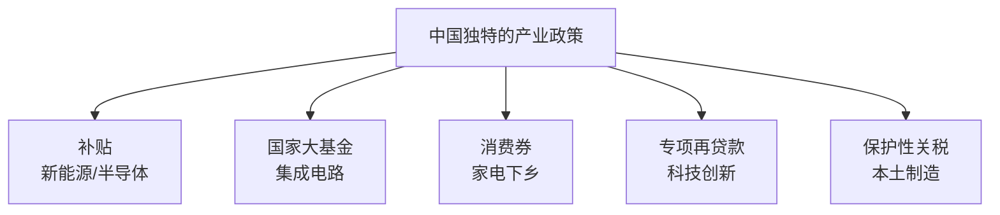

### 3. 周期短

```
中国行业从兴起到产能过剩通常 3-5 年：
- 光伏：2018 兴起 → 2024 严重产能过剩
- 电动车：2020 加速 → 2024 内卷至死
- 锂矿：2021 大牛 → 2023 暴跌
- 半导体设备：2020+ 兴起 → ?

→ 中国资本充沛+执行力强，让产业周期被"压缩"
→ 投资中国成长股需要更早进、更早出
```

---

## 实战案例：研究"AI 算力"行业

### Step 1：行业空间

```
全球数据中心资本支出（2024）：~$3000 亿
AI 占比从 ~10% 上升到 ~40%（2025+）
预计 2027 全球 AI 算力市场 ~$5000 亿

→ 这是个万亿级规模的赛道
```

### Step 2：生命周期

```
当前位置：成长早期（导入期末/成长期初）
- 渗透率：企业 AI 部署 < 10%
- 标准：尚未完全确定
- 应用：仍在探索
```

### Step 3：竞争格局

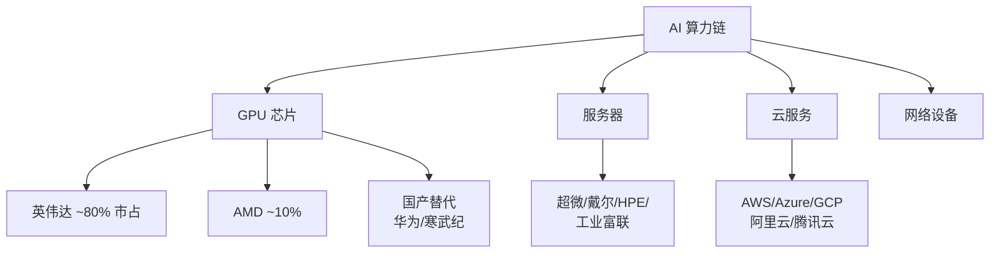

### Step 4：价值链分析

```
AI 算力价值链利润分布：
- 芯片：英伟达毛利 70%+ ← 最赚钱
- 服务器组装：毛利 10-20%
- 云服务：毛利 30-50%
- 应用：商业模式不明

→ 投资逻辑：先押"卖铲子的"（芯片+设备）
→ 应用层等模式跑出来再押
```

### Step 5：风险

```
1. 资本开支可持续性：科技巨头能否持续投入
2. 商业模式：AI 应用能否产生足够收入
3. 技术路线：会不会被替代
4. 地缘政治：芯片出口管制
5. 估值过高：英伟达 P/E > 60
```

---

## 输出研究报告

一份完整的行业报告应包含：

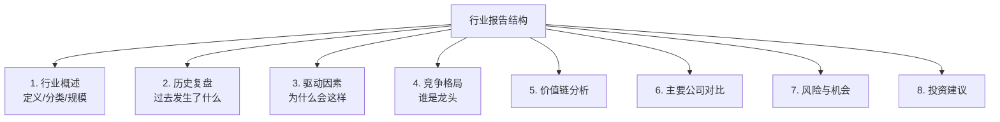

---

## 行业研究的常见错误

```mermaid
graph TB
    A[错误清单] --> B[1. "行业向好就能赚钱"<br/>忽略竞争格局]
    A --> C[2. "龙头就一定赢"<br/>忽略颠覆者]
    A --> D[3. 只看高增长不看天花板]
    A --> E[4. 不看政策风险]
    A --> F[5. 把热点当行业]
    A --> G[6. 不看周期位置]
    A --> H[7. 看不懂的行业还买]
```

---

## 核心概念速查

| 术语 | 英文 | 一句话解释 |
|------|------|-----------|
| TAM | Total Addressable Market | 总潜在市场 |
| SAM | Serviceable Addressable Market | 可服务市场 |
| SOM | Serviceable Obtainable Market | 可获得市场 |
| 渗透率 | Penetration Rate | 已使用人群比例 |
| 集中度 | Concentration | 市场份额集中程度（CR4/CR8） |
| 波特五力 | Porter's Five Forces | 行业竞争分析框架 |
| 价值链 | Value Chain | 上下游价值传递链条 |
| 长坡厚雪 | — | 巴菲特：长期复利的好行业 |

---

## 推荐阅读

- 《竞争战略》— 迈克尔·波特
- 《好战略，坏战略》— Richard Rumelt
- 各行业的经典书：
  - 半导体：《巨人的对决》
  - 互联网：《浪潮之巅》
  - 消费：《品牌的起源》

---

## 下一篇

→ [04 宏观策略分析](./04-macro-strategy.md)：从宏观推到具体操作
