# 04 宏观策略分析 | Macro Strategy

`🔴 高级` `预计阅读：30 分钟`

> 核心问题：怎么从宏观数据推导到具体的资产操作？怎么像桥水/索罗斯那样思考？

---

## 一句话总结

**宏观策略 = 用宏观环境的判断，找到当前阶段最该买/最该卖的资产。它的核心不是预测，而是"押注高概率事件"。**

---

## 宏观策略的思考框架

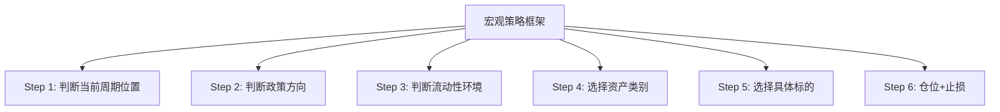

---

## Step 1：判断周期位置

### 五维度框架

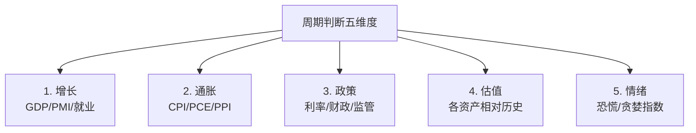

### 当前判断（2025）

| 维度 | 美国 | 中国 |
|------|------|------|
| 增长 | 扩张后期，边际放缓 | 底部，复苏初期 |
| 通胀 | 仍高于目标但回落 | 接近 0，通缩压力 |
| 政策 | 高利率维持/缓慢降 | 降息+宽松 |
| 估值 | 偏贵（科技股） | 便宜（A股/港股） |
| 情绪 | 偏乐观（AI 主线） | 偏悲观但触底回升 |

### 周期与资产对应

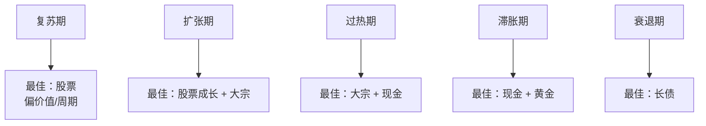

---

## Step 2：判断政策方向

```mermaid
graph TB
    A[政策方向四象限] --> B[宽松 + 财政扩张<br/>= "全力刺激"]
    A --> C[宽松 + 财政紧缩<br/>= "弱刺激"]
    A --> D[紧缩 + 财政扩张<br/>= "矛盾期"]
    A --> E[紧缩 + 财政紧缩<br/>= "全力压制"]
    
    B -.- B1["所有资产受益<br/>2009、2020"]
    C -.- C1["资产温和上涨"]
    D -.- D1["最复杂<br/>当前美国"]
    E -.- E1["资产承压<br/>2022 加息+紧财政"]
```

### 政策的"二阶导"很重要

```
不是看政策是宽松/紧缩，
而是看政策的"边际变化"。

例：
- 已经是宽松环境，但宽松力度在减弱 → 实际是利空
- 已经是紧缩环境，但紧缩力度在减弱 → 实际是利好
```

---

## Step 3：判断流动性环境

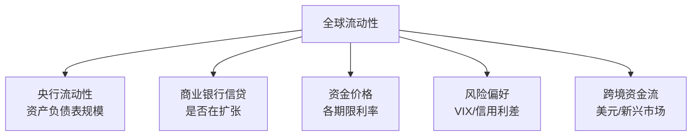

### 流动性的"七层"判断

```mermaid
graph TB
    A[第 1 层<br/>美联储 + 主要央行总规模] --> B[第 2 层<br/>政策利率水平]
    B --> C[第 3 层<br/>市场实际利率<br/>(SOFR/DR007)]
    C --> D[第 4 层<br/>信用利差<br/>(高收益债 vs 国债)]
    D --> E[第 5 层<br/>股票风险溢价<br/>(ERP)]
    E --> F[第 6 层<br/>VIX 恐慌指数]
    F --> G[第 7 层<br/>资金流向<br/>(ETF/北向)]
```

---

## Step 4：选择资产类别

### 主题驱动的资产选择

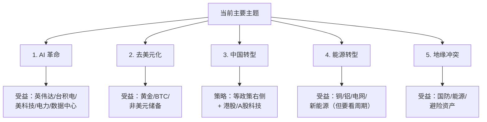

---

## Step 5：选择具体标的

### 自上而下：从主题到标的

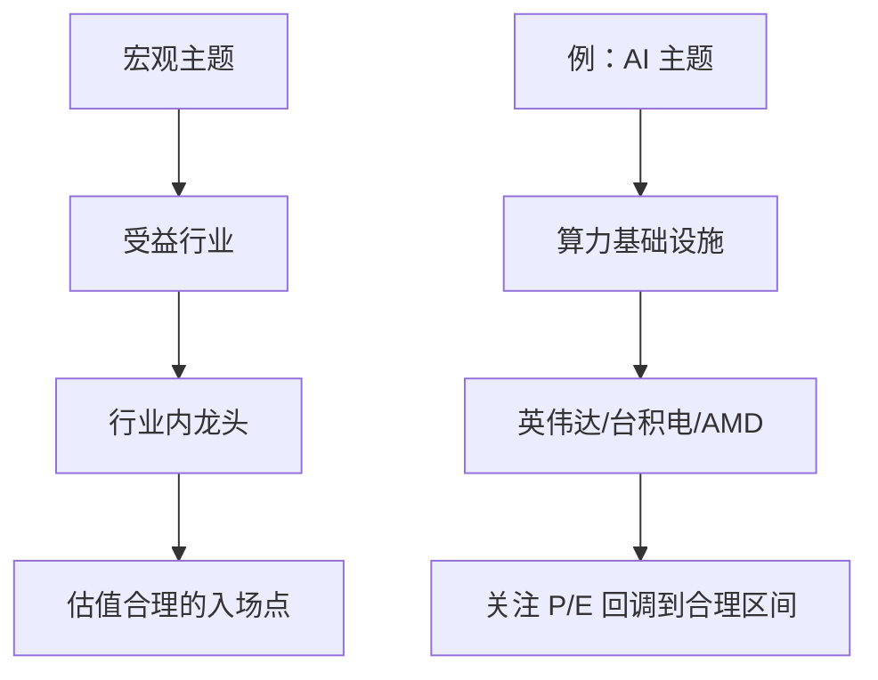

---

## 经典宏观策略案例

### 案例 1：索罗斯狙击英镑（1992）

```mermaid
graph TB
    A[判断] --> A1[英国加入 ERM<br/>= 英镑被高估]
    A --> A2[英国经济疲弱<br/>不应该高利率]
    A --> A3[德国央行不会救]
    
    B[操作] --> B1[做空英镑 100 亿美元]
    B --> B2[杠杆放大]
    
    C[结果] --> C1[英国央行放弃干预]
    C --> C2[英镑暴跌 15%]
    C --> C3[索罗斯赚 10 亿美元<br/>"打败英格兰银行"]
```

**学到的**：宏观判断错配 + 政策受限 = 高确定性机会

### 案例 2：达里奥的"美丽去杠杆"判断（2008-2010）

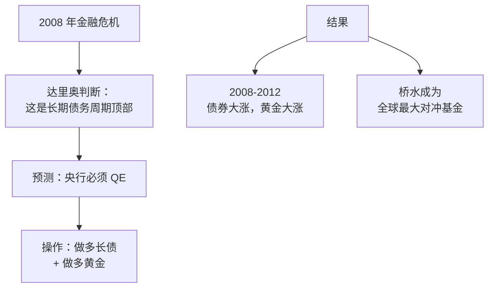

### 案例 3：保尔森做空次贷（2007）

```mermaid
graph TB
    A[研究] --> A1[次贷违约率上升]
    A --> A2[CDO 评级虚高]
    A --> A3[CDS 价格便宜]
    
    B[操作] --> B1[买入 CDS<br/>= 给次贷买"保险"]
    
    C[结果] --> C1[2008 年次贷崩盘]
    C --> C2[基金回报 +590%]
    C --> C3[赚 150 亿美元<br/>《大空头》原型]
```

**共同点**：
- 重大宏观判断
- 不对称回报（小赔大赚）
- 等待时机
- 重仓出击

---

## 不对称回报的思维

```mermaid
graph TB
    A[传统投资思维] --> B[预测涨跌<br/>多/空二选一]
    
    C[宏观对冲思维] --> D[找到不对称机会]
    D --> E[损失有限<br/>收益巨大]
    
    F[例子] --> G[做多虚值期权<br/>赔光保费但不会更多<br/>对了赚 10-100 倍]
    F --> H[CDS 赌违约<br/>违约率 0.1% 时的"保险"<br/>违约时赔率 1000:1]
```

> 💡 桥水的 Pure Alpha、保尔森的次贷做空、Bridgewater 的"Risk Parity"——核心都是**寻找不对称机会**。

---

## 几个有效的宏观判断信号

### 1. 收益率曲线倒挂

```
2Y - 10Y 国债收益率倒挂
→ 历史上 100% 准确预测美国衰退
→ 但时间滞后 6-24 个月
```

### 2. M2 增速变化

```
中国 M2 增速触底回升
→ 通常领先 A 股 1-2 个季度
```

### 3. 房地产销售

```
中国房地产销售连续 3 个月环比改善
→ 经济和股市的重要信号
```

### 4. 美联储政策转向

```
美联储从"鹰"转"鸽"
→ 全球风险资产受益
→ 但通常滞后于股市底部
```

### 5. 美元周期

```
美元强势周期持续 7-10 年
→ 末期警惕反转
→ 影响所有非美元资产
```

---

## 宏观策略的常见错误

```mermaid
graph TB
    A[错误清单] --> B[1. 太早入场<br/>"对的判断+错的时机=亏钱"]
    A --> C[2. 杠杆过大<br/>市场可以保持非理性比你撑得久还久]
    A --> D[3. 忽视尾部风险<br/>黑天鹅总会来]
    A --> E[4. 过度自信<br/>自己的"独到判断"通常是错的]
    A --> F[5. 不止损<br/>判断错了不认]
    A --> G[6. 单一押注<br/>不分散]
```

---

## 自己的宏观判断流程

### 周流程

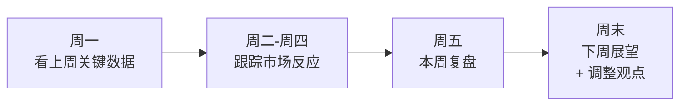

### 月流程

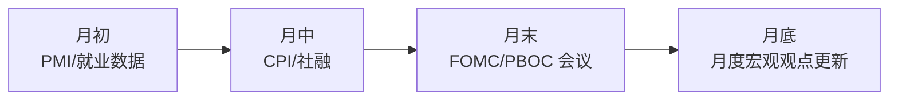

### 季度流程

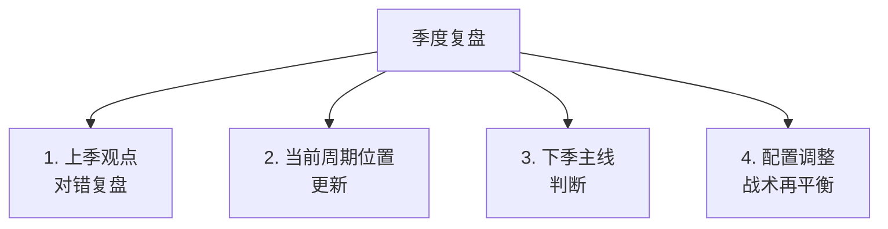

---

## 桥水"All Weather"的逻辑

桥水之所以能穿越周期，核心在于**用风险贡献而非金额配置**：

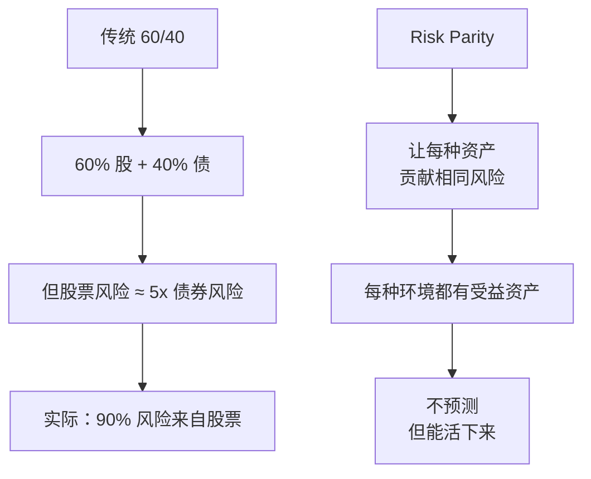

---

## 实战 mini 案例：当前判断

假设我们要给自己一个"年度展望"（2025 年视角）：

```
判断：
1. 美国：扩张后期，AI 主题主导
2. 中国：政策底已现，市场底待确认
3. 全球：流动性边际改善，但债务周期顶部

策略倾向：
- 美股：保持仓位但警惕集中度风险
- A 股 / 港股：左侧布局，关注政策催化
- 黄金：长期超配（去美元化逻辑）
- 美债：等加息周期结束信号
- 美元：美元周期可能见顶
- 加密：在仓位允许范围内保留 BTC

关键监控信号：
- 美联储何时明确转向降息
- 中国房地产销售拐点
- 美元指数能否跌破 100
- AI 资本开支是否兑现盈利
```

> ⚠️ 这只是示例。真实判断需要持续跟踪和修正。

---

## 怎么提高宏观判断能力？

```mermaid
graph TB
    A[提升路径] --> B[1. 持续阅读<br/>研报/新闻/书籍]
    A --> C[2. 持续记录<br/>判断 + 结果]
    A --> D[3. 复盘对错<br/>找到自己的"盲点"]
    A --> E[4. 多元思维<br/>历史/政治/科技]
    A --> F[5. 接触一手信息<br/>调研/访谈/数据]
    A --> G[6. 谦逊<br/>承认不知道的部分]
```

---

## 核心概念速查

| 术语 | 英文 | 一句话解释 |
|------|------|-----------|
| 宏观对冲 | Global Macro | 基于宏观判断的对冲基金策略 |
| 不对称回报 | Asymmetric Payoff | 损失有限收益巨大 |
| 风险平价 | Risk Parity | 各资产风险贡献相同 |
| 美林时钟 | Merrill Lynch Clock | 周期-资产对应模型 |
| Carry Trade | — | 套息交易 |
| 尾部风险 | Tail Risk | 极端事件 |
| 厚尾分布 | Fat Tail | 极端事件比正态分布预测的多 |
| 凯利公式 | Kelly Criterion | 最优仓位计算 |

---

## 延伸思考

1. 为什么大多数对冲基金长期跑不赢标普 500？
2. 宏观对冲基金式微是什么原因？
3. AI 时代，宏观判断会不会被算法取代？
4. 如果你只能押一个宏观主题 5 年不动，押什么？

---

## 推荐阅读

- 《对冲基金风云录》— 巴顿·比格斯
- 《金融炼金术》— 索罗斯
- 《原则》— 达里奥
- 《超越泡沫》— 巴顿·比格斯
- 《大空头》— 迈克尔·刘易斯（电影也好看）

---

## 下一篇

→ [05 跨资产关联分析](./05-cross-asset.md)：股债汇商之间到底怎么互相影响？
