# 05 跨资产关联分析 | Cross-Asset Analysis

`🔴 高级` `预计阅读：25 分钟`

> 核心问题：股、债、汇、商之间到底怎么互相影响？为什么"美债收益率涨了，全球资产都跌"？

---

## 一句话总结

**没有任何资产是孤岛。理解资产之间的关联，是从"散户"晋级到"宏观投资者"的关键一步。**

---

## 资产关联的"母图"

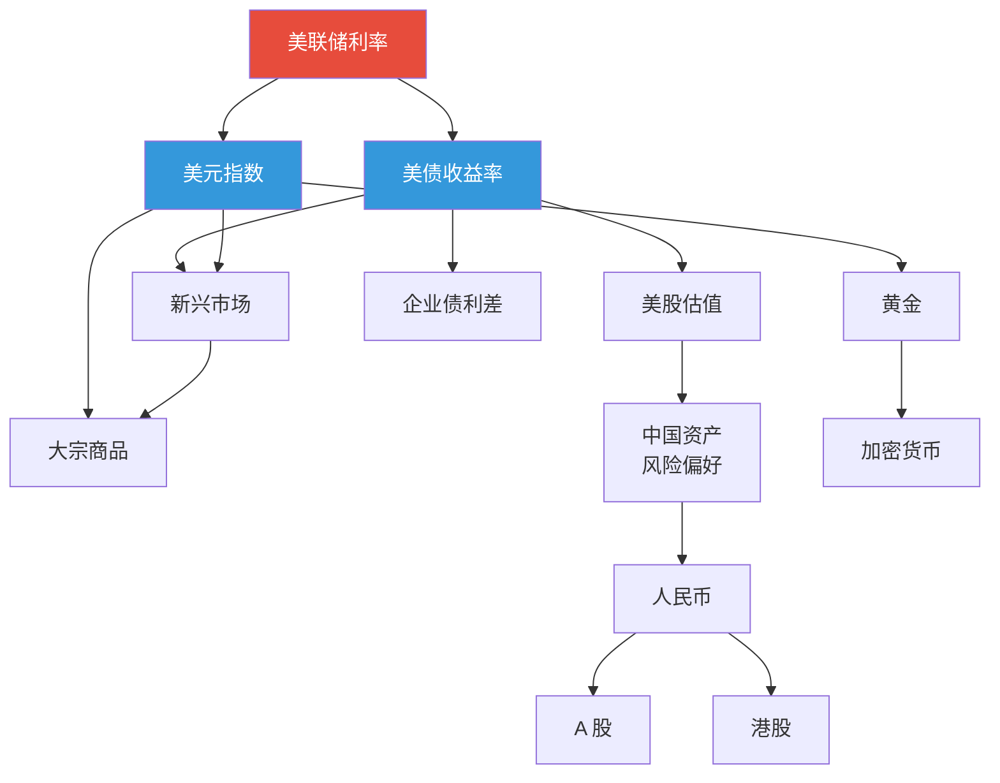

---

## 核心关联链 1：利率 → 股票

### 折现率视角

```
股票价值 = Σ 未来现金流 / (1 + r)^t

r 上升 → 折现率上升 → 现值下降 → 股价下跌
r 下降 → 折现率下降 → 现值上升 → 股价上涨
```

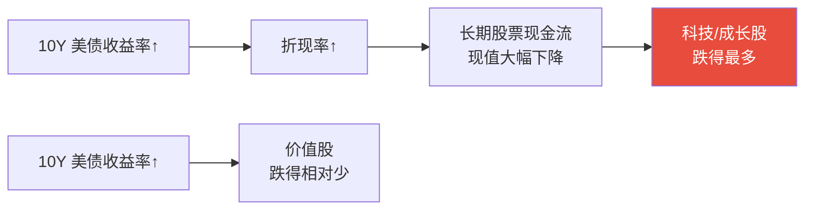

### 为什么科技股对利率最敏感？

```
科技股估值的钱 70%+ 来自 5 年后的现金流。
传统股估值的钱大多来自当下的现金流。

利率上升 1%：
- 远期现金流（10年后）现值变化大
- 近期现金流（明年）现值变化小

→ 科技股 P/E 压缩最严重（2022 年纳指最大跌 35%）
```

---

## 核心关联链 2：美元 → 全球资产

### "强美元"的传导

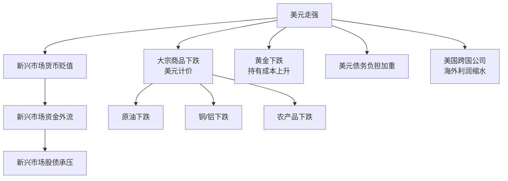

### 美元的"反身性"


> ⚠️ 这种正反馈在极端情况下会变成"美元飙升 + 新兴市场崩盘"。1997 亚洲金融危机就是典型。

---

## 核心关联链 3：通胀 → 利率 → 资产

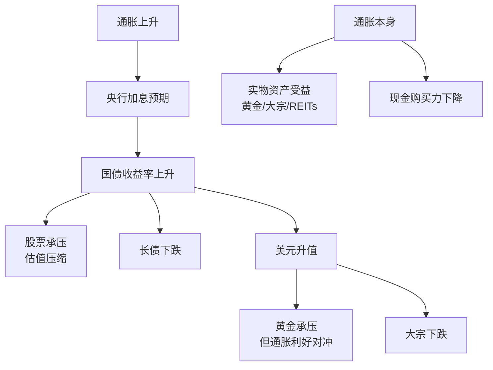

### 为什么黄金的传导"不直接"？

```
通胀 ↑ → 央行加息 → 实际利率 ↑ → 黄金 ↓
但同时
通胀 ↑ → 抗通胀需求 → 黄金 ↑

最终看：实际利率（名义利率 - 通胀预期）
- 实际利率 ↑ → 黄金 ↓
- 实际利率 ↓ → 黄金 ↑
```

---

## 关键关联矩阵

> 当 X 上涨时，Y 通常怎么走？（基于历史统计）

| | 美元↑ | 美债收益率↑ | 油价↑ | 黄金↑ | A股↑ | BTC↑ |
|--|-------|------------|-------|-------|------|------|
| **美股** | 🟡 | 🔴 | 🟡 | 🟡 | 🟢弱 | 🟡 |
| **A 股** | 🔴 | 🔴 | 🔴 | 🟡 | — | 🟡 |
| **港股** | 🔴强 | 🔴 | 🔴 | 🟡 | 🟢强 | 🟡 |
| **黄金** | 🔴 | 🔴 | 🟢 | — | 🟡 | 🟢弱 |
| **BTC** | 🔴 | 🔴 | 🟡 | 🟢弱 | 🟡 | — |
| **人民币** | 🔴 | 🔴 | 🔴 | 🟡 | 🟢 | 🟡 |
| **新兴市场** | 🔴强 | 🔴 | 🟡 | 🟡 | 🟡 | 🟡 |

🟢 正相关　🔴 负相关　🟡 中性/弱

> ⚠️ 相关性不是因果性，且会随宏观环境变化。2022 年股债双杀打破了多个传统相关性。

---

## 实战案例：拆解一次 FOMC 加息

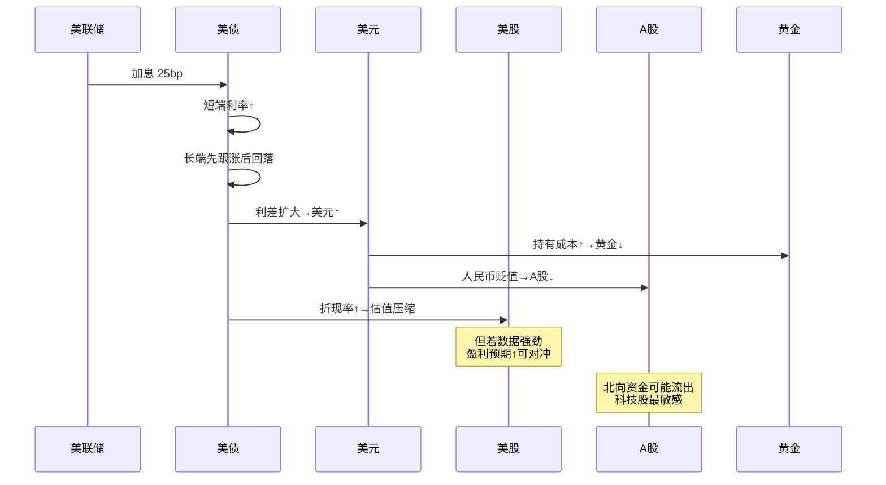

---

## 几个常见的"反常识"

### 1. 加息初期：股市可以涨

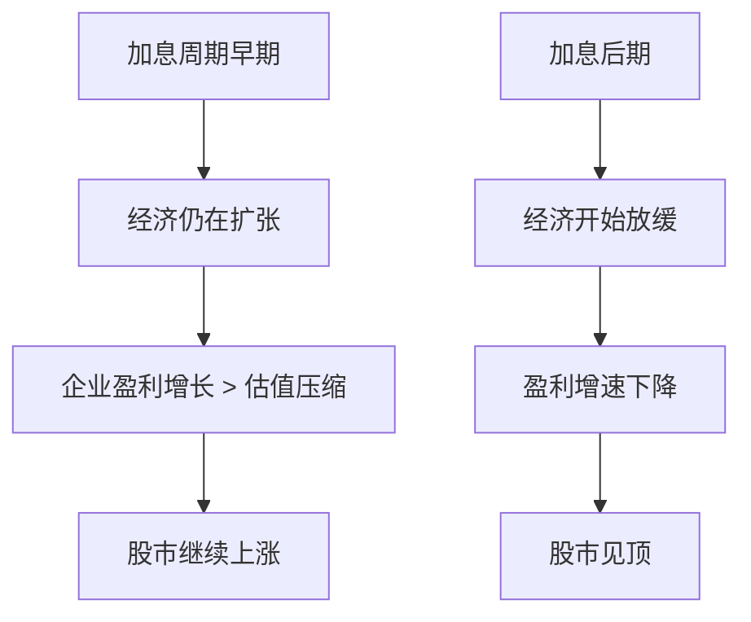

> 📊 历史上，标普 500 在加息周期前 1-2 年通常仍上涨，加息接近尾声时见顶。

### 2. 降息开始：股市可能跌

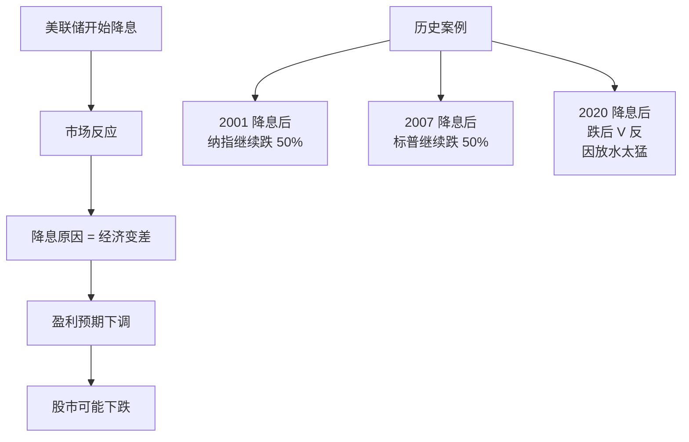

> 💡 "降息利好股市"是常见误解。**只有当降息成功避免衰退时，才利好**。

### 3. 美元强 + 黄金强（2022-2024 反常识）

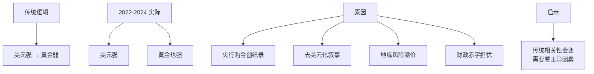

### 4. 中美股市经常背离

```
2020 年：A 股先涨，美股后涨
2021 年：A 股跌，美股涨
2022 年：A 股跌，美股跌
2023 年：A 股跌，美股涨
2024 年：A 股先弱后强，美股强

→ 中美经济周期错位 + 政策方向不同
→ "中美股市同步"是经常被打破的假设
```

---

## 跨资产策略案例

### 1. Risk-On / Risk-Off 模式

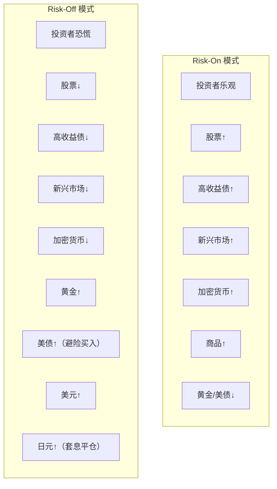

### 2. "美林时钟"的资产轮动

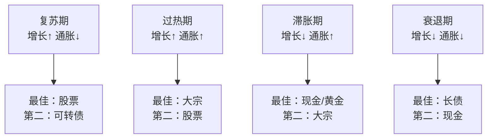

### 3. 全球宏观对冲案例

```
2022 年的"完美对冲"：
- 做空长期美债（赌加息）
- 做多美元（赌强美元）
- 做空科技股（赌估值压缩）
- 做多大宗能源（赌通胀+地缘）
- 做空人民币（赌弱中国）

→ 这种组合 2022 年回报极佳
→ 但 2023-2024 部分头寸开始反向
```

---

## 关联性的失效

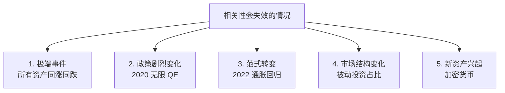

> ⚠️ "60/40 死了"的论调就来自 2022 年股债双杀打破了 40 年的负相关。

---

## 监控关联性的工具

### 滚动相关性

```python
# 简化逻辑
correlation_60d = stock.rolling(60).corr(bond)

if correlation_60d < -0.5:
    # 股债负相关 → 60/40 有效
elif correlation_60d > 0:
    # 股债正相关 → 60/40 失效，需要其他对冲
```

### 关键监控指标

| 指标 | 含义 |
|------|------|
| 股债 60 日相关性 | 60/40 是否有效 |
| 股债 12 月相关性 | 长期范式 |
| BTC 与纳指相关性 | 加密的"风险资产化" |
| 黄金与美债相关性 | 避险逻辑是否一致 |
| A 股与美股相关性 | 全球化程度 |

---

## 怎么用关联性指导操作？

### 1. 不要被"伪分散"骗

```
持仓示例：
- 茅台
- 五粮液
- 泸州老窖
- 贵州茅台 ETF

看起来 4 只持仓，实际 1 个押注（白酒板块）。
真正分散需要：
- 股票 + 债券（负相关）
- A 股 + 美股（弱相关）
- 黄金（独立）
```

### 2. 在极端时刻保留"超级避险"

```
所有资产同跌时：
- 美债（特别是长期）
- 美元
- 日元
- 部分情况下黄金

这些是"系统性危机"中的最后避风港。
```

### 3. 利用关联性做对冲

```
持有 A 股科技股 → 对冲方法：
1. 做空恒生科技 ETF（高相关）
2. 买入美元 / 黄金（负相关）
3. 持有美债（在系统性风险时受益）
```

---

## 全球宏观投资者的"思维矩阵"

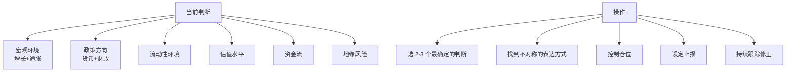

---

## 核心概念速查

| 术语 | 英文 | 一句话解释 |
|------|------|-----------|
| 相关性 | Correlation | 两个资产同向运动的程度 |
| Risk-On | — | 风险偏好上升 |
| Risk-Off | — | 风险偏好下降，避险 |
| 反身性 | Reflexivity | 价格影响基本面（索罗斯） |
| 套息交易 | Carry Trade | 借低息币投高息资产 |
| 对冲 | Hedging | 用反向头寸降低风险 |
| 配对交易 | Pairs Trading | 同时做多/空相关资产 |

---

## 延伸思考

1. 如果美元失去储备货币地位，全球资产关联会怎样重塑？
2. AI 革命会改变哪些传统的资产关联？
3. BTC 现在是"风险资产"还是"避险资产"？什么时候会改变？

---

## 推荐阅读

- 《Inside the House of Money》— Steven Drobny
- 《The Most Important Thing》— Howard Marks
- 《Soros on Soros》
- 桥水的 "Daily Observations"
- @MacroAlf 的 Twitter / Substack

---

## 下一篇

→ [06 政策分析框架](./06-policy-analysis.md)：怎么解读政策信号？为什么"读懂中国"比"读懂美国"更难？
