# 06 政策分析框架 | Policy Analysis

`🔴 高级` `预计阅读：25 分钟`

> 核心问题：怎么解读政策信号？为什么"读懂中国"比"读懂美国"难？政策怎么影响资产价格？

---

## 一句话总结

**政策是中国资本市场最重要的变量，也是最难分析的变量。学会读"政策措辞"、判断"政策力度"、跟踪"政策落地"，就掌握了中国投资的核心。**

---

## 中美政策制定的差异

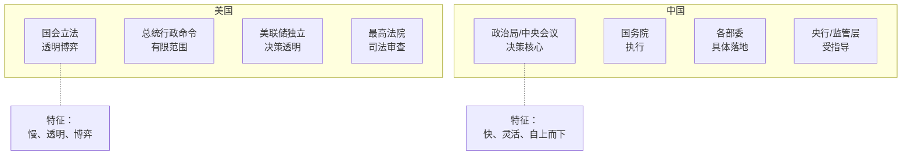

> 💡 这种差异决定了两国投资逻辑：美国看市场，中国看政策。

---

## 中国政策分析框架

### 第一层：顶层设计（5-10 年）

```mermaid
graph TB
    A[最高纲领性文件] --> B[党代会报告<br/>每 5 年]
    A --> C[十四五/十五五规划<br/>5 年规划]
    A --> D[二十大/三中全会决定]
    A --> E[长期战略<br/>2035 远景]
    
    F[当前的"大主题"] --> G[新质生产力]
    F --> H[共同富裕]
    F --> I[高质量发展]
    F --> J[新型工业化]
    F --> K[一带一路]
    F --> L[国家安全]
```

### 第二层：年度定调（1 年）

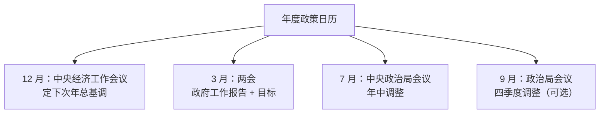

### 第三层：季度部署

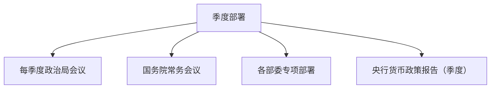

### 第四层：具体执行（每月/每周）

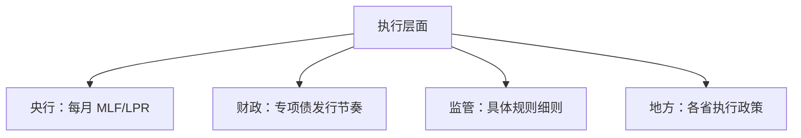

---

## 解读"政策措辞"

中国政策语言有一套独特的"暗码"。读懂这些暗码，就能领先市场判断方向。

### 货币政策措辞

| 措辞 | 倾向 | 含义 |
|------|------|------|
| "稳健中性" | 中性 | 不松不紧 |
| "稳健灵活适度" | 偏宽松 | 有宽松空间 |
| "稳健精准有力" | 宽松 | 主动宽松 |
| "保持流动性合理充裕" | 宽松 | 流动性宽松 |
| "保持流动性合理稳定" | 中性 | 维持现状 |
| "防范金融风险" | 偏紧 | 控制杠杆 |
| "总闸门" | 紧缩 | 严控货币 |
| "灵活精准、合理适度" | 偏宽松 | 定向支持 |

### 财政政策措辞

| 措辞 | 倾向 |
|------|------|
| "积极有为" | 强力扩张 |
| "提质增效" | 适度扩张 |
| "稳健" | 中性 |
| "积极的财政政策" | 扩张 |
| "积极加力提效" | 大力扩张 |

### 房地产措辞

| 措辞 | 含义 | 时期 |
|------|------|------|
| "房住不炒" | 紧，限投机 | 2017-2024 |
| "支柱产业" | 松，重视 | 2003-2017 / 2024+ |
| "促进房地产市场平稳健康发展" | 适度刺激 | 2024+ |
| "推动房地产新模式" | 转型 | 2023+ |
| "保交楼" | 应急救助 | 2022+ |

### 股市措辞

| 措辞 | 含义 |
|------|------|
| "保护中小投资者" | 监管收紧 |
| "提振投资者信心" | 暖风频吹 |
| "活跃资本市场" | 大利好 |
| "增强资本市场内在稳定性" | 稳定为主 |
| "防范市场异常波动" | 干预潜在风险 |

---

## 政策周期判断

### 政策松紧周期

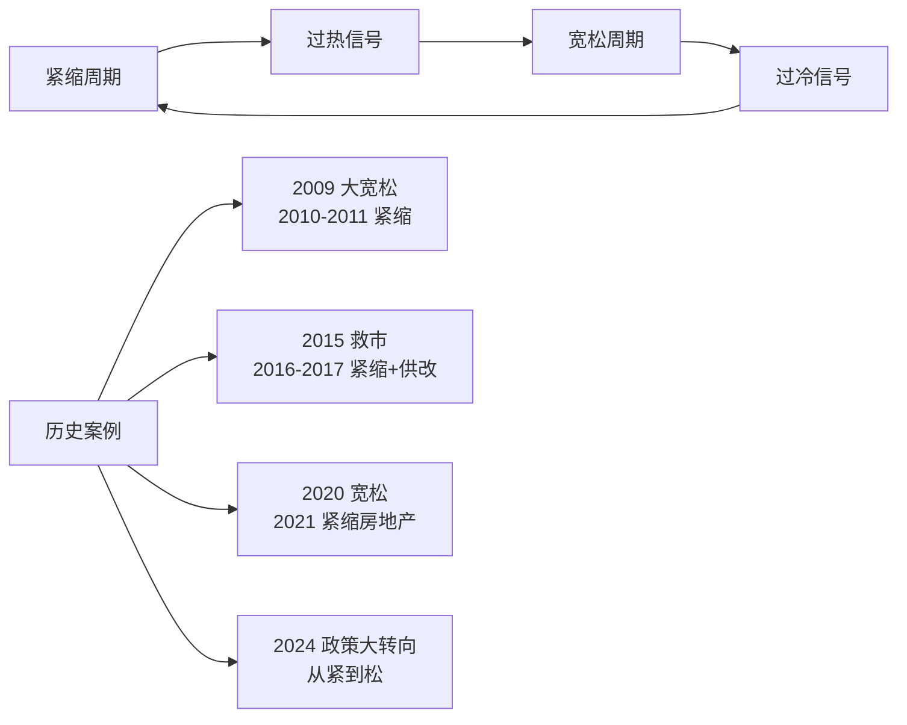

### 怎么判断政策周期？

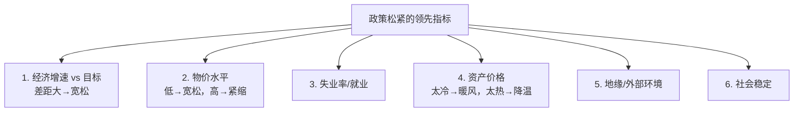

---

## 几类核心政策的解读

### 货币政策

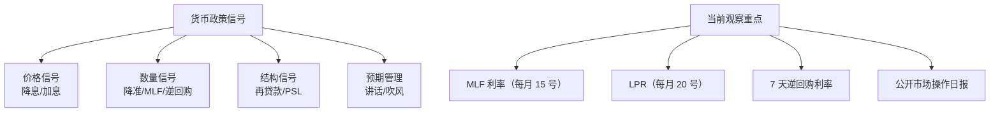

### 财政政策

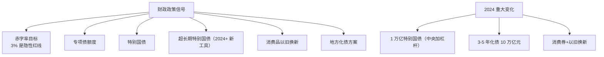

### 产业政策

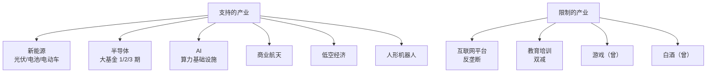

### 监管政策

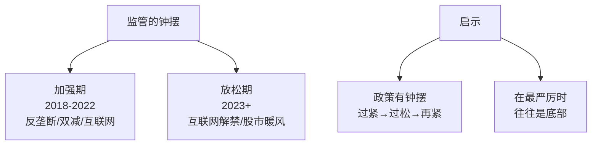

---

## 政策的传导链

### 货币政策传导

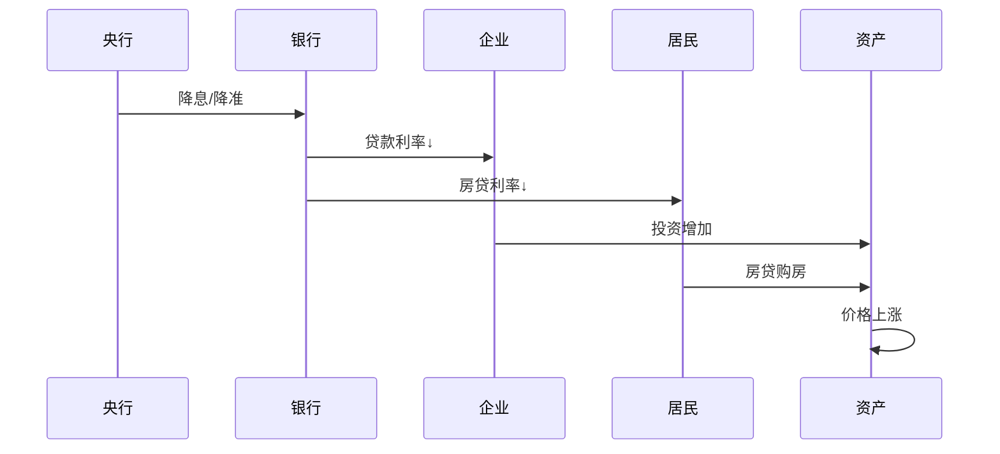

### 财政政策传导

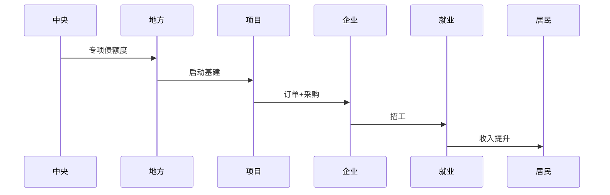

---

## 中美政策博弈

### 中美贸易/科技政策

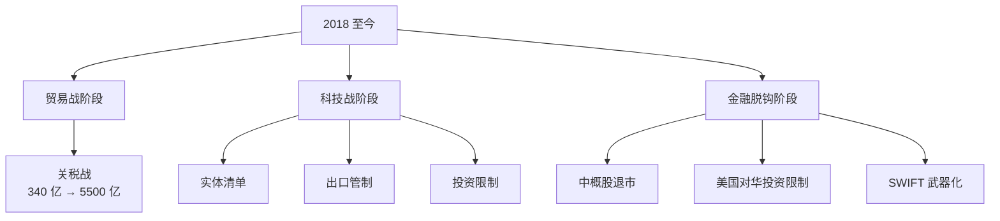

### 政策博弈下的资产影响

| 升级 | 受益 | 受损 |
|------|------|------|
| 关税战 | 国产替代/出海非美 | 出口美国的中国企业 |
| 科技封锁 | 国产芯片/半导体 | 高度依赖美技术的企业 |
| 金融脱钩 | A 股/港股长期 | 中概股 |

---

## 实战：解读一次重要会议

### 案例：2024.9.26 政治局会议

> 这是 2024 年最重要的政策转折点之一。

#### 措辞变化

```
2024.7（之前）：
"坚定不移完成全年经济社会发展目标任务"

2024.9.26（新）：
"促进房地产市场止跌回稳"
"推动一揽子增量政策落地"
"研究强化大型商业银行核心一级资本"
"全力支持平台经济健康发展"
```

#### 信号解读

```mermaid
graph TB
    A[关键信号] --> B[1. 房地产<br/>从"促进发展"到"止跌回稳"<br/>= 直接刺激]
    A --> C[2. 财政<br/>"增量政策"<br/>= 大规模刺激将至]
    A --> D[3. 银行<br/>"核心一级资本"<br/>= 注资]
    A --> E[4. 平台经济<br/>"全力支持"<br/>= 监管转向]
```

#### 市场反应

```
9.24：央行行长发布会（前奏）
9.26：政治局会议（确认）
9.27-30：A 股 4 天暴涨 25%
10 月：港股恒科涨 30%+
```

#### 启示

```
能在政治局会议措辞变化中
读出"政策转向"信号
就能领先市场 2-3 天
入场建仓
```

---

## 政策落地的"信号"和"陷阱"

### 真信号

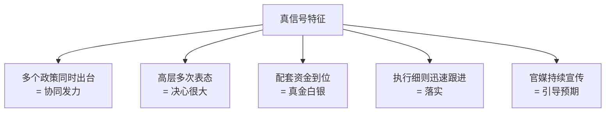

### 假信号 / 陷阱

```mermaid
graph TB
    A[假信号陷阱] --> B[只有一个部委表态<br/>= 力度不够]
    A --> C[措辞模糊<br/>= 没有强约束]
    A --> D["研究"、"探索"<br/>= 还没决定]
    A --> E[没有配套资金<br/>= 难以落地]
    A --> F[执行细则迟迟不出]
```

---

## 政策跟踪日历

### 必看时点

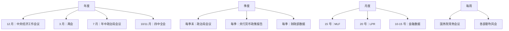

---

## 政策分析的工具

### 关键信息源

| 来源 | 用途 |
|------|------|
| 新华社/人民日报 | 权威发布 |
| 国务院政策吹风会 | 解读权威 |
| 各部委官网 | 具体细则 |
| 央行官网 | 货币政策 |
| 学习强国 | 党媒视角 |
| 财新/华尔街见闻 | 解读分析 |
| 券商首席宏观研报 | 专业解读 |

### AI 辅助阅读

现在可以用 ChatGPT/Claude 帮助：
- 对比政策文本变化
- 提取关键措辞
- 总结要点
- 分析潜在影响

但**最终判断需要自己**——政策背后的政治逻辑 AI 不一定懂。

---

## 政策分析的常见错误

```mermaid
graph TB
    A[错误清单] --> B[1. 过度解读单个文件<br/>需要看政策组合]
    A --> C[2. 忽视执行差距<br/>"政策好"≠"落地好"]
    A --> D[3. 短期博弈<br/>政策有滞后性]
    A --> E[4. 只看中文媒体<br/>错过外资视角]
    A --> F[5. 政治化解读<br/>把所有都看成"博弈"]
    A --> G[6. 忽视底层经济规律<br/>政策也撼动不了周期]
```

---

## 投资启示

### 1. 在政策"右侧"也来得及

```
政策出台后，资产通常会有 1-3 个月的"消化期"。
不需要追求"领先市场 1 天"，
"领先大众 1 个月"已经足够。
```

### 2. "底"通常出现在最严厉的时候

```
2018 教育股政策最严 → 后来反弹（暂时）
2021 互联网监管最严 → 2024 转向
2022 房地产最差 → 2024 政策大力支持

→ 政策反转往往出现在"已经完蛋"的时候
```

### 3. 不要逆势而行

```
长期对抗政策方向 = 必败

反例：
- 2021 重仓教育股 → 双减
- 2018-2022 重仓互联网 → 反垄断
- 2018+ 重仓地产 → 三道红线

→ 政策利空的板块，等政策转向再上车
→ 政策利好的板块，趁早布局
```

---

## 核心概念速查

| 术语 | 解释 |
|------|------|
| 政治局会议 | 中央政治局月度/季度会议（25 名委员） |
| 政治局常委会议 | 7 名常委决策（最高） |
| 中央经济工作会议 | 每年 12 月，定下年总调 |
| 两会 | 全国人大+政协，每年 3 月 |
| 国务院常务会议 | 每周一次，李强主持 |
| 三道红线 | 房企融资管控（2020.8） |
| 双减 | 教育减负+减作业（2021.7） |
| 房住不炒 | 房地产定调（2017+） |
| 共同富裕 | 长期目标（2021+） |
| 新质生产力 | 当前经济关键词（2024+） |

---

## 推荐资源

- 新华社、人民日报客户端（一手政策）
- 国务院政策文件库
- 国研中心、中金、中信等首席的解读
- 任泽平、李迅雷等知名分析师
- 公众号：智本社、付鹏的财经世界

---

## 延伸思考

1. 为什么外资对 2024.9 政策大转向反应迟缓？
2. 中国政策的"独立性"和"连续性"哪个更强？
3. 党的二十届三中全会最重要的信号是什么？
4. 怎么判断政策是"短期刺激"还是"长期转向"？

---

## 下一篇

→ [07 市场微观结构](./07-market-microstructure.md)：资金流动、持仓结构、情绪指标
