# 07 市场微观结构 | Market Microstructure

`🔴 高级` `预计阅读：20 分钟`

> 核心问题：除了基本面和宏观，还有哪些"看不见"的力量在影响价格？

---

## 一句话总结

**资金流、持仓结构、市场情绪、衍生品仓位——这些"微观结构"信号常常领先于价格。看清这些，能帮你判断行情的"质地"和"持续性"。**

---

## 市场微观结构的三个层次

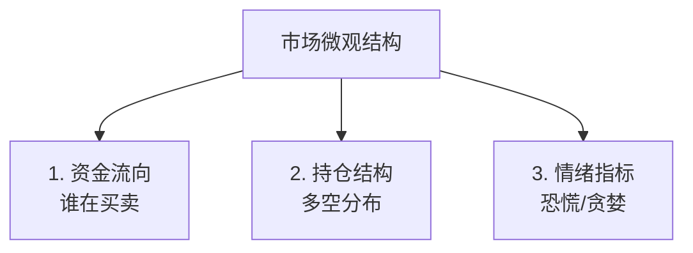

---

## Layer 1：资金流向

### A 股资金面

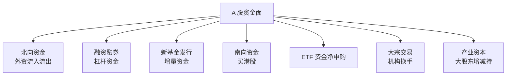

### 美股资金面

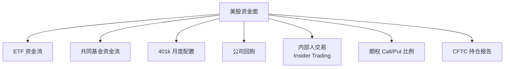

### 关键资金信号

#### 北向资金（A 股）

```mermaid
graph TB
    A[北向资金作用] --> B[历史上是"聪明钱"<br/>但近年有效性下降]
    A --> C[反映外资对中国看法]
    A --> D[影响蓝筹股流动性]
    
    E[怎么用？] --> F[连续 5 日净流入 > 200 亿<br/>= 强信号]
    E --> G[连续净流出<br/>= 谨慎]
    E --> H[突然大量流入<br/>= 关注催化剂]
```

#### 公司回购（美股）

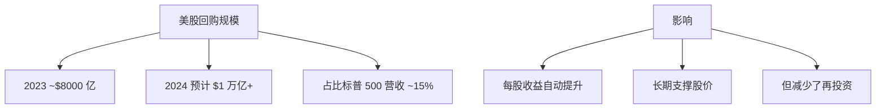

> 💡 美股长期向上的隐藏推手：**持续大规模回购**。这是 A 股没有的力量。

---

## Layer 2：持仓结构

### CFTC 持仓报告（美国）

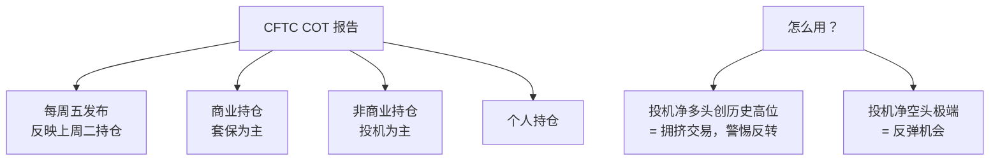

### 实战例子

```
2008 年 7 月油价 $147：
- 投机净多头创历史新高
- 商业空头创历史新高
→ 极端拥挤
→ 之后油价 6 个月跌到 $30

2022 年 4 月铜价高点：
- 投机净多头偏高
- 后续大幅回调
```

### A 股的持仓信号

```mermaid
graph TB
    A[A 股持仓信号] --> B[公募基金持仓集中度<br/>"抱团"现象]
    A --> C[北向持仓数据<br/>每日公布]
    A --> D[融券余额<br/>做空意愿]
    A --> E[陆股通持股]
    
    F[2021 抱团现象] --> G[公募 60% 仓位集中前 50 票]
    F --> H[白酒/医药/新能源核心股]
    F --> I[2021 春节后崩盘]
```

---

## Layer 3：情绪指标

### 恐慌贪婪指数

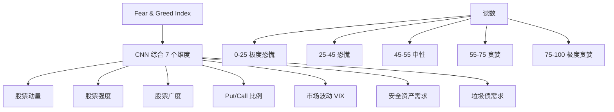

> 💡 巴菲特名言："在别人贪婪时恐惧，在别人恐惧时贪婪。"

### VIX：恐慌指数

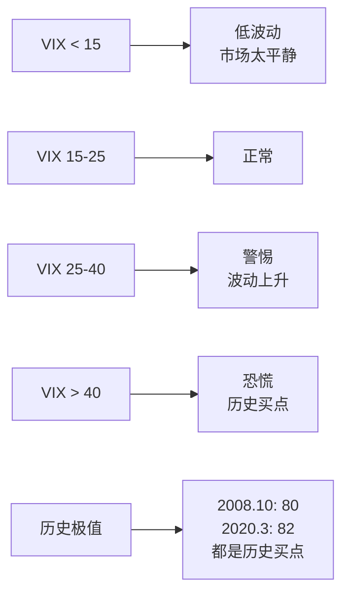

### Put/Call 比例

```
Put/Call 比例 = 看跌期权交易量 / 看涨期权交易量

正常：0.7-1.0
> 1.2 = 极度看空（往往是反弹时机）
< 0.5 = 极度看多（警惕回调）
```

### A 股情绪指标

| 指标 | 含义 | 信号 |
|------|------|------|
| 涨停家数 | 多头情绪 | >100 家 = 情绪好 |
| 跌停家数 | 空头情绪 | >50 家 = 警惕 |
| 沪深成交额 | 流动性 | 万亿是分水岭 |
| 换手率 | 活跃度 | 低 = 平淡 |
| 融资余额 | 加杠杆 | 持续上升 = 牛市 |
| 新基金发行 | 增量资金 | 爆款 = 顶部信号 |

---

## 极端情绪的"逆向信号"

### 顶部信号

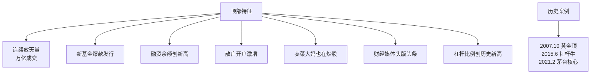

### 底部信号

```mermaid
graph TB
    A[底部特征] --> B[成交量极度萎缩]
    A --> C[新基金发行困难<br/>"死扛"]
    A --> D[市场弥漫绝望情绪]
    A --> E[基金大幅赎回]
    A --> F[散户清仓离场]
    A --> G[财经话题"无人问津"]
    A --> H[市盈率/市净率历史低位]
    
    I[历史案例] --> J[2008.10/2014.6/<br/>2018.12/2024.1]
```

---

## 衍生品市场的领先信号

### 期权 Skew（偏度）

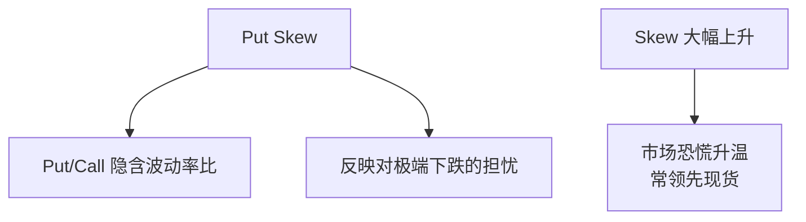

### 期货持仓变化

```
当大型机构在期货市场异常加仓/减仓：
→ 通常是对未来的判断
→ 比公开数据更敏感
→ 但需要专业渠道获取
```

---

## 流动性信号

### TED 利差（美元流动性）

```
TED Spread = LIBOR/SOFR - 短期国债收益率
正常：< 50bp
> 100bp = 流动性紧张
> 200bp = 危机征兆

2008.10：飙到 460bp
2020.3：飙到 140bp
```

### 国债与回购利率

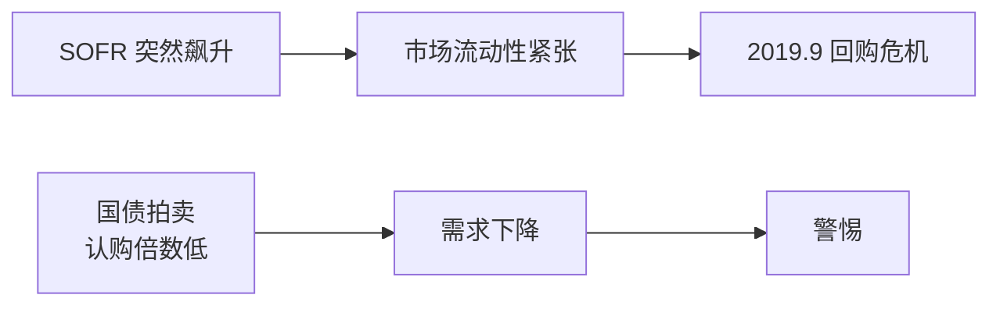

---

## 实战使用案例

### 案例 1：2024.9 月 A 股反转信号

```
9.18 之前：
- 成交量萎缩到 5000 亿
- 新基金发行冰点
- 融资余额低位
- 北向资金持续流出
- 散户绝望情绪
→ 极度恐慌

9.24 央行发布会 →
9.26 政治局会议 →
9.27 起 A 股暴涨

→ 极度恐慌 + 政策催化 = 反转
```

### 案例 2：2021.2 茅台顶部

```
2 月初：
- 公募基金抱团茅台
- 茅台 P/E ~70（历史高位）
- 北向资金持续流入
- 全民买基金
- "茅台教"信仰
→ 极度贪婪

2 月 18 日开始下跌
→ 之后 3 年大幅调整
```

---

## 微观信号的局限

### 1. 信号会"失效"

```
被广泛知道的指标，
作用会减弱。

例：北向资金作为"聪明钱"
2014-2018 有效
2019-2021 减弱
2022+ 几乎失效
```

### 2. 极端情绪可以更极端

```
2007 年贪婪指数已经满分
但市场又涨了几个月

2008.10 恐慌指数已经爆表
但市场又跌了 3 个月
```

### 3. 政策能改变一切

```
中国市场的政策影响大
微观信号在政策面前都是浮云
```

---

## 综合使用框架

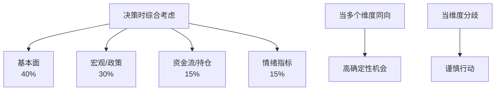

---

## 核心概念速查

| 术语 | 英文 | 一句话解释 |
|------|------|-----------|
| 北向资金 | Northbound | 外资买 A 股 |
| 南向资金 | Southbound | 内地买港股 |
| 融资融券 | Margin | 借钱买/借股卖 |
| VIX | Volatility Index | 美股恐慌指数 |
| Put/Call 比例 | Put/Call Ratio | 期权多空比 |
| CFTC COT | Commitment of Traders | 美国期货持仓报告 |
| Fear & Greed | — | 贪婪恐慌指数 |
| TED Spread | — | 美元流动性紧张程度 |
| Skew | — | 期权偏度 |

---

## 推荐工具

- TradingView：图表 + 部分情绪指标
- CNN Fear & Greed Index：免费查询
- CME FedWatch：加息概率
- 同花顺/东方财富：A 股资金流
- Glassnode：加密货币链上数据

---

## 下一篇

→ [08 构建投资体系](./08-investment-system.md)：把所有学到的整合成可执行的体系
