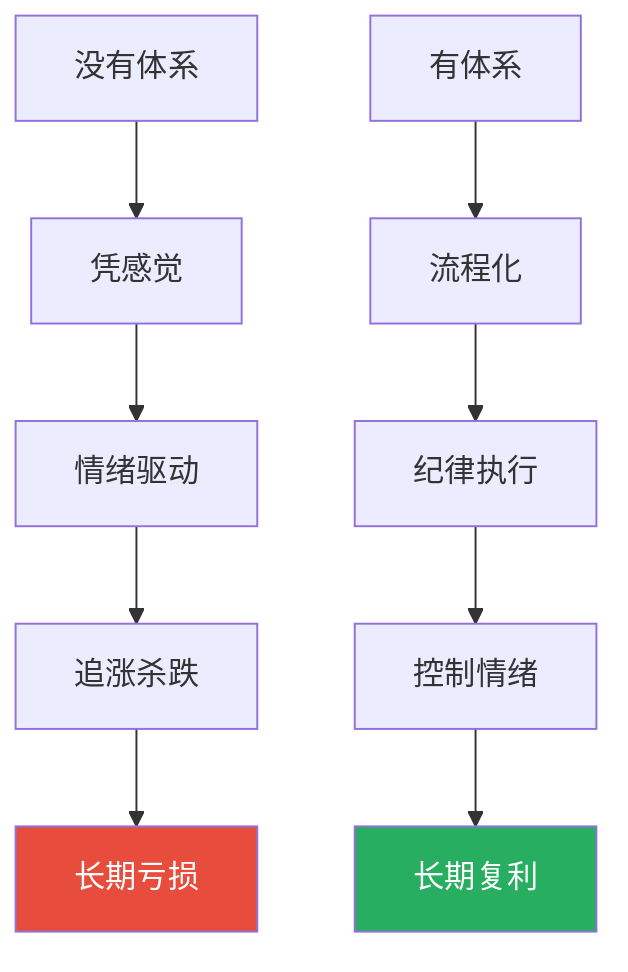
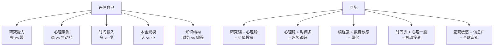
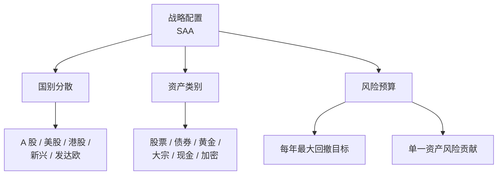
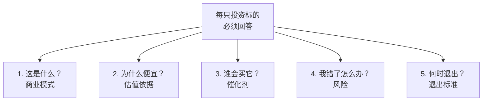
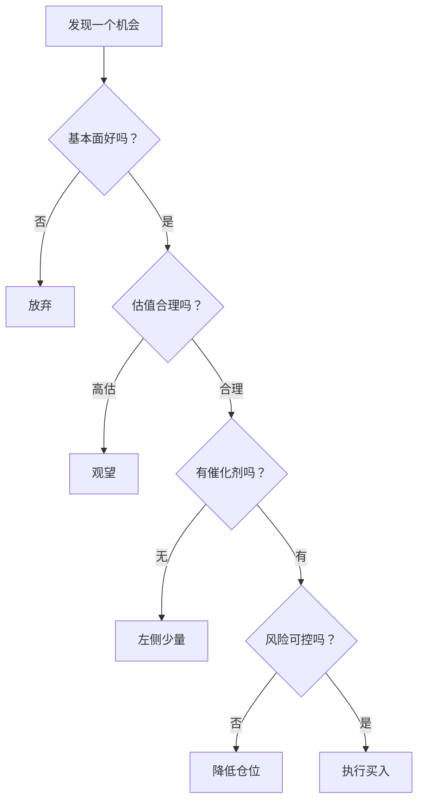
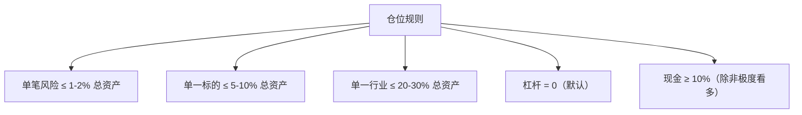
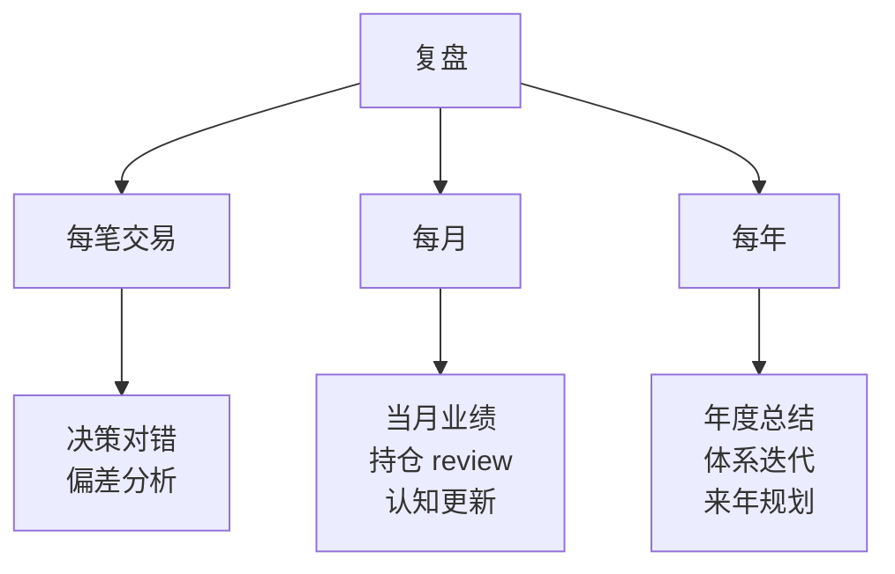
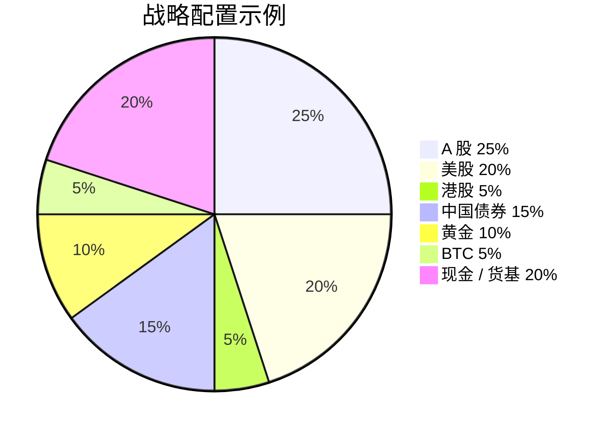
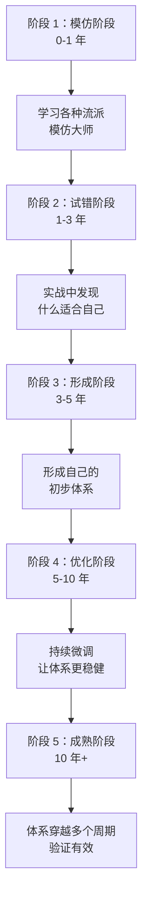

# 08 构建投资体系 | Building Your Investment System

`🔴 高级` `预计阅读：25 分钟`

> 核心问题：怎么把所有学到的知识整合成一个可执行的体系？怎么避免每次操作都"凭感觉"？

---

## 一句话总结

**投资体系 = 你的投资哲学 + 决策流程 + 风险规则 + 复盘机制。它不是为了让你"赚最多"，而是让你"少犯大错"。**

---

## 为什么需要"体系"？



> 💡 投资体系的最大价值不是"找到必胜机会"，而是"防止必败操作"。

---

## 投资体系的 5 个层次

```mermaid
graph TB
    L1[第 1 层<br/>投资哲学<br/>"为什么投？"] --> L2[第 2 层<br/>战略<br/>"投什么？"]
    L2 --> L3[第 3 层<br/>战术<br/>"什么时候投？"]
    L3 --> L4[第 4 层<br/>执行<br/>"怎么投？"]
    L4 --> L5[第 5 层<br/>复盘<br/>"做对了吗？"]
```

---

## Layer 1：投资哲学

这是你最深的"信念"，决定其他一切。

### 核心问题

```mermaid
graph TB
    A[你需要回答] --> B[1. 我相信市场有效吗？]
    A --> C[2. 我相信能预测未来吗？]
    A --> D[3. 我相信"有人能稳定跑赢市场"吗？]
    A --> E[4. 我相信"长期"还是"短期"？]
    A --> F[5. 我能承受多大波动？]
    A --> G[6. 我的目标是收益还是稳定？]
```

### 主要投资流派

| 流派 | 核心信念 | 代表 |
|------|----------|------|
| 价值投资 | 价格围绕价值波动 | 巴菲特、芒格 |
| 成长投资 | 高增长公司值高估值 | 林奇、菲利普·费雪 |
| 趋势跟踪 | 趋势会持续 | 海龟交易、CTA |
| 量化投资 | 数据+模型胜于直觉 | 西蒙斯、Two Sigma |
| 全球宏观 | 大趋势决定一切 | 索罗斯、达里奥 |
| 被动投资 | 跑不过市场就成为市场 | 博格、巴菲特（劝散户） |
| 行为金融 | 利用人性的弱点 | 卡尼曼 |

### 找到适合自己的



> 💡 不要试图"博采众长"。**专注一个流派，把它做精**。

---

## Layer 2：战略配置

### 资产配置框架



### 长期不变 vs 短期调整

```
战略：每 3-5 年评估一次
战术：每季度可微调（±5-10%）
不要：天天改变战略
```

---

## Layer 3：战术决策

### 选标的的 Checklist



### 入场决策树



---

## Layer 4：执行规则

### 仓位规则



### 加减仓规则

```
首次买入：30-50% 计划仓位
确认走对：加 20-30%
进一步确认：再加 20%

止盈/减仓：
- 涨 30% 减 1/3
- 涨 50% 再减 1/3
- 剩余 1/3 让利润奔跑

止损：
- 价格止损：-10% 到 -15%
- 逻辑止损：买入逻辑被破坏
- 时间止损：6-12 月不涨
```

### 交易纪律

```mermaid
graph TB
    A[交易纪律] --> B[盘前/盘中/盘后<br/>分时段决策]
    A --> C[决策前先写下<br/>"为什么"]
    A --> D[决策后等 24 小时<br/>再执行（防冲动）]
    A --> E[不要刷盘<br/>不要看新闻冲动操作]
```

---

## Layer 5：复盘机制

### 三层复盘



### 复盘清单（每月）

```markdown
# 月度复盘 YYYY-MM

## 业绩
- 月度回报：___%
- 累计回报：___%
- 最大回撤：___%
- 持仓比例：___%

## 决策回顾
| 日期 | 操作 | 标的 | 仓位 | 理由 | 结果 | 教训 |
|------|------|------|------|------|------|------|

## 对错复盘
- 做对的：（什么帮我做对了？）
- 做错的：（什么导致我做错？）
- 该做没做：（错过了什么？为什么？）
- 不该做做了：（哪些是冲动？）

## 认知更新
- 这个月学到了什么新知识？
- 哪些原有判断需要修正？

## 下月计划
- 主要关注什么？
- 仓位是否需要调整？
- 哪些标的需要密切跟踪？
```

---

## 一个真实可用的体系示例

> 以下是一个示例体系，你可以根据自己情况调整。

### 投资哲学

```
1. 我相信市场长期有效，但短期会犯错
2. 我相信"长坡厚雪"的好行业 + 优秀公司能持续创造价值
3. 我相信宏观周期会影响估值，但不影响优秀公司的长期价值
4. 我承认我无法预测短期波动
5. 我的目标：8-12% 年化复合回报，最大回撤 < 20%
```

### 战略配置（30 岁，进取型）



### 战术决策

```
- 股票：以 ETF 为主（80%），少量个股（20%）
- 个股选择：长期有竞争优势的龙头
- 不参与短期博弈
- 不参与不熟悉的行业
- 政策性风险大的行业不重仓
```

### 执行规则

```
- 单一个股 ≤ 5%
- 单一行业 ≤ 20%
- 不用杠杆
- 跌 15% 必须重新评估
- 涨 50% 减 1/3
- 每月 1 日检查配置
- 每季度调整一次（如必要）
```

### 复盘节奏

```
每周日：30 分钟复盘
每月 1 日：1 小时月度复盘
每年 1 月：半天年度复盘
```

---

## 体系演化的"红线"

### 不能改的（核心信念）

```
1. 长期主义
2. 风险控制
3. 不用杠杆（除非小仓位）
4. 不碰不懂的
5. 不追热点
```

### 可以改的（战术层面）

```
1. 具体的资产比例
2. 单一标的的选择
3. 行业偏好
4. 入场/出场的具体规则
```

### 红线：不能跨越

```
1. 不能因为"这次特殊"而 All in
2. 不能因为"亏了想翻本"而加杠杆
3. 不能因为"听消息"而买不熟悉的
4. 不能因为情绪而操作
```

---

## 体系成熟的几个阶段



---

## 几个值得参考的"大师体系"

### 巴菲特/芒格的体系

```
- 投资哲学：买好公司，长期持有
- 战略：集中投资 5-10 只股票
- 标的标准：护城河 + 优秀管理层 + 合理估值
- 执行：极度耐心，不为业绩压力交易
- 风险：不用杠杆（伯克希尔几乎无负债）
- 复盘：每年股东信里反思
```

### 达里奥的体系

```
- 投资哲学：理解经济机器
- 战略：全天候 + Pure Alpha
- 标的：宏观资产配置
- 执行：基于规则的系统化
- 风险：风险平价
- 复盘：原则化思考，写《Principles》
```

### 索罗斯的体系

```
- 投资哲学：反身性
- 战略：寻找市场失衡
- 标的：高杠杆方向性押注
- 执行：试探+加注+止损
- 风险：极度强调止损
- 复盘："如果错了，我会知道——市场会告诉我"
```

---

## 核心概念速查

| 术语 | 一句话解释 |
|------|-----------|
| 投资哲学 | 你最深的信念 |
| 战略配置 | 长期资产组合 |
| 战术 | 短期调整与选股 |
| Checklist | 决策前必答的问题清单 |
| 复盘 | 评估决策与结果的关系 |
| 体系迭代 | 持续完善体系 |

---

## 🎉 Level 3 完成！

恭喜你完成了 Level 3 的全部内容。现在你应该能：
- ✅ 用 DCF/相对估值给资产定价
- ✅ 看懂三张财报，识别风险
- ✅ 系统研究一个行业
- ✅ 从宏观推导到具体操作
- ✅ 理解资产之间的关联
- ✅ 解读政策信号
- ✅ 看懂市场微观结构
- ✅ 建立自己的投资体系雏形

**下一步** → [Level 4: 体系精通](../level-4-expert/) — 哲学、认知、长期进化

---

## 行动清单

- [ ] 写下你的"5 条投资原则"
- [ ] 设计你的"资产配置方案"
- [ ] 制定你的"决策 Checklist"
- [ ] 建立"决策记录"模板
- [ ] 设定"月度/季度复盘"日程
- [ ] 找 3 本经典书反复读

---

## 推荐阅读

- 《原则》— Ray Dalio
- 《穷查理宝典》— 芒格
- 《股市真规则》— Pat Dorsey
- 《通向财务自由之路》— Van Tharp
- 桥水的"Daily Observations"
