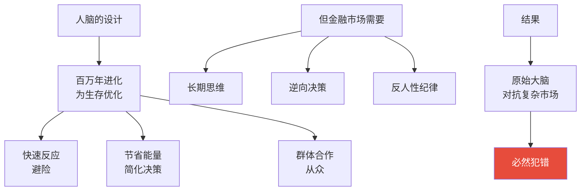
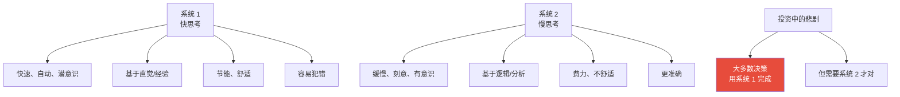
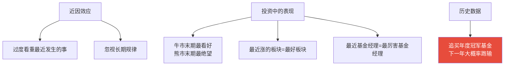
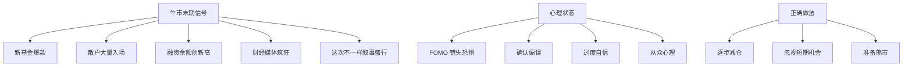
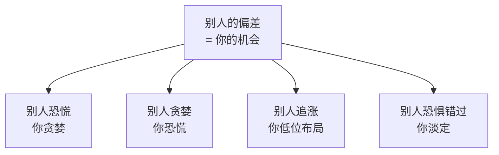
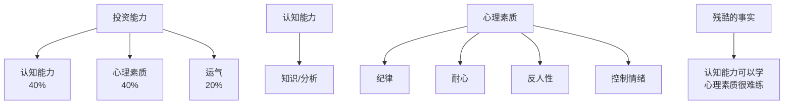

# 01 行为金融学 | Behavioral Finance

`⚫ 精通` `预计阅读：30 分钟`

> 核心问题：为什么聪明人也会犯蠢？为什么明明知道道理，还是做出错误决策？

---

## 一句话总结

**投资最大的敌人不是市场，是自己。理解人性的认知偏差，才能避免被自己的大脑欺骗。**

---

## 为什么"聪明人也会犯傻"？



> 💡 卡尼曼诺贝尔经济学奖的核心贡献：**人类不是理性的，是"有限理性"的**。

---

## 系统 1 vs 系统 2



---

## 投资中常见的认知偏差

### 1. 损失厌恶（Loss Aversion）

```mermaid
graph TB
    A[实验] --> B[赚 100 元的快乐]
    A --> C[亏 100 元的痛苦]
    
    D[结论] --> E[亏的痛苦 ≈ 赚快乐 × 2]
    
    F[投资中的表现] --> G[不愿止损<br/>"反正只是浮亏"]
    F --> H[赚一点就跑<br/>"落袋为安"]
    F --> I[追加亏损仓位<br/>"摊平成本"]
    
    style E fill:#e74c3c,color:#fff
```

**经典实验**（卡尼曼）：
```
情景 A：直接给你 1000 元
情景 B：50% 概率得 2000 元，50% 概率得 0

大多数人选 A（即使期望值相同）。

情景 C：直接亏 1000 元
情景 D：50% 概率亏 2000 元，50% 概率亏 0

大多数人选 D（"赌一把"，避免确定的亏损）。
```

> 💡 这就是为什么散户**赚 5% 就跑，亏 50% 还在扛**。

### 2. 锚定效应（Anchoring）

```mermaid
graph TB
    A[锚定效应] --> B[决策被"参考点"严重影响]
    
    C[投资中的表现] --> D[紧盯"买入价"<br/>等回本就卖]
    C --> E[把当前价看成"贵/便宜"基准<br/>无视基本面变化]
    C --> F[历史最高价当作"目标价"]
    C --> G[整数关口情结<br/>3000 点保卫战]
    
    style D fill:#e74c3c,color:#fff
```

**真实案例**：
```
你在 50 元买入一只股票，跌到 30 元。
正确思考：在 30 元的当下，这只股票值得买吗？
错误思考：等回到 50 元（我的成本）就卖。

但市场不知道你的成本，也不在乎你的成本。
```

### 3. 确认偏误（Confirmation Bias）

```mermaid
graph TB
    A[确认偏误] --> B[只看支持自己观点的信息]
    A --> C[忽视反对自己观点的证据]
    A --> D[把模糊信息<br/>解释为支持自己]
    
    E[投资中的表现] --> F[买了的票<br/>只看好消息]
    E --> G[卖了的票<br/>只看坏消息]
    E --> H[在多/空社区<br/>找"志同道合"的人]
    E --> I[忽视真正的风险信号]
```

**破解方法**：
```
做出投资决策前：
1. 主动寻找"反方观点"
2. 想象"我错了的话，会怎样"
3. 每次都给自己写"做空报告"
4. 找朋友帮你挑刺
```

### 4. 过度自信（Overconfidence）

```mermaid
graph TB
    A[过度自信] --> B[高估自己的判断准确度]
    A --> C[低估市场的不确定性]
    A --> D[低估犯错的概率]
    
    E[研究发现] --> F[90% 的人认为<br/>自己的开车技术高于平均水平]
    E --> G[投资中也类似<br/>大多数人觉得自己能跑赢市场]
    
    H[投资中的表现] --> I[过度交易<br/>越交易越亏]
    H --> J[过度集中<br/>"这只一定行"]
    H --> K[使用杠杆<br/>"我不会爆仓"]
    H --> L[忽视分散]
    
    style I fill:#e74c3c,color:#fff
```

**破解方法**：
```
1. 接受自己会犯错
2. 始终保留"我可能错了"的可能性
3. 对自己的判断打 70% 折扣
4. 用历史业绩检验自己（多数人会失望）
```

### 5. 近因效应（Recency Bias）



### 6. 处置效应（Disposition Effect）

```
处置效应 = 倾向于卖盈利、留亏损

具体表现：
- "落袋为安"：稍微赚点就卖
- "等回本"：亏损死扛

实证研究：
- 散户卖出的股票，后续平均跑赢
  自己留下的股票（即一直在卖好的，留差的）
```

### 7. 从众心理（Herding）

```mermaid
graph TB
    A[从众心理] --> B[别人买什么<br/>我买什么]
    A --> C[财经大 V<br/>怎么说就怎么做]
    A --> D[在社区找"队友"]
    
    E[结果] --> F[在顶部疯狂买入<br/>2007/2015/2021 抱团]
    E --> G[在底部恐慌抛售<br/>2008/2018/2024.1]
    
    H[反向思维] --> I[多数人贪婪时恐惧]
    H --> J[多数人恐惧时贪婪]
    
    style F fill:#e74c3c,color:#fff
    style G fill:#e74c3c,color:#fff
```

### 8. 沉没成本谬误（Sunk Cost Fallacy）

```
"我已经亏 30% 了，再卖就真亏了"
→ 错误！

正确思考：
"这只股票在当前价位，值得我继续持有吗？"
"如果我现在没买，我会买吗？"

如果"不会买"→ 应该卖。
不管你之前亏多少，那是已经发生的，无法改变。
```

### 9. 后视镜偏误（Hindsight Bias）

```mermaid
graph TB
    A[后视镜偏误] --> B["事后觉得'当时就该想到'"]
    A --> C[认为过去的趋势<br/>必然会延续]
    
    D[影响] --> E[盲目相信自己的"判断力"]
    D --> F[低估未来的不确定性]
    
    G[破解] --> H[做决策时及时记录<br/>避免事后美化]
```

### 10. 控制错觉（Illusion of Control）

```
明明是随机事件，
我们却觉得"自己能控制"。

例：
- 觉得自己能"判断"明天涨跌
- 觉得多看盘能"提高"判断准确度
- 觉得频繁交易能"降低"风险（实际相反）

破解：
承认"运气"在投资中的巨大作用
```

### 11. 幸存者偏差（Survivorship Bias）

```mermaid
graph TB
    A[幸存者偏差] --> B[只看到成功者]
    A --> C[忽视大量失败者]
    
    D[投资中的表现] --> E[巴菲特/芒格的成功故事]
    D --> F[但同期还有 1000 个"投资大师"破产]
    D --> G[选股大赛冠军很厉害？<br/>但参加 1000 人，必然有冠军]
    
    H[启示] --> I[别人能赚钱<br/>不代表你能]
    H --> J[要学策略<br/>而不是"成功者"本身]
```

---

## 几种"危险时刻"

### 牛市末期：极度贪婪



### 熊市末期：极度恐慌

```mermaid
graph TB
    A[熊市末期信号] --> B[基金大量赎回]
    A --> C[散户清仓离场]
    A --> D[财经话题"无人问津"]
    A --> E["完蛋了"叙事盛行]
    
    G[心理状态] --> H[损失厌恶]
    G --> I[处置效应]
    G --> J[近因效应]
    G --> K[绝望]
    
    L[正确做法] --> M[逐步加仓]
    L --> N[关注估值]
    L --> O[忽视短期波动]
```

---

## 应对认知偏差的工具

### 1. Pre-Mortem（事前验尸）

```mermaid
graph TB
    A[做出决策前] --> B[假设这个决策<br/>1 年后失败了]
    B --> C[详细描述<br/>"为什么会失败"]
    C --> D[列出 5-10 个原因]
    D --> E[评估这些原因<br/>是否在当下被忽视]
```

### 2. 决策日志

```markdown
日期：YYYY-MM-DD
决策：买入 XX 股票，仓位 5%
为什么：
- 理由 1
- 理由 2
- 理由 3
反方观点：
- 风险 1
- 风险 2
退出条件：
- 价格 < XX 止损
- 基本面恶化
确信度：60%（不是 100%！）
```

### 3. 24 小时规则

```
重大决策（特别是 All in 类）：
1. 写下决策和理由
2. 等 24 小时
3. 重新评估

冲动决策的危险性会在 24 小时后大幅降低
```

### 4. 反向思考

```
做决策前问：
- 如果我相反的判断是对的，会怎样？
- 这个决策的"反方"会怎么说？
- 5 年后回看，我会后悔做这个决策吗？
```

### 5. Checklist

```
固定的检查清单
不依赖"灵感"和"判断力"
强制系统 2 介入

例：
□ 这家公司的核心业务我懂吗？
□ 估值在历史什么分位？
□ 主要风险是什么？
□ 我的退出条件？
□ 这只股票占总资产几个百分点？
```

### 6. 写作

```
强制把想法写下来：
- 把直觉转化为逻辑
- 暴露推理漏洞
- 后续可以复盘
- 减少"自欺欺人"
```

---

## 几个练习

### 练习 1：你属于哪种偏差？

```
回看过去 10 笔交易：

1. 哪些是因为"听消息"买的？（从众）
2. 哪些是"亏了不舍得卖"？（损失厌恶）
3. 哪些是"赚了急忙跑"？（处置效应）
4. 哪些是"觉得自己肯定对"？（过度自信）
5. 哪些是"看到最近涨/跌就跟"？（近因效应）

找出你最容易犯的 1-2 个偏差，重点防范。
```

### 练习 2：反向角色扮演

```
最近你看好的一只股票：
现在用 30 分钟，写一份"做空报告"
列出至少 10 个不该买的理由

如果写不出 10 个 → 你研究不够深入
如果你被自己说服了 → 重新思考
```

### 练习 3：决策日志的 1 年回看

```
回看 1 年前的决策日志：
- 当时的判断有几个对？
- 哪些"确信度高"的判断错了？
- 哪些"很犹豫"的判断对了？
- 你的"判断准确率"是多少？

大多数人发现：
自己的判断准确率远低于自己以为的
```

---

## 大师们怎么应对人性？

### 巴菲特

```
- 不看盘（避免短期波动干扰）
- 极度长期持有
- 每年股东信反思
- 集中但不重仓单一
- "在别人贪婪时恐惧"
```

### 达里奥

```
- 极度透明（要求所有人写下不同意见）
- 算法化决策（减少主观）
- "Pain + Reflection = Progress"
- 失败被视为学习机会
```

### 索罗斯

```
- "如果错了，市场会告诉我"
- 严格止损
- 拒绝"价值认同"
- 把投资和身份分离
```

---

## 行为金融学的"反向应用"



### 经典案例

```
2008.10：
- 全市场恐慌
- 但巴菲特公开喊"Buy American"
- 大量买入 GE/BAC 等
- 之后赚翻天

2024.1：
- A 股 2700 点
- 全民绝望
- 但社保/国家队大量买入
- 之后 9 月反弹
```

---

## 心理素质 = 投资的"硬技能"



---

## 核心概念速查

| 偏差 | 英文 | 一句话解释 |
|------|------|-----------|
| 损失厌恶 | Loss Aversion | 亏的痛苦 > 赚的快乐 |
| 锚定效应 | Anchoring | 被参考点严重影响 |
| 确认偏误 | Confirmation Bias | 只看支持自己的信息 |
| 过度自信 | Overconfidence | 高估自己 |
| 近因效应 | Recency Bias | 过度看重最近 |
| 处置效应 | Disposition Effect | 卖盈留亏 |
| 从众 | Herding | 跟随大众 |
| 沉没成本 | Sunk Cost | 因过去成本影响当下决策 |
| 后视镜偏误 | Hindsight Bias | 事后觉得早知道 |
| 控制错觉 | Illusion of Control | 觉得能控制随机事件 |
| 幸存者偏差 | Survivorship Bias | 只看到成功者 |
| FOMO | Fear of Missing Out | 错失恐惧 |

---

## 推荐阅读

- 《思考，快与慢》— 卡尼曼（必读，行为金融奠基之作）
- 《错误的行为》— 理查德·塞勒
- 《行为投资学手册》— Greg Davies
- 《金融心理学》— Lars Tvede
- 《非理性繁荣》— 罗伯特·席勒

---

## 延伸思考

1. AI 没有情绪，会不会成为"完美投资者"？为什么不会？
2. 集体的认知偏差怎么形成"市场情绪"？
3. 你 5 年前的最大决策错误，背后是哪种偏差？
4. 为什么"知道道理"和"做到"之间有巨大鸿沟？

---

## 下一篇

→ [02 概率与决策](./02-probability-and-decisions.md)：怎么在不确定性中做出好决策？
