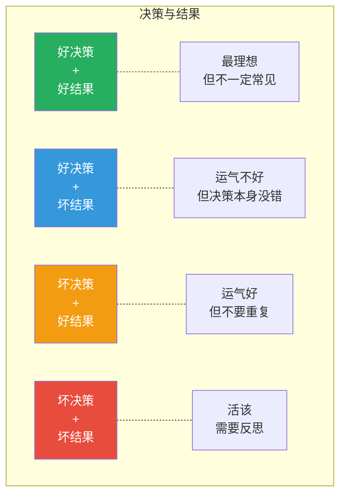
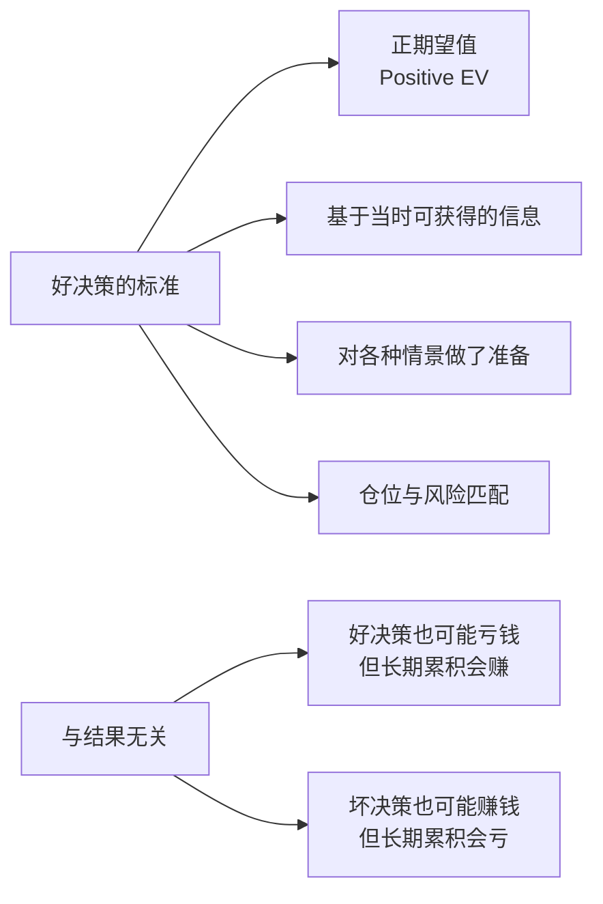
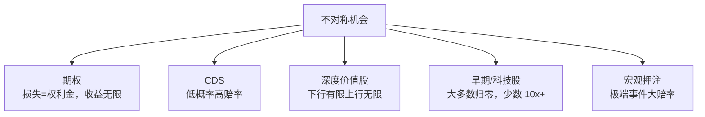
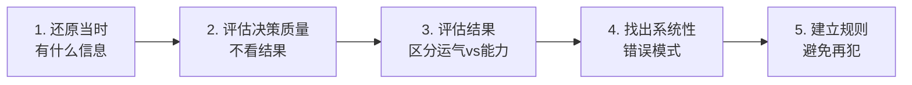

# 02 概率与决策 | Probability & Decision Making

`⚫ 精通` `预计阅读：30 分钟`

> 核心问题：怎么在不确定性中做出好决策？为什么"好决策"有时会带来"坏结果"？

---

## 一句话总结

**好决策 ≠ 好结果。投资是一场概率游戏，目标不是每次都对，而是让"对的时候赚得多 + 错的时候亏得少"。**

---

## 决策与结果：必须分开评估

### 经典 2x2 矩阵



> 💡 **复盘的核心是评估决策本身，不是评估结果**。结果好的决策可能是侥幸，结果差的决策可能是正确的。

### 经典案例

```
决策：买入腾讯（2010 年）
- 公司基本面：极强
- 估值：合理
- 长期前景：广阔
→ 这是一个好决策

但如果你 2021 年初买（高位），亏损 50%
→ 决策没那么好（买入时点不佳），但结果差

如果你 2018 年底买（低位），赚 5 倍
→ 好决策好结果

如果你买茅台没研究就跟风（2007 年）
→ 即使赚钱也是坏决策（运气好）
```

---

## 期望值思维

### 核心公式

```
期望值 = Σ (情景概率 × 情景收益)

例：投资某股票
情景 A：30% 概率涨 100%
情景 B：50% 概率涨 20%
情景 C：20% 概率亏 50%

期望值 = 0.3×100% + 0.5×20% + 0.2×(-50%)
       = 30% + 10% + (-10%)
       = +30%

→ 这是个正期望值的决策，应该买
→ 但要承担"20% 概率亏 50%"的风险
```

### 什么是"好决策"？



---

## 不对称回报：投资的圣杯

```mermaid
graph TB
    A[最理想的投资] --> B[损失有限<br/>收益巨大]
    
    C[例子] --> D[买入虚值期权<br/>赔光保费 vs 涨 10-100 倍]
    C --> E[早期 BTC<br/>亏完仓位 vs 翻 100 倍]
    C --> F[价值股+催化剂<br/>跌 20% vs 涨 200%]
    
    G[公式] --> H[期望值 = 0.1 × 1000% + 0.9 × (-100%)<br/>= 100% + (-90%)<br/>= +10%]
```

### 凯利公式（最优仓位）

```
最优仓位 = (赔率 × 胜率 - 败率) / 赔率
         = (b × p - q) / b

例：
胜率 60%，赢时赚 20%，输时亏 10%
b = 2（赔率），p = 0.6，q = 0.4

f* = (2 × 0.6 - 0.4) / 2 = 0.4

→ 凯利公式建议下注 40%
→ 实战通常用 1/4 凯利 = 10%
```

### 不对称回报的几种来源



---

## 概率思维的几个原则

### 原则 1：用范围思考，不用点估计

```
错误：股价会涨到 100 元
正确：股价 60% 概率在 80-120 元，
      30% 概率在 50-80 元，
      10% 概率 < 50 元
```

### 原则 2：考虑"基础概率"

```mermaid
graph TB
    A[基础概率思维] --> B[不要只看眼前的特殊性]
    A --> C[要参考类似情况的历史平均]
    
    D[例子] --> E[这次创业公司"不一样"？<br/>但 90% 创业公司失败<br/>你的公司大概率也会]
    
    D --> F[这次牛市"不一样"？<br/>但所有牛市都会结束<br/>你的牛市大概率也会]
```

### 原则 3：贝叶斯更新

```
随着新信息出现，不断更新自己的判断概率

例：
初始判断：A 公司财报会超预期，概率 60%
新信息：竞争对手财报很差
更新判断：A 公司财报超预期概率 → 70%

新信息：行业景气度下滑数据
更新判断：A 公司财报超预期概率 → 50%

→ 像科学家一样，根据证据更新观点
→ 不是固守原来的判断
```

### 原则 4：警惕"低概率高影响"事件

```
黑天鹅事件：
- 单次发生概率：< 1%
- 但发生时影响：致命

例：
- 2008 年雷曼倒闭
- 2020 年新冠
- 2022 年俄乌战争

→ 不能只看"期望值"
→ 还要看"最坏情况"是否能承受
```

---

## 决策的"质量"评估

### 高质量决策的标志

```mermaid
graph TB
    A[高质量决策] --> B[1. 信息充分<br/>不是拍脑袋]
    A --> C[2. 多角度考虑<br/>正反两方都看]
    A --> D[3. 量化思考<br/>给出概率/期望值]
    A --> E[4. 风险控制<br/>"错了怎么办"]
    A --> F[5. 仓位合理<br/>不 All in]
    A --> G[6. 退出标准明确]
    A --> H[7. 写下来<br/>避免事后美化]
```

### 低质量决策的特征

```mermaid
graph TB
    A[低质量决策] --> B[1. 听消息<br/>"XX 老师说"]
    A --> C[2. 情绪驱动<br/>FOMO/恐慌]
    A --> D[3. 单一视角<br/>只看好消息]
    A --> E[4. 没有量化<br/>"应该会涨"]
    A --> F[5. 仓位过重]
    A --> G[6. 没有止损]
    A --> H[7. "回头再看"]
```

---

## 复盘：从决策到学习

### 复盘的"3 层 + 1 类"

```mermaid
graph TB
    A[复盘三层] --> B[层 1：决策本身<br/>当时信息+逻辑是否合理]
    A --> C[层 2：执行过程<br/>有没有按计划]
    A --> D[层 3：心理状态<br/>有没有情绪干扰]
    
    E[特殊类] --> F[最重要的：<br/>"该做没做"<br/>= 错过的机会]
```

### 复盘的常见错误

```mermaid
graph TB
    A[错误的复盘] --> B[结果导向<br/>"赚了就是好决策"]
    A --> C[后视镜偏误<br/>"我早就觉得"]
    A --> D[只看胜利<br/>忽略错过]
    A --> E[过度自责<br/>认知瘫痪]
    A --> F[流于表面<br/>没找到根因]
```

### 正确的复盘步骤



---

## 投资是"重复的概率游戏"

### 为什么"概率"在长期才显现？

```
单次决策：胜率 60%，可能输
10 次决策：胜率 60%，预期赢 6 次（变异较大）
100 次决策：胜率 60%，预期赢 60 次（接近真实分布）
1000 次决策：几乎确定接近 60%

→ 投资是一场长期游戏
→ 短期可能反常，长期会回归概率
→ 如果你的"系统"是正期望值，长期一定赢
```

### 巴菲特的"球场"比喻

```
"投资就像棒球，
但有一个区别：
你可以一直等"球"，
等到一个完美的球再挥棒。

你不需要每个球都打"
```

→ **不要为了"做点什么"而做决策。**
→ **只在高确定性、高期望值时下重注。**

---

## 期望值思维的实战应用

### 案例 1：评估一只股票

```
A 公司当前股价：100 元
未来 12 个月情景：

情景    概率    股价    回报
好     30%    150    +50%
中     50%    110    +10%
坏     20%    70     -30%

期望回报 = 0.3×50% + 0.5×10% + 0.2×(-30%)
        = 15% + 5% + (-6%)
        = +14%

风险（最坏情况）：-30%

→ 期望值正，可买
→ 但仓位要考虑 -30% 的承受度
```

### 案例 2：是否做空？

```
当前判断：B 公司有大问题，可能腰斩
但市场可能继续疯狂上涨

情景    概率    回报
腰斩    40%    +50%
震荡    30%    +5%
继续涨  30%    -50%

期望值 = 0.4×50% + 0.3×5% + 0.3×(-50%)
      = 20% + 1.5% + (-15%)
      = +6.5%

期望值正，但：
- 时机错可能直接爆仓（如果用杠杆）
- 短期下跌后可能反弹
- 心理承受难度高

→ 期望值正不一定该做
→ 还要看你能否执行+承受
```

### 案例 3：仓位大小的决策

```
信号：政策大转向 + 估值极低 + 极度悲观
判断：未来 6 个月有 70% 概率涨 30%
反方：30% 概率没涨甚至跌 15%

期望值 = 0.7×30% + 0.3×(-15%)
      = 21% + (-4.5%)
      = +16.5%

凯利公式：
f* = (b×p - q)/b = (2×0.7 - 0.3)/2 = 55%

但实战：
- 用 1/4 凯利 = 14%
- 考虑流动性、心理承受度
- 最终可能用 10-15%

→ 即使期望值很高
→ 仓位也要保留犯错空间
```

---

## 长期 vs 短期

### 短期：噪音 > 信号

```
短期股价 = 90% 噪音 + 10% 信号
- 短期就像抛硬币
- 准确率几乎不可能高
- 重仓短期 = 赌博
```

### 长期：信号 > 噪音

```
长期股价 = 10% 噪音 + 90% 信号
- 长期反映基本面
- 准确率可以提升
- 重仓长期 = 投资
```

> 💡 这就是为什么"长期投资"通常胜率更高——**噪音被时间平滑掉了**。

---

## 决策心法

### 巴菲特的"内圈"

```
画两个圈：
- 圈内：你真正懂的领域
- 圈外：你不懂的领域

只在圈内做决策。
不要 FOMO，不要追时髦。

巴菲特错过了：
- 互联网早期（不懂）
- 早期亚马逊（不懂）
- BTC（不信）

但他从不为此后悔。
"我不需要赚到所有钱，只需要赚我能理解的钱。"
```

### 芒格的"不打的球"

```
真正决定一生财富的，
不是你"打中"了哪些球，
而是你"没打"哪些球。

→ 大多数交易是浪费
→ 大多数机会是噪音
→ 真正的好球，一年也就几次
```

### 索罗斯的"承认错误"

```
"重要的不是你对还是错，
而是你对的时候赚了多少，
错的时候亏了多少。"

→ 错了立刻止损（小亏）
→ 对了让利润奔跑（大赚）
→ 不对称回报的精髓
```

---

## 概率思维的训练

### 练习 1：每周做"预测"

```
每周写下：
- 下周美联储会鹰还是鸽？概率多少？
- 下周 A 股会涨还是跌？概率多少？
- 下周 BTC 会突破 X 还是 Y？概率多少？

记录在表格里。

3 个月后看：
- 你的"自信度"和"准确度"匹配吗？
- 你说"80% 确定"的事，有多少真的对？

大多数人发现：
- 自信度永远高于准确度
- 这就是过度自信
```

### 练习 2：贝叶斯更新

```
某只股票的判断：
- 初始：会涨，概率 60%

新信息 1：财报超预期
更新到：80%

新信息 2：行业政策利好
更新到：85%

新信息 3：大股东减持
更新到：65%

→ 不要固守初始判断
→ 让证据改变你的概率
```

### 练习 3：写"反方报告"

```
每次重要决策前：
花 30 分钟写"为什么这是错的"
列出至少 10 个反对理由

如果你被自己说服了 → 重新考虑
如果你能反驳所有反方 → 决策可能更稳
```

---

## "不对称信息"vs"内幕"

```
合法的信息优势：
- 更多/更深入的研究
- 独立思考
- 长期跟踪
- 多角度对比

非法的"内幕"：
- 上市公司未公开信息
- 高管/董事的预先知情
- 重大事件的事先知情
（千万不要碰）

合法信息优势 + 概率思维 = 长期赚钱的核心
```

---

## 核心概念速查

| 术语 | 英文 | 一句话解释 |
|------|------|-----------|
| 期望值 | Expected Value (EV) | 概率加权的平均回报 |
| 凯利公式 | Kelly Criterion | 最优仓位 |
| 不对称回报 | Asymmetric Payoff | 损失有限，收益巨大 |
| 贝叶斯更新 | Bayesian Update | 根据新证据更新概率 |
| 基础概率 | Base Rate | 类似情况的历史平均 |
| 黑天鹅 | Black Swan | 低概率高影响事件 |
| 决策质量 | Decision Quality | 决策本身好坏（不看结果） |
| 后视镜偏误 | Hindsight Bias | 事后觉得早知道 |

---

## 推荐阅读

- 《决断》— Annie Duke（前世界扑克冠军写的决策书）
- 《思考，快与慢》— 卡尼曼
- 《超预测》— Philip Tetlock
- 《信号与噪声》— Nate Silver
- 《随机漫步的傻瓜》— 塔勒布
- 《魔鬼数学》— Jordan Ellenberg

---

## 延伸思考

1. 为什么扑克高手在投资界往往做得很好？
2. AI 没有情绪，决策质量会更高吗？为什么不一定？
3. 你过去 1 年最重要的 5 个决策，哪些是好决策？哪些是坏决策？
4. 如果你只能用 5 个原则做投资，你会选哪 5 个？

---

## 下一篇

→ [03 全球宏观策略](./03-global-macro.md)：桥水/索罗斯/德鲁肯米勒怎么思考？
