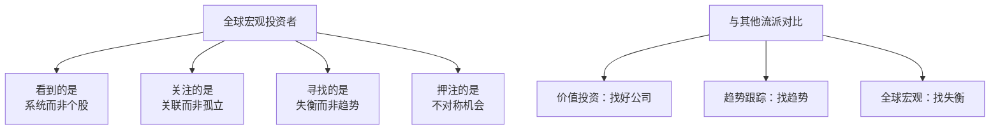
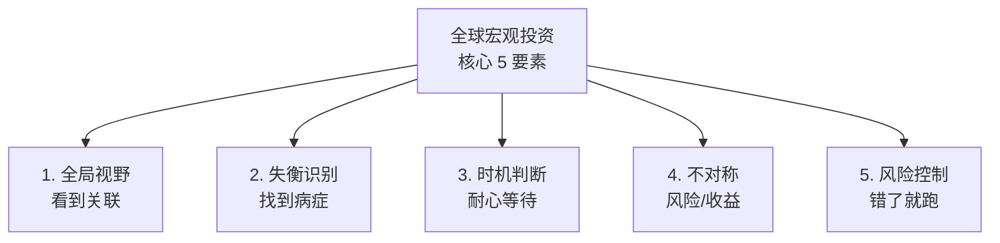
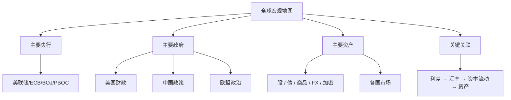
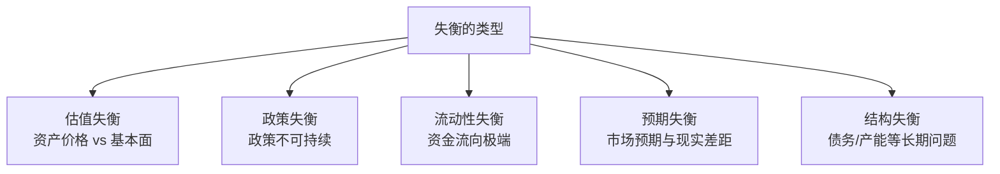
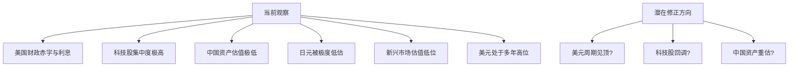
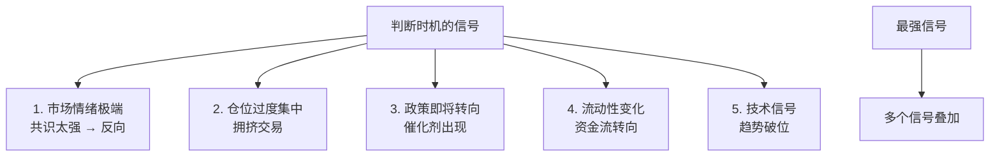
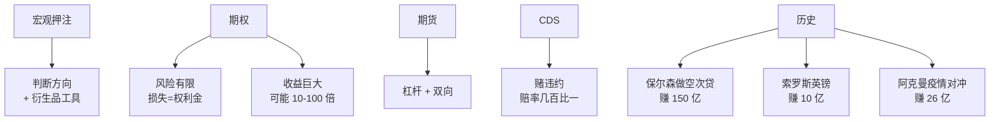
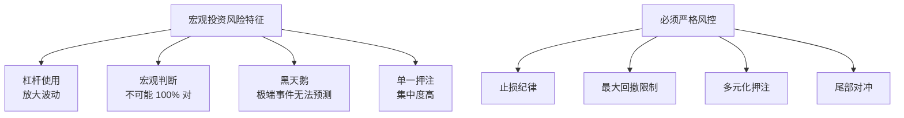
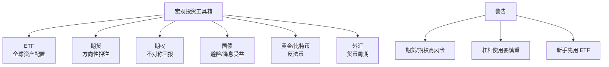

# 03 全球宏观策略 | Global Macro Strategy

`⚫ 精通` `预计阅读：30 分钟`

> 核心问题：桥水/索罗斯/德鲁肯米勒怎么思考？怎么进行真正的"全球宏观"投资？

---

## 一句话总结

**全球宏观 = 把世界看作一个相互连接的系统，找到失衡，押注修正。这是投资的"最高难度模式"，也是少数能跨越周期的策略。**

---

## 全球宏观的"思维方式"



> 💡 全球宏观投资者像个"系统医生"——诊断全球经济的"病症"，预测"治疗反应"。

---

## 全球宏观大师的方法论

### 1. 桥水 / 达里奥：经济机器

```mermaid
graph TB
    A[达里奥的方法论] --> B[把经济看成<br/>一台"机器"]
    B --> C[输入：政策/事件]
    B --> D[输出：增长/通胀/资产价格]
    
    E[核心框架] --> F[短期债务周期<br/>5-8 年]
    E --> G[长期债务周期<br/>50-75 年]
    E --> H[生产力增长<br/>背景趋势]
    
    I[操作] --> J[数据驱动]
    I --> K[原则化决策]
    I --> L[全天候配置]
```

> 📖 推荐：达里奥的《Principles》、《Big Debt Crises》、《Changing World Order》

### 2. 索罗斯：反身性

```mermaid
graph TB
    A[反身性 Reflexivity] --> B[市场不仅反映现实<br/>也塑造现实]
    
    C[传统观点] --> D[基本面 → 价格]
    
    E[索罗斯观点] --> F[基本面 ↔ 价格<br/>互相影响]
    
    G[实战例子] --> H[1992 英镑危机]
    G --> I[1997 亚洲金融危机]
    G --> J[2008 次贷危机]
    
    K[启示] --> L[寻找"自我强化"的趋势]
    K --> M[在趋势末期反向押注]
```

#### 反身性的经典案例

```
1992 年英国脱离 ERM：
- 英镑被高估 → 政府/央行尽力维持
- 维持成本越来越高 → 投机者发现弱点
- 索罗斯重仓做空 → 央行更加被动
- 央行被迫放弃 → 英镑暴跌
- 索罗斯净赚 10 亿美元

→ 这就是"反身性"：
  价格压力本身改变了基本面（央行被迫放弃）
```

### 3. 德鲁肯米勒：找"大象"

```mermaid
graph TB
    A[德鲁肯米勒方法论] --> B[寻找大趋势<br/>"大象"]
    A --> C[在趋势确认时重仓]
    A --> D[严格止损]
    A --> E[抓住几次大机会<br/>胜过一辈子小赚]
    
    F[业绩] --> G[30 年从未亏损<br/>年化 30%+]
```

> 💡 德鲁肯米勒名言："你需要保护好你的资金，等待真正的机会。当机会来临时，全力出击。"

### 4. 斯坦利·米勒：风险定价

```
"我做空英镑，索罗斯说：
'你说你 100% 确定，但你只压了 1 倍杠杆？
为什么不是 5 倍？'"

→ 真正的高确定性机会，应该用足杠杆
→ 但前提是：判断真的对+止损严格
```

---

## 全球宏观的核心要素



---

## Element 1：全局视野

### 关注的"全球地图"



### 信息源（必备）

```
每天看：
- 全球主要市场（亚洲/欧洲/美洲开盘）
- 美元指数 / 主要货币对
- 10Y 美债收益率 / 主要国家利率
- 油价 / 黄金 / 铜（经济温度计）
- BTC（流动性指标）

每周看：
- 央行讲话日历
- 经济数据日历（NFP/CPI/PMI）
- 国际清算银行（BIS）报告

每月看：
- IMF 报告
- 桥水 Daily Observations（公开部分）
- 顶级宏观研究（Lyn Alden / Pozsar / Macro Compass）
```

---

## Element 2：识别失衡

### 什么是"失衡"？



### 历史上的"失衡"案例

| 时期 | 失衡 | 修正方式 | 投资机会 |
|------|------|----------|----------|
| 1992 | 英镑被高估，ERM 不可持续 | 英国脱离 ERM | 做空英镑 |
| 1997 | 亚洲固定汇率 + 大量短期外债 | 货币崩盘 | 做空泰铢/韩元 |
| 2007 | 美国次贷过度泡沫 | 信用崩溃 | 做空 CDO/CDS |
| 2014 | 强美元 + 油价过低 | 油价崩盘 | 做空原油 |
| 2021 | 极度宽松 + 通胀苗头 | 加息周期 | 做空长债 |
| 2024 | 中美利差倒挂极致 | 美联储降息 | 做多人民币/中国资产 |

### 当前可能的失衡（2025）



> ⚠️ 这些是**可能的失衡**，不是确定的判断。投资决策需要更深入分析。

---

## Element 3：时机判断

### "对的判断 + 错的时机 = 亏钱"

```
凯恩斯名言：
"市场可以保持非理性比你撑得久还久。"

例子：
- 2007 年 1 月看空次贷 → 错（早 1 年）
- 1996 年看空互联网 → 错（晚 4 年）
- 2020 年看空美元 → 错（晚 4 年）

→ 时机比判断更难
→ 需要触发因素 + 风险控制
```

### 时机的"信号"



### 实战：怎么"等"？

```
德鲁肯米勒方法：
1. 识别失衡
2. 不立刻下注
3. 等"催化剂"出现（如政策转向）
4. 在右侧确认时建仓
5. 接受错过最低点（拿不准的钱不要赚）
```

---

## Element 4：不对称回报

### 为什么宏观投资能赚大钱？



### 不对称的两种来源

```
来源 1：极端事件
- 大多数时候不发生（小亏权利金）
- 一旦发生赔率巨大（10-100 倍）

来源 2：高确定性失衡
- 时机选对 + 杠杆
- 风险/回报比 1:5+
- 成功率虽然不高，但回报巨大
```

---

## Element 5：风险控制

### 全球宏观的风险特征



### 索罗斯的止损

```
"如果错了，我要立刻知道——
市场会告诉我。
我不会和市场争论。"

→ 价格一旦显示判断错了，立刻止损
→ 不死扛
→ 这是宏观投资者活下来的关键
```

---

## 几个真实的"宏观押注"

### 案例 1：2008 保尔森做空次贷

```
研究：
- 次贷违约率不可持续
- CDO 评级虚高
- CDS 价格便宜（市场不认为会违约）

操作：
- 大量买入 CDS（"保险"）
- 等待违约浪潮

时机：
- 2007 早期开始建仓
- 2008 全面爆发

结果：
- 基金回报 590%
- 保尔森个人赚 40 亿
- 《大空头》原型
```

### 案例 2：阿克曼 2020 疫情对冲

```
研究：
- 2020.2 看到疫情可能全球扩散
- 信用利差极低（市场不担心）
- 风险对冲极便宜

操作：
- 用 2700 万美元买 CDX 投资级 + 高收益指数 CDS

时机：
- 2 月底建仓
- 3 月美股熔断

结果：
- 这笔对冲赚 26 亿美元
- 同时用赚的钱抄底股票
- 成为对冲基金传奇
```

### 案例 3：达里奥 2008-2010"美丽去杠杆"

```
研究：
- 2008 年判断这是长期债务周期顶部
- 央行必须 QE
- 通缩 + 名义增长 → 长债 + 黄金受益

操作：
- 重仓美债
- 重仓黄金
- 做多对抗通胀的资产

结果：
- 桥水成为全球最大对冲基金
- 但 2010 年代美元强势，部分判断错
- 总体表现仍然优秀
```

---

## 普通投资者怎么"借鉴"宏观思维？

### 1. 不一定要做对冲

```
你不需要做空 CDS 或买虚值期权。
你可以：
- 调整仓位（看空就减仓）
- 配置黄金（对冲法币贬值）
- 持有现金（等待机会）
- 多元化国别（对冲单一国家风险）
```

### 2. 关注"全球大势"

```
不要只看 A 股或美股。
关注：
- 全球流动性（美联储/全球央行）
- 全球经济（中美欧周期）
- 关键资产（美元/黄金/油）
- 重大政治（选举/地缘）
```

### 3. 找几个"长期主题"

```
现在的几个长期主题：
- AI 革命
- 去美元化
- 新能源转型
- 中美博弈
- 全球老龄化

→ 配置受益于这些主题的资产
→ 长期持有
```

### 4. 接受不确定性

```
宏观判断 60% 准确率已经很厉害了。
不要追求 100% 正确。

承认错误 + 严格止损 + 反复学习
比"永远正确"重要得多。
```

---

## 全球宏观的"心法"

### 1. 看远不看近

```
短期市场是噪音。
长期是基本面。
全球宏观看的是 1-3 年甚至更长的趋势。
```

### 2. 看多不看少

```
信息源越多越好（但要筛选）。
观点越多元越好。
立场不要僵化。
```

### 3. 接受错误

```
你不可能每次都对。
重点是错的时候亏小钱，对的时候赚大钱。
```

### 4. 永远谦逊

```
世界比你想象的复杂。
"专家"经常错。
保持好奇心，永远学习。
```

---

## 全球宏观的"工具箱"

### 必备工具



---

## 学习资源

### 必读

- 《Principles》— Ray Dalio
- 《How the Economic Machine Works》— Dalio (B站视频)
- 《Inside the House of Money》— Steven Drobny
- 《Soros on Soros》— George Soros
- 《对冲基金风云录》— Barton Biggs
- 《大空头》— Michael Lewis

### 跟踪

- 桥水 Daily Observations（公开部分）
- Howard Marks Memos
- Lyn Alden Investment Strategy
- @MacroAlf Twitter / Substack
- Macro Voices Podcast

---

## 核心概念速查

| 术语 | 英文 | 一句话解释 |
|------|------|-----------|
| 全球宏观 | Global Macro | 全球资产宏观押注 |
| 反身性 | Reflexivity | 价格塑造基本面 |
| 失衡 | Imbalance | 不可持续的状态 |
| 不对称 | Asymmetric | 损失有限收益巨大 |
| 尾部对冲 | Tail Hedge | 极端事件保险 |
| Carry Trade | — | 套息交易 |
| 风险平价 | Risk Parity | 各资产风险贡献相同 |

---

## 延伸思考

1. 你最近最看好/看空的全球宏观判断是什么？根据是什么？
2. 如果你只有 1 笔重仓机会，你会押什么？
3. 全球宏观对冲基金为什么近年表现普遍下降？
4. AI 会不会"消灭"宏观投资？

---

## 下一篇

→ 04 风险管理进阶（待建）：尾部风险、黑天鹅、反脆弱
