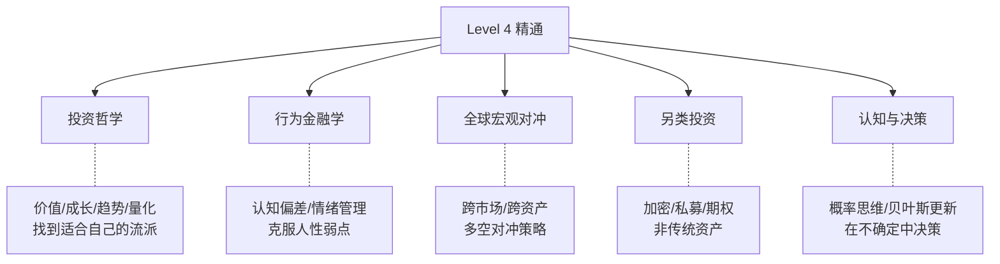

# ⚫ Level 4: 体系精通

> 目标：构建完整的投资哲学和交易体系，持续迭代进化，在不确定性中做出高质量决策。

## 前置要求

完成 [Level 3: 独立分析](../level-3-advanced/) 全部内容，并有至少 1 年的实战经验。

## 学习方向

## 课程列表

| # | 主题 | 核心问题 |
|---|------|----------|
| 01 | 投资哲学与流派 | 你信什么？你的"第一性原理"是什么？ |
| 02 | 行为金融学 | 为什么聪明人也会犯蠢？ |
| 03 | 概率与决策 | 怎么在不确定性中做出好决策？ |
| 04 | 全球宏观策略 | 桥水/索罗斯/德鲁肯米勒怎么做？ |
| 05 | 期权与衍生品 | 怎么用非线性工具表达观点？ |
| 06 | 量化思维 | 怎么用数据验证直觉？ |
| 07 | 风险管理进阶 | 尾部风险/黑天鹅/反脆弱 |
| 08 | 持续进化 | 怎么建立反馈循环，越来越好？ |

## 这个阶段的核心

Level 4 不再是"学知识"，而是：

1. **形成自己的投资哲学** — 你相信什么？不相信什么？
2. **建立决策系统** — 不靠灵感，靠流程
3. **管理情绪和认知** — 最大的敌人是自己
4. **持续复盘迭代** — 每一次决策都是学习机会
5. **接受不确定性** — 没有人能预测未来，但可以做好准备

## 推荐阅读

- 《思考，快与慢》— 卡尼曼
- 《反脆弱》— 塔勒布
- 《穷查理宝典》— 芒格
- 《原则》— 达里奥
- 《金融炼金术》— 索罗斯
- 《对冲基金风云录》— 巴顿·比格斯
- 《随机漫步的傻瓜》— 塔勒布

## 永远记住

> "投资是一个不断犯错、不断修正的过程。目标不是不犯错，而是让正确的决策带来的收益远大于错误的损失。"

> "市场永远比你聪明。保持谦逊，保持好奇，保持学习。"
