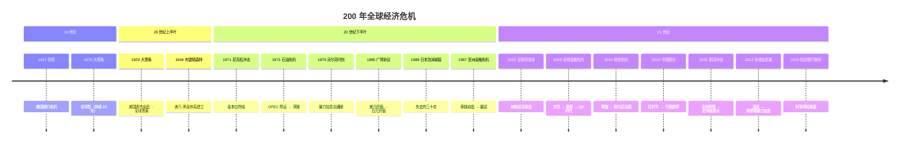
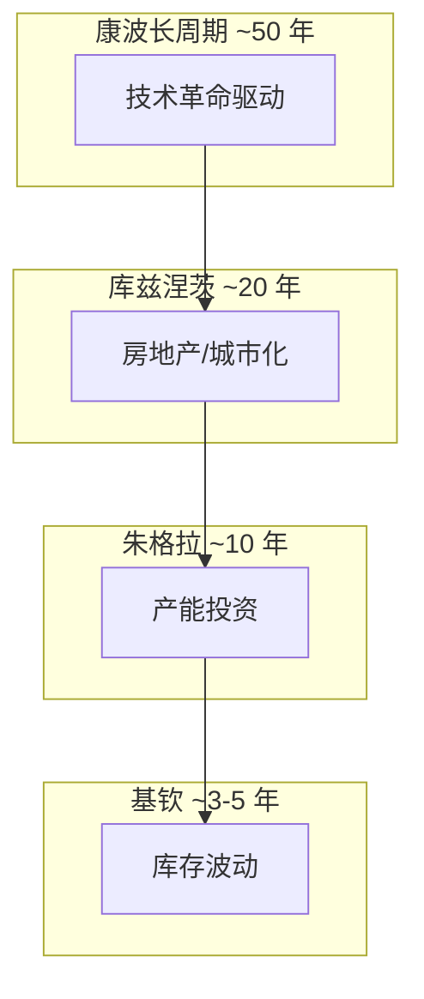

# 📜 经济史 | Economic History

> 核心目标：以史为鉴。所有的"这次不一样"，最终都证明历史在重复。

---

## 为什么要学经济史？

> "那些不记得过去的人，注定要重蹈覆辙。" —— 桑塔亚纳

---

## 模块导航

| 目录 | 内容 |
|------|------|
| [crises/](./crises/) | 历次重大经济危机复盘 |
| [china/](./china/) | 中国经济发展史 |
| [us/](./us/) | 美国经济与美元体系演变 |
| [global-cycles/](./global-cycles/) | 全球经济长周期理论 |

---

## 重大危机时间线

---

## 经济周期理论

| 周期 | 英文 | 长度 | 驱动力 |
|------|------|------|--------|
| 基钦周期 | Kitchin Cycle | 3-5 年 | 库存变动 |
| 朱格拉周期 | Juglar Cycle | 7-11 年 | 设备投资 |
| 库兹涅茨周期 | Kuznets Cycle | 15-25 年 | 房地产/建筑 |
| 康德拉季耶夫周期 | Kondratieff Wave | 40-60 年 | 技术革命 |

> 💡 周期理论不是精确预测工具，而是帮你理解"我们大概在哪个阶段"。

---

## 学习建议

1. **先读危机**。危机是最好的老师，每次危机都暴露了系统的弱点。
2. **找共性**。所有泡沫都有相似的形成和破裂模式。
3. **关注政策应对**。危机本身不可怕，可怕的是错误的应对。
4. **连接当下**。学完 2008 年，想想当前中国的房地产问题有什么相似和不同。
