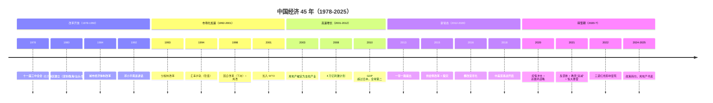
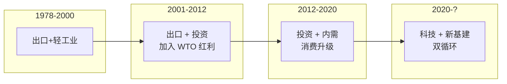

# 🇨🇳 中国经济史

> 理解今天的中国经济，必须从 1978 年改革开放开始看起。

---

## 关键时间线

---

## 关键专题文件

| 主题 | 文件 |
|------|------|
| 改革开放 40 年 | [reform-opening.md](./reform-opening.md) |
| 1998 国企改革与房改 | [1998-reforms.md](./1998-reforms.md) |
| 加入 WTO 的影响 | [wto-accession.md](./wto-accession.md) |
| 4 万亿刺激计划 | [2008-stimulus.md](./2008-stimulus.md) |
| 棚改货币化 | [shantytown-monetization.md](./shantytown-monetization.md) |
| 房地产周期 | [real-estate-cycle.md](./real-estate-cycle.md) |
| 中美贸易战 | [us-china-trade-war.md](./us-china-trade-war.md) |

---

## 中国经济发展的"三驾马车"演变

---

## 几个核心问题

1. **中国为什么能在 40 年内从极贫到世界第二？**
   - 制度红利（市场化改革）
   - 人口红利（劳动力供给）
   - 全球化红利（加入 WTO）
   - 城市化红利（土地财政）
   - 后发优势（学习+追赶）

2. **当前面临的转型挑战是什么？**
   - 人口红利消失（2022 年人口负增长）
   - 全球化红利消失（去全球化）
   - 城市化红利消失（已 65%+）
   - 房地产红利消失（出清周期）

3. **未来的增长来源在哪里？**
   - 高端制造（新能源/半导体/AI）
   - 内需消费（仍在培育）
   - 服务业升级
   - 海外市场（一带一路）

---

## 推荐阅读

- 《中国经济周期与策略》 — 任泽平
- 《这就是中国》 — 张维为（视角）
- 《邓小平时代》 — 傅高义
- 《Capital Mind》 — 关于中国资本市场的研究
