# 1929 大萧条 | The Great Depression

`🔴 高级` `预计阅读：25 分钟`

> 核心问题：1929 年股市崩盘怎么变成了 10 年大萧条？现在还有可能再来一次吗？

---

## 一句话总结

**大萧条不是因为股市崩盘，而是因为崩盘后政策极度错误。它定义了现代央行的所有"应该做什么"和"不应该做什么"。**

---

## 时间线

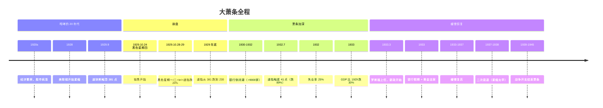

---

## 咆哮的 20 年代：泡沫的形成

### 经济繁荣

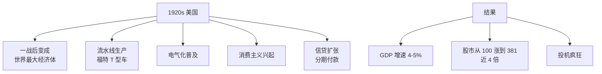

### 投机的疯狂

```
- 信用保证金交易：10% 首付即可买股票（10 倍杠杆）
- 投资信托基金大量发行
- 各阶层都在炒股（鞋童给老板"建议"）
- "新时代论"：经济周期已经被消灭
- 经济学家费雪（1929.10.16）：
  "股价已达到永久性高位"
```

### 1928-1929：美联储的紧缩

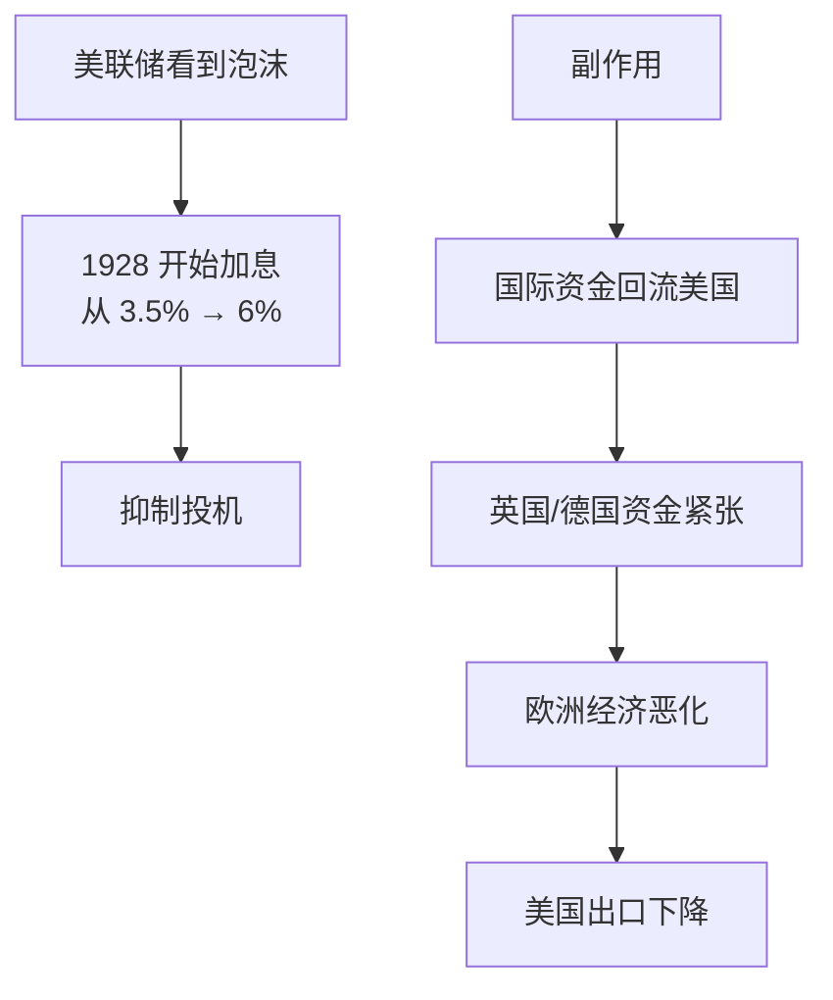

---

## 崩盘：1929.10

### 那个黑色的周

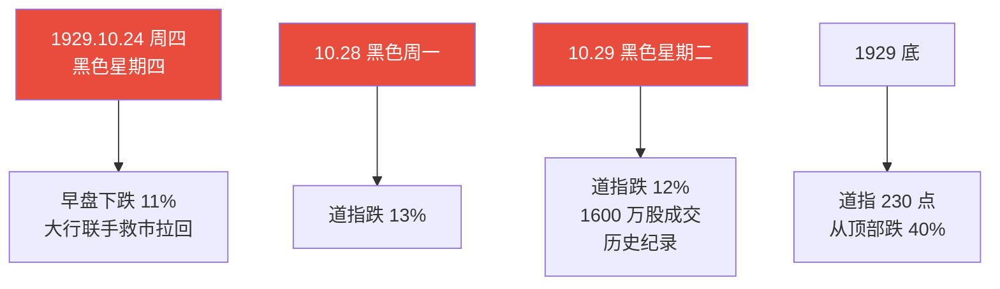

### 但崩盘只是开始

```
1929.10：道指从 381 → 230（跌 40%）
1932.7：道指触底 41（从顶部跌 89%）

→ 真正的灾难发生在崩盘之后的 3 年
→ 这就是政策错误的代价
```

---

## 萧条加深：1930-1932

### 失业率飙升

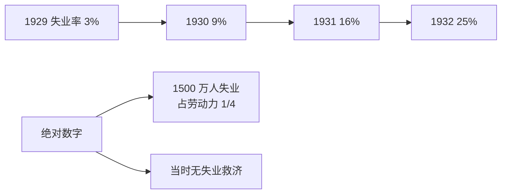

### 银行体系崩溃

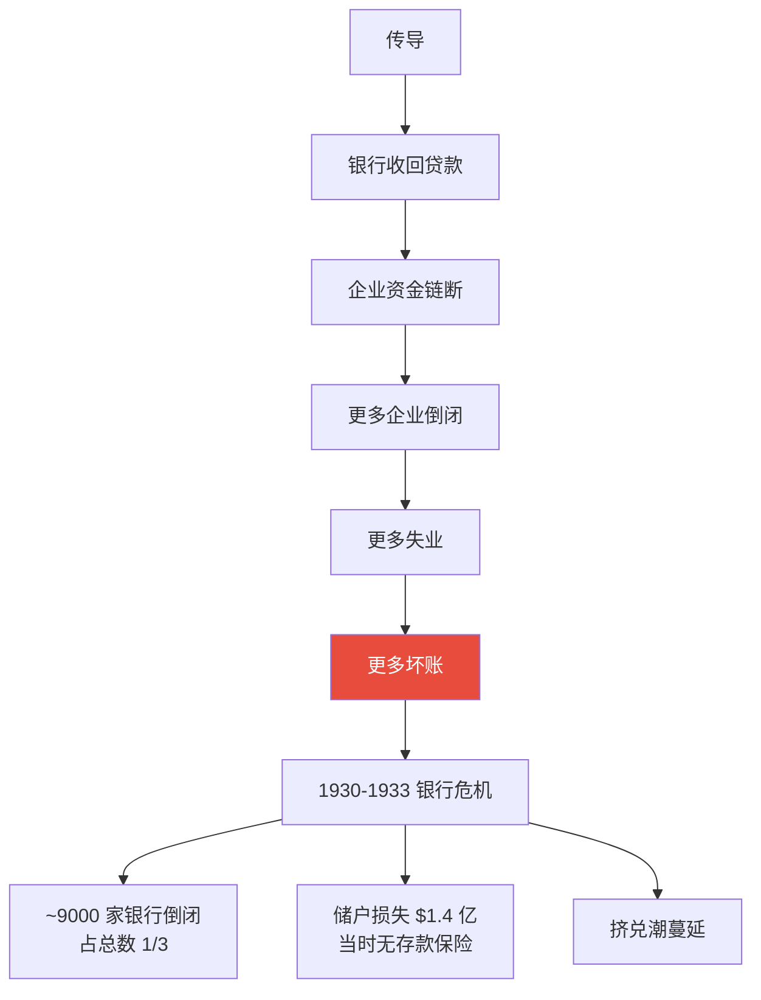

### 通缩螺旋

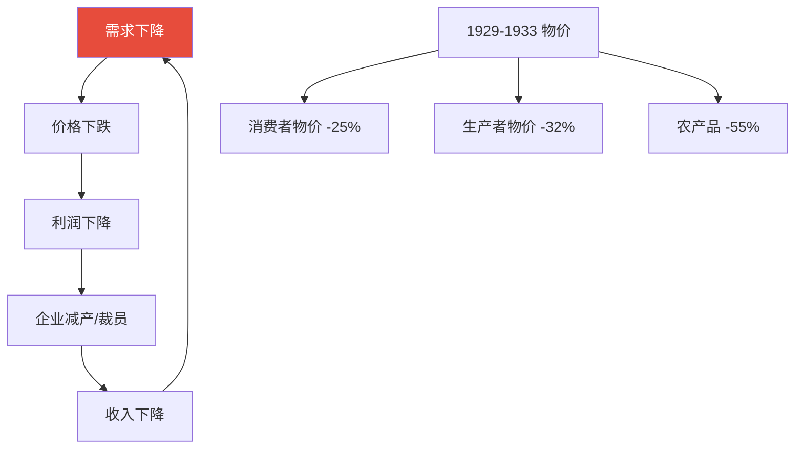

---

## 大萧条 vs 普通衰退的差异

| 维度 | 普通衰退 | 大萧条 |
|------|----------|--------|
| 持续 | 1-2 年 | 10+ 年 |
| GDP 跌幅 | 1-3% | -30% |
| 失业率 | 6-9% | 25% |
| 通缩 | 不严重 | 深度通缩 |
| 银行 | 部分困难 | 大规模倒闭 |

---

## 政策错误：为什么变成大萧条？

### 错误 1：美联储紧缩

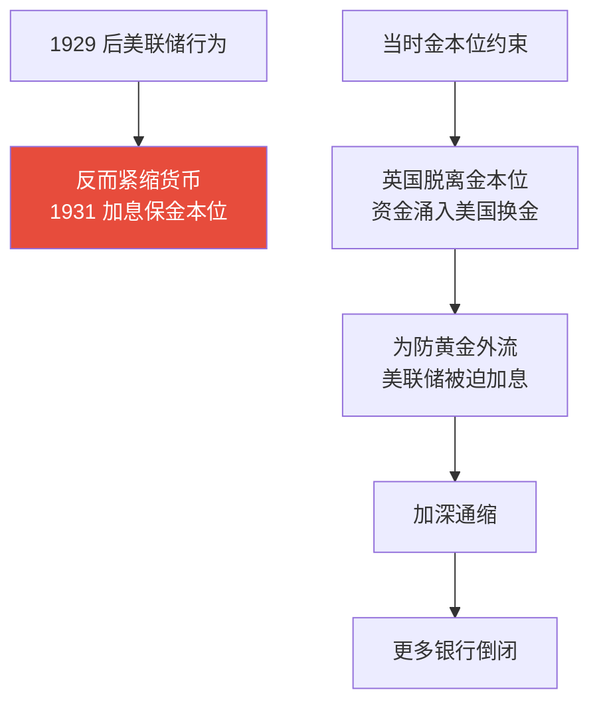

弗里德曼后来论证：**大萧条本质是美联储造成的货币崩溃**。如果当时大胆放水，萧条不会这么严重。

### 错误 2：财政紧缩（胡佛政府）

```
1932 年胡佛：
- 平衡预算（紧缩支出）
- 加税
- 不愿大规模救济

→ 完全相反的方向
→ 加深萧条
```

### 错误 3：贸易保护

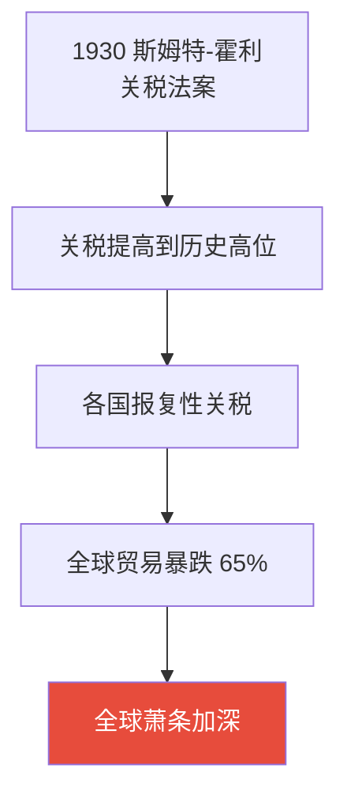

> 💡 这就是为什么经济学家普遍反对贸易保护——大萧条期间各国"以邻为壑"，结果一起完蛋。

### 错误 4：金本位束缚

```
当时所有主要国家都在金本位下，
央行不能"印钱"救助。

最先脱离金本位的国家：
- 英国 1931（最早）
- 美国 1933
- 法国 1936（最晚）

→ 离开金本位的时间，几乎完全决定了
  各国走出萧条的速度
```

---

## 罗斯福新政：救赎的开始

### 关键举措

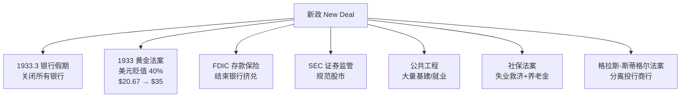

### 关键转折：脱离金本位


### 1937 二次衰退：另一个教训

```
1937 年新政进展顺利，罗斯福政府决定：
- 平衡预算
- 美联储提高准备金率
- 太早紧缩

结果：1937-1938 经济再次衰退。

教训：恢复早期就紧缩 = 灾难性错误
现代版本：2010 年欧洲过早紧缩 → 欧债危机
```

---

## 真正结束萧条的：二战

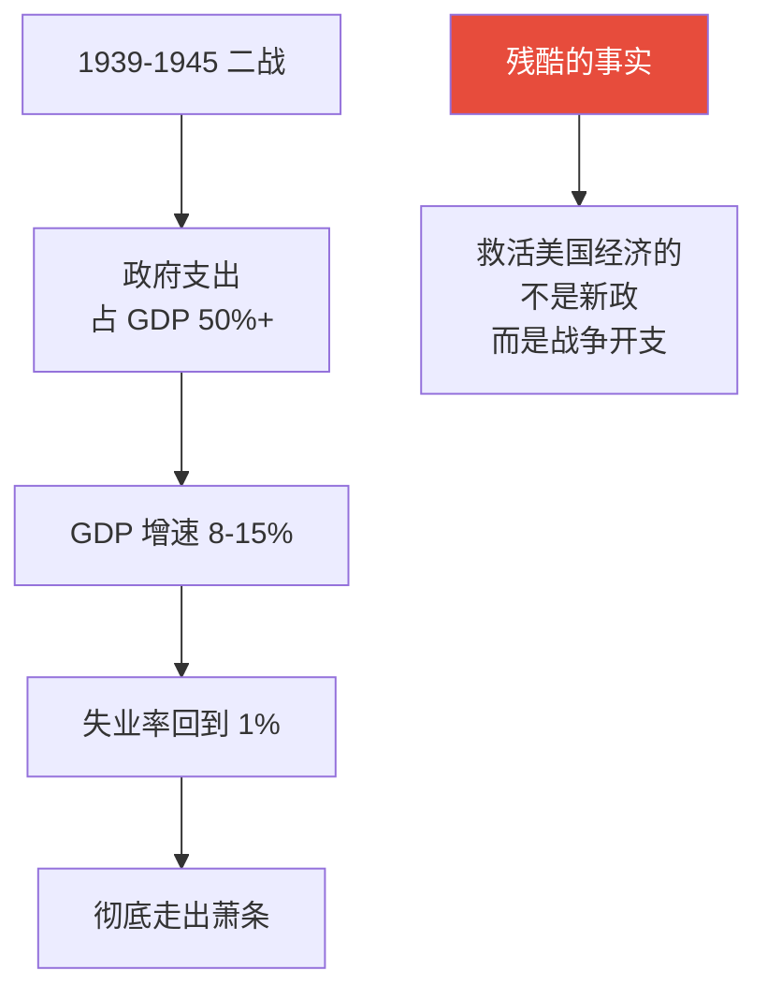

> 💡 这给后人的启示：**大规模财政开支**才是治理萧条的关键工具。新政不够大，二战才够大。这是凯恩斯主义的经验基础。

---

## 大萧条对现代央行的塑造

### 学到的教训

```mermaid
graph TB
    A[大萧条教训] --> B[1. 央行必须做<br/>"最后贷款人"]
    A --> C[2. 不能让通缩失控]
    A --> D[3. 银行体系要保护]
    A --> E[4. 金本位太僵化]
    A --> F[5. 救助宁早勿晚<br/>宁多勿少]
    A --> G[6. 不能贸易保护]
    
    H[2008 年应用] --> I[伯南克：<br/>"我研究了大萧条<br/>不会再让它发生"]
    H --> J[QE 大规模启动]
    H --> K[利率快速降至 0]
    H --> L[救助金融机构]
    H --> M[避免了"大萧条 2.0"]
    
    style I fill:#27ae60,color:#fff
```

### 1929 vs 2008 vs 2020

| 维度 | 1929 应对 | 2008 应对 | 2020 应对 |
|------|-----------|-----------|-----------|
| 反应速度 | 慢，错误方向 | 快，正确方向 | 极快，史诗规模 |
| 货币政策 | 紧缩 | 降息+QE | 零利率+无限 QE |
| 财政政策 | 紧缩 | 救助+刺激 | 直接发钱 |
| 银行救助 | 不救 | 救 | 救 |
| GDP 跌幅 | -30% | -4% | -3.4% |
| 失业最高 | 25% | 10% | 14.7% |
| 持续时间 | 10+ 年 | 1.5 年 | 6 个月 |

---

## 大萧条会再来吗？

### 不太可能（短期）

```
现代央行有：
- 美联储独立性
- 各种工具（QE/财政协调）
- 经过 2008 检验的应对手册
- 全球协调机制

→ 不会出现 1929 那种"完全不作为"的情况
```

### 但风险在累积

```mermaid
graph TB
    A[当前隐忧] --> B[全球债务/GDP > 350%<br/>历史最高]
    A --> C[央行工具空间受限<br/>已经低利率+QE]
    A --> D[全球化倒退<br/>类似 1930s 关税战]
    A --> E[贫富分化<br/>类似 1920s]
    A --> F[地缘冲突<br/>1930s 也是地缘高风险期]
    
    G[结论] --> H[发生 1929 式萧条概率低<br/>但发生"长期低迷"的概率不低]
```

---

## 投资启示

### 大萧条期间什么资产保值？

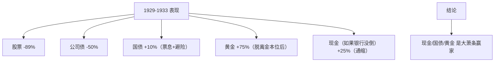

### 长期视角

```
1929 顶部买入标普 500：
- 道指 1954 才回到 1929 高点（25 年）
- 但加上分红再投资，1944 年就回本了（15 年）

→ 即使在最差的时点买，长期持有+分红再投资
  仍然能赚钱（但需要极强的耐心）
```

---

## 核心概念速查

| 术语 | 英文 | 一句话解释 |
|------|------|-----------|
| 大萧条 | Great Depression | 1929-1939 全球大萧条 |
| 黑色星期四 | Black Thursday | 1929.10.24 |
| 通缩螺旋 | Deflationary Spiral | 物价下跌的恶性循环 |
| 金本位 | Gold Standard | 货币与黄金挂钩 |
| 新政 | New Deal | 罗斯福的救助计划 |
| FDIC | — | 联邦存款保险公司（1933成立） |
| 保证金交易 | Margin Trading | 借钱炒股 |
| 流动性陷阱 | Liquidity Trap | 利率为零仍无效（凯恩斯首提此概念） |

---

## 推荐阅读

- 《美国货币史》— 弗里德曼（必读，重新定义了对大萧条的理解）
- 《大萧条》— 本·伯南克（前美联储主席的研究）
- 《怒火 1929》— 杰西·利弗摩尔的故事
- 《1929 大崩盘》— 加尔布雷思
- 电影《冰与火之歌·权力的游戏》中的"长冬"灵感来自此

---

## 延伸思考

1. 如果美联储 1929 年立刻降息+QE，大萧条会避免吗？
2. 当前全球央行已经把弹药打光了，下次危机怎么办？
3. AI 革命和 1920s 电气化革命的相似度？泡沫风险？
4. 中国会有 1930s 式的"长期通缩"吗？

---

## 相关链接

- [2008 金融危机](./2008-global-financial-crisis.md)
- [信用与债务周期](../../00-foundations/level-2-intermediate/07-credit-cycle.md)
- [货币政策深入](../../00-foundations/level-2-intermediate/03-monetary-policy.md)
- [1971 关闭黄金窗口](../us/1971-gold-window.md)
