# 1989 日本泡沫破裂 | Japan's Bubble Burst

`🔴 高级` `预计阅读：30 分钟`

> 核心问题：1980 年代日本是怎么膨胀到"东京地价 = 全美国"的？泡沫破裂后为什么花了 30 年才走出来？这对中国意味着什么？

---

## 一句话总结

**日本泡沫是史上最壮观的资产价格泡沫之一。它的破裂方式和后果，是理解"资产负债表衰退"和"流动性陷阱"的最佳案例，也是当下中国应该警惕的镜子。**

---

## 时间线

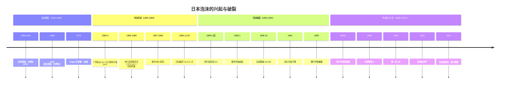

---

## 泡沫的形成：1985-1989

### 起点：广场协议（1985）

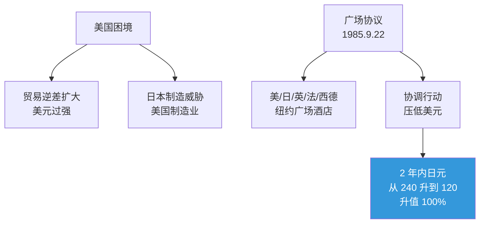

### 日本的"自我毁灭"应对

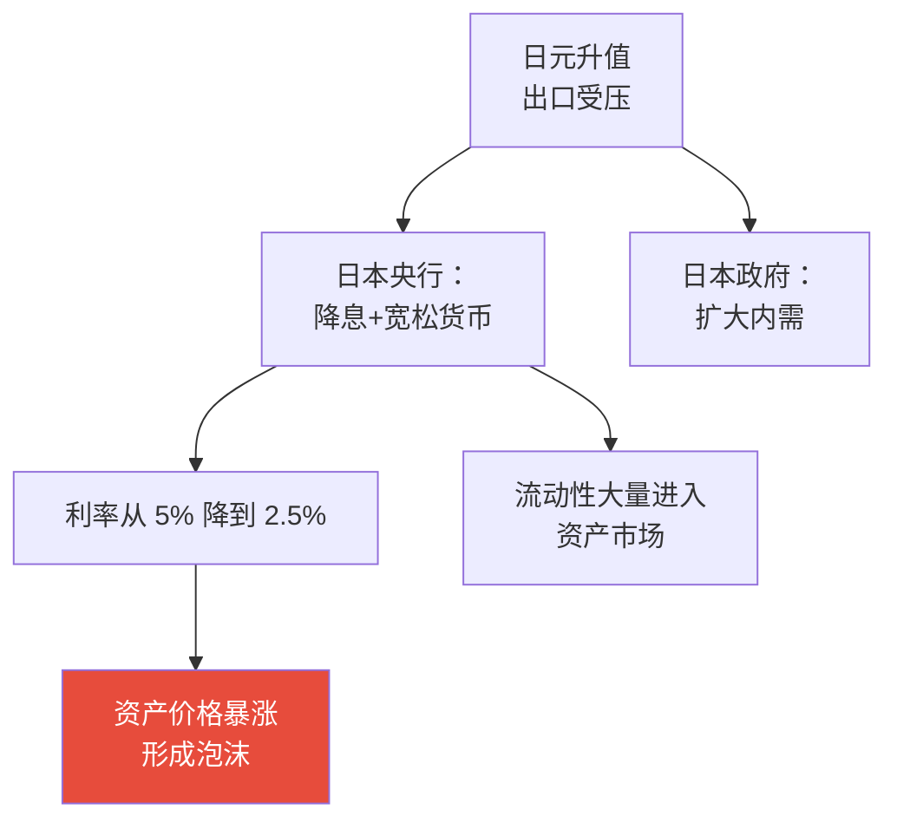

### 泡沫的极致

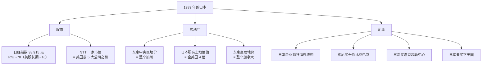

---

## 疯狂的细节

### 当年的真实场景

```
- 银座的高尔夫俱乐部会员费：$1 百万+
- 普通办公人员花 5 万买一个高尔夫球洞
- 日本公司用全画 1 张梵高画像 8250 万美元
- 银行借给企业 100% 房价的贷款
- 一些公司开始炒股，"财技"创造的利润 > 主营
- 房贷期限：100 年（"祖孙三代房贷"）
```

### 泡沫的市场指标

| 指标 | 1989 年高点 | 历史正常值 |
|------|-------------|-----------|
| 日经 P/E | 70 倍 | 16 倍 |
| 房价/收入 | 18 倍 | 5 倍 |
| 房屋租金回报率 | 1% | 5%+ |
| 银行不动产贷款占比 | 40% | <20% |
| 企业土地资产/总资产 | 40% | <15% |

---

## 破裂：1989-1992

### 央行的"刺破"

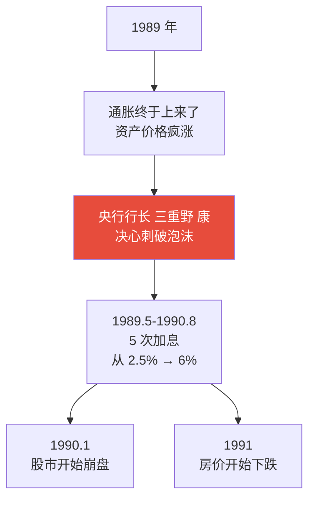

### 崩盘的速度

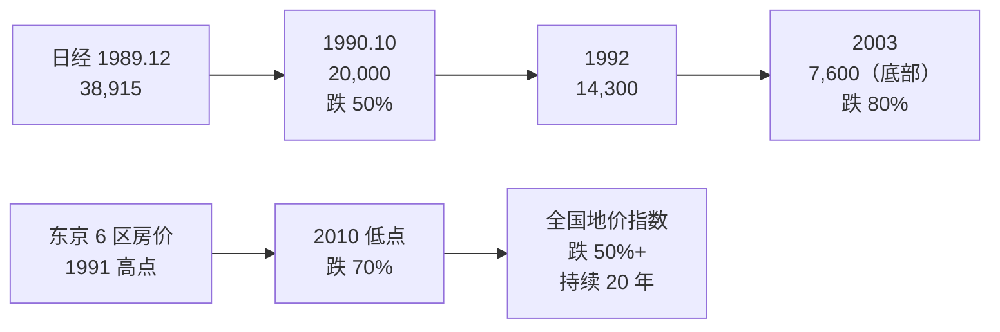

> 📊 日本股市花了 **34 年**才回到 1989 年高点（2024 年才创新高）。

---

## 为什么花了 30 年？

### 1. 资产负债表衰退（辜朝明理论）

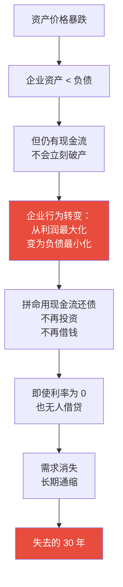

> 💡 这是辜朝明的核心洞见。日本不是"流动性陷阱"（货币政策失效），而是更糟糕的"资产负债表衰退"（私人部门主动去杠杆）。

### 2. 政策应对慢且错

```mermaid
graph TB
    A[1990 年初] --> A1[央行不愿快速降息<br/>担心被指责"救泡沫"]
    
    B[1991 年] --> B1[财政开始刺激<br/>但规模不够]
    
    C[1990s 中期] --> C1[让僵尸企业活着<br/>银行不愿核销坏账]
    C1 --> C2[资源错配<br/>新增长无法发生]
    
    D[1997 年] --> D1[消费税从 3% → 5%<br/>提前财政紧缩<br/>致命错误]
    D1 --> D2[经济二次探底]
    
    style D1 fill:#e74c3c,color:#fff
```

### 3. 银行业危机

```mermaid
graph TB
    A[泡沫时期<br/>银行大量房贷] --> B[泡沫破裂后<br/>大量坏账]
    B --> C[银行不愿核销<br/>"延展和假装"]
    C --> D[僵尸银行+僵尸企业]
    D --> E[10 年后才<br/>大规模重组]
```

### 4. 人口老龄化加速

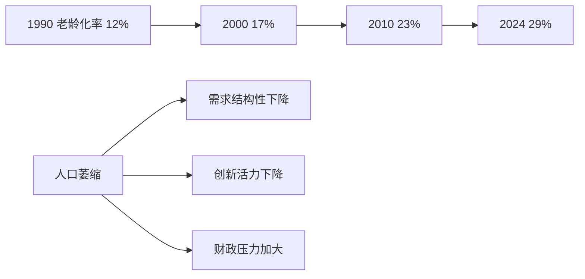

### 5. 文化心理的"通缩心态"

经历了 10+ 年下跌后，日本社会形成了：
- 不消费（怕涨价不会发生）
- 不借贷（怕还不上）
- 不创业（求稳定）
- 这种心态自我强化通缩

---

## 几次"假希望"

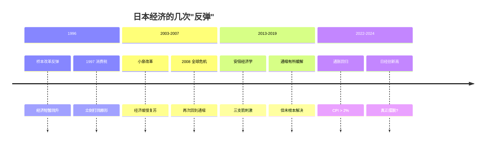

---

## 安倍经济学（Abenomics）

### 三支箭

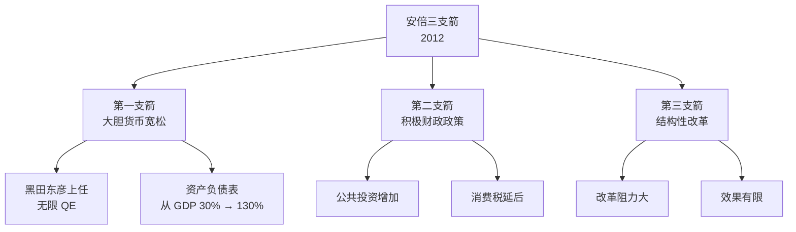

### 评价

| 成就 | 不足 |
|------|------|
| 通缩心态被打破 | 政府债务/GDP > 250% |
| 股市大涨 | 工资增长缓慢 |
| 日元贬值利好出口 | 进口通胀 |
| 就业改善 | 结构性问题未解 |

> 💡 安倍经济学不是完全胜利，但**至少阻止了进一步恶化**。

---

## 当前的日本（2024-2025）

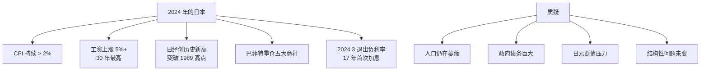

---

## 中国 vs 日本：相似与不同

### 相似点（值得警惕）

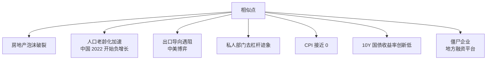

### 不同点（中国的优势）

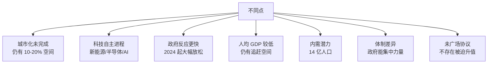

### 关键判断

```
日本 1990 时：
- 人均 GDP $30k+，已是发达国家
- 没有可学习的"前面国家"
- 老龄化在发达国家中较早

中国 2024 时：
- 人均 GDP $13k，仍在追赶阶段
- 看到了日本的教训
- 老龄化时点的人均 GDP 较低

→ 中国增长空间更大，但也面临更复杂的外部环境
→ "重蹈覆辙"或"避免覆辙"，关键在政策应对
```

---

## 投资启示

### 在"日本化"环境中赚钱的方法

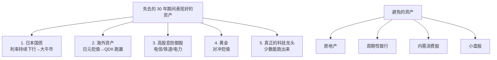

---

## 核心概念速查

| 术语 | 英文 | 一句话解释 |
|------|------|-----------|
| 广场协议 | Plaza Accord | 1985 五国协议日元升值 |
| 资产负债表衰退 | Balance Sheet Recession | 私人部门主动去杠杆 |
| 流动性陷阱 | Liquidity Trap | 利率为零仍无法刺激经济 |
| 失去的十年 | Lost Decade | 日本 1991-2001 |
| 失去的二十年/三十年 | — | 后来扩展到 2010s/2020s |
| 安倍经济学 | Abenomics | 三支箭刺激政策 |
| 僵尸企业 | Zombie Company | 靠贷款苟活的低效企业 |
| 通缩心态 | Deflationary Mindset | 不消费/不借贷的社会心理 |

---

## 推荐阅读

- 《大衰退》— 辜朝明（经典，必读）
- 《泡沫经济：日本失去的二十年》— 野口悠纪雄
- 《Princes of the Yen》— Richard Werner
- 《日本病》— 多人著作
- 纪录片《The Lost Decade》(BBC)

---

## 延伸思考

1. 中国能避免日本的命运吗？最关键的是什么？
2. 如果广场协议没发生，日本会怎样？
3. 日本"失去的三十年"对国民幸福的真实影响有多大？（GDP 不变但生活质量？）
4. 中国房地产已经跌了 4 年，2025 后会怎样？

---

## 相关链接

- [日本经济](../../04-global-economy/japan/)
- [信用与债务周期](../../00-foundations/level-2-intermediate/07-credit-cycle.md)
- [中国经济](../../04-global-economy/china/)
- [房地产](../../03-assets/real-estate/)
