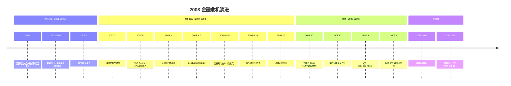
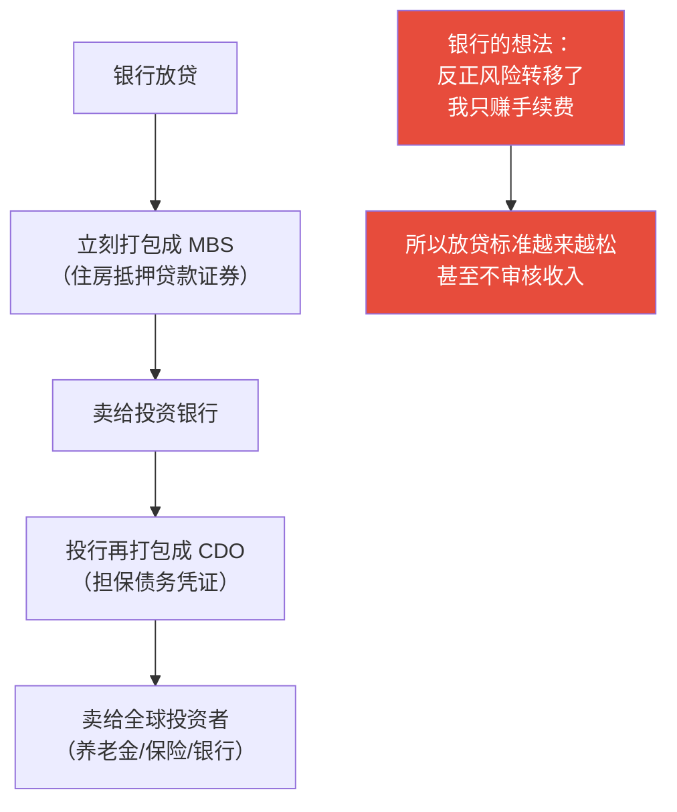
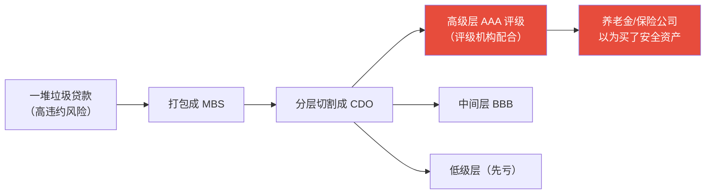
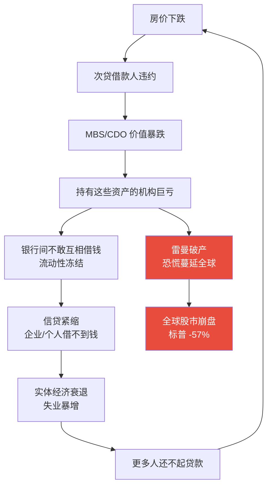
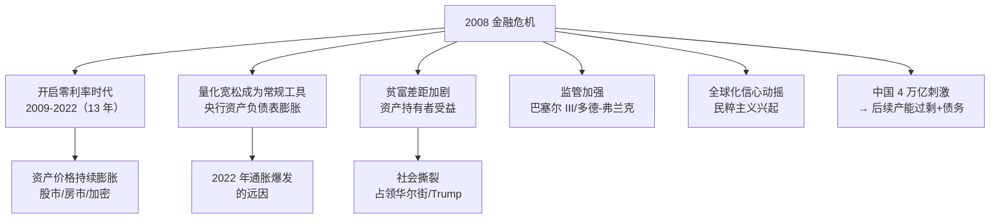
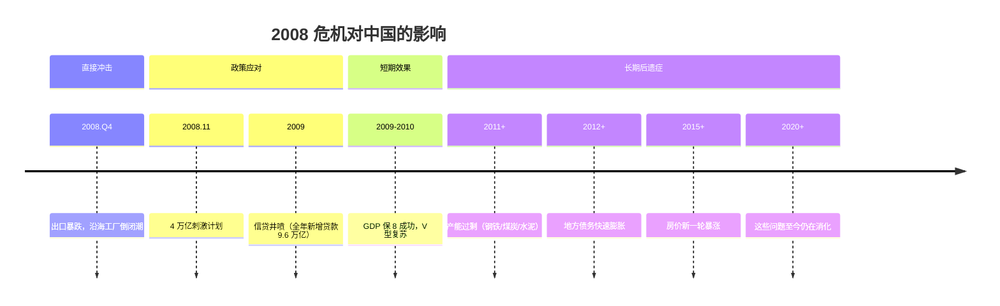

# 2008 全球金融危机 | Global Financial Crisis

`🔴 高级` `预计阅读：30 分钟`

> 核心问题：2008 年到底发生了什么？为什么一个美国的房贷问题能引发全球金融海啸？

---

## 一句话总结

**过度杠杆 + 金融创新失控 + 监管缺失 = 系统性崩溃。2008 年危机改变了全球经济的运行方式，开启了"央行主导"的新时代。**

---

## 危机时间线

---

## 危机的根源：次贷是怎么回事？

### 传统房贷 vs 次贷

| | 传统房贷 (Prime) | 次级贷款 (Subprime) |
|--|-----------------|-------------------|
| 借款人 | 信用好、收入稳定 | 信用差、收入不稳定 |
| 首付 | 20%+ | 0-5%（甚至零首付） |
| 利率 | 固定/低 | 浮动/高（前低后高） |
| 违约率 | 低 | 高 |

### 为什么银行愿意放次贷？

### 金融创新的"炼金术"

> 💡 核心问题：**垃圾贷款经过"打包+分层+评级"，变成了 AAA 级"安全资产"**。全球投资者以为自己买的是低风险产品，实际上底层全是定时炸弹。

---

## 崩溃的传导链

### 为什么雷曼破产是引爆点？

- 雷曼是全球第四大投行
- 它的破产证明：**"大到不能倒"不是真的**
- 全球金融机构恐慌：下一个是谁？
- 银行间市场冻结 → 全球流动性危机

---

## 救市：史无前例的干预

### 美联储的操作

| 措施 | 内容 | 规模 |
|------|------|------|
| 降息至零 | 联邦基金利率 → 0-0.25% | — |
| QE1 | 买 MBS + 国债 | $1.75 万亿 |
| QE2 | 买国债 | $6000 亿 |
| QE3 | 每月买 $850 亿 | 开放式 |
| 总计 | 资产负债表从 $9000 亿 → $4.5 万亿 | 扩张 5 倍 |

### 财政部的操作

| 措施 | 内容 |
|------|------|
| TARP | $7000 亿救助金融机构 |
| 接管房利美/房地美 | 国有化两房 |
| 救助 AIG | $1820 亿 |
| 汽车业救助 | GM/Chrysler |

---

## 危机的深远影响

---

## 对中国的影响

---

## 关键教训

| 教训 | 说明 |
|------|------|
| 杠杆是双刃剑 | 放大收益也放大损失 |
| "这次不一样"最危险 | 每次泡沫都有人说"这次不一样" |
| 复杂性掩盖风险 | 越复杂的金融产品，风险越难评估 |
| 流动性可以瞬间消失 | 平时能卖的东西，恐慌时可能卖不掉 |
| 系统性风险无法分散 | 所有人都在同一条船上 |
| 政策应对决定后果 | 1929 年不救 → 大萧条；2008 年救 → 快速复苏 |

---

## 与当下的对比

| 维度 | 2008 年 | 2024-2025 年 |
|------|---------|-------------|
| 核心风险 | 美国房地产 + 金融衍生品 | 中国房地产 + 地方债务 |
| 杠杆主体 | 美国家庭 + 投行 | 中国地方政府 + 房企 |
| 传导机制 | MBS/CDO → 全球金融体系 | 土地财政 → 城投 → 银行 |
| 政策空间 | 利率从 5% 降到 0（空间大） | 中国利率已经很低 |
| 全球影响 | 全球金融海啸 | 主要影响中国内部（目前） |

---

## 核心概念速查

| 术语 | 英文 | 一句话解释 |
|------|------|-----------|
| 次贷 | Subprime Mortgage | 发给信用差的人的房贷 |
| MBS | Mortgage-Backed Securities | 房贷打包成的证券 |
| CDO | Collateralized Debt Obligation | MBS 再打包分层的产品 |
| CDS | Credit Default Swap | 给债券买的"保险"（做空工具） |
| 大到不能倒 | Too Big to Fail | 机构太大，倒了会拖垮整个系统 |
| QE | Quantitative Easing | 央行印钱买资产 |
| 系统性风险 | Systemic Risk | 整个金融系统崩溃的风险 |
| 去杠杆 | Deleveraging | 减少债务/降低杠杆率 |

---

## 推荐延伸

- 🎬 电影《大空头》(The Big Short) — 生动还原危机过程
- 🎬 纪录片《监守自盗》(Inside Job) — 揭露华尔街贪婪
- 📖 《大而不倒》— 安德鲁·罗斯·索尔金
- 📖 《这次不一样》— 莱因哈特 & 罗格夫

---

## 相关链接

- [银行体系](../../00-foundations/level-1-beginner/03-banking-system.md)
- [信用与债务周期](../../00-foundations/level-2-intermediate/07-credit-cycle.md)
- [美国经济](../../04-global-economy/us/)
- [中国经济](../../04-global-economy/china/)
