# 2020 新冠疫情冲击 | COVID-19 Crisis

`🔴 高级` `预计阅读：25 分钟`

> 核心问题：2020 年发生了什么？为什么"史诗级"的应对反而埋下了 2022 年的通胀种子？

---

## 一句话总结

**2020 年危机展示了"现代央行+财政"的极限：3 个月就把 2008 年用 3 年做的 QE 都做了。但救市的代价是 2022 年的高通胀和长期债务问题——很多影响至今未消化。**

---

## 时间线

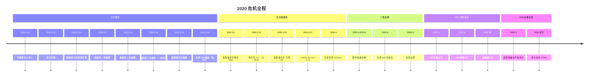

---

## 危机的特殊性

### 这次不是金融危机，是经济停摆

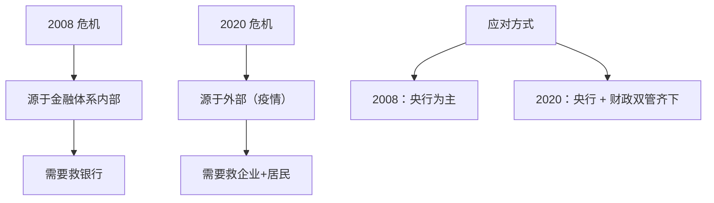

### 经济数据的极端

```
2020 年 4 月（疫情高峰）：
- 美国失业率：从 3.5% → 14.7%（一个月）
- 美国 GDP（Q2）：环比 -32%（年化）
- 全球航空业：-94%
- 油价：WTI 一度跌到 -$37（负油价！）
- 美股 VIX：飙到 82（历史第二高）
```

---

## 美联储的"史诗级"应对

### 反应速度对比

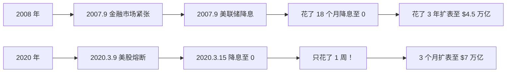

### 工具箱大全

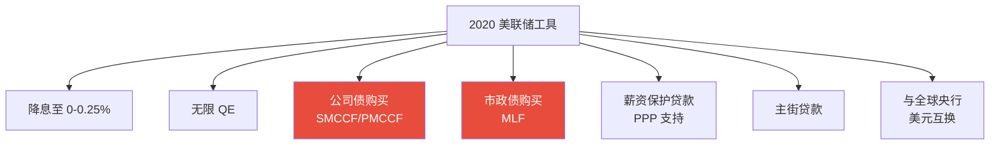

> 💡 美联储**第一次直接买公司债**，打破了央行不直接干预企业市场的传统。这是货币政策的范式转变。

---

## 财政政策的"直升机撒钱"

### 美国 CARES Act（2020.3）

```
$2.2 万亿（占美国 GDP 10%）
- $1200/人 直接发放
- 失业救济 +$600/周
- 中小企业 PPP 贷款 $3500 亿
- 大企业救助 $5000 亿
- 医疗系统 $1500 亿

后续陆续追加：
- 2020.12 第二轮 $9000 亿
- 2021.3 第三轮 $1.9 万亿
- 总规模：~$5 万亿（占 GDP 25%！）
```

### 为什么这次"直接发钱"？

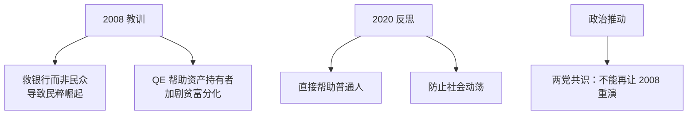

### "直接发钱"的副作用

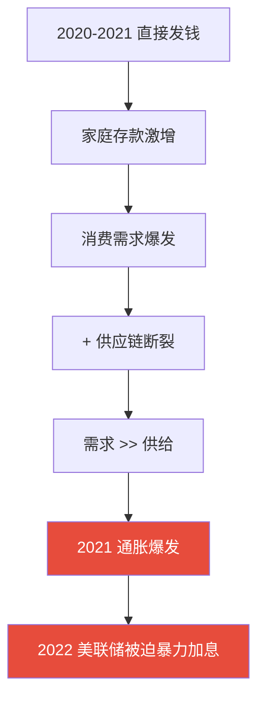

> 💡 **救市的代价**：流动性 + 直接发钱 = 史无前例的通胀压力。

---

## 中国的应对（更克制）

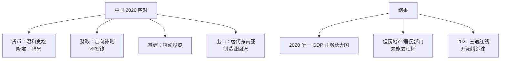

### 中美应对对比

| 维度 | 美国 | 中国 |
|------|------|------|
| 货币 | 0 利率 + 无限 QE | 温和降息 + 定向 |
| 财政 | $5 万亿（GDP 25%） | 限制（GDP 5%） |
| 直接发钱 | 是 | 否 |
| 企业救助 | 大规模 | 定向 |
| 重点 | 救消费 | 救生产 |
| 短期效果 | V 型反弹+通胀 | 平稳+通缩 |
| 长期遗产 | 高通胀+高债务 | 房地产困局 |

---

## V 型反弹的资产表现

### 2020.3 → 2021.12 资产回报

```
- 标普 500：+108%
- 纳斯达克：+135%
- 比特币：+830%（$5000 → $69,000）
- 黄金：+30%（高点）
- 中概互联网：+50%（高点）
- 大宗商品：油 +320%（从 -37 到 +120）
```

> 💡 这是**历史上最快的财富积累**期之一，也是最快泡沫化的一段时期。

### 资产泡沫的形成

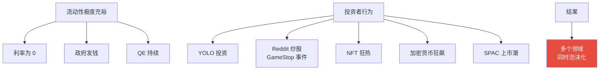

### 经典泡沫事件

```
2021.1 GameStop 事件：
- Reddit 散户合力做多
- 对抗对冲基金
- 股价从 $20 → $483 → 暴跌
- "韭菜起义"

2021.3 SPAC 狂潮：
- "空白支票公司"
- 1000+ SPAC 上市
- 后来大多破发

2021.9 NFT 顶峰：
- 单个 JPEG 卖几百万美元
- 现已基本归零

2021.11 BTC 顶峰：
- $69,000
- 之后跌到 $15,500（-78%）
```

---

## 通胀的回归

### 2021 年通胀逐步显现

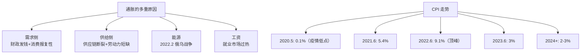

### 美联储的"判断错误"

```
2021 年美联储说：
"通胀是暂时的"（Transitory）

但实际：
通胀变得"持续"
最终被迫 2022.3 开始加息
2022-2023 累计加息 525bp
40 年来最快加息
```

> 💡 这次"判断错误"的代价：2022 年股债双杀，全球资产承压。

---

## 长期影响（至今未消化）

### 1. 全球债务激增

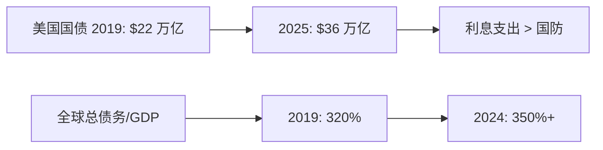

### 2. 财富不平等加剧

```
2020-2024 年财富变化：
- 美国前 1%：净资产 +30 万亿
- 美国后 50%：净资产基本不变
- 资产持有者 vs 工薪族 = 巨大分化

→ 加剧政治极化
→ 推动民粹主义
```

### 3. 远程办公冲击商业地产

```
办公楼空置率：
- 2019：~10%
- 2024：~20%（部分城市 30%+）

→ 商业地产价值下降 30%+
→ 银行贷款风险
→ 城市税收下滑
```

### 4. AI 革命被推动

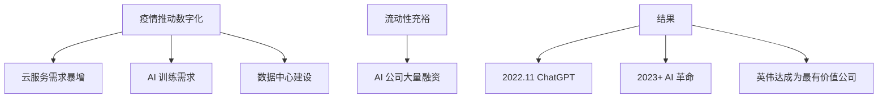

---

## 投资启示

### 1. 危机就是机会

```
2020.3 触底时买入：
- 标普 500：3 年翻倍
- 纳指：3 年翻 1.5 倍
- 比特币：3 年涨 14 倍

但当时大多数人在恐慌抛售。
```

### 2. 不要低估央行的"创造力"

```
2008 年的 QE 已经"史无前例"
2020 年又把规模翻了一倍

→ 永远不要轻易做空"央行+财政"组合
```

### 3. 印钱有代价

```
史诗级救助 → 史诗级通胀 → 史诗级加息

短期狂欢 → 长期还账
```

### 4. 警惕泡沫信号

```
2021 年的种种信号：
- 散户疯狂炒股
- NFT 狂热
- 加密狂飙
- SPAC 滥发

→ 都是流动性泡沫的典型表现
→ 历史一再证明，结果都是泡沫破裂
```

---

## 中国视角的特殊性

### 2020-2021：中国相对克制

```
没有大规模发钱
房地产开始调控（三道红线 2020.8）
出口受益于供应链替代

短期：经济相对稳健
长期：避免了美式通胀
但：房地产困局开始
```

### 2022-2024：中美错位加深

```
美国：通胀 → 加息 → 高利率
中国：通缩 → 降息 → 低利率

→ 完全相反的政策方向
→ 资产表现完全分化
```

---

## 核心概念速查

| 术语 | 解释 |
|------|------|
| 熔断 | Circuit Breaker（市场暂停交易机制） |
| CARES Act | 2020.3 美国救助法案 |
| 无限 QE | 美联储不限规模购买资产 |
| Direct Stimulus | 直接给居民发钱 |
| Reopening Trade | 重启交易（受益于经济恢复） |
| Stay-at-Home Trade | 居家交易（疫情受益股） |
| YOLO Investment | "你只活一次"式投资 |
| SPAC | 特殊目的收购公司 |
| Transitory Inflation | 暂时性通胀（美联储后来承认错判） |

---

## 推荐阅读

- 《Trillion Dollar Triage》— Nick Timiraos（详述美联储 2020）
- 《The Lords of Easy Money》— Christopher Leonard（批判 QE）
- 《Boom and Bust》— Coggan（金融周期）
- 鲍威尔的相关讲话和会议纪要

---

## 延伸思考

1. 如果当时美联储更克制，世界会怎样？
2. "直接发钱"是好政策还是坏政策？长期后果？
3. 下次危机来时，央行还有多少弹药？
4. 中美应对的对比，谁的策略更优？

---

## 相关链接

- [2008 金融危机](./2008-global-financial-crisis.md)
- [信用与债务周期](../../00-foundations/level-2-intermediate/07-credit-cycle.md)
- [财政政策](../../00-foundations/level-2-intermediate/04-fiscal-policy.md)
- [美元霸权](../../04-global-economy/connections/dollar-hegemony.md)
