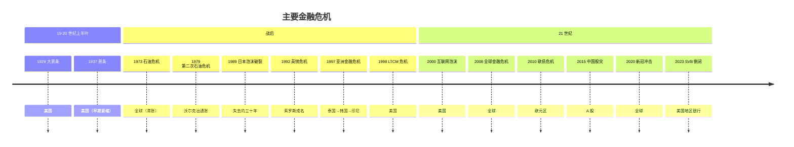
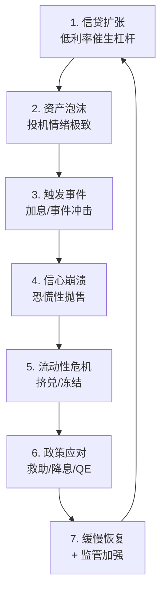

# 💥 历次重大经济危机

> 危机是最好的老师。每次危机都暴露了系统的弱点，也催生了新的应对工具。

---

## 危机时间线

---

## 各危机详细分析

| 危机 | 文件 |
|------|------|
| 1929 大萧条 | [1929-great-depression.md](./1929-great-depression.md) |
| 1973 石油危机 | [1973-oil-crisis.md](./1973-oil-crisis.md) |
| 1989 日本泡沫 | [1989-japan-bubble.md](./1989-japan-bubble.md) |
| 1997 亚洲金融危机 | [1997-asian-crisis.md](./1997-asian-crisis.md) |
| 2000 互联网泡沫 | [2000-dotcom-bubble.md](./2000-dotcom-bubble.md) |
| **2008 全球金融危机** | [2008-global-financial-crisis.md](./2008-global-financial-crisis.md) ✅ |
| 2010 欧债危机 | [2010-european-debt-crisis.md](./2010-european-debt-crisis.md) |
| 2015 中国股灾 | [2015-china-stock-crash.md](./2015-china-stock-crash.md) |
| 2020 新冠冲击 | [2020-covid-shock.md](./2020-covid-shock.md) |
| 2023 SVB 倒闭 | [2023-svb-collapse.md](./2023-svb-collapse.md) |

---

## 危机的共同模式

> 💡 "市场永远会重复，但不会以完全相同的方式。" — 马克·吐温（大意）

---

## 危机给投资者的教训

1. **杠杆是双刃剑** — 牛市放大收益，熊市放大损失
2. **流动性能瞬间消失** — 平时能卖的东西，恐慌时卖不掉
3. **"这次不一样"是危险信号** — 历史一直在重演
4. **复杂掩盖风险** — 越复杂的产品，风险越难评估
5. **政策应对决定结局** — 1929 v.s. 2008 的对比
6. **现金为王的时刻** — 危机底部，没有钱的人才是真正的输家
7. **危机是最大的机会** — 巴菲特：在别人贪婪时恐惧，在别人恐惧时贪婪
