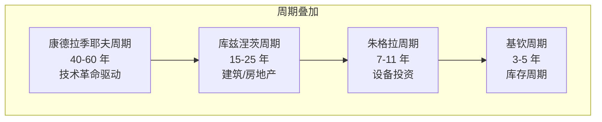
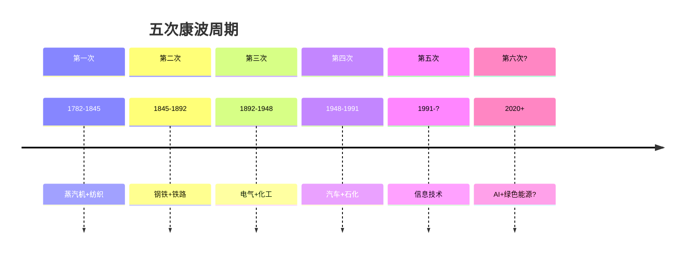

# 🔄 全球经济长周期

> 理解长周期，避免被短期波动迷惑。

---

## 四大经济周期

| 周期 | 长度 | 驱动 | 代表事件 |
|------|------|------|----------|
| 基钦 | 3-5 年 | 库存波动 | 制造业 PMI 起伏 |
| 朱格拉 | 7-11 年 | 设备/产能 | 资本支出周期 |
| 库兹涅茨 | 15-25 年 | 建筑/城市化 | 房地产大周期 |
| 康波 | 40-60 年 | 技术革命 | 蒸汽 → 电力 → 信息 → AI？ |

---

## 康波周期（最长周期）

每个康波包含：**繁荣 → 衰退 → 萧条 → 复苏**，约 50 年。

---

## 待深入

- [ ] 康波周期详解（kondratieff-wave.md）
- [ ] 库兹涅茨周期与房地产（kuznets-cycle.md）
- [ ] 朱格拉周期与产能（juglar-cycle.md）
- [ ] 基钦周期与库存（kitchin-cycle.md）
- [ ] 周期叠加与判断方法（cycle-overlap.md）
- [ ] 达里奥的"大周期"框架（dalio-big-cycle.md）
