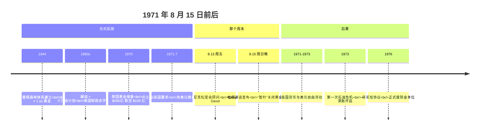
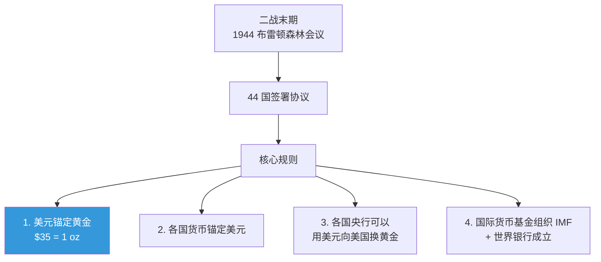
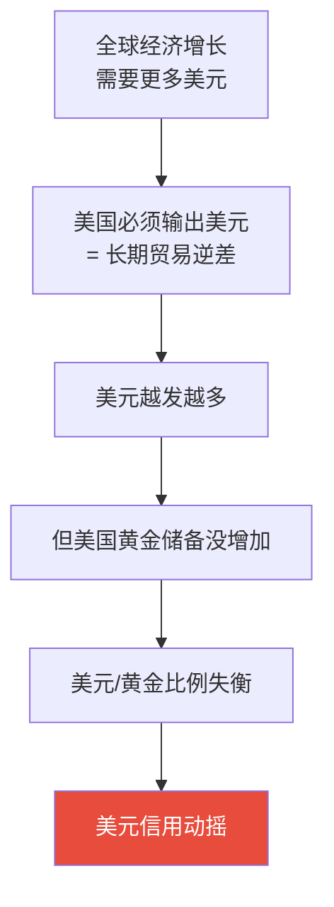
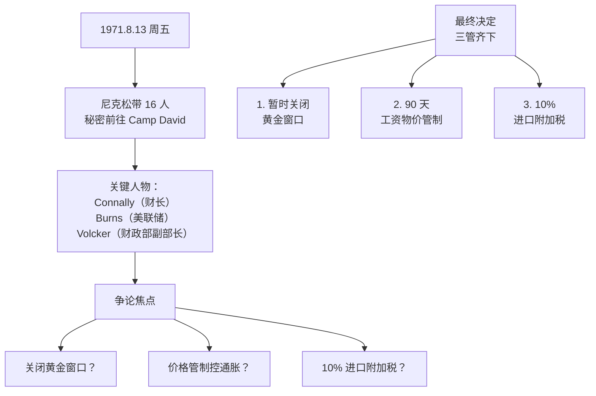
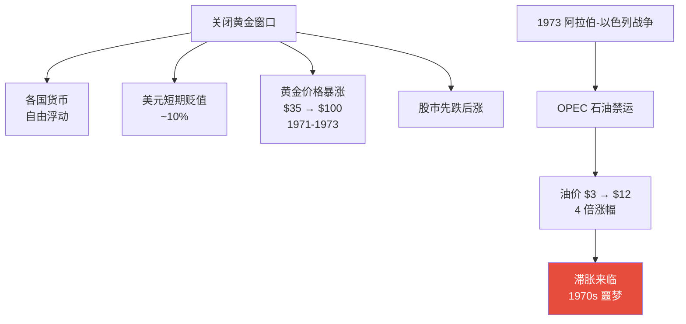
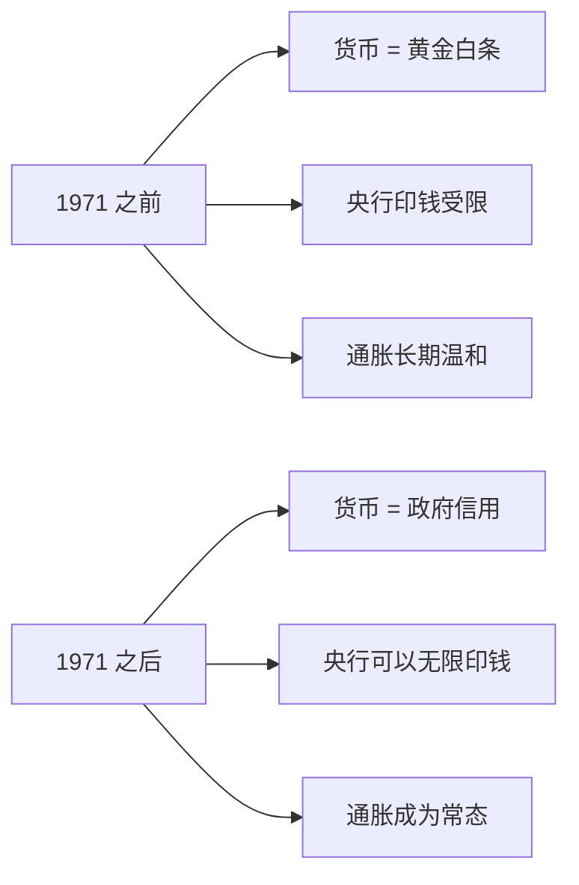
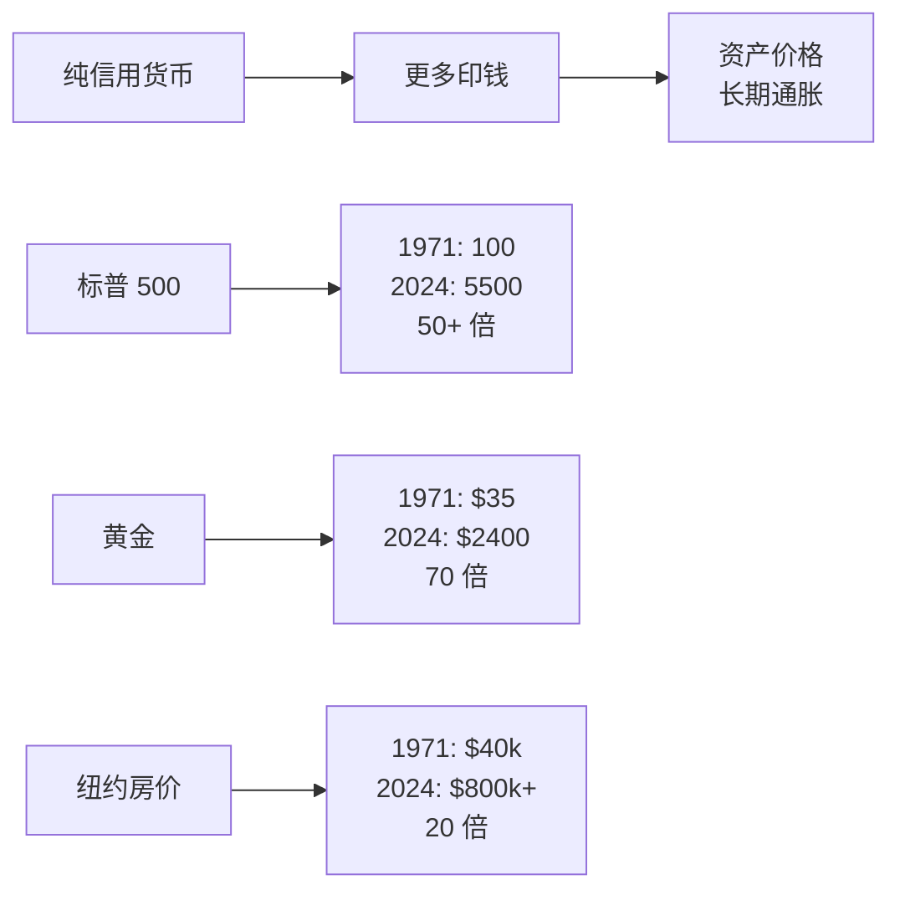
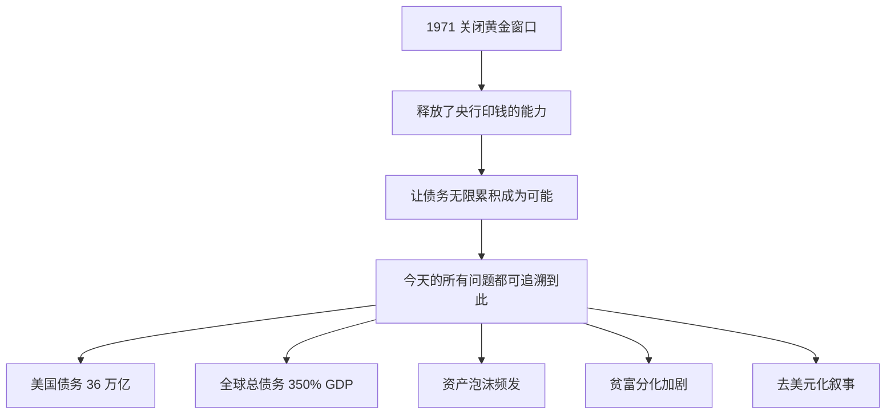

# 1971 尼克松关闭黄金窗口 | The Nixon Shock

`🔴 高级` `预计阅读：20 分钟`

> 核心问题：1971 年那个晚上发生了什么？为什么它被称为"现代金融史最重要的一天"？

---

## 一句话总结

**1971 年 8 月 15 日，尼克松宣布美元与黄金脱钩。这一天结束了 4000 年的金本位历史，开启了纯信用货币时代。今天我们看到的所有"印钱"问题，都源于那个晚上。**

---

## 时间线：那个改变世界的周末



---

## 背景：布雷顿森林体系

### 体系设计（1944）



> 💡 这套体系的核心逻辑：美国有全球 70%+ 的黄金储备，美元 = 黄金，让世界相信美元的"金子般"信用。

### 体系运行（1944-1971）

```
对美国：
- 美元成为世界储备货币
- 享受"嚣张特权"（铸币税）

对世界：
- 有了稳定的国际货币
- 但经济决策受美国束缚
- 美国"出口通胀"

对市场：
- 汇率稳定 → 国际贸易繁荣
- "光辉的 30 年"（1945-1973）
```

---

## 危机：体系为什么崩溃？

### 特里芬难题（Triffin Dilemma）



> 💡 这是布雷顿森林体系内在的、无法解决的矛盾。1960 年代经济学家特里芬就预言了这个结局。

### 直接导火索

```mermaid
graph TB
    A[1960s 美国问题] --> B[越战烧钱<br/>~$1500 亿]
    A --> C["大社会计划"<br/>福利支出激增]
    A --> D[财政赤字爆炸]
    
    D --> E[美元供应过剩]
    E --> F[各国怀疑美元]
    F --> G[纷纷要求<br/>换黄金]
    
    G --> H[戴高乐：<br/>"派军舰来运回我们的黄金"]
    G --> I[英国 1971.8.13<br/>要求兑换 30 亿美元黄金]
    
    style I fill:#e74c3c,color:#fff
```

到 1971 年 8 月：
- 美国黄金储备：$100 亿
- 海外美元负债：$700 亿
- 比例：1:7（远超 1:1 兑付能力）

**这就是一场"美元挤兑"。**

---

## Camp David 周末



> 📺 8 月 15 日周日晚 9 点，尼克松在电视上 17 分钟讲话——抢在亚洲市场开盘前。次日全球市场震荡。

### 尼克松那句"经典误导"

```
"这个'暂时'的措施..."

50+ 年过去了，"暂时"还在继续。
```

---

## 短期影响（1971-1973）



---

## 长期影响（1971 至今）

### 1. 法定货币时代开启



### 2. 通胀的范式转变

```
1900-1971 美元购买力：变化不大（金本位约束）
1971-2024 美元购买力：贬值 ~85%

同样 1 美元：
- 1971 年能买 1 加仑汽油
- 2024 年只能买 1/4 加仑汽油
```

### 3. 资产价格大牛市



### 4. 财政与货币政策"无锚"

| 维度 | 金本位时代 | 法币时代 |
|------|-----------|---------|
| 央行权力 | 受黄金约束 | 无约束 |
| 财政赤字 | 受限 | 可持续累积 |
| 通胀容忍度 | 极低 | 2% 视为"健康" |
| 危机救助 | 受限 | "无限 QE" |
| 政府债务/GDP | 战时除外 < 50% | 经常 100%+ |

### 5. 金融危机频次

```
1944-1971（布雷顿森林）：
- 主要危机：1971 黄金挤兑
- 大型金融危机：极少

1971-2024（法币时代）：
- 1973 石油危机
- 1979 第二次石油危机
- 1987 黑色星期一
- 1989 日本泡沫
- 1997 亚洲金融危机
- 1998 LTCM
- 2000 互联网泡沫
- 2008 全球金融危机
- 2010 欧债危机
- 2020 新冠
- 平均 5-7 年一次大危机
```

---

## 为什么这么重要？



> 💡 看懂 1971 年，就看懂了：
> - 为什么黄金长期看好（央行印钱无止境）
> - 为什么 BTC 被叫"数字黄金"（同样是抗印钱叙事）
> - 为什么美国财政赤字停不下来（没有黄金约束）
> - 为什么"现金是垃圾"（购买力持续贬值）
> - 为什么资产价格长期通胀（钱越来越多）

---

## 法币体系会终结吗？

### 历史规律

```
所有法币最终都会贬值/崩溃。
没有例外。

平均寿命：
- 罗马的银币：贬值用了几百年
- 现代法币：通常 27 年内大幅贬值
- 美元：1971 至今 53 年，是寿命最长的法币之一
```

### 当前美元体系的"终结信号"

| 指标 | 现状 |
|------|------|
| 美国债务/GDP | >120%（历史新高） |
| 财政利息支出 | 超过国防预算 |
| 央行购金 | 创纪录（2022-2024） |
| 全球美元储备占比 | 从 70% 降至 58% |
| 黄金储备占比 | 从低位回升 |
| BRICS 本币结算 | 在推进 |

> ⚠️ 这不是说美元马上崩溃，但**结构性压力在累积**。

---

## 投资启示

```mermaid
graph TB
    A[1971 教训] --> B[长期持有现金<br/>= 必输的赌局]
    A --> C[长期持有硬资产<br/>= 必赢的赌局]
    A --> D[硬资产包括<br/>黄金/优质股票/房产/BTC]
    
    E[通胀是"温水煮青蛙"] --> F[10 年贬值 30%<br/>不痛不痒]
    E --> G[但 30 年贬值 70%<br/>足以毁掉一生储蓄]
```

---

## 核心概念速查

| 术语 | 英文 | 一句话解释 |
|------|------|-----------|
| 金本位 | Gold Standard | 货币与黄金挂钩 |
| 布雷顿森林 | Bretton Woods | 1944-1971 美元-黄金体系 |
| 法定货币 | Fiat Money | 没有实物支撑的货币 |
| 特里芬难题 | Triffin Dilemma | 储备货币的内在矛盾 |
| 尼克松冲击 | Nixon Shock | 1971 关闭黄金窗口 |
| 嚣张特权 | Exorbitant Privilege | 美国享受的储备货币红利 |
| 牙买加体系 | Jamaica Accord | 1976 正式废除金本位 |

---

## 延伸阅读

- 《货币战争》— 宋鸿兵（视角偏激但启发性强）
- 《美元的兴衰》
- 《Bretton Woods Agreement》— 历史档案
- 《尼克松回忆录》
- BBC 纪录片《The Day the Dollar Died》

---

## 延伸思考

1. 如果尼克松没有关闭黄金窗口，世界会怎样？
2. 我们这一代人是否会见证法币体系的"终结时刻"？
3. BTC 的 2100 万枚硬上限，是不是对 1971 的"解药"？
4. 中国持有大量美债，本质上是不是为美国"补贴"？

---

## 相关链接

- [货币的本质](../../00-foundations/level-1-beginner/01-money.md)
- [黄金](../../03-assets/commodities/gold/)
- [美国经济史](./README.md)
- [国际贸易与汇率](../../00-foundations/level-2-intermediate/05-trade-and-fx.md)
