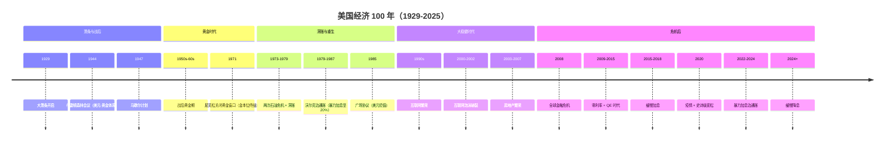
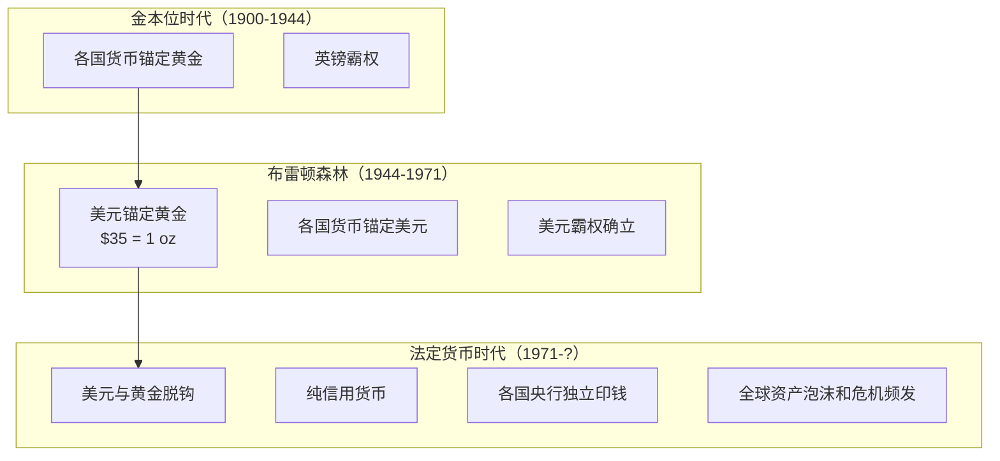
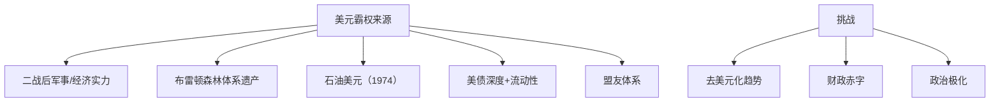

# 🇺🇸 美国经济史

> 理解美元、美联储、美国经济周期的演变，是理解全球经济的基础。

---

## 关键时间线

---

## 关键专题文件

| 主题 | 文件 |
|------|------|
| 1971 关闭黄金窗口 | [1971-gold-window.md](./1971-gold-window.md) |
| 1979 沃尔克时刻 | [volcker-moment.md](./volcker-moment.md) |
| 1985 广场协议 | [plaza-accord.md](./plaza-accord.md) |
| 2000 互联网泡沫 | [dotcom-bubble.md](./dotcom-bubble.md) |
| 2008 金融危机 | [../crises/2008-global-financial-crisis.md](../crises/2008-global-financial-crisis.md) |
| 2009-2015 QE 时代 | [qe-era.md](./qe-era.md) |
| 2020 疫情应对 | [2020-covid-response.md](./2020-covid-response.md) |
| 2022 暴力加息 | [2022-rate-hike.md](./2022-rate-hike.md) |

---

## 美元体系的演变

---

## 美联储的演变

| 时代 | 特征 | 代表主席 |
|------|------|----------|
| 早期（1913-1951） | 受财政部制约 | — |
| 独立时代（1951-1979） | 但通胀问题严重 | 多人 |
| 沃尔克时代（1979-1987） | 暴力加息治通胀 | Volcker |
| 大稳健（1987-2006） | 微调，市场最爱 | Greenspan |
| 危机时代（2006-2014） | QE 创新 | Bernanke |
| 正常化尝试（2014-2018） | 缓慢退出 | Yellen |
| 鲍威尔时代（2018-?） | 疫情 + 通胀 + 加息 | Powell |

---

## 美国经济的几个"长期叙事"

### 1. 美元霸权

### 2. 创新驱动

每一轮技术革命都让美国保持竞争力。

### 3. 消费驱动

美国 GDP 中消费占比从 1950 年的 60% 上升到现在的 68%，**就业 → 收入 → 消费 → GDP** 形成闭环。

---

## 推荐阅读

- 《美国货币史》— 弗里德曼
- 《大而不倒》— 索尔金（2008 危机）
- 《金钱的胜利》— 弗格森（金融史）
- 《伟大的博弈》— 戈登（华尔街史）
- 《股票魔法师》— 米涅尔维尼（美股交易史）
