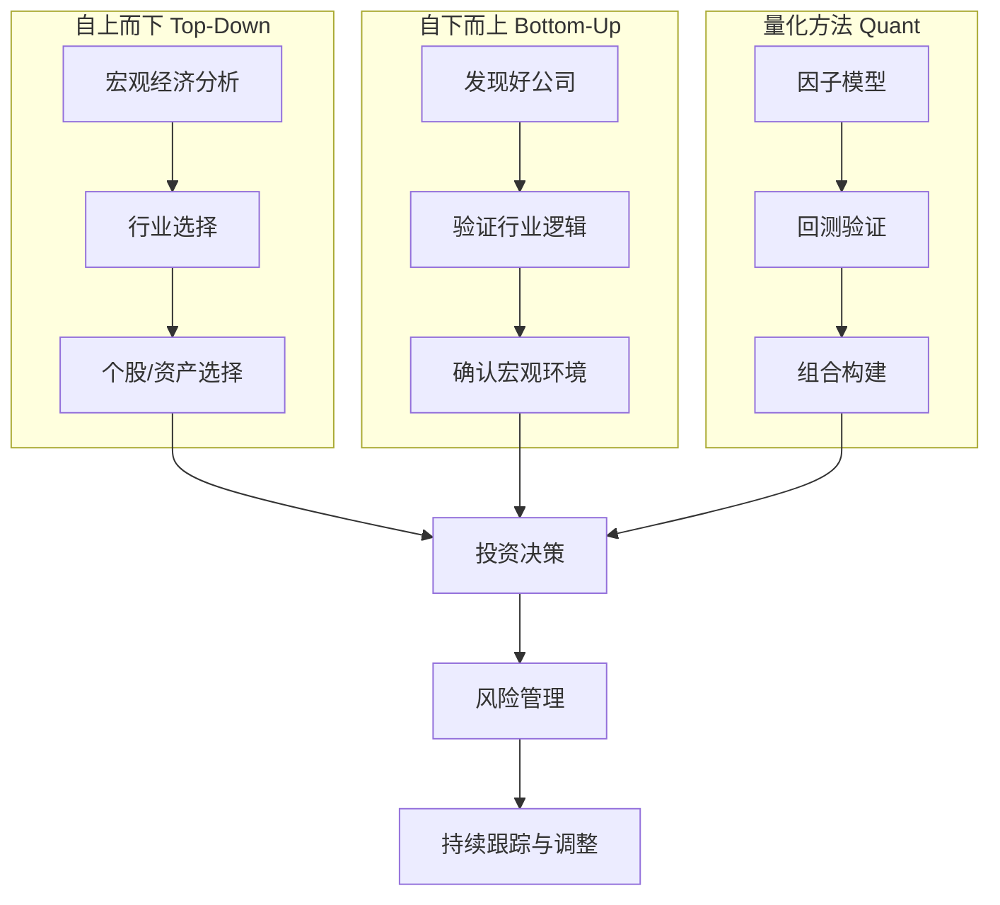
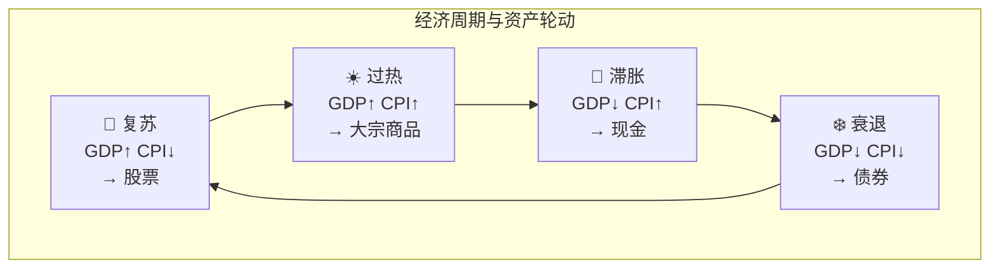
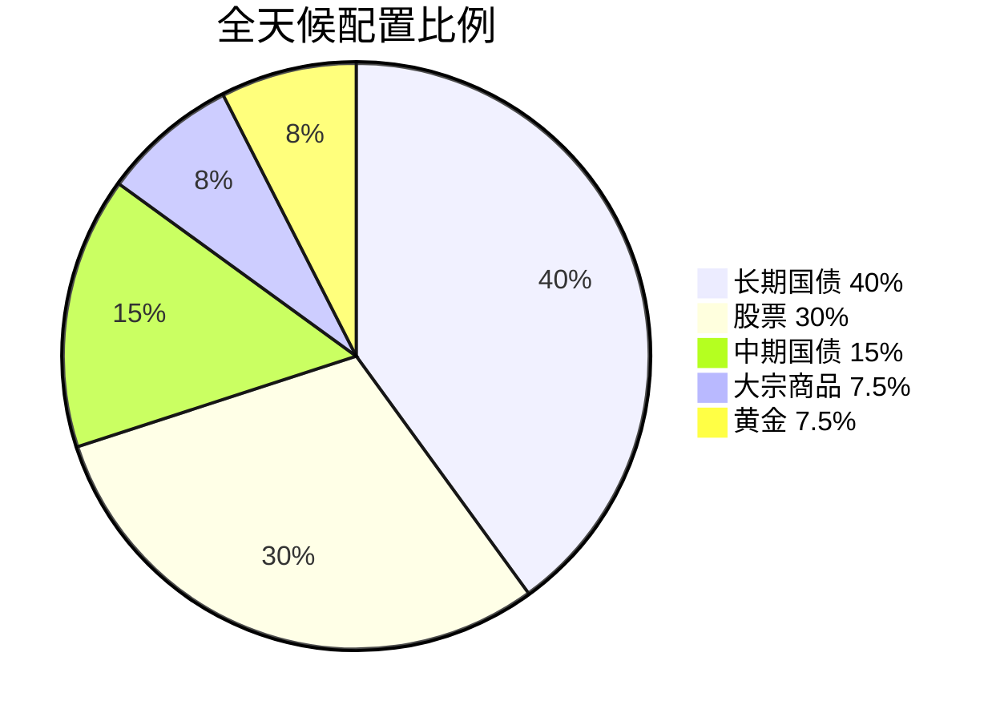

# 🔧 投研方法论 | Methodology

> 核心目标：掌握分析工具和思维框架，能独立做出投资判断。

---

## 方法论全景

---

## 模块导航

| 目录 | 内容 | 适合阶段 |
|------|------|----------|
| [valuation/](./valuation/) | 估值方法（DCF、相对估值、DDM） | Level 2-3 |
| [technical/](./technical/) | 技术分析基础（趋势、量价） | Level 2 |
| [quant/](./quant/) | 量化入门（因子、回测） | Level 3-4 |
| [risk/](./risk/) | 风险管理（仓位、止损、相关性） | Level 2+ |
| [frameworks/](./frameworks/) | 经典框架（美林时钟、全天候等） | Level 2-3 |

---

## 核心框架速览

### 美林时钟 (Merrill Lynch Clock)

### 达里奥全天候策略 (All Weather)

核心思想：不预测未来，而是**在任何经济环境下都能活下来**。

### 估值三板斧

| 方法 | 适用 | 核心逻辑 |
|------|------|----------|
| DCF (现金流折现) | 稳定盈利公司 | 公司值 = 未来所有现金流的现值 |
| 相对估值 (P/E, P/B) | 有可比公司时 | 和同行比贵不贵 |
| DDM (股利折现) | 高分红公司 | 公司值 = 未来所有分红的现值 |

---

## 学习路径建议

1. 先学 [frameworks/](./frameworks/) → 建立全局观
2. 再学 [valuation/](./valuation/) → 会给资产定价
3. 然后 [risk/](./risk/) → 知道怎么保护自己
4. 最后 [quant/](./quant/) → 用数据验证想法
5. [technical/](./technical/) 选学 → 辅助择时（不要迷信）
