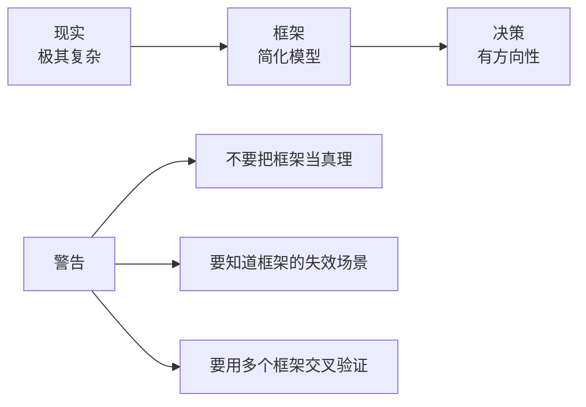
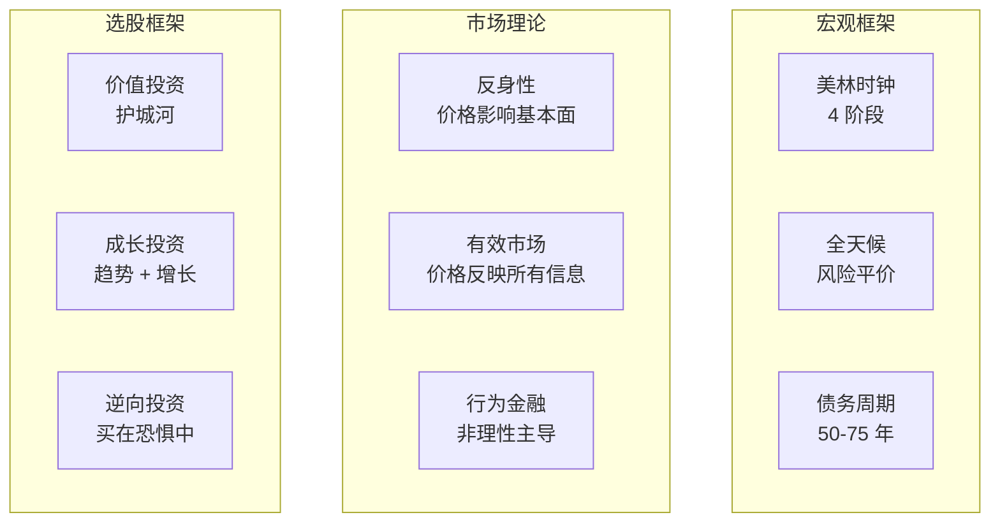
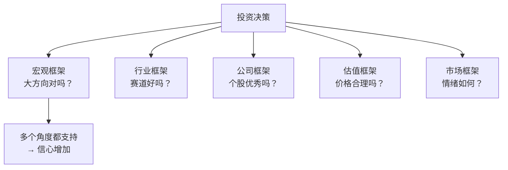
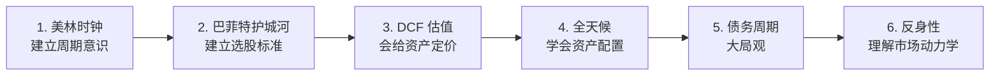

# 🎯 经典分析框架 | Classic Frameworks

`🟡 进阶`

> 核心目标：掌握几个经典的宏观/投资分析框架，建立看世界的"思维地图"。

---

## 框架不是真理，是工具

> "所有模型都是错的，但有些是有用的。" — George Box

---

## 核心框架列表

| 框架 | 用途 | 难度 | 文件 |
|------|------|------|------|
| 美林时钟 | 经济周期与资产轮动 | 🟢 | [merrill-clock.md](./merrill-clock.md) |
| 全天候策略 | 全季节资产配置 | 🟡 | [all-weather.md](./all-weather.md) |
| 达里奥债务周期 | 长期宏观分析 | 🔴 | [debt-cycle.md](./debt-cycle.md) |
| 索罗斯反身性 | 市场与基本面互动 | 🔴 | [reflexivity.md](./reflexivity.md) |
| 巴菲特护城河 | 选股的核心思想 | 🟡 | [moat.md](./moat.md) |
| DCF 估值 | 给资产定价 | 🔴 | [../valuation/dcf.md](../valuation/dcf.md) |

---

## 框架对比一览

---

## 框架使用心法

### 1. 不要用一个框架走天下

每个框架都有失效场景：
- 美林时钟在 2010s 央行干预下经常失效
- 价值投资在 2010s 成长股牛市跑输
- 全天候在 2022 年股债双杀时回撤巨大

### 2. 跨框架交叉验证

### 3. 知道框架的"失效信号"

每个框架都要问：**什么情况下这个框架会失效？**

| 框架 | 失效信号 |
|------|----------|
| 美林时钟 | 央行大幅干预（如 2020 年） |
| 价值投资 | 长期低利率推高估值 |
| 趋势跟踪 | 震荡市连续假突破 |
| 全天候 | 股债同时下跌（2022） |

### 4. 框架要本土化

美国的框架不能直接用在中国：
- A 股流动性驱动 > 盈利驱动
- 政策影响远超美股
- 行业生命周期短（新能源 3 年完成兴起到产能过剩）

---

## 推荐学习路径

---

## 自己的框架

学完这些经典框架后，最终目标是**形成自己的思维框架**：

- 你最相信哪些原则？
- 你最不信哪些"常识"？
- 你的优势在哪里？
- 你的劣势在哪里？

> "成功投资的关键不是模仿大师，而是建立适合自己的体系。" — 霍华德·马克斯（大意）

---

## 相关链接

- [估值方法](../valuation/)
- [风险管理](../risk/)
- [量化方法](../quant/)
- [经济周期](../../00-foundations/level-2-intermediate/02-business-cycle.md)
