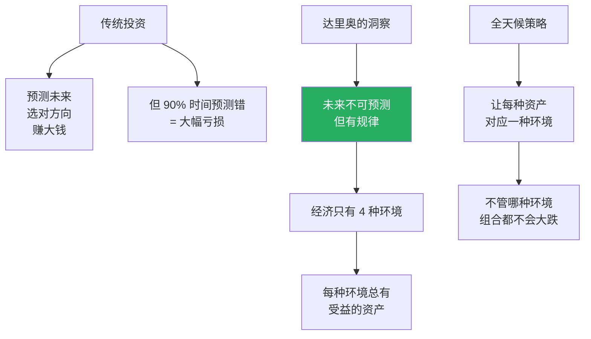
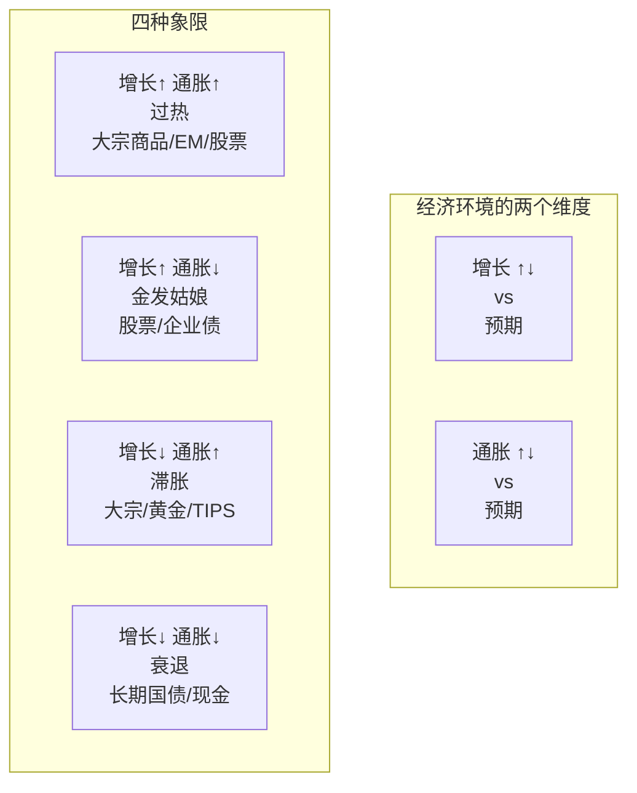
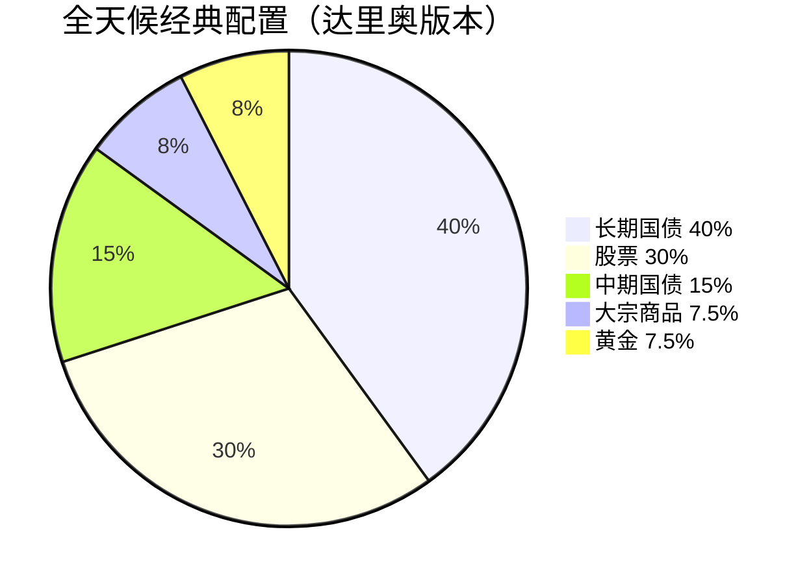
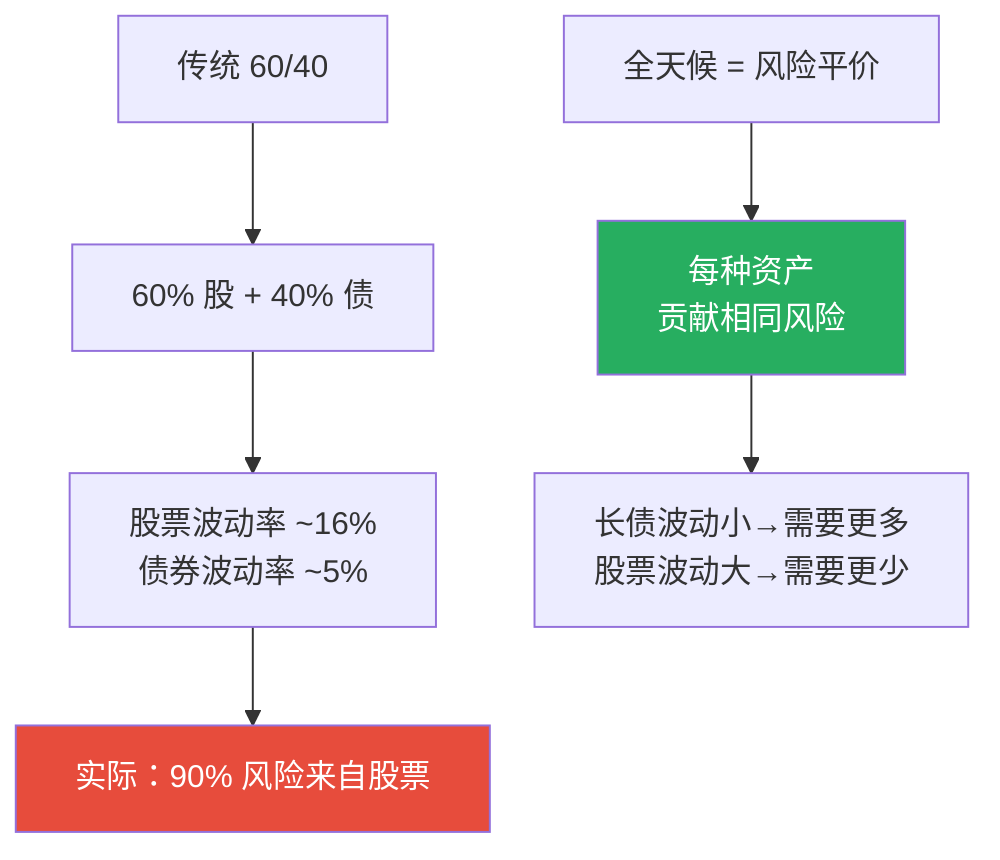
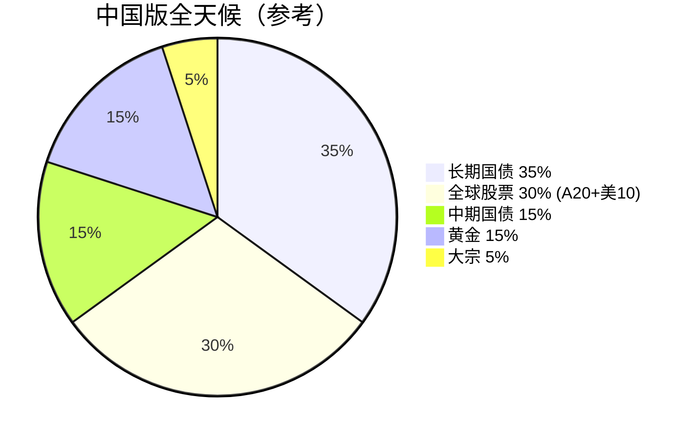
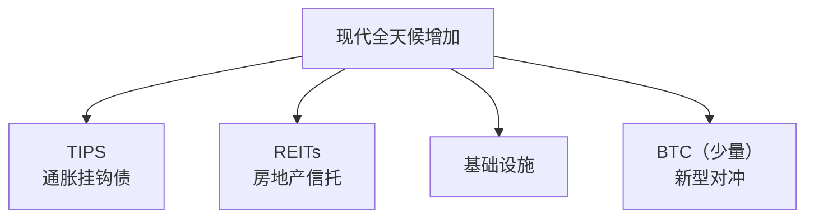

# 全天候策略 | All Weather Strategy

`🟡 进阶` `预计阅读：20 分钟`

> 核心问题：能不能设计一个"在任何经济环境下都能活下来"的组合？这就是桥水"全天候"的核心思想。

---

## 一句话总结

**全天候 = 不预测未来，而是为所有可能的经济环境做好准备。它牺牲了"赌对方向"的高回报，换来了"穿越周期"的稳定性。**

---

## 全天候的核心理念



---

## 四种经济环境



> 💡 **关键不是"绝对值"，是"相对预期"**。如果通胀实际是 4%，但市场预期 5%，对资产价格而言这是"通胀低于预期"，不是"通胀高"。

---

## 经典全天候配置



### 为什么是这个比例？

#### 不是看金额，是看风险贡献



#### 为什么需要 40% 长债？

```
长债是"通缩+衰退"环境最大受益者。
但长债波动小，所以需要更多权重才能"贡献足够风险"。

历史上：
- 2008 危机：长债涨 +25%，股票跌 -37%
- 2020 疫情：长债涨 +18%，股票先跌后反弹
```

#### 为什么需要黄金 + 大宗？

```
黄金 = 通胀对冲 + 避险
大宗 = 经济过热的受益者

2022 年股债双杀，黄金/大宗保护了组合。
```

---

## 各环境下的资产表现

| 环境 | 表现最好 | 表现最差 |
|------|----------|----------|
| 增长↑通胀↑（过热） | 大宗、新兴市场股 | 长债 |
| 增长↑通胀↓（金发） | 股票、企业债 | 黄金、大宗 |
| 增长↓通胀↑（滞胀） | 黄金、TIPS、大宗 | 股票、长债 |
| 增长↓通胀↓（衰退） | 长债、现金 | 股票、大宗 |

### 历史回测（1925-2023）

```
全天候 vs 标普 500：

年化回报：
- 全天候：~8%
- 标普 500：~10%

最大回撤：
- 全天候：-10%
- 标普 500：-50%（2008）

夏普比率：
- 全天候：~0.8
- 标普 500：~0.5
```

> 💡 全天候的回报略低，但**风险调整后回报更高**。最大回撤显著小于股票。

---

## 全天候在中国的本土化

### 中国可投工具

| 全天候资产 | 中国版工具 |
|-----------|-----------|
| 长期国债 | 30 年国债 ETF / 长债基金 |
| 股票 | 沪深 300 + 标普 500 + 港股 |
| 中期国债 | 5-10 年国债 ETF |
| 大宗商品 | 商品 QDII / 资源股 |
| 黄金 | 黄金 ETF (518880) |

### 中国版全天候参考配置



> 💡 中国版应该**适当增加黄金权重**（去美元化叙事 + 央行购金潮）和**全球分散**。

---

## 全天候的实施

### 步骤 1：明确目标资产配置

```
基础版（更激进）：
- 长债 30% / 股票 40% / 中债 10% / 黄金 12% / 大宗 8%

平衡版：
- 长债 40% / 股票 30% / 中债 15% / 黄金 7.5% / 大宗 7.5%

保守版：
- 长债 50% / 股票 20% / 中债 15% / 黄金 10% / 大宗 5%
```

### 步骤 2：选择具体工具

```
长债：30 年国债 ETF (511090) 或 长期纯债基金
股票：沪深300 ETF + 纳指 ETF + 恒生 ETF（按 50/30/20）
中债：5-10 年国债 ETF (511260) 或中长期纯债基金
黄金：黄金 ETF (518880)
大宗：南方原油 / 嘉实原油 / 白银 ETF
```

### 步骤 3：定期再平衡

```mermaid
graph TB
    A[再平衡规则] --> B[时间触发<br/>每年 1 次]
    A --> C[阈值触发<br/>偏离 ±5%]
    
    D[效果] --> E[强制"高抛低吸"]
    D --> F[控制风险敞口]
```

---

## 全天候 vs 60/40

### 优势

| 维度 | 60/40 | 全天候 |
|------|-------|--------|
| 简单度 | 极简 | 复杂 |
| 长期回报 | 8-10% | 7-9% |
| 最大回撤 | -25% | -10% |
| 滞胀环境 | 失败（2022） | 部分受益 |
| 通缩环境 | 优秀 | 优秀 |
| 通胀环境 | 失败 | 不错 |
| 工具门槛 | 低 | 中 |

### 60/40 失效的 2022 年

```
2022 年：
- 标普 500：-19%
- 美国 10Y 国债：-17%
- 60/40 组合：-18%

但全天候：
- 黄金：+2%
- 大宗：+15%
- 风险平价组合：-10% 左右

→ 全天候在 2022 年也亏，但显著少于 60/40
```

---

## 全天候的局限与质疑

### 局限 1：低利率环境的挑战

```mermaid
graph TB
    A[2008-2021 零利率环境] --> B[长债收益率极低]
    B --> C[长债"避险"作用弱]
    C --> D[全天候相对收益变差]
    
    E[2022 加息周期] --> F[长债大跌]
    F --> G[全天候首次大幅回撤]
    
    style F fill:#e74c3c,color:#fff
```

### 局限 2：高估了大宗商品的稳定性

```
大宗商品长期回报实际较低（年化 ~3-5%）
但波动率高（30%+）

→ 拉低了组合的整体效率
```

### 局限 3：杠杆问题

```
真正的"风险平价"需要杠杆：
- 风险贡献相同 = 低风险资产权重大
- 但低风险资产收益也低
- 解决方法：对低风险资产加杠杆

但杠杆带来流动性风险（2020.3 桥水回撤就源于此）
```

### 局限 4：在结构性变化下失效

```
全天候假设：四种环境会循环出现
但如果出现"持续滞胀"或"持续通缩"
组合可能长期跑输
```

---

## 全天候的进化版本

### 1. Risk Parity（风险平价）

更纯粹的版本，不限定于全天候四种资产。

### 2. 因子多样化

不仅资产类别多样化，还要因子多样化（价值/动量/质量）。

### 3. 战术叠加

在战略全天候基础上，做小幅战术倾斜（±5%）。

### 4. 加入新资产



---

## 谁适合全天候？

### 适合

- 不想盯盘
- 长期持有（10年+）
- 厌恶大幅回撤
- 接受相对低的回报
- 退休资金/保命钱

### 不适合

- 追求高回报
- 喜欢择时
- 短期投资
- 资金量小（<50 万难分散）
- 心痒痒的人

---

## 实战建议

### 对个人投资者

```mermaid
graph TB
    A[实施建议] --> B[1. 先用小钱试 1-2 年<br/>体会"无聊"]
    A --> C[2. 用 ETF 实现<br/>降低成本]
    A --> D[3. 设定自动再平衡]
    A --> E[4. 不要中途改变配置]
    A --> F[5. 把它作为"地基"<br/>另留小钱"主动"]
```

### 不要犯的错

```
1. 中途因短期回报差而放弃
2. 看到某资产涨就调权重
3. 频繁再平衡（增加交易成本）
4. 只配置 A 股而不是全球
5. 用错工具（如长债买成短债）
```

---

## 核心概念速查

| 术语 | 英文 | 一句话解释 |
|------|------|-----------|
| 全天候 | All Weather | 桥水的全季节策略 |
| 风险平价 | Risk Parity | 各资产风险贡献相同 |
| TIPS | Treasury Inflation-Protected Securities | 通胀挂钩债 |
| 再平衡 | Rebalancing | 定期回归目标比例 |
| 风险贡献 | Risk Contribution | 单一资产对组合波动的贡献 |
| 杠杆比率 | Leverage Ratio | 总敞口/自有资金 |

---

## 推荐阅读

- 《Principles》— Ray Dalio
- 《How the Economic Machine Works》— Ray Dalio (B站视频)
- 桥水公开发表的"全天候"白皮书
- 《Risk Parity Fundamentals》

---

## 相关链接

- [资产配置入门](../../00-foundations/level-2-intermediate/08-asset-allocation.md)
- [美林时钟](./merrill-clock.md)
- [全球经济关联](../../04-global-economy/connections/)
