# 美林时钟 | Merrill Lynch Investment Clock

`🟡 进阶` `预计阅读：15 分钟`

> 核心问题：怎么根据宏观环境判断该买什么资产？

---

## 一句话总结

**美林时钟 = 用增长和通胀两个维度，把经济分成 4 个阶段，每个阶段对应不同的最优资产。简单但有用，是宏观投资的入门框架。**

---

## 美林时钟的逻辑

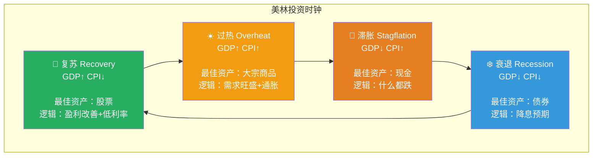

### 来源

由美林证券（现美银美林）2004 年提出。基于 1973-2004 年美国数据回测。

---

## 各阶段详解

### 复苏期（Recovery）

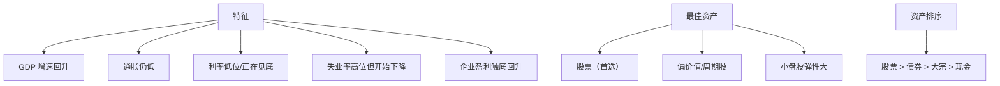

**典型案例**：2009、2016、2020.4 后

### 过热期（Overheat）

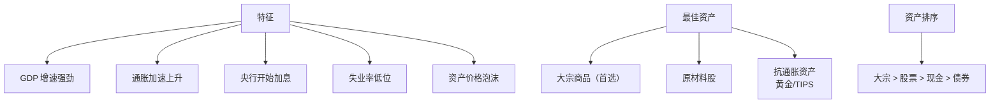

**典型案例**：2007、2021 后期、2008.5（油价 $147 时）

### 滞胀期（Stagflation）

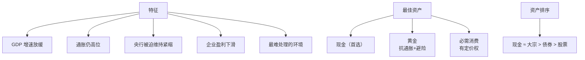

**典型案例**：1970s 石油危机、2022 年

### 衰退期（Recession）

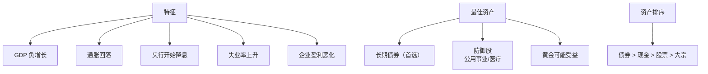

**典型案例**：2008.10-2009.3、2020.3、1973-1975

---

## 怎么判断当前阶段？

### 关键指标

```mermaid
graph TB
    A[判断当前阶段] --> B[增长指标<br/>GDP/PMI/就业]
    A --> C[通胀指标<br/>CPI/PCE/PPI]
    
    B --> B1[同比增速]
    B --> B2[环比变化]
    B --> B3[领先指标 LEI]
    
    C --> C1[当前水平]
    C --> C2[趋势方向]
    C --> C3[预期变化]
    
    D[关键是看"二阶导"] --> E[增速在加速 vs 减速]
```

### 实战判断（2025 年中）

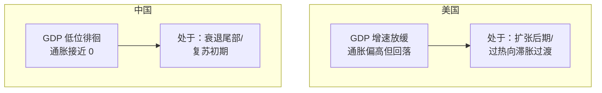

---

## 美林时钟的局限

### 局限 1：央行干预扭曲

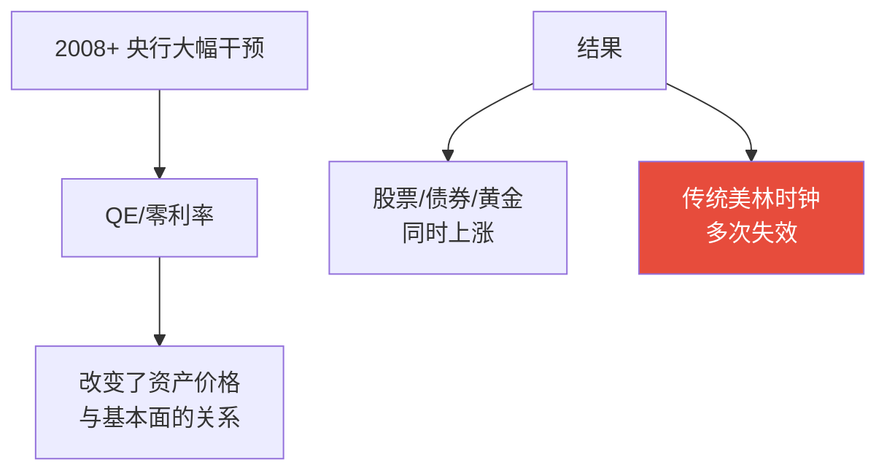

### 局限 2：阶段没有清晰分界

```
现实中：
- 阶段之间是渐变的
- 有时跳过某个阶段
- 同一阶段持续时间差异大
- 不同国家可能处于不同阶段
```

### 局限 3：基于美国历史

```
美林时钟基于 1973-2004 美国数据。
中国/欧洲/新兴市场可能不完全适用。

中国特殊性：
- 政策周期 > 自然周期
- 房地产周期主导
- 货币传导机制不同
```

### 局限 4：未考虑流动性

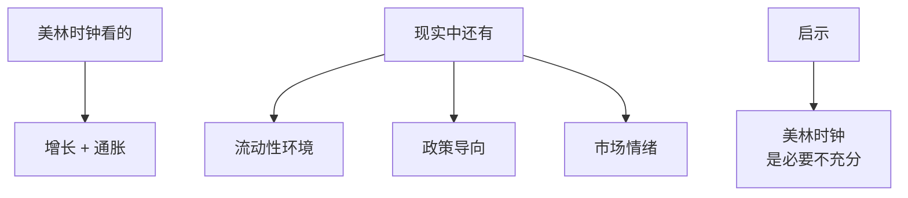

---

## 美林时钟的进化版

### 1. 加入流动性维度

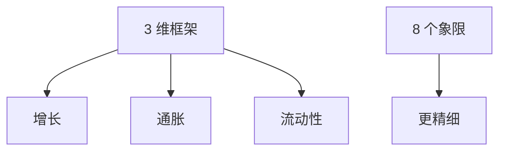

### 2. 考虑政策维度（中国版）

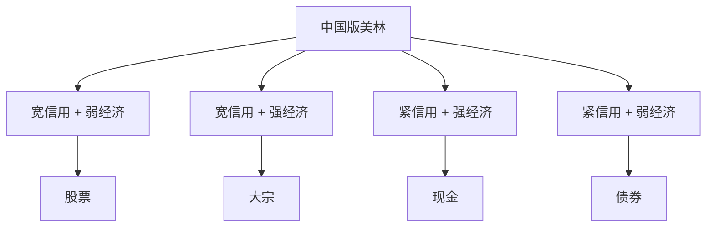

### 3. 风格轮动版

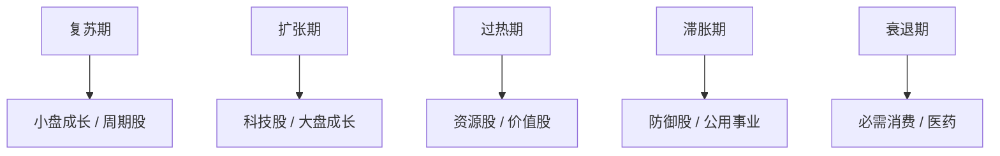

---

## 实战使用美林时钟

### 步骤 1：判断当前阶段

```
1. 看 PMI（领先 3-6 个月）
2. 看 CPI/PCE（同步指标）
3. 看央行政策方向
4. 综合判断处于 4 个阶段中的哪个
```

### 步骤 2：对应资产倾斜

```
不是只买"最佳资产"，
而是在均衡配置基础上做倾斜（±10-20%）。

例：均衡配置 60/40
- 复苏期：调到 70/30（加股票）
- 过热期：调到 65/15/20（加大宗）
- 滞胀期：调到 30/30/40（多现金）
- 衰退期：调到 30/70（加长债）
```

### 步骤 3：监控信号

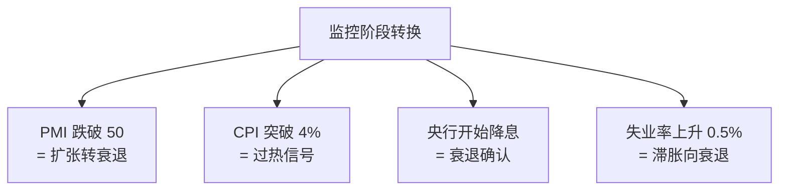

### 步骤 4：避免过度调整

```
太敏感 = 频繁交易 = 摩擦成本
太迟钝 = 错过最佳时机

平衡：每季度评估一次，半年/一年小幅调整
```

---

## 历史案例

### 2008-2010：完整周期

```
2008.5：过热顶部
- 油价 $147，通胀爆发
- 股市/商品高位
- 应该减仓股票，配置现金/黄金

2008.10：衰退底部确认
- 雷曼倒闭，金融危机
- 美联储紧急降息+QE
- 应该加仓长债

2009.3：复苏开始
- 股市触底
- 央行宽松
- 应该加仓股票

2010：扩张期
- 股市大幅上涨
- 持有股票 / 商品
```

### 2022：教科书式滞胀

```
2022.Q1：增长见顶
- 通胀飙升至 9%
- 美联储开始加息

2022.Q2-Q4：滞胀环境
- GDP 增速放缓
- 通胀仍高
- 股债双杀

最佳策略：
- 现金（涨息收益）
- 商品（俄乌战争+供应链）
- 黄金（避险+抗通胀）
- 避免：股票/债券
```

---

## 与其他框架的关系

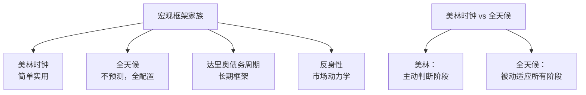

---

## 核心概念速查

| 术语 | 英文 | 一句话解释 |
|------|------|-----------|
| 美林时钟 | Merrill Lynch Clock | 经济周期与资产轮动框架 |
| 复苏期 | Recovery | 增长↑通胀↓ |
| 过热期 | Overheat | 增长↑通胀↑ |
| 滞胀期 | Stagflation | 增长↓通胀↑ |
| 衰退期 | Recession | 增长↓通胀↓ |
| 资产轮动 | Asset Rotation | 不同阶段不同资产领涨 |
| 风格轮动 | Style Rotation | 价值/成长/小盘/大盘的轮换 |

---

## 推荐阅读

- 美林《The Investment Clock》原始报告（2004）
- 各券商的"中国版美林时钟"研究
- 桥水《Bridgewater Daily Observations》
- 宏观分析师对当前阶段的判断（多看几家观点）

---

## 延伸思考

1. 美林时钟在过去 20 年是越来越准还是越来越不准？为什么？
2. AI 革命会让经济周期消失吗？
3. 中国应该用什么"中国特色"的美林时钟？
4. 你能根据美林时钟判断 2025 年下半年应该买什么吗？

---

## 相关链接

- [全天候策略](./all-weather.md)
- [经济周期](../../00-foundations/level-2-intermediate/02-business-cycle.md)
- [资产配置](../../00-foundations/level-2-intermediate/08-asset-allocation.md)
