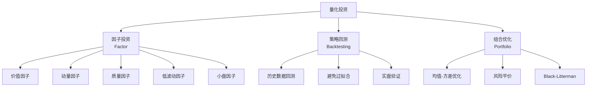

# 🤖 量化方法 | Quantitative Methods

`🔴 高级`

> 核心问题：怎么用数据和模型代替主观判断？

---

## 量化的三大方向

---

## 量化的优势与陷阱

| 优势 | 陷阱 |
|------|------|
| 排除情绪干扰 | 过拟合（在历史数据"完美"，在未来失灵） |
| 可大规模执行 | 黑天鹅无法回测 |
| 可严格回测 | 数据质量问题（幸存者偏差） |
| 持续迭代 | 策略容量有限（钱越多越难） |

---

## 待补充

- [ ] 因子投资入门（factors.md）
- [ ] 回测的正确方法（backtesting.md）
- [ ] Python 量化工具入门（python-tools.md）
- [ ] 组合优化基础（portfolio-optimization.md）
- [ ] 链上数据分析（on-chain.md）
