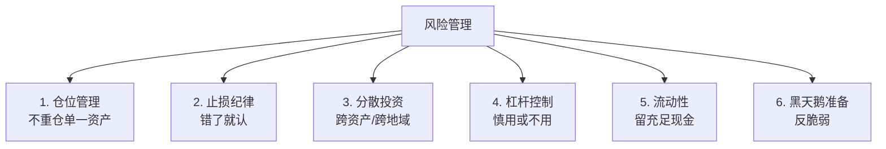
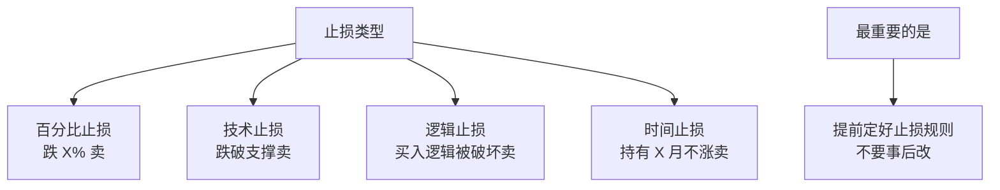

# ⚖️ 风险管理 | Risk Management

`🟡 进阶`

> 核心问题：怎么不亏大钱？怎么在不确定性中保护自己？

---

## 风险管理的核心原则



---

## 仓位管理

### 凯利公式（简化版）

```
最优仓位 = 胜率 - (1 - 胜率) / 赔率

例：胜率 60%，盈亏比 2:1
最优仓位 = 0.6 - 0.4/2 = 40%
```

> ⚠️ 实战中通常用凯利公式的 1/4 或 1/2，因为我们对胜率和赔率的估计不准。

### 单一仓位上限

| 风险偏好 | 单一资产上限 | 单一行业上限 |
|----------|-------------|-------------|
| 保守 | 5% | 15% |
| 均衡 | 10% | 25% |
| 进取 | 15% | 35% |
| 激进 | 25% | 50% |

---

## 止损



---

## 待补充

- [ ] 仓位管理详解（position-sizing.md）
- [ ] 止损策略（stop-loss.md）
- [ ] 相关性与分散（diversification.md）
- [ ] 黑天鹅与尾部风险（tail-risk.md）
- [ ] 杠杆的正确使用（leverage.md）
