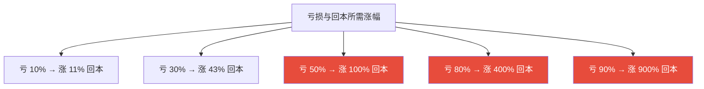
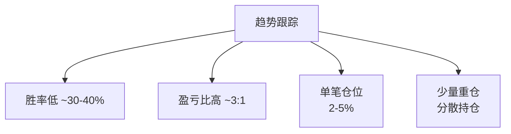
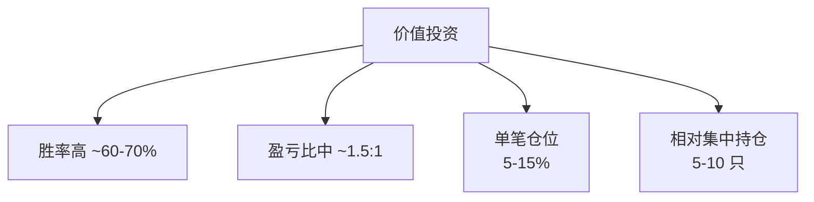
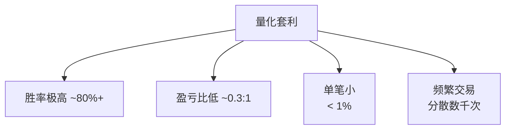
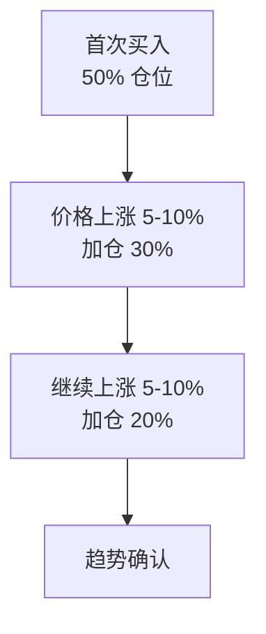
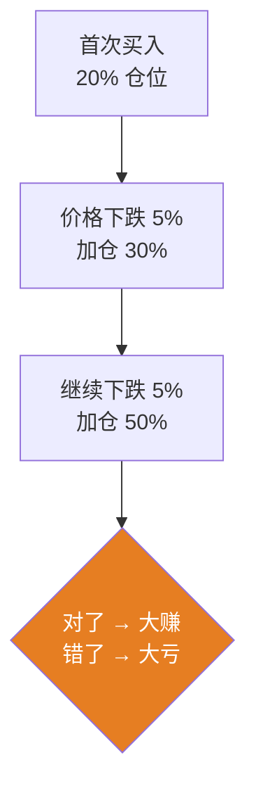
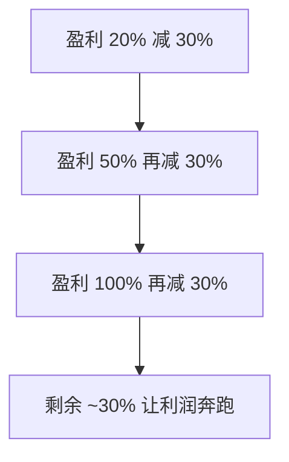
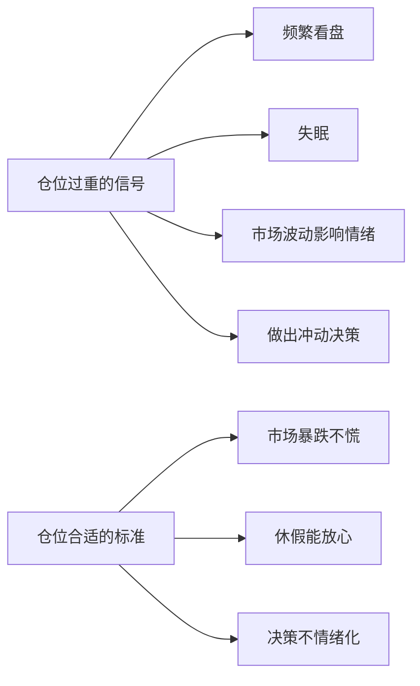
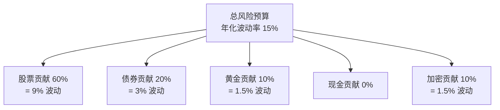
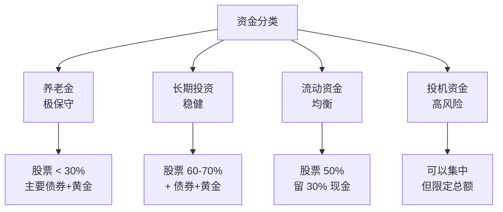

# 仓位管理 | Position Sizing

`🟡 进阶` `预计阅读：15 分钟`

> 核心问题：单笔交易该投多少钱？怎么避免"亏 1 次就一蹶不振"？

---

## 一句话总结

**仓位管理决定你能不能"活下来"。再好的判断，仓位错了也会破产；再差的判断，仓位对了也死不了。**

---

## 为什么仓位管理这么重要？

### 损失的"非对称性"



> 💡 这就是为什么"控制回撤"比"追求高回报"重要得多。

### 复利的脆弱性

```
情景 1：连续 5 年盈利 20%
1.2^5 = 2.49（赚 149%）

情景 2：4 年盈利 20% + 1 年亏损 50%
1.2^4 × 0.5 = 1.04（仅赚 4%）

→ 一次大亏可以毁掉多年盈利
```

---

## 仓位管理的核心原则

### 原则 1：单笔风险不超过总资产 1-2%

```
什么是"风险"？
风险 = (买入价 - 止损价) × 持仓数量

例：账户 100 万
单笔风险 = 1% = 1 万
如果某股票止损位是买入价 - 10%，
则最多买入 10 万（亏 10% = 1 万）
```

### 原则 2：单一标的不超过总资产 5-10%

```
即使你最看好的股票，也不要超过 10%。
原因：黑天鹅总会发生（财务造假、政策风险、行业崩溃）

例：康美药业（曾是白马股）→ 财务造假 → 暴跌 95%
若仓位 30% → 总资产 -28%
若仓位 5%  → 总资产 -4.75%
```

### 原则 3：单一行业不超过总资产 20-30%

```
2021 教育"双减" → 教育股全行业暴跌 80%
2022 互联网监管 → 中概互联网腰斩
2024 房地产持续下跌 → 地产链全线惨淡

→ 行业风险无法分散，需要靠权重控制
```

### 原则 4：高相关性资产合并计算

```
持仓：
- 茅台 8%
- 五粮液 5%  
- 泸州老窖 4%
- 山西汾酒 3%

看起来分散，实际"白酒板块仓位 = 20%"
应该作为"一个仓位"管理
```

---

## 凯利公式 (Kelly Criterion)

```
最优仓位 f* = (bp - q) / b

其中：
b = 赔率（盈利/亏损比）
p = 胜率
q = 1 - p（败率）
```

### 简化版

```
f* = (胜率 × 平均盈利 - 败率 × 平均亏损) / 平均盈利

例：胜率 60%，赢时赚 20%，输时亏 10%
f* = (0.6 × 20% - 0.4 × 10%) / 20%
   = (12% - 4%) / 20%
   = 40%
```

### 实战中的"半凯利"

```
完整凯利 → 波动太大，心理难承受
1/2 凯利 → 上面例子用 20% 仓位
1/4 凯利 → 上面例子用 10% 仓位

为什么？
1. 我们对胜率/赔率的估计不准
2. 心理承受度有限
3. 留有犯错空间
```

---

## 不同策略的仓位规模

### 趋势跟踪策略



### 价值投资策略



### 高频量化策略



---

## 加仓策略

### 金字塔加仓（推荐）



特点：
- 越涨买得越少
- 平均成本随趋势上移
- 错了也亏不多

### 倒金字塔加仓（不推荐）



特点：
- 越跌买得越多（"摊低成本"）
- 但如果是下行趋势，会越摊越亏
- 普通人不要轻易用

---

## 减仓策略

### 趋势减仓



### 估值减仓

```
基于估值分位数：
- P/E 在历史 70% 分位 → 卖 1/3
- P/E 在历史 80% 分位 → 卖 1/3  
- P/E 在历史 90% 分位 → 卖 1/3
```

### 时间减仓

```
持有 1 年达到目标 → 卖 1/3
持有 2 年仍未达到 → 重新评估
持有 3 年仍未达到 → 至少卖一半
```

---

## 仓位与心理

### 让你"睡得着"的仓位



> 💡 **如果一只股票让你晚上睡不着，仓位太重，立刻减半。**

### 总仓位的"四档"

| 总仓位 | 对应判断 | 策略 |
|--------|----------|------|
| 90-100% | 极度看好 | 仅在牛市初期 |
| 60-80% | 看好 | 正常市场 |
| 30-50% | 中性 | 不确定时期 |
| 10-30% | 看空 | 高估值/危险信号 |
| 0-10% | 极度看空 | 真正的危险时刻 |

---

## 仓位管理的常见错误

### 错误 1："这次不一样"

```
"这只股票一定会涨，我要重仓"
"这次行情很大，我要 All in"

→ 100% 失败的导火索
```

### 错误 2：不止损就死扛

```
亏 10% 不卖 → 亏 20% 还在等
亏 20% 还在等 → 亏 40%
亏 40% → 已经麻木
亏 50%+ → 永远等回本

→ 一只票拖累整个组合
```

### 错误 3：杠杆使用不当

```
新手最大的陷阱是杠杆。

借 50% 钱炒股 = 1.5 倍杠杆
- 涨 10% → 你赚 15%
- 跌 10% → 你亏 15%
- 跌 30% → 你亏 45%（破产警告）
- 跌 50% → 你被强制平仓（爆仓）

合约 10 倍杠杆：
- 跌 10% → 直接归零

→ 99% 的人不应该用杠杆
```

### 错误 4：情绪驱动加减仓

```
看到涨 → 追高加仓
看到跌 → 恐慌减仓
→ 高买低卖，注定亏钱
```

---

## 实战工具

### 单笔仓位计算

```
账户：100 万
风险偏好：单笔最多亏 1%（= 1 万）
某股止损位：买入价 -8%

最大仓位 = 1 万 / 8% = 12.5 万
仓位占比 = 12.5%

→ 但还要考虑"单一仓位上限 10%"
→ 最终：10 万（10%）
```

### 杠杆敞口计算

```
账户：100 万
持仓：股票 80 万 + 加密 20 万 + 杠杆敞口 30 万

总敞口 = 130 万
杠杆比 = 1.3 倍

如果总敞口 / 净资产 > 1.5 → 警惕
> 2 → 危险
> 3 → 接近爆仓
```

### 风险预算（Risk Budget）



---

## 不同账户的仓位策略



---

## 核心概念速查

| 术语 | 英文 | 一句话解释 |
|------|------|-----------|
| 仓位 | Position Size | 单笔/组合的金额或比例 |
| 凯利公式 | Kelly Criterion | 最优仓位计算公式 |
| 杠杆 | Leverage | 借钱放大敞口 |
| 单笔风险 | Risk Per Trade | 单笔交易最大可能亏损 |
| 风险预算 | Risk Budget | 整体可承受波动率 |
| 集中度 | Concentration | 持仓的集中程度 |
| 爆仓 | Liquidation | 杠杆下被强制平仓 |
| 平均成本 | Average Cost | 多次买入的均价 |

---

## 行动清单

- [ ] 计算你的"单笔最大风险"金额
- [ ] 检查现有持仓的集中度（行业/板块）
- [ ] 评估当前总仓位是否符合判断
- [ ] 设定加仓/减仓的具体规则
- [ ] 杠杆使用：能不用就不用

---

## 推荐阅读

- 《通向财务自由之路》— 范·撒普（Position Sizing 经典）
- 《海龟交易法则》— 柯蒂斯·费斯
- 《股市真规则》第三章
