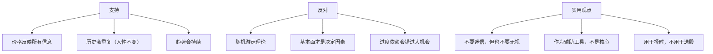

# 📈 技术分析基础 | Technical Analysis

`🟡 进阶`

> 核心问题：能不能从图表中看出未来？技术分析是科学还是玄学？

---

## 技术分析的合理性与局限

---

## 核心工具

| 工具 | 用途 |
|------|------|
| 趋势线 | 判断方向 |
| 移动平均线 (MA) | 平滑波动，识别趋势 |
| 支撑/阻力位 | 关键价格 |
| 成交量 | 确认趋势力度 |
| MACD | 趋势 + 动能 |
| RSI | 超买超卖 |
| 布林带 | 波动区间 |

---

## 待补充

- [ ] 趋势判断（trend.md）
- [ ] 量价关系（volume-price.md）
- [ ] 主要指标详解（indicators.md）
- [ ] 形态识别（patterns.md）
- [ ] 技术分析的局限（limitations.md）
