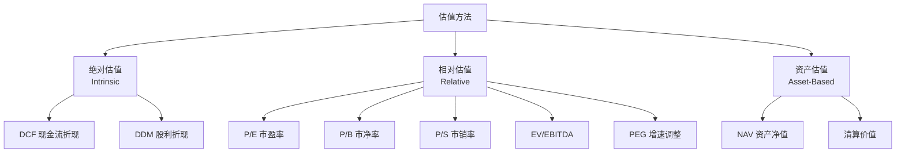

# 💎 估值方法 | Valuation

`🟡 进阶`

> 核心问题：一个资产到底值多少钱？

---

## 估值的三大方法

---

## 各方法适用场景

| 方法 | 适用 | 不适用 |
|------|------|--------|
| DCF | 现金流稳定可预测 | 早期/亏损公司 |
| P/E | 盈利稳定的成熟公司 | 周期性公司、亏损公司 |
| P/B | 重资产公司（银行/地产） | 轻资产公司 |
| P/S | 营收稳定的公司、SaaS | 利润率差异大的行业 |
| EV/EBITDA | 跨国比较、高负债公司 | 资本结构差异大 |
| NAV | 房地产、控股公司 | 经营性公司 |

---

## 待补充内容

- [ ] DCF 详细教程（dcf.md）
- [ ] P/E 的正确使用（pe.md）
- [ ] 周期股估值（cyclical.md）
- [ ] 成长股估值（growth.md）
- [ ] 银行/保险/地产的特殊估值（financial.md）
