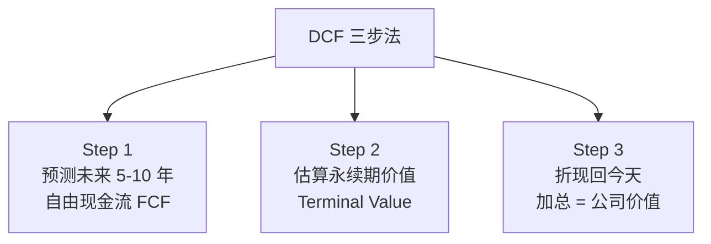
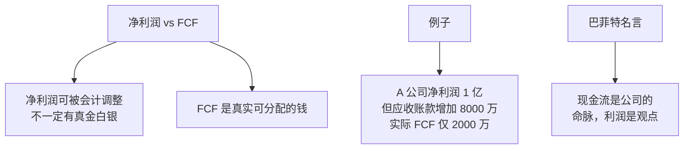
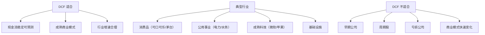

# DCF 现金流折现详解 | Discounted Cash Flow

`🔴 高级` `预计阅读：30 分钟`

> 核心问题：怎么用 DCF 给一家公司估值？为什么 DCF 既"完美"又"危险"？

---

## 一句话总结

**DCF 是估值的"理论圣杯"——一家公司值多少钱 = 它未来所有现金流的现值之和。但实际操作中，假设的微小变化会导致估值的巨大差异。**

---

## DCF 的核心思想

### 一句话原理

```
今天的 100 元 ≠ 明天的 100 元

为什么？
1. 时间价值（钱可以增值）
2. 通胀（购买力下降）
3. 风险（明天的钱不一定能拿到）

→ 要把"未来的钱"折回"现在的钱"
```

### 折现公式

```
现值 PV = 未来值 FV / (1 + r)^t

例：
3 年后的 100 元，年化折现率 8%
PV = 100 / 1.08³ = 100 / 1.26 = 79.4 元

→ "3 年后的 100 元"等于"今天的 79.4 元"
```

---

## DCF 估值的三步法



---

## Step 1：自由现金流（FCF）

### 什么是 FCF？

```
自由现金流 = 公司"真正赚到"且"自由可用"的钱

公式 1（来自现金流量表）：
FCF = 经营活动现金流 - 资本支出（CapEx）

公式 2（推导式）：
FCF = 净利润
    + 折旧/摊销（不真正花钱的费用）
    - 营运资金变化（应收/存货占用资金）
    - 资本支出（买设备/厂房）
```

### 为什么不用净利润？



### FCF 的预测

```
基本步骤：
1. 看历史 5-10 年 FCF 趋势
2. 分析增长驱动力
3. 给出未来 5-10 年的预测

预测方法：
- 假设增速：明年 +X%，逐年递减到永续增速
- 自上而下：行业增速 → 公司份额变化 → 公司增速
- 自下而上：营收增长 → 利润率 → 资本支出
```

### 案例：可口可乐 FCF 预测

```
2024 年 FCF：~$100 亿

未来 10 年预测：
- 前 3 年增速 5%（成熟公司）
- 4-7 年 4%
- 8-10 年 3%（接近 GDP 增速）

预测结果（亿美元）：
2025: 105
2026: 110
2027: 116
2028: 121
2029: 126
2030: 131
2031: 136
2032: 140
2033: 144
2034: 149
```

---

## Step 2：永续期价值（Terminal Value）

### 什么是永续期？

```
预测期（5-10 年）后，公司还会继续运营。
但不可能永远精确预测。
所以用"永续模型"估算第 10 年之后的全部价值。
```

### 永续期公式（Gordon 增长模型）

```
TV = FCF_(n+1) / (r - g)
   = 第 11 年 FCF / (折现率 - 永续增速)

注意：
- g 必须 < r（否则结果无穷大）
- g 通常用长期 GDP 增速（2-3%）
- r 是公司的折现率
```

### 案例：可口可乐永续期

```
第 10 年 FCF：149 亿
永续增速 g = 2.5%
折现率 r = 8%

第 11 年 FCF = 149 × 1.025 = 152.7 亿

TV（第 10 年时）= 152.7 / (0.08 - 0.025)
              = 152.7 / 0.055
              = 2776 亿

→ 这意味着第 10 年那一刻，
"未来无限期"的现值是 2776 亿
```

### 永续期的"陷阱"

```mermaid
graph TB
    A[永续期通常占总估值 50-80%] --> B[微小改动影响巨大]
    
    C[g 从 2.5% 改到 3%] --> D[TV 从 2776 → 3054<br/>+10%]
    
    E[r 从 8% 改到 7%] --> F[TV 从 2776 → 3393<br/>+22%]
    
    G[启示] --> H[DCF 的"灵敏度"<br/>主要来自永续期]
```

---

## Step 3：折现回今天

### 折现率（WACC）

```
折现率 = 加权平均资本成本（WACC）
WACC = (E/V) × Re + (D/V) × Rd × (1 - T)

其中：
E = 股权市值
D = 总债务
V = E + D（总资本）
Re = 股权成本（投资者要求的回报率）
Rd = 债务成本（公司付的利息）
T = 税率
```

### 股权成本（Re）：CAPM 模型

```
Re = Rf + β × ERP

Rf = 无风险利率（10Y 美债收益率，~4.5%）
β = 公司股价与市场的相关性（贝塔值）
ERP = 股权风险溢价（4-6%）

例：可口可乐
Rf = 4.5%
β = 0.6（防御股）
ERP = 5%
Re = 4.5% + 0.6 × 5% = 7.5%
```

### 折现：把未来的钱"折"回今天

```
对于第 t 年的 FCF：
PV_t = FCF_t / (1 + r)^t

例：可口可乐第 5 年 FCF = 126 亿
折现率 8%
PV_5 = 126 / 1.08^5 = 126 / 1.469 = 85.8 亿

对永续期 TV（第 10 年那一刻的值）：
PV_TV = TV / (1 + r)^10
      = 2776 / 1.08^10
      = 2776 / 2.159
      = 1286 亿
```

### 加总 = 公司价值

```
公司总价值（企业价值 EV）
= Σ FCF_t 的现值（t = 1 到 10）
+ 永续期价值的现值

例：可口可乐
预测期 PV 合计：~750 亿
永续期 PV：~1286 亿
EV ≈ 2036 亿

→ 减去净债务 → 股权价值
→ 除以总股数 → 每股价值
```

---

## 完整的 DCF 例子

### 假设条件

```
公司 X：消费品龙头
当前股价：$100
总股数：10 亿股
当前市值：$1000 亿

财务数据：
- 当前 FCF：$50 亿
- 未来 5 年 FCF 增速：8%
- 之后 5 年增速：5%
- 永续增速：2.5%
- 折现率（WACC）：8%
- 净债务：$50 亿
```

### Step 1：未来 10 年 FCF 预测

| 年 | FCF（亿）| 折现因子 | PV（亿）|
|---|---------|---------|---------|
| 1 | 54.0 | 0.926 | 50.0 |
| 2 | 58.3 | 0.857 | 50.0 |
| 3 | 63.0 | 0.794 | 50.0 |
| 4 | 68.0 | 0.735 | 50.0 |
| 5 | 73.5 | 0.681 | 50.0 |
| 6 | 77.2 | 0.630 | 48.6 |
| 7 | 81.0 | 0.583 | 47.3 |
| 8 | 85.1 | 0.540 | 45.9 |
| 9 | 89.3 | 0.500 | 44.7 |
| 10 | 93.8 | 0.463 | 43.4 |

预测期 PV 合计 = **480 亿**

### Step 2：永续期价值

```
第 11 年 FCF = 93.8 × 1.025 = 96.1 亿
TV = 96.1 / (0.08 - 0.025) = 1747 亿

折现回今天：
PV_TV = 1747 × 0.463 = 809 亿
```

### Step 3：加总

```
企业价值 EV = 480 + 809 = 1289 亿
减去净债务 50 亿
股权价值 = 1239 亿

每股内在价值 = 1239 / 10 = $123.9

当前股价 $100，DCF 估值 $124
→ 股价被低估 24%
→ 安全边际不够大（巴菲特要 30-50%）
→ 可以观察等回调
```

---

## DCF 的"敏感性分析"

DCF 对假设极其敏感。一个负责任的分析必须做"敏感性测试"。

### 双变量敏感性表

```
            折现率 →
永续增速 ↓   7%      8%       9%

2%        $138    $115     $97
2.5%      $148    $124     $104
3%        $160    $134     $112
```

> 💡 同一家公司，DCF 估值可能 $97-160，相差 **65%**！

### 这告诉我们什么？

```mermaid
graph TB
    A[DCF 的真相] --> B[不是"精确计算"<br/>而是"合理范围"]
    A --> C[假设变 1% → 估值变 10%+]
    A --> D[需要做敏感性分析]
    A --> E[最终给出"价值区间"<br/>不是"精确数字"]
```

---

## DCF 的局限

### 局限 1：垃圾进，垃圾出

```
DCF 的输出完全取决于输入。
如果增速预测错了 → 估值就错了
如果折现率错了 → 估值就错了

→ DCF 让"主观判断"披上了"科学外衣"
→ 容易被滥用：先有结论，再调假设倒推
```

### 局限 2：不适合早期/亏损公司

```
DCF 需要预测未来现金流。
但早期公司：
- 现在亏损，未来不确定
- 商业模式可能变
- 增速波动大

→ DCF 在早期公司上几乎没用
→ 用其他方法（比较法、用户/营收倍数）
```

### 局限 3：不适合周期股

```
周期股的 FCF 起伏巨大。
如果在周期顶部做 DCF：
- 当年 FCF 高 → 推算未来都高 → 估值虚高

如果在周期底部：
- 当年 FCF 低 → 推算未来都低 → 估值虚低

→ 周期股要用"normalized FCF"（周期平均）
```

### 局限 4：忽视了"反身性"

```
DCF 假设：
- 现金流独立于股价
- 股价反映现金流

但实际：
- 股价高 → 公司更容易融资 → 业务更好
- 股价低 → 融资困难 → 业务恶化

→ 索罗斯的"反身性"理论
→ DCF 模型无法捕捉这一点
```

### 局限 5：折现率难定

```
该用 8% 还是 10%？
βe 是 0.8 还是 1.2？
ERP 是 4% 还是 6%？

→ 这些都是"主观判断"
→ 没有"正确答案"
```

---

## 巴菲特的 DCF "心算"

巴菲特说他从不真正算 DCF，但他用 DCF 的"思想"：

```
"如果我看不清这家公司未来 10 年的现金流，
我就不会买。
不管它现在看起来多便宜。"

实战版：
1. 这家公司未来 10 年能赚多少钱？（粗估）
2. 我愿意花多少钱买这些未来的钱？
3. 当前股价低于我的估算？买。
4. 高于？等。
```

> 💡 **DCF 的精髓不是计算，而是思考**：你买的是公司未来产生现金的能力。

---

## 实战中的 DCF

### 个人投资者的简化版

如果你不想做完整模型：

```
简化 DCF：
1. 当前 FCF
2. 假设增速 X%（保守）
3. 算出未来 10 年 FCF
4. 加总（粗略，不折现也行）
5. 加上现金，减去债务
6. 除以总股数
7. 比较股价

例：
当前 FCF 50 亿，每年增 8%
10 年累计 FCF：~720 亿
+ 现金 200 亿 - 债务 100 亿 = 820 亿
÷ 10 亿股 = $82/股

如果当前股价 $50，潜力大
如果股价 $90，没什么吸引力
```

### 反向 DCF：股价隐含什么？

```
比 "猜未来" 更靠谱的方法：
"市场假设是什么？"

例：英伟达股价 $130
未来 10 年要支撑什么样的增速？

逆推：
- 如果维持当前 P/E，要 FCF 5 年翻一倍
- 即 FCF 增速 ~15%/年
- 这合理吗？
- 如果合理 → 价格合适
- 如果不合理 → 风险大
```

---

## DCF 的最佳应用场景



---

## 核心概念速查

| 术语 | 英文 | 一句话解释 |
|------|------|-----------|
| DCF | Discounted Cash Flow | 现金流折现 |
| FCF | Free Cash Flow | 自由现金流 |
| WACC | Weighted Average Cost of Capital | 加权平均资本成本 |
| CAPM | Capital Asset Pricing Model | 资本资产定价模型 |
| 折现率 | Discount Rate | 把未来折到现在的利率 |
| 永续期 | Terminal Period | 预测期之后的"无限期" |
| 永续期价值 | Terminal Value (TV) | 永续期的现值 |
| 永续增速 | Terminal Growth Rate (g) | 永续期的假设增速 |
| 敏感性分析 | Sensitivity Analysis | 测试假设变化的影响 |
| 反向 DCF | Reverse DCF | 从股价倒推市场假设 |

---

## 推荐阅读

- 《Investment Valuation》— Aswath Damodaran（圣经）
- 《估值》— McKinsey 团队
- Damodaran YouTube 课程（免费，强烈推荐）
- 《巴菲特致股东的信》（实战智慧）

---

## 延伸思考

1. 如果你只能用 1 个数字定义"价值"，是 DCF 估值吗？还是其他？
2. AI 时代，DCF 模型是否还适用？
3. 中国的国有企业 DCF 估值的特殊性？
4. 你最近研究的一只股票，做一遍 DCF，结果如何？

---

## 相关链接

- [估值方法论总览](../../00-foundations/level-3-advanced/01-valuation.md)
- [财务报表分析](../../00-foundations/level-3-advanced/02-financial-statements.md)
- [估值模块入口](./README.md)
